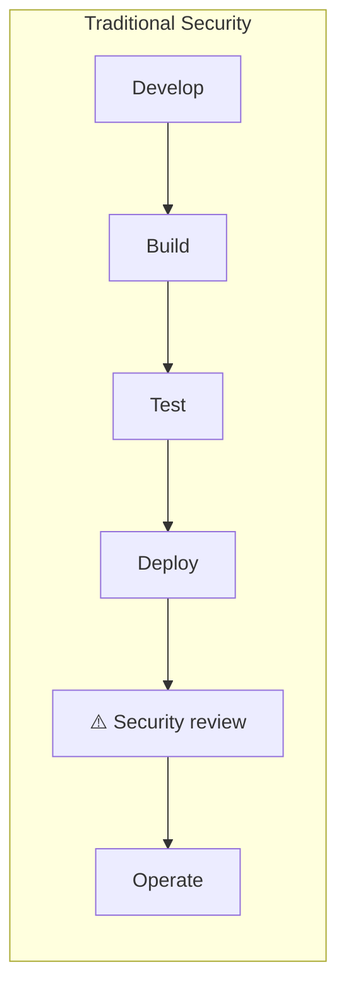
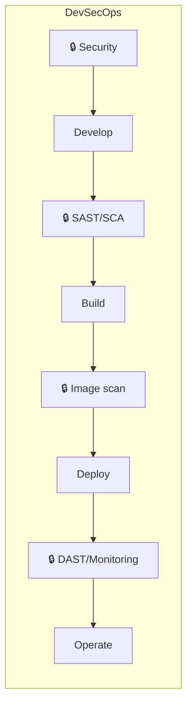
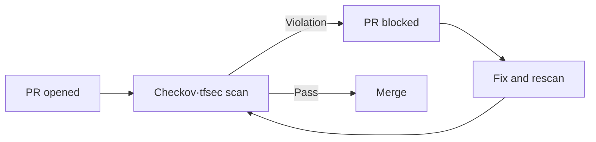

> Last reviewed: August 2026

## Overview

DevSecOps is an approach that embeds security into the development (Dev) and operations (Ops) pipeline **from the very start**. Instead of the traditional approach of reviewing security after deployment, it automates security verification starting from the moment code is written.

:::note
For security monitoring of the operational environment after deployment, see [Security Posture Management](../../security/security-posture/); for OS/runtime patching, see [Patch Management and Vulnerability Response](../../devops/patch-and-vulnerability/).
:::

### The Shift-Left Principle

The further left (earlier in development) security verification moves:

- **Reduced remediation cost** — Vulnerabilities found in production cost 10-100x more to fix than those caught during development
- **Maintained deployment speed** — Automated security gates eliminate manual review bottlenecks
- **Stronger developer capability** — Immediate feedback improves security awareness

## Security Tools by Pipeline Stage

| Stage | Security activity | Tool type |
| --- | --- | --- |
| **Writing code** | Preventing secret exposure, secure coding patterns | Pre-commit hooks, IDE plugins |
| **Code review/PR** | Static analysis (SAST), secret scanning | SAST, secret scanning |
| **Build** | Dependency vulnerabilities (SCA), license checks | SCA (Software Composition Analysis) |
| **Container build** | Image vulnerability scanning, base image verification | Container scanning |
| **IaC validation** | Infrastructure code security checks | IaC scanning |
| **Pre-deployment** | Policy gates, approval workflows | Policy-as-Code |
| **Runtime** | DAST, penetration testing, runtime protection | DAST, RASP |

## SAST (Static Application Security Testing)

**Static analysis.** Scans the source code itself without executing it, to find security vulnerabilities. It catches issues quickly during development, but cannot find issues that only surface at runtime.

| Vendor/tool | Service | Characteristics |
| --- | --- | --- |
| AWS | [Amazon Inspector (code scanning)](https://docs.aws.amazon.com/inspector/latest/user/scanning-code.html) | Automatic code vulnerability scanning for Lambda/ECR. Python, Java, JavaScript, etc. |
| Azure | [Microsoft Defender for DevOps](https://learn.microsoft.com/azure/defender-for-cloud/defender-for-devops-introduction) + GitHub Advanced Security | CodeQL-based. Native GitHub/Azure DevOps integration |
| Google Cloud | No native SAST — integrate [Semgrep](https://semgrep.dev/) or [SonarQube](https://www.sonarsource.com/products/sonarqube/) into Cloud Build | Connect a third-party tool into the pipeline |
| Vendor-neutral | [SonarQube](https://www.sonarsource.com/products/sonarqube/), [Semgrep](https://semgrep.dev/), [Snyk Code](https://snyk.io/product/snyk-code/) | Consistent analysis across multicloud environments |

## DAST (Dynamic Application Security Testing)

**Dynamic analysis.** Actually attacks a running application from the outside to find vulnerabilities. It can uncover issues that only surface in a deployed environment (authentication bypass, misconfiguration, etc.).

| Tool | Characteristics |
| --- | --- |
| [OWASP ZAP](https://www.zaproxy.org/) | Open source. Can be integrated into a CI/CD pipeline |
| [Burp Suite](https://portswigger.net/burp) | Commercial. Manual penetration testing + automated scanning |
| [Nuclei](https://nuclei.projectdiscovery.io/) | Open source. Template-based vulnerability scanning. Easy CI integration |

No CSP offers a native DAST tool, so it's common to run the vendor-neutral tools above against a staging environment.

## SCA (Software Composition Analysis)

**Dependency analysis.** Detects known vulnerabilities (CVEs) and license violations in open-source libraries/packages. Manages the risk of code you pulled in, rather than code you wrote yourself.

| Vendor/tool | Service | Characteristics |
| --- | --- | --- |
| AWS | [Inspector SBOM](https://docs.aws.amazon.com/inspector/latest/user/sbom-generator.html) | SBOM generation + CVE matching |
| Azure | [Defender for DevOps](https://learn.microsoft.com/azure/defender-for-cloud/defender-for-devops-introduction) + [GitHub Dependabot](https://docs.github.com/en/code-security/dependabot) | Defender for DevOps integrates Azure DevOps/GitHub; Dependabot is a GitHub feature |
| Google Cloud | [Artifact Analysis](https://cloud.google.com/artifact-analysis/docs) | Scans container images + language packages |
| Vendor-neutral | [Snyk Open Source](https://snyk.io/product/snyk-open-source/), [Trivy](https://trivy.dev/), [Grype](https://github.com/anchore/grype) | Supports multiple registries and languages |

## IaC Security Validation

Detects security misconfigurations before deployment in [infrastructure code](../../devops/iac/) such as Terraform, CloudFormation, and Bicep.

| Tool | Target | Characteristics |
| --- | --- | --- |
| [Checkov](https://www.checkov.io/) | Terraform, CloudFormation, Kubernetes, Helm | 1,000+ built-in policies. Mapped to CIS Benchmarks |
| [tfsec](https://aquasecurity.github.io/tfsec/) (now part of Trivy) | Terraform | Merged into Trivy. Native HCL analysis |
| [KICS](https://kics.io/) | Terraform, CloudFormation, Ansible, Docker | Open source. Supports multiple IaC formats |
| [cfn-nag](https://github.com/stelligent/cfn_nag) | CloudFormation | AWS-specific |
| [Azure Policy (DeployIfNotExists)](https://learn.microsoft.com/azure/governance/policy/concepts/effects#deployifnotexists) | ARM/Bicep | Enforces policy at deployment time |

### Example IaC Security Validation Pipeline

## Policy-as-Code

Defines security policies as code so they can be enforced automatically.

| Tool/service | Vendor | Purpose |
| --- | --- | --- |
| [AWS SCP (Service Control Policies)](https://docs.aws.amazon.com/organizations/latest/userguide/orgs_manage_policies_scps.html) | AWS | Enforces allow/deny actions at the Organization level |
| [Azure Policy](https://learn.microsoft.com/azure/governance/policy/overview) | Azure | Evaluates policy on resource creation/change. Deny/audit/auto-remediate |
| [Google Cloud Organization Policy](https://cloud.google.com/resource-manager/docs/organization-policy/overview) | Google Cloud | Organization-level constraints (region restrictions, service restrictions, etc.) |
| [OCI Security Zones](https://docs.oracle.com/en-us/iaas/security-zone/home.htm) | OCI | Attaches security policies to compartments. Denies violating operations (preventive policy enforcement) |
| [OPA (Open Policy Agent)](https://www.openpolicyagent.org/) | Vendor-neutral | Define general-purpose policy in the Rego language. Kubernetes, Terraform, API gateways, etc. |
| [HashiCorp Sentinel](https://www.hashicorp.com/sentinel) | Vendor-neutral | Enforces policy in Terraform Enterprise/Cloud |

### Policy-as-Code Application Examples

| Policy | Implementation |
| --- | --- |
| "All S3 buckets must be encrypted" | AWS Config Rule + auto-remediation Lambda |
| "Production resources allowed only in specific regions" | SCP / Organization Policy / Azure Policy |
| "Deny resource creation without tags" | Azure Policy (Deny) / AWS Tag Policy |
| "Container images only from approved registries" | OPA Gatekeeper (Kubernetes Admission) |
| "Deny Terraform plan that assigns a public IP" | Sentinel / Checkov CI gate |

## Secret Scanning

Detects secrets (API keys, passwords, tokens) committed to a code repository. For secure storage and rotation of secrets, see [Secrets Management](../../security/secrets/).

| Tool | Characteristics |
| --- | --- |
| [GitHub Secret Scanning](https://docs.github.com/en/code-security/secret-scanning) | Automatic detection on push. Automatically notifies vendors via the partner program |
| [GitLeaks](https://gitleaks.io/) | Open source. Pre-commit hook + CI integration |
| [TruffleHog](https://trufflesecurity.com/trufflehog) | Scans the entire Git history. 600+ secret patterns |
| [Amazon Q Developer (code scanning)](https://aws.amazon.com/q/developer/) | Detects secrets/vulnerabilities in code (formerly CodeGuru Security). IDE plugin migration to [Kiro](https://kiro.dev/) complete. The Q Developer IDE plugin is in maintenance mode (EOS April 2027) |

:::caution
**Block secret commits at the source with a pre-commit hook.** Once a secret enters the Git history, force-pushing it away can still leave it in caches. Prevention is the best strategy.
:::

## DevSecOps Maturity Model

| Level | Characteristics | Example tools |
| --- | --- | --- |
| **Level 1 — Manual** | Manual security review after deployment. Hotfix on discovering a vulnerability | Manual penetration testing |
| **Level 2 — Partially automated** | SAST/SCA added to CI. Results are report-only (not blocking) | SonarQube, Snyk (alert mode) |
| **Level 3 — Gates applied** | Pipeline blocked on Critical/High vulnerabilities. Policy-as-Code begins | Checkov + PR blocking, OPA |
| **Level 4 — Fully automated** | Security gates at every stage. Auto-remediation. Security metrics tracked | Full tool chain + SIEM integration |

## Common Mistakes

- **SAST/SCA results only alert, never block** — Critical vulnerabilities get deployed all the way to production. Block the pipeline for at least Critical/High findings.
- **Removing a secret from Git history only via force-push** — It can still remain in caches and forks. Immediately rotating the secret is the only real solution.
- **Running `terraform apply` without IaC security scanning** — Public S3 buckets, overly permissive Security Groups, and similar issues get deployed as-is. Gate the PR stage with Checkov/tfsec.

## Checklist

- [ ] Is a secret scanner (GitLeaks, etc.) configured as a pre-commit hook?
- [ ] Does the CI pipeline include SAST + SCA + IaC scanning, and does the build fail on a Critical finding?
- [ ] Does vulnerability scanning run automatically when building container images?

## References

### AWS

- [AWS DevSecOps Workshop](https://catalog.workshops.aws/devsecops)

### Azure

- [Microsoft Security Development Lifecycle](https://www.microsoft.com/en-us/securityengineering/sdl)

### Google Cloud

- [Google Cloud Security Best Practices](https://cloud.google.com/security/best-practices)

### Standards and Community

- [OWASP DevSecOps Guideline](https://owasp.org/www-project-devsecops-guideline/)
- [NIST SP 800-218 (Secure Software Development Framework)](https://csrc.nist.gov/publications/detail/sp/800-218/final)
- [CIS Software Supply Chain Security Guide](https://www.cisecurity.org/cis-benchmarks)
- [SLSA (Supply-chain Levels for Software Artifacts)](https://slsa.dev/)
