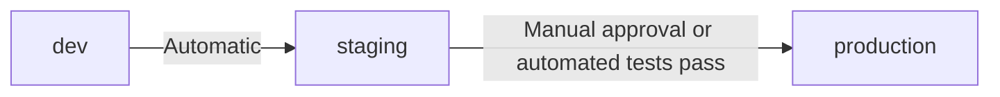

import { Tabs, TabItem } from '@astrojs/starlight/components';

> Last reviewed: May 2026

## Overview

After choosing managed Kubernetes from [Container Services](../../compute/containers/), **Day-2 operations** begin. Cluster upgrades, deployment automation, security policy, and observability are areas requiring ongoing management.

:::note
For a guide to choosing managed Kubernetes, see [Container Services](../../compute/containers/); for securing inter-service communication, see [Service Mesh](../../compute/service-mesh/).
:::

## Cluster Upgrades

Kubernetes releases three minor versions a year, and each vendor ends support for older versions after a set period.

| Vendor | Service | Supported versions | Upgrade method |
| --- | --- | --- | --- |
| AWS | EKS | Latest 4 (+ paid Extended Support) | Control plane → node group, sequentially |
| Azure | AKS | Latest 3 | Control plane → node pool, sequentially. Auto-upgrade option |
| Google Cloud | GKE | Latest 3 (Rapid/Regular/Stable channels) | Automatic upgrade based on Release Channel |
| OCI | OKE | Latest 3 | Control plane → node pool, sequentially |

**Upgrade strategies:**
- **Blue-Green node pool** — Create a new-version node pool → migrate workloads → delete the old node pool
- **Rolling** — Drain nodes one at a time → upgrade → uncordon
- **GKE Autopilot** — Google manages upgrades automatically

## Deployment Operations (GitOps)

Uses a Git repository as the single source of truth to declaratively manage cluster state. For GitOps concepts and a tool comparison, see [Getting Started with DevOps](../../devops/getting-started/#gitops); for CI/CD pipeline design, see [CI/CD](../../devops/cicd/).

**Kubernetes promotion strategy:**

## Security/Policy

| Area | Tool | Role |
| --- | --- | --- |
| **Admission Control** | [OPA Gatekeeper](https://open-policy-agent.github.io/gatekeeper/), [Kyverno](https://kyverno.io/) | Enforces policy on pod creation (image source restrictions, resource limits, etc.) |
| **Network Policy** | Calico, Cilium, vendor-native | Controls pod-to-pod communication (default: allow all → allow explicitly only) |
| **Image Policy** | Signature verification (Cosign, Notation) | Allows deployment only from approved registries/signed images |
| **Workload Identity** | IRSA (AWS), Workload Identity (Google Cloud/Azure) | Maps a cloud IAM role to a pod (no Service Account Key needed) |

## Platform Operations

| Component | Role | Representative tools |
| --- | --- | --- |
| **Ingress** | Routes external traffic → in-cluster services | NGINX Ingress, AWS ALB Controller, GKE Gateway |
| **cert-manager** | Automatic TLS certificate issuance/renewal | Let's Encrypt, ACM PCA integration |
| **external-dns** | Automatically registers DNS records on service creation | Route 53, Cloud DNS, Azure DNS integration |
| **Secret delivery** | Injects external secrets → pods | External Secrets Operator, CSI Secret Store Driver |
| **Backup** | etcd + PV backup | Velero |

## Observability

| Layer | Collection target | Tools |
| --- | --- | --- |
| **Cluster** | Node CPU/memory, pod status, scheduling | Prometheus + Grafana, vendor-native (Container Insights, GKE Monitoring) |
| **Application** | Request latency, error rate, traces | OpenTelemetry, Jaeger, X-Ray |
| **Control plane** | API Server latency, etcd status, scheduler | Managed offerings expose limited visibility. Supplement with audit logs |
| **Events** | Pod restarts, OOM kills, scheduling failures | Kubernetes Events → log collection |

## VPC Networking

A Kubernetes cluster runs on top of a VPC subnet, and the pod networking approach determines IP consumption and performance.

### Pod CIDR and Subnet Relationship

| Approach | Description | Vendor |
| --- | --- | --- |
| **VPC-native (VPC IP assigned to pods)** | Pods use VPC IPs directly. Can communicate directly with other resources in the VPC | AWS VPC CNI, Azure CNI, Google Cloud Alias IP |
| **Overlay network** | A separate CIDR is assigned to pods. Doesn't consume VPC IPs, but adds encapsulation overhead | Azure kubenet, Calico VXLAN, Flannel |

### Subnet IP Exhaustion

With the VPC-native approach, both nodes and pods consume VPC IPs, which can exhaust the subnet.

| Vendor | Mitigation |
| --- | --- |
| AWS | Prefix Delegation (allocates a /28 block per node), adding a Secondary CIDR |
| Azure | Azure CNI Overlay (pods use an overlay IP), Azure CNI + Dynamic IP Allocation |
| Google Cloud | Alias IP ranges, /14 default Pod CIDR (sufficiently large) |

### Service Exposure Patterns

| Level | Method | VPC resource |
| --- | --- | --- |
| ClusterIP | Accessible only within the cluster | None |
| NodePort | Exposed externally via node IP + port | Adds a Security Group rule |
| LoadBalancer | Automatically creates a cloud LB | LB + Target Group + Security Group |
| Ingress/Gateway | L7 routing (path/host-based) | Automatically creates ALB/App Gateway/Cloud LB |

### Network Policy

A Kubernetes-native feature for controlling pod-to-pod traffic. Its role differs from a VPC Security Group.

| Distinction | Network Policy (pod level) | Security Group (VPC level) |
| --- | --- | --- |
| Applies to | Pod ↔ Pod | Instance/ENI ↔ external |
| Implementation | Calico, Cilium, vendor-native | Vendor VPC feature |
| Default behavior | Allow all (if no policy) | Deny all (inbound) |

:::note
For VPC/subnet design fundamentals (CIDR planning, public/private separation, Transit Gateway), see [VPC and Subnets](../../networking/vpc-subnet/); for managed Kubernetes selection and node strategy, see [Container Services](../../compute/containers/).
:::

**Vendor-specific Kubernetes VPC/subnet design guides:**

- [AWS EKS — VPC and Subnet Best Practices](https://docs.aws.amazon.com/eks/latest/best-practices/subnets.html)
- [Azure AKS — IP Address Planning](https://learn.microsoft.com/azure/aks/concepts-network-ip-address-planning)
- [Google Cloud GKE — VPC-native Cluster Networking](https://cloud.google.com/kubernetes-engine/docs/concepts/alias-ips)
- [OCI OKE — Network Configuration](https://docs.oracle.com/en-us/iaas/Content/ContEng/Concepts/contengnetworkconfig.htm)

## Vendor Differences

<Tabs>
<TabItem label="AWS EKS">
- Control plane is managed; nodes are user-managed (Managed Node Group or Fargate)
- IRSA maps IAM Roles per pod
- VPC CNI (assigns VPC IPs directly to pods)
- ALB Ingress Controller automatically creates an AWS ALB
</TabItem>

<TabItem label="Azure AKS">
- Control plane is free (only node costs)
- Entra ID integration (RBAC + Conditional Access)
- Azure CNI or kubenet
- Native KEDA integration (event-driven autoscaling)
</TabItem>

<TabItem label="Google Cloud GKE">
- **Autopilot mode**: fully automated node management (billed per pod)
- Workload Identity removes the need for a Service Account Key
- Native Gateway API support
- Release Channel manages automatic upgrades
</TabItem>

<TabItem label="OCI OKE">
- Control plane is free
- Virtual Node (serverless node) option
- OCI IAM dynamic groups map pod permissions
- Flannel or OCI VCN-Native Pod Networking
</TabItem>
</Tabs>

## Common Mistakes

- **Delaying cluster upgrades until reaching an unsupported version** — This leads to forced upgrades or a halt in security patches. Establish an upgrade plan every quarter.
- **Operating without a Network Policy** — The default allows all pod-to-pod communication. Once breached, lateral movement is unrestricted.
- **Setting the VPC subnet IP range too small, causing pod scheduling failures** — In a VPC CNI environment, both nodes and pods consume VPC IPs. Allocate a sufficient CIDR (/20 or larger) during initial design.

## Checklist

- [ ] Is the cluster version within vendor support, and is an upgrade schedule in place?
- [ ] Is a policy applied via OPA/Kyverno etc. to allow only approved image registries?
- [ ] Are resource requests and limits configured per pod?

## References

### Azure

- [Azure AKS Best Practices](https://learn.microsoft.com/azure/aks/best-practices)

### Google Cloud

- [GKE Best Practices](https://cloud.google.com/kubernetes-engine/docs/best-practices)

### OCI

- [OCI OKE Documentation](https://docs.oracle.com/en-us/iaas/Content/ContEng/home.htm)

### Tools (SubnetTool)

- [Kubernetes Pod CIDR Calculator](https://subnettool.com/kubernetes-pod-cidr-calculator) — enter node/pod counts → calculates the required CIDR
- [Cloud Kubernetes Subnet Planner](https://subnettool.com/cloud-kubernetes-subnet-planner) — calculates subnet sizes per AKS/EKS/GKE/ARO
- [Kubernetes Networking Comparison (AKS vs EKS vs GKE vs ARO)](https://subnettool.com/kubernetes-networking-comparison) — compares networking differences across vendors

### Standards and Community

- [AWS EKS Best Practices Guide](https://aws.github.io/aws-eks-best-practices/)
- [Argo CD Documentation](https://argo-cd.readthedocs.io/)
- [CNCF Kubernetes Security Best Practices](https://kubernetes.io/docs/concepts/security/)
