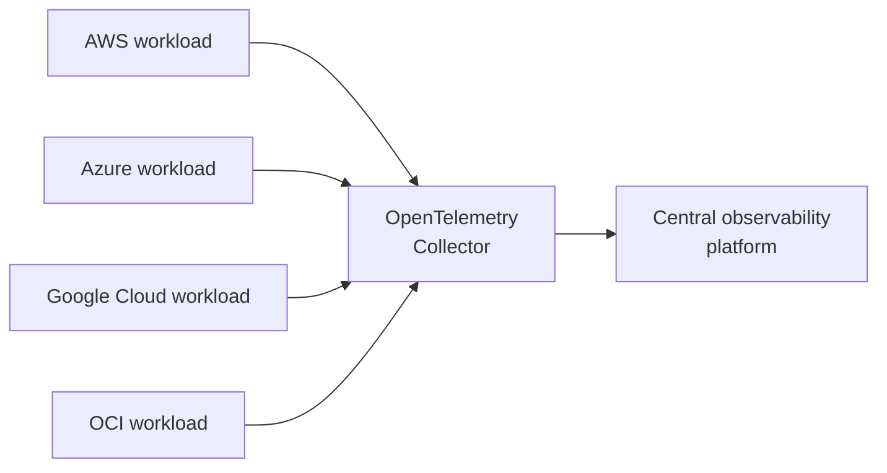
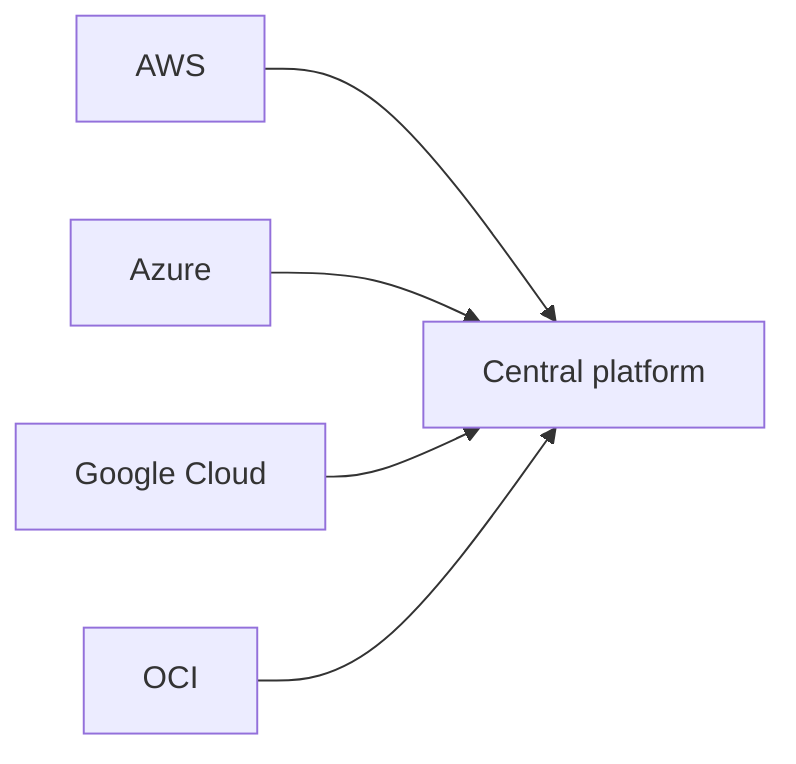
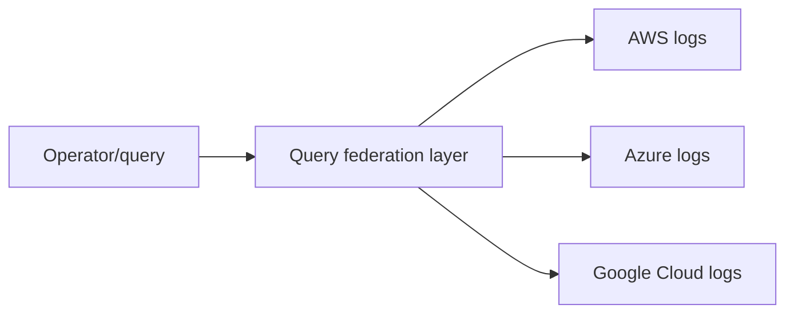

> Last reviewed: May 2026

:::note
For single-cloud monitoring fundamentals, see [Monitoring](../../devops/monitoring/). SLI/SLO/SLA concepts are covered in [SLI/SLO and Error Budgets](../../devops/slo/). This document focuses on **how to unify observability across a multicloud environment**.
:::

## Why Unification Is a Challenge

In a multicloud environment, each vendor provides its own observability tools.

| Vendor | Logs | Metrics | Traces |
| --- | --- | --- | --- |
| AWS | CloudWatch Logs | CloudWatch Metrics | X-Ray |
| Azure | Azure Monitor Logs | Azure Monitor Metrics | Application Insights |
| Google Cloud | Cloud Logging | Cloud Monitoring | Cloud Trace |
| OCI | OCI Logging | OCI Monitoring | OCI APM |

Operating these tools separately causes:

- **Silos** — When a single request crosses multiple clouds, tracking the full flow is difficult
- **Duplicate cost** — Licensing, storage, and training costs for each platform
- **Lack of consistency** — Dashboards and alerts are scattered, confusing the operations team
- **Vendor lock-in** — Deep reliance on a specific tool increases switching cost

## The OpenTelemetry Standard

[OpenTelemetry](https://opentelemetry.io/) is a CNCF project that provides a **vendor-neutral observability standard**. It collects logs/metrics/traces in a unified way.

- **Language SDK** — Instrumentation libraries for major languages (Java, Python, Go, JavaScript, .NET, etc.)
- **Collector** — An agent that collects, processes, and forwards data
- **Semantic Conventions** — Standard attribute names/formats (e.g., `http.method`, `service.name`)

Official vendor support:

- [AWS Distro for OpenTelemetry (ADOT)](https://aws-otel.github.io/)
- [Azure Monitor OpenTelemetry](https://learn.microsoft.com/azure/azure-monitor/app/opentelemetry-overview)
- [Google Cloud OpenTelemetry](https://cloud.google.com/stackdriver/docs/instrumentation/overview)
- [OCI OpenTelemetry Support](https://docs.oracle.com/en-us/iaas/application-performance-monitoring/doc/configure-open-source-tracing-systems.html)

## Integration Patterns

### 1. Fan-in (Central Aggregation)

Send data from each cloud's workloads to a single central platform.

- **Advantages** — A single dashboard, cross-cloud correlation analysis
- **Disadvantages** — The central platform is a single point of failure; data movement cost
- **Use** — Common in general multicloud operating organizations

### 2. Fan-out (Query Federation)

Keep data in each cloud, and query multiple sources simultaneously at query time.

- **Advantages** — No data movement, saves egress cost
- **Disadvantages** — Query latency, requires a federation engine
- **Use** — Cases with strict data sovereignty requirements (supported by tools like Grafana)

### 3. Hybrid

Only critical metrics are centrally aggregated; detailed logs stay in place.

## 3rd-Party Platform Comparison

Most organizations use a 3rd-party platform to unify observability across multiple clouds.

| Platform | Characteristics | Notes |
| --- | --- | --- |
| [Datadog](https://www.datadoghq.com/) | Unified dashboards, broad integrations, strong APM | SaaS-focused |
| [New Relic](https://newrelic.com/) | Full-stack APM, usage-based pricing | SaaS |
| [Dynatrace](https://www.dynatrace.com/) | AI-based automatic anomaly detection (Davis AI) | Enterprise |
| [Splunk](https://www.splunk.com/) | Strong log analysis, integrated security analytics (SIEM) | Enterprise |
| [Elastic Observability](https://www.elastic.co/observability) | Open-source based, flexible deployment | Self-hosting possible |
| [Grafana Cloud](https://grafana.com/products/cloud/) | Managed Prometheus/Loki/Tempo | OpenTelemetry-friendly |

## Self-Built Stack

If cloud portability and cost control matter, you can build an open-source stack yourself.

| Area | Open source |
| --- | --- |
| Metrics | [Prometheus](https://prometheus.io/), [Thanos](https://thanos.io/), [VictoriaMetrics](https://victoriametrics.com/) |
| Logs | [Elasticsearch/OpenSearch](https://opensearch.org/), [Loki](https://grafana.com/oss/loki/) |
| Traces | [Jaeger](https://www.jaegertracing.io/), [Tempo](https://grafana.com/oss/tempo/) |
| Dashboards | [Grafana](https://grafana.com/) |
| Collectors | [OpenTelemetry Collector](https://opentelemetry.io/docs/collector/), [Fluent Bit](https://fluentbit.io/) |

CNCF's [Cloud Native Landscape — Observability](https://landscape.cncf.io/guide#observability-and-analysis) organizes the entire ecosystem.

## Cost Considerations

Observability cost is generally proportional to **volume collected (GB)** and **retention period (days)**. In a multicloud setting, you also need to consider egress cost.

### Key Cost Drivers

- **Log volume** — Can vary by 10x depending on the application log level (DEBUG vs ERROR)
- **Metric cardinality** — More tag combinations increase storage cost (e.g., per-user-ID metrics)
- **Trace sampling** — Storing only 1-10% of all traces can still be sufficient for analysis
- **Cross-cloud egress** — With the Fan-in pattern, several TB of data can move each month

### Cost Reduction Strategies

- **Sampling** — Keep only representative traces
- **Compression/tiering** — Move older logs to cheaper storage
- **Filtering** — Remove unnecessary logs at the collection stage
- **Aggregation** — Send only aggregated metrics centrally, instead of raw logs
- **In-region processing** — Aggregate within a region and forward only the metrics when possible

## Multicloud Unified Monitoring (Single Pane of Glass)

Looking at AWS CloudWatch, Azure Monitor, and Google Cloud Cloud Monitoring separately is inefficient. In a multicloud environment, you need a **unified dashboard that shows the state of every cloud from one place**.

| Approach | Description | Tools |
| --- | --- | --- |
| **OpenTelemetry standardization** | Vendor-neutral instrumentation → collected into a single backend | OTel Collector + Grafana/Datadog |
| **3rd-party unified platform** | Metrics/logs from every vendor into a single SaaS | Datadog, New Relic, Dynatrace, Splunk |
| **Open-source stack** | Self-operated, no vendor lock-in | Prometheus + Grafana + Loki + Tempo |

**Considerations when building unified monitoring:**

- Convert each vendor's native metrics to OTel or Prometheus format
- Route alerts to a single channel (PagerDuty, Opsgenie)
- Standardize tags/labels so the dashboard can filter by vendor
- Cost: 3rd-party SaaS bills by collection volume, so log volume needs to be managed

## Implementation Checklist

Items to check when adopting multicloud observability:

- [ ] Use the OpenTelemetry standard to avoid vendor-locked instrumentation
- [ ] Define common tagging conventions such as `service.name`, `environment`
- [ ] Set a trace sampling policy (head sampling / tail sampling)
- [ ] Establish collection/retention policy by log level (e.g., ERROR 90 days, INFO 7 days)
- [ ] Keep cloud-native metrics (CPU, network) in the vendor tool
- [ ] Consolidate application metrics/traces into the central platform
- [ ] Define SLOs and build an error budget dashboard (see [SLI/SLO and Error Budgets](../../devops/slo/))
- [ ] Standardize alert routing (single integration into PagerDuty, Opsgenie, etc.)
- [ ] Monitor cost (the cost of the observability platform itself)

## What to Keep Doing

- **Regular dashboard/alert reviews** — Check quarterly whether dashboards reflect the current architecture.
- **Remove alert noise** — Remove ignored alerts or adjust thresholds. Alert fatigue causes real incidents to be missed.
- **SLO-based alert tuning** — Switching to alerts based on error budget burn rate reduces noise.

## Common Mistakes

- **Sending all logs to the central platform at DEBUG level** — Collection cost explodes. Establish a log-level policy per environment (WARN and above in production).
- **Using high-cardinality values (user ID, request ID) in metric tags** — Time-series explosion drastically worsens storage cost and query performance.
- **Running traces at 100% sampling** — Most normal requests have low analytical value. Tail sampling (storing only errors/slow requests) can cut costs by 90%+.

## Related Documents

- [Monitoring](../../devops/monitoring/)
- [SLI/SLO](../../devops/slo/)
- [Platform Engineering](../../devops/platform-engineering/)
- [Security Posture Management](../../security/security-posture/)

## References

### Standards and Open Source

- [OpenTelemetry Official Documentation](https://opentelemetry.io/docs/)
- [CNCF Observability TAG](https://github.com/cncf/tag-observability)
- [Cloud Native Observability Landscape](https://landscape.cncf.io/guide#observability-and-analysis)

### AWS

- [AWS Distro for OpenTelemetry (ADOT)](https://aws-otel.github.io/)
- [CloudWatch Documentation](https://docs.aws.amazon.com/AmazonCloudWatch/latest/monitoring/)
- [AWS X-Ray Documentation](https://docs.aws.amazon.com/xray/)

### Azure

- [Azure Monitor OpenTelemetry](https://learn.microsoft.com/azure/azure-monitor/app/opentelemetry-overview)
- [Application Insights Documentation](https://learn.microsoft.com/azure/azure-monitor/app/app-insights-overview)
- [Azure Monitor Documentation](https://learn.microsoft.com/azure/azure-monitor/)

### Google Cloud

- [Google Cloud OpenTelemetry](https://cloud.google.com/stackdriver/docs/instrumentation/overview)
- [Cloud Logging Documentation](https://cloud.google.com/logging/docs)
- [Cloud Monitoring Documentation](https://cloud.google.com/monitoring/docs)
- [Cloud Trace Documentation](https://cloud.google.com/trace/docs)

### OCI

- [OCI APM OpenTelemetry](https://docs.oracle.com/en-us/iaas/application-performance-monitoring/doc/configure-open-source-tracing-systems.html)
- [OCI Logging Documentation](https://docs.oracle.com/en-us/iaas/Content/Logging/home.htm)
- [OCI Monitoring Documentation](https://docs.oracle.com/en-us/iaas/Content/Monitoring/home.htm)
