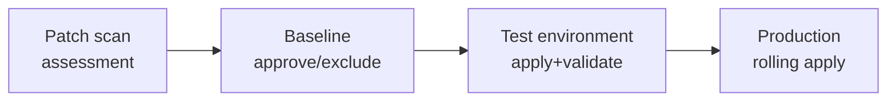
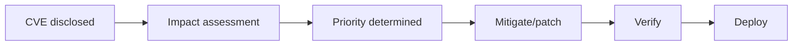

> Last reviewed: May 2026

## Overview

Operating cloud infrastructure involves two recurring security tasks.

1. **Periodic patching** — Regularly applying security updates to the OS, runtime, and middleware
2. **Vulnerability response** — When a CVE is disclosed, assessing the scope of impact and applying an urgent patch or mitigation

These are separate processes, but since tools and pipelines overlap, they're covered together here.

## Periodic Patch Management

### Vendor Patch Management Services

| Vendor | Service | Target | Characteristics |
| --- | --- | --- | --- |
| AWS | [Systems Manager Patch Manager](https://docs.aws.amazon.com/systems-manager/latest/userguide/systems-manager-patch.html) | EC2 (Linux/Windows) | Defines patch baselines, schedules maintenance windows, compliance reporting |
| Azure | [Azure Update Manager](https://learn.microsoft.com/azure/update-manager/overview) | VM (Linux/Windows), Arc-connected servers | Agentless assessment, scheduled patching, pre/post scripts |
| Google Cloud | [OS Patch Management](https://cloud.google.com/compute/docs/os-patch-management) | Compute Engine (Linux/Windows) | Patch Jobs + Patch Deployments |
| OCI | [OS Management Hub](https://docs.oracle.com/en-us/iaas/osmh/doc/home.htm) | Compute (Oracle Linux/Windows) | Package management, scheduled jobs, compliance reporting |

### Patch Process

1. **Scan/assess** — Check the list of missing patches on current instances
2. **Define baseline** — Classify which patch categories to auto-approve (Critical, Security, etc.) and set an exclusion list
3. **Test application** — Apply to a non-production environment first to verify compatibility
4. **Production rollout** — Apply sequentially by group within a maintenance window. Halt on failure

### Patching Strategies

| Strategy | Description | Suitable environment |
| --- | --- | --- |
| **Immutable Infrastructure** | Replace instances with a patched new AMI/image | Containers, Auto Scaling groups, serverless |
| **In-place Patching** | Apply patches directly to a running instance | Stateful servers (DB, legacy apps) |
| **Blue-Green** | Prepare a patched new environment, then switch traffic | When minimizing downtime is required |

:::note
**Prefer Immutable Infrastructure whenever possible.** Since applying a patch = building and deploying a new image, patch state stays consistent and rollback is easy. In container environments, this corresponds to updating the base image and redeploying. To automate security scanning during image builds, see [DevSecOps](../../devops/devsecops/).
:::

## Vulnerability Detection and Response

### Vendor Vulnerability Scanning Services

These services overlap with the CWPP area of [Security Posture Management](../../security/security-posture/). Here they're covered from a patch-response perspective.

| Vendor | Service | Scan target | Characteristics |
| --- | --- | --- | --- |
| AWS | [Amazon Inspector](https://docs.aws.amazon.com/inspector/latest/user/what-is-inspector.html) | EC2, ECR images, Lambda | Agentless automatic scanning. CVE + network reachability analysis |
| Azure | [Microsoft Defender for Cloud](https://learn.microsoft.com/azure/defender-for-cloud/defender-for-cloud-introduction) | VM, containers, App Service, DB | Integrated CSPM + CWPP. Vulnerability assessment + security recommendations |
| Google Cloud | [Security Command Center](https://cloud.google.com/security-command-center/docs) + [Artifact Analysis](https://cloud.google.com/artifact-analysis/docs) | Compute Engine, GKE, Artifact Registry | Integrated vulnerability + misconfiguration + threat detection |
| OCI | [Vulnerability Scanning](https://docs.oracle.com/en-us/iaas/scanning/home.htm) | Compute, Container Registry | Agent-based host scanning + container image scanning |

### Container Image Vulnerability Scanning

In container environments, detecting vulnerabilities at image build time is essential.

| Vendor | Registry scanning | CI/CD integration |
| --- | --- | --- |
| AWS | ECR image scanning (integrated with Inspector) | Automatic scanning in CodeBuild/CodePipeline |
| Azure | Defender for Containers (ACR scanning) | Azure DevOps/GitHub Actions integration |
| Google Cloud | Artifact Analysis (Artifact Registry) | Automatic scan on Cloud Build triggers |
| OCI | Container Registry scanning | Integrated with DevOps service pipelines |

### Vulnerability Response Process

| Stage | Activity | Example tools |
| --- | --- | --- |
| **Detection** | The vulnerability scanner matches CVEs | Inspector, Defender, SCC |
| **Impact assessment** | CVSS score + actual exposure (network reachability, whether used at runtime) | Inspector network reachability, Defender attack path analysis |
| **Prioritization** | Critical + externally exposed = respond immediately. Low + internal only = next regular patch cycle | CVSS + EPSS + business impact |
| **Mitigation** | Temporary measures before patching (WAF rule, network isolation, disabling the feature) | WAF, Security Group, feature flag |
| **Apply patch** | Regular patch process or an urgent hotfix | Patch Manager, image rebuild |
| **Verify** | Rescan for vulnerabilities after patching + confirm normal service operation | Rescan + smoke test |

### Emergency Vulnerability (Zero-Day) Response

The response framework for urgent situations that can't wait for the regular patch cycle.

| Step | Activity |
| --- | --- |
| **1. Receive alert** | Monitor vendor security bulletins, CVE feeds, security news |
| **2. Identify scope** | Immediately query the list of resources using the vulnerable package/version (leveraging SBOM) |
| **3. Immediate mitigation** | Network isolation, WAF virtual patching, disabling the vulnerable feature |
| **4. Emergency patch** | Apply the vendor patch release immediately (reduced testing may be acceptable, but always prepare a rollback plan) |
| **5. Post-verification** | Rescan the entire environment, check for indicators of compromise (IOC) |

:::caution
Managing an **SBOM (Software Bill of Materials)** in advance lets you identify the scope of impact within minutes when an emergency vulnerability arises. AWS Inspector and Google Cloud Artifact Analysis support automatic SBOM generation.
:::

## Automation Best Practices

- **Golden image pipeline** — Periodically build patched base images, and deploy all instances/containers from them
- **Compliance dashboard** — Real-time monitoring of the proportion of unpatched instances (target: 95%+ compliance)
- **SLA-based patch deadlines** — Critical: within 72 hours, High: within 7 days, Medium: within 30 days (adjust per organizational policy)
- **Automatic ticket creation** — Automatically create a Jira/ServiceNow ticket when a vulnerability is detected, for tracking
- **Regular reporting** — Monthly patch compliance rate, mean time to patch (MTTP), trend of unresolved vulnerabilities

## Common Mistakes

- **Applying patches directly to production without testing** — Compatibility issues cause service incidents. Always validate in a non-production environment first.
- **Deciding priority by CVSS score alone** — You need to also consider actual exploit likelihood (EPSS) and network exposure. A High CVE on an externally exposed server can be more urgent than a Critical CVE on an internal-only server.
- **Not maintaining an SBOM, causing days of delay in identifying impact scope during an emergency CVE** — Enable automatic SBOM generation in Inspector/Artifact Analysis.

## Checklist

- [ ] Is the proportion of unpatched instances monitored in real time (target: 95%+ compliance)?
- [ ] Is a patch SLA defined for Critical vulnerabilities (e.g., within 72 hours)?
- [ ] Is there a golden image pipeline that periodically rebuilds container base images?

## References

### AWS

- [AWS Systems Manager Patch Manager](https://docs.aws.amazon.com/systems-manager/latest/userguide/systems-manager-patch.html)
- [Amazon Inspector](https://docs.aws.amazon.com/inspector/latest/user/what-is-inspector.html)

### Azure

- [Azure Update Manager](https://learn.microsoft.com/azure/update-manager/overview)
- [Microsoft Defender for Cloud](https://learn.microsoft.com/azure/defender-for-cloud/)

### Google Cloud

- [Google Cloud OS Patch Management](https://cloud.google.com/compute/docs/os-patch-management)
- [Google Cloud Security Command Center](https://cloud.google.com/security-command-center/docs)

### OCI

- [OCI OS Management Hub](https://docs.oracle.com/en-us/iaas/osmh/doc/home.htm)
- [OCI Vulnerability Scanning](https://docs.oracle.com/en-us/iaas/scanning/home.htm)

### Standards and Community

- [NIST Vulnerability Database (NVD)](https://nvd.nist.gov/)
- [FIRST EPSS (Exploit Prediction Scoring System)](https://www.first.org/epss/)
