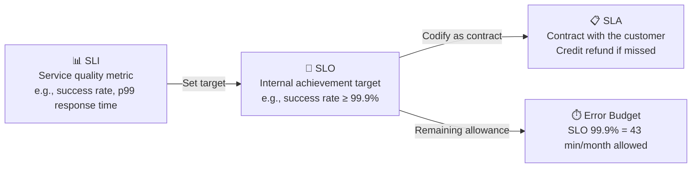

> Last reviewed: May 2026

## Overview

In DevOps/SRE, SLI/SLO/SLA is the framework for systematically defining "is the service reliable enough?"

| Term | Definition | Example |
| --- | --- | --- |
| **SLI** (Service Level Indicator) | A metric that measures service quality | Request success rate, p99 response time, uptime percentage |
| **SLO** (Service Level Objective) | An internal target value for an SLI | "Monthly request success rate of 99.9% or higher" |
| **SLA** (Service Level Agreement) | A contract with the customer. Includes compensation if the SLO is missed | "Credit refund if availability falls below 99.95%" |

Relationship: **SLI** (measurement) → **SLO** (target) → **SLA** (contract)

## Error Budget

An SLO of 99.9% means "about 43 minutes of downtime per month is allowed." This allowed time is called the **error budget**.

| SLO | Allowed monthly downtime | Allowed annual downtime |
| --- | --- | --- |
| 99% | 7h 18m | 3d 15h |
| 99.9% | 43m | 8h 46m |
| 99.95% | 21m | 4h 23m |
| 99.99% | 4m | 52m |

Why the error budget matters:

- **Balancing deployment speed and stability** — When the error budget has room left, you can ship new features; once it's exhausted, focus shifts to stabilization.
- **Resolving inter-team conflict** — Resolves the "let's deploy faster" vs. "let's operate more reliably" conflict with data.
- **A basis for investment decisions** — Going from 99.9% to 99.99% can increase cost by 10x or more. You should choose the level appropriate to business needs.

## 5 Steps to Setting an SLO

1. **Select an SLI** — Choose a metric that directly affects user experience (e.g., API response time p99, error rate, availability).
2. **Measure the current level** — Measure the actual SLI over the past 30 days.
3. **Set the SLO** — Set it slightly above the current level. Don't target 99.99% from the start.
4. **Monitor the error budget** — Display the error budget burn rate on a dashboard, and send an alert if the burn rate is fast.
5. **Establish an error budget policy** — Agree in advance on policies such as a deployment freeze or stabilization sprint when the budget is exhausted.

:::note
**Reference:** The SLI/SLO/error budget concepts were formalized in Google's SRE book, [Site Reliability Engineering](https://sre.google/sre-book/table-of-contents/).
:::

## CSP SLA ≠ Your Service's SLA

"The CSP gives a 99.99% SLA, so my service must be 99.99% too" is a common misconception.

| Distinction | CSP SLA | Your service's SLA |
| --- | --- | --- |
| **Target** | An individual component (EC2, RDS, S3, etc.) | The entire service experienced by the end user |
| **Scope** | "This component won't go down" | "The user will get a normal response" |
| **Calculation** | Guaranteed by the vendor | Achieved by your own architecture |
| **Compensation** | Credit refund if the SLA is missed | Customer churn, contract breach |

### Multiplying Availability in a Series

If a service passes through LB → App → DB → Cache:

> 99.99% × 99.95% × 99.9% × 99.99% = **about 99.83%** (roughly 15 hours of downtime annually)

Even if the CSP guarantees 99.9%+ on each, chaining them together brings the overall number down.

### How to Increase Availability

| Pattern | Effect | Example |
| --- | --- | --- |
| Parallel redundancy (Active-Active) | 1 - (1-A)² | Multi-AZ, regional redundancy |
| Circuit breaker / fallback | Isolates dependency failures | Direct DB lookup when the cache fails |
| Asynchronous processing | Removes synchronous dependencies | Decouple with a message queue |
| Graceful degradation | Only a subset of functionality stops | Show a default list when recommendations fail |

### SLO > SLA (Using the Error Budget)

- SLA promised to the customer: 99.9% (8.7 hours/year)
- Internal SLO target: 99.95% (4.4 hours/year)
- The difference = the error budget → used for deployment, experimentation, and maintenance
- If the SLO equals the SLA, the error budget is zero → nothing can be done

## Common Mistakes

- **Setting the SLO equal to the SLA** — The error budget becomes zero, leaving no room for deployment or experimentation. Set the SLO higher than the SLA to secure margin.
- **Using server metrics (CPU, memory) as the SLI** — These don't directly connect to user experience. Choose user-facing metrics such as request success rate or p99 response time.
- **Targeting 99.99% from the start** — The cost of achieving it grows exponentially. Measure the current level first, then improve gradually.

## Checklist

- [ ] Is the SLI defined using a metric (success rate, latency) that directly affects user experience?
- [ ] Can the error budget burn rate be checked on a real-time dashboard?
- [ ] Is there a team-wide, pre-agreed policy (e.g., deployment freeze) for when the error budget is exhausted?

## References

- [Google SRE Book — Service Level Objectives](https://sre.google/sre-book/service-level-objectives/)
- [DORA Metrics](https://dora.dev/)
- [OpenSLO Specification](https://openslo.com/)
