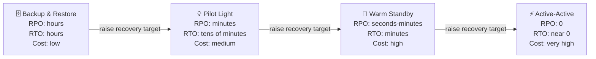

> Last reviewed: May 2026

## What Is DR

**Disaster Recovery (DR)** is the plan and process for restoring service within a predefined target time when service is interrupted by a natural disaster, hardware failure, human error, or similar event.

## Defining a Disaster

To build a DR plan, you first need to define "what counts as a disaster." A disaster is a different order of event from a single resource failure.

### Types of Disasters

| Category | Examples | Scope of Impact |
| --- | --- | --- |
| **Natural disaster** | Earthquake, flood, typhoon, fire, power outage | A single or multiple data centers, a region |
| **Hardware/infrastructure failure** | Power supply failure, network backbone disconnection, storage cluster damage | A single AZ to a region |
| **Software/platform failure** | Cloud vendor's region-wide service outage, deployment failure | A single service to a region |
| **Human error** | Accidental deletion, incorrect change, misconfiguration | A single resource to an entire account |
| **Security incident** | Ransomware, data breach, credential theft | Data, account, region |
| **External supply chain issue** | External API/service outage, SaaS vendor failure | Scope of that dependency |

### Classifying Disaster Levels

Response strategies are applied differently depending on the scope of failure.

| Level | Definition | Response |
| --- | --- | --- |
| **Local failure** | A single server or single resource fails | Auto-scaling, health-check-based automatic recovery |
| **AZ failure** | An entire single Availability Zone goes down | Multi-AZ deployment, automatic failover between AZs |
| **Regional failure** | An entire region goes down (rare, but does happen) | Cross-region replication, region-to-region DR |
| **Vendor failure** | An entire cloud vendor outage | Multi-cloud DR (high cost/complexity) |

:::note
**Key point:** it's common to handle failures up to AZ level with high-availability (HA) design, and to handle regional failures and above with DR design. Trying to solve every failure with DR makes costs excessive; conversely, having only HA without DR makes recovery from a regional failure impossible.
:::

### The Difference Between Disaster and High Availability

**High Availability (HA)** is a design that keeps service running even when individual failures occur. **DR** is a recovery strategy for failures at a scale (regional disaster) that HA cannot prevent.

| Aspect | High Availability (HA) | Disaster Recovery (DR) |
| --- | --- | --- |
| **Goal** | Maintain uninterrupted service | Recover service after a disaster |
| **Target failure** | Failures within an AZ | Failures at regional scale or above |
| **Implementation** | Multi-AZ, load balancers, automatic failover | Cross-region replication, DR site |
| **Cost** | Relatively low | High (duplicate infrastructure) |

## Key Metrics: RPO and RTO

| Metric | Definition | Business Meaning |
| --- | --- | --- |
| **RPO** (Recovery Point Objective) | Maximum acceptable data loss time upon recovery | "How many minutes/hours of data can we afford to lose at most?" |
| **RTO** (Recovery Time Objective) | Maximum acceptable time to restore service after a failure | "Within how many minutes/hours must service be back at most?" |

RPO and RTO are derived from business requirements. They are not set arbitrarily by the technical team, but determined through a Business Impact Analysis (BIA).

## Alignment with Business Goals

### Business Impact Analysis (BIA)

Before setting DR targets, you first need to define the following:

1. **Identify core business processes** — which systems, if interrupted, directly impact revenue/customers?
2. **Estimate the cost of downtime** — what is the cost per hour/minute of downtime? (revenue loss, penalties, reputational damage)
3. **Derive RPO/RTO** — set targets at the balance point between downtime cost and DR build cost
4. **Classify tiers** — applying the same DR level to all systems is excessively costly. Classify by importance tier

| Tier | RPO | RTO | DR Strategy | Examples |
| --- | --- | --- | --- | --- |
| **Tier 1** (mission-critical) | 0 (no data loss allowed) | Minutes | Active-Active / Hot Standby | Payment systems, trading platforms |
| **Tier 2** (business-critical) | Minutes to 1 hour | 1-4 hours | Warm Standby | Order management, CRM |
| **Tier 3** (general business) | Hours to 24 hours | 24 hours | Pilot Light / Backup & Restore | Internal tools, development environments |

## DR Strategy Types

| Strategy | RPO | RTO | Cost | Description |
| --- | --- | --- | --- | --- |
| **Backup & Restore** | Hours | Hours | Low | Restore from regular backups upon failure. Cheapest but slowest |
| **Pilot Light** | Minutes | Tens of minutes | Medium | Only core infrastructure runs at minimal scale at all times. Scale up on failure |
| **Warm Standby** | Seconds to minutes | Minutes | High | A scaled-down full environment runs at all times. Scale up on failure |
| **Active-Active** | 0 | Near 0 | Very high | Traffic handled simultaneously in two regions. Automatic failover on failure |

## Implementation by Strategy — Vendor Service Mapping

The vendor services used to actually implement each strategy above.

### Backup & Restore Implementation

Data is replicated to another region in advance, and infrastructure is newly created and restored in that region upon failure.

| Role | AWS | Azure | Google Cloud | OCI |
| --- | --- | --- | --- | --- |
| Storage replication | S3 Cross-Region Replication | Geo-Redundant Storage (GRS) | Multi-region Storage | Cross-Region Copy |
| DB backup replication | RDS automated cross-region backup copy | Azure SQL Geo-Backup | Cloud SQL cross-region backup | Data Guard (Standby) |
| Infrastructure recreation | CloudFormation / Terraform | ARM / Bicep / Terraform | Terraform | Resource Manager / Terraform |

### Pilot Light to Warm Standby Implementation

Core infrastructure runs at minimal/reduced scale in the DR region at all times, and scales up upon failure.

| Role | AWS | Azure | Google Cloud | OCI |
| --- | --- | --- | --- | --- |
| DR orchestration | Elastic Disaster Recovery (DRS) | Azure Site Recovery | — (configured as an architecture pattern) | Full Stack DR |
| DB real-time replication | RDS Cross-Region Read Replica, Aurora Global DB | Azure SQL Geo-Replication | Cloud SQL Cross-Region Replica | Data Guard (Active) |
| Traffic switching | Route 53 Failover | Traffic Manager / Front Door | Cloud DNS + Global LB | DNS Traffic Management |

### Active-Active Implementation

Traffic is handled simultaneously in two regions, and if one fails, the other absorbs the full load.

| Role | AWS | Azure | Google Cloud | OCI |
| --- | --- | --- | --- | --- |
| Global routing | Route 53 + Global Accelerator | Front Door | Global HTTP(S) LB | DNS Traffic Management |
| Global database | Aurora Global Database, DynamoDB Global Tables | Cosmos DB (Multi-region Write) | Spanner | Autonomous DB (Cross-Region) |
| State synchronization | ElastiCache Global Datastore | Azure Cache Geo-Replication | Memorystore Cross-Region | — |

## DR Testing

A DR plan is meaningless if it isn't tested. You must regularly verify that it works as planned when an actual failure occurs.

### Test Types

| Type | Description | Frequency |
| --- | --- | --- |
| **Tabletop Exercise** | Scenario-based discussion. No actual system changes | Quarterly |
| **Walkthrough Test** | Execute the recovery procedure step by step, without affecting production | Semi-annually |
| **Simulation Test** | Perform an actual failover, but within a limited scope | Annually |
| **Full Interruption Test** | Actually shut down the production region and switch to the DR region | Annually (optional) |

### What to Check During Testing

- Is the actual RTO within the target RTO?
- Is the actual RPO within the target RPO? (verify the amount of data lost)
- Does the failback (returning to the original region) procedure work?
- Are the runbooks/automation scripts up to date?
- Are the responsible personnel familiar with the procedure?

:::note
A DR plan **must be tested regularly**. If you run the recovery procedure for the first time during an actual failure, you will not achieve the target RTO. Perform a Simulation Test or Walkthrough Test at least once a year and keep runbooks up to date.
:::

### Relationship to Chaos Engineering

Beyond DR testing, Chaos Engineering is the practice of routinely injecting failures to verify system resilience.

| Vendor | Tool |
| --- | --- |
| AWS | [AWS Fault Injection Service](https://docs.aws.amazon.com/fis/) |
| Azure | [Azure Chaos Studio](https://learn.microsoft.com/en-us/azure/chaos-studio/) |
| Google Cloud | — (3rd party: Gremlin, LitmusChaos) |
| OCI | — (3rd party: Gremlin, LitmusChaos) |

## DR Regions by Country and Regulation

When choosing a secondary region, look not only at latency but also at **whether data leaves the jurisdiction**. A region pair in the same country enables in-country DR; using a neighboring country's region creates cross-border transfer requirements. See each country guide for primary and secondary candidates:

- [Korea](../../korea/) — Seoul, Busan, Chuncheon; vendors with in-country DR; cross-border personal data transfer
- [United States](../../us/) — FedRAMP, data residency
- [EU](../../eu/) — GDPR, sovereign cloud
- [Japan](../../japan/) — ISMAP, Government Cloud
- [Singapore](../../singapore/) — MTCS, PDPA

:::caution
When using a region outside the jurisdiction for DR, you must meet that country's cross-border personal data transfer and data residency requirements. For workloads with strict data sovereignty, prioritize vendors that support in-country DR.
:::

## Common Mistakes

- **Building a DR plan and never testing it** — during an actual failure, outdated runbooks fail to work, and the target RTO cannot be achieved
- **Applying the same DR strategy to every system** — designing everything as Active-Active without considering cost, or leaving everything at Backup & Restore
- **Not reviewing data sovereignty when using an out-of-jurisdiction DR region** — regulatory violations from failing to confirm cross-border personal data transfer and residency requirements

## Checklist

- [ ] Have you defined RPO/RTO per workload based on a Business Impact Analysis (BIA)?
- [ ] Do you perform DR testing (at minimum a Walkthrough) at least once a year and keep runbooks up to date?
- [ ] If using an out-of-jurisdiction DR region, have you met the legal requirements for cross-border data transfer?

## Related Documents

- [Regions and Availability Zones](../../about-cloud/regions-and-zones/)
- [Backup and Recovery](../../storage/backup/)
- [Well-Architected Framework](../../about-cloud/well-architected/)

## References

### AWS

- [AWS Disaster Recovery whitepaper](https://docs.aws.amazon.com/whitepapers/latest/disaster-recovery-workloads-on-aws/disaster-recovery-workloads-on-aws.html)
- [AWS Elastic Disaster Recovery](https://docs.aws.amazon.com/drs/)
- [AWS Fault Injection Service](https://docs.aws.amazon.com/fis/)

### Azure

- [Azure Site Recovery documentation](https://learn.microsoft.com/en-us/azure/site-recovery/)
- [Azure business continuity](https://learn.microsoft.com/en-us/azure/reliability/business-continuity-management-program)
- [Azure Chaos Studio](https://learn.microsoft.com/en-us/azure/chaos-studio/)

### Google Cloud

- [Google Cloud DR planning guide](https://cloud.google.com/architecture/dr-scenarios-planning-guide)
- [Google Cloud disaster recovery architecture](https://cloud.google.com/architecture/disaster-recovery)

### OCI

- [OCI Full Stack DR](https://docs.oracle.com/en-us/iaas/disaster-recovery/index.html)
- [OCI business continuity guide](https://docs.oracle.com/en-us/iaas/disaster-recovery/index.html)
