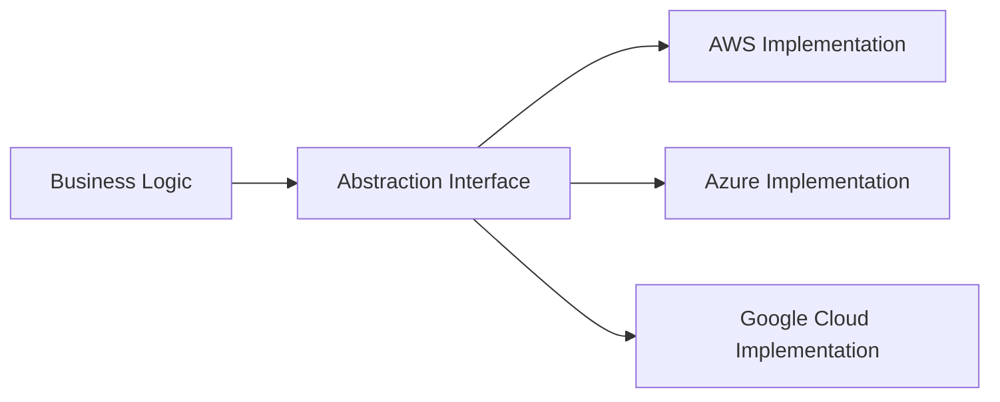

> Last reviewed: August 2026

## Why an Exit Strategy Matters

The more deeply you integrate with a single vendor, the more **your pricing leverage shrinks**, and the more vulnerable you become to the vendor's policy changes (price hikes, service discontinuation, regional withdrawal). Some jurisdictions, such as the EU's DORA, mandate **documented Exit Plans** for the financial sector. In November 2025, the ESAs (EBA, EIOPA, ESMA) published the first list of designated CTPPs (Critical ICT Third-Party Providers) under DORA, requiring financial entities using designated CTPPs to demonstrate stricter exit readiness. Country-specific obligations are in the [Korea](../../korea/), [United States](../../us/), [EU](../../eu/), [Japan](../../japan/), and [Singapore](../../singapore/) guides.

An important misconception:

:::caution
**"Zero lock-in" is unrealistic, and often counterproductive.** Pursuing complete portability at the cost of giving up the benefits of managed services (reduced operational burden, automated security, high availability) can actually hurt competitiveness. The goal is not to **eliminate lock-in but to choose an "acceptable level of lock-in."**
:::

[AWS Prescriptive Guidance](https://docs.aws.amazon.com/prescriptive-guidance/latest/strategy-multicloud-fsi/vendor-lockin.html) states the same position — *"Avoiding lock-in depends more on an organization's people and processes than on technical decisions."*

## Four Dimensions of Lock-in

| Dimension | Description | Examples |
| --- | --- | --- |
| **Data lock-in** | Data formats, storage, egress costs | S3-only formats, Cosmos DB-exclusive API, egress cost of petabyte-scale data |
| **API lock-in** | Code built around a specific vendor SDK/API | Lambda event objects, Azure Durable Functions state management |
| **Architecture lock-in** | Designs based on vendor-specific services | Step Functions workflows, Cosmos DB-exclusive features |
| **Operational lock-in** | Team skills and toolchain concentrated on one vendor | Teams that only use CloudFormation, Azure DevOps pipelines |
| **AI/ML lock-in** | Vendor dependency through fine-tuned models, embeddings, and vector DBs | Non-exportable vendor-specific fine-tuned models, vector indices tied to a specific embedding model, platform-dependent prompt/RAG pipelines |

## Lock-in Levels and Trade-offs

The degree of lock-in varies by service. Generally, **the lower the layer (IaaS), the lower the lock-in; the higher the layer (managed services), the higher the lock-in.**

| Level | Lock-in | Portability | Management Burden | Representative Examples |
| --- | --- | --- | --- | --- |
| **IaaS (VM)** | Low | High | High | EC2, Azure VM, Compute Engine |
| **Containers (Kubernetes)** | Very low | Very high | Medium | EKS/AKS/GKE/OKE |
| **Open-source managed** | Medium | Medium | Low | Managed PostgreSQL/Valkey/Kafka |
| **Cloud-native PaaS** | High | Low | Very low | Aurora, Cosmos DB, BigQuery |
| **Serverless (FaaS)** | Very high | Very low | Very low | Lambda, Azure Functions, Cloud Run |

The choice is a trade-off between "**reduced management burden vs. secured portability**." Most organizations don't concentrate on a single point but mix multiple points depending on workload characteristics.

## Design Principles for Portability

### 1. Prefer Standard Open Source

Where possible, choose **industry-standard open-source interfaces**.

| Category | Portable Choice | Less Portable Choice |
| --- | --- | --- |
| Container orchestration | Kubernetes (EKS/AKS/GKE/OKE) | ECS, Service Fabric |
| Relational database | PostgreSQL/MySQL compatible (Aurora PostgreSQL, Cloud SQL) | Cosmos DB proprietary API, DynamoDB |
| Cache | Valkey/Redis compatible (ElastiCache, Cache for Redis) | Vendor-proprietary cache |
| Message queue | Kafka compatible (MSK, Event Hubs for Kafka) | SQS, Service Bus |
| Container images | OCI standard images (ECR, ACR, Artifact Registry) | Vendor-specific deployment formats |
| Authentication | OIDC/SAML | Vendor-specific SDK authentication |

### 2. Define Infrastructure as IaC

IaC is the foundation of portability. Terraform can manage multi-cloud definitions with a single tool, giving it the highest portability.

| Tool | Multi-cloud Support | Portability |
| --- | --- | --- |
| [Terraform / OpenTofu](https://www.terraform.io/) | Major vendors + 3rd party | Very high |
| [Pulumi](https://www.pulumi.com/) | Major vendors | High |
| [Crossplane](https://www.crossplane.io/) | Kubernetes-based abstraction | High |
| AWS CloudFormation | AWS only | Low |
| Azure Bicep / ARM | Azure only | Low |
| Google Cloud Deployment Manager | Google Cloud only | Low |
| OCI Resource Manager | OCI only (Terraform-based) | Medium |

:::note
For a detailed comparison of IaC tools, see [IaC](../../devops/iac/).
:::

### 3. Abstraction Layer

Isolate vendor-specific code so it doesn't spread into the application's business logic.

Representative abstraction libraries/frameworks:

- **Storage**: Go Cloud Development Kit, Apache Libcloud
- **Messaging**: CloudEvents (CNCF)
- **AI**: LangChain, LlamaIndex (LLM abstraction)
- **Kubernetes**: Knative Serving, Dapr

:::note
Abstraction has the downside of forcing a "**lowest common denominator**," making it harder to use each vendor's unique features. If a team has no actual plan to switch between multiple vendors, the cost of abstraction can exceed the cost of lock-in.
:::

### 4. Data Portability

- **Standard formats** — Parquet, Avro, JSON, CSV
- **Store regular backups in a neutral location** — a different region/vendor/on-premises
- **Be aware of egress costs** — egress fees for petabyte-scale data can run into tens of thousands to hundreds of thousands of USD. Note: Google Cloud waived egress fees for switching providers starting January 2024, and in September 2025 launched Data Transfer Essentials for EU/UK, waiving multicloud egress fees in compliance with the EU Data Act
- **Use offline transfer options** — see [Storage Migration](../../storage/migration/)

## Exit Execution Plan

Common components of an Exit Plan required in the financial sector/regulated industries:

### 1. Asset Inventory

- List of workloads, data, and dependent services
- Lock-in level per item (high/medium/low)
- Migration priority and difficulty

### 2. Trigger Scenarios

Situations that would trigger an Exit:

- Unilateral price increases by the vendor (exceeding contractual caps)
- Announcement of discontinuation of a core service
- Regulatory changes restricting vendor use
- Vendor security incident/loss of trust
- Strategic changes due to M&A

### 3. Migration Procedure

- Prepare the target environment (another vendor or on-premises)
- Data migration sequence (migration waves, see [Application Migration](../../compute/migration/))
- Dual-run period (running both environments in parallel)
- Legacy shutdown criteria

### 4. Cost Estimation

- Data egress
- Migration tools/personnel
- Operational downtime costs
- Building the new environment

### 5. Periodic Validation

- Annual Exit Plan review
- Impact analysis on major architecture changes
- PoC with competing vendors to confirm actual migration feasibility

## Common Mistakes

- **Giving up all managed services to eliminate lock-in** — running everything directly on Kubernetes for the sake of portability, which actually increases operational burden and cost
- **Documenting the Exit Plan without validating it** — never running an annual competing-vendor PoC or real migration test, so the plan drifts from reality
- **Not estimating egress costs in advance** — overlooking that egress costs for petabyte-scale data can reach tens of thousands to hundreds of thousands of USD

## Checklist

- [ ] Are you managing an inventory of lock-in levels (high/medium/low) per workload?
- [ ] Have you defined Exit trigger scenarios (price increases, service discontinuation, regulatory changes)?
- [ ] Do you review the Exit Plan annually and perform impact analysis on major architecture changes?

## References

### AWS

- [AWS Prescriptive Guidance — Building a multicloud strategy (FSI)](https://docs.aws.amazon.com/prescriptive-guidance/latest/strategy-multicloud-fsi/welcome.html)
- [AWS Prescriptive Guidance — Considering vendor lock-in](https://docs.aws.amazon.com/prescriptive-guidance/latest/strategy-multicloud-fsi/vendor-lockin.html)

### Azure

- [Microsoft EU Data Boundary](https://learn.microsoft.com/privacy/eudb/eu-data-boundary-learn)
- [Azure service retirement announcements](https://azure.microsoft.com/updates/?status=retirement)

### Google Cloud

- [Google Cloud Data Processing and Security Terms](https://cloud.google.com/terms/data-processing-addendum)
- [Google Cloud service deprecation announcements](https://cloud.google.com/terms/deprecation)

### OCI

- [Oracle Cloud Hosting and Delivery Policies](https://www.oracle.com/corporate/contracts/cloud-services/)

### Standards and Regulations

- [CNCF Cloud Native Trail Map](https://landscape.cncf.io/)
- [EU DORA (Digital Operational Resilience Act)](https://www.eiopa.europa.eu/digital-operational-resilience-act-dora_en)
- [ESAs CTPP Designation and Oversight Framework](https://www.esma.europa.eu/dora-oversight) — first CTPP designation list published November 2025
- [Martin Fowler — Strangler Fig Application](https://martinfowler.com/bliki/StranglerFigApplication.html)
