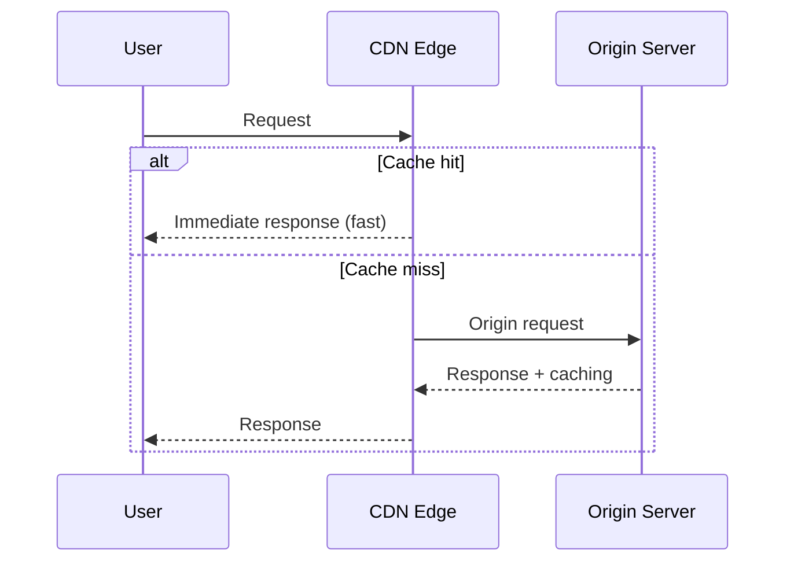

> Last reviewed: May 2026

## Overview

Users of a web service are distributed around the world, but the origin server sits in a specific region. Users in a distant region incur latency proportional to the physical distance.

A **CDN** (Content Delivery Network) is a service that caches content at edge locations around the world, delivering it quickly from the location closest to the user. Since responses come from the edge instead of going all the way to the origin server, latency drops significantly and origin load decreases as well.

### How It Works

### Key Concepts

| Concept | Description |
| --- | --- |
| **Origin** | The server holding the original content. Object storage, a VM, a load balancer, etc. |
| **Edge/PoP** | A cache server close to the user. Hundreds of locations worldwide |
| **Cache hit/miss** | A hit (fast) if content is at the edge; a miss (fetched from origin) if not |
| **TTL (Time To Live)** | The cache's valid duration. Refetched from origin once it expires |
| **Cache invalidation** | Forcibly deletes a cache entry before its TTL expires. Propagating this globally takes time |

Cloud CDNs **recommend HTTPS by default**, with a free TLS certificate provided as an integrated feature, so you can apply SSL/TLS without purchasing a separate certificate. HTTP is also supported, but an HTTPS-only configuration is recommended for security.

:::note
Terminating TLS at the CDN edge reduces the client↔edge handshake RTT, improving TTFB. For network path acceleration of TCP/UDP workloads that can't be cached, see the "Global Network Accelerator" section at the bottom of this document.
:::

## What It Applies To

CDN can be applied not just to static files, but to a wide range of workloads.

| Target | Description |
| --- | --- |
| **Static files** | Images, CSS, JS. The most basic CDN use case |
| **API responses** | Cache infrequently-changing API responses at the edge. Reduces origin load |
| **Video streaming** | MP4 downloads, HLS/DASH adaptive streaming. Essential for large-volume transfers |
| **Dynamic content / API** | Not cacheable, but reduces latency via edge TCP/TLS termination + routing over the vendor backbone. Origin connection reuse cuts handshake cost |

:::caution
**Should a REST API sit behind a CDN?** There are two benefits:
1. **Cacheable APIs** (public data, product listings, exchange rates) — a short TTL (5-60s) reduces origin load
2. **Non-cacheable APIs** (authenticated, personalized) — even without caching, edge TCP/TLS termination + backbone path optimization reduces latency

Every major CDN (CloudFront, Front Door, Cloud CDN) supports dynamic content acceleration. Even with caching disabled via `Cache-Control: no-store`, the network path optimization benefit is retained.
:::

## Caching Strategy

### Caching Layers

| Layer | Location | Control method |
| --- | --- | --- |
| **Browser cache** | User device | `Cache-Control`, `ETag` headers |
| **CDN edge cache** | Vendor edge location | TTL policy, cache key configuration |
| **Origin cache** | In front of the origin server (optional) | Reverse proxy, origin shield |

### Cache Key Strategy

| Strategy | Method | TTL setting |
| --- | --- | --- |
| **Hashed filename** | `app.a3f2c1.js` (hash inserted at build time) | Very long (1 year). No invalidation needed |
| **Version query** | `app.js?v=2` | Moderate. Some CDNs may not recognize it as a cache key |
| **Short TTL** | Same URL, 5-minute TTL | Suited for frequently-changing content like API responses |
| **Invalidation** | Manual invalidation request | Only for urgent fixes. May incur cost |

:::note
Most frontend build tools (Webpack, Vite, etc.) automatically generate hashed filenames. A common pattern is setting a short TTL only for `index.html`, while running the rest of the static files with a long TTL + hashed filenames.
:::

## Architecture Patterns

### When CDN Is Effective

| Pattern | Description | CDN benefit |
| --- | --- | --- |
| **Single-region origin + global users** | DB/app exists in only one region, but users are worldwide | Edge caching eliminates latency to the origin region |
| **1-to-many distribution** | Delivering identical content to tens of thousands to millions of users | Distributes origin load to the edge. Large-scale serving possible even with a single origin |
| **Absorbing traffic spikes** | Sudden traffic surges from events/news | The edge absorbs most of it, keeping origin load normal |
| **Static site hosting** | Serving an SPA/static site from object storage | Operate entirely without a server, using only CDN + object storage |

### Content Protection (Signed URL / Token)

For cases where access must be restricted while distributing via CDN (paid content, authenticated users only):

| Method | Description | AWS | Azure | Google Cloud |
| --- | --- | --- | --- | --- |
| **Signed URL** | A time-limited signed URL | CloudFront Signed URL | Front Door Private Link | Cloud CDN Signed URL |
| **Signed Cookie** | Cookie-based auth. Applies to multiple files at once | CloudFront Signed Cookie | — | — |
| **Token authentication** | Token validated at the edge | CloudFront Functions | Front Door Rules Engine | — |
| **Geo-restriction** | Allow or block specific countries/regions | Supported | Supported | Supported |
| **WAF integration** | IP restriction, rate limiting, bot blocking | CloudFront + WAF | Front Door + WAF | Cloud Armor |

:::note
For cases where content protection is critical, such as paid video streaming, combine Signed URL + DRM (Digital Rights Management). The CDN protects the delivery path, and DRM protects the content itself.
:::

## Product Comparison

| Vendor | Product | Notes |
| --- | --- | --- |
| AWS | CloudFront | 400+ edge locations. Origin Shield (an origin-protecting cache layer) |
| Azure | Azure CDN / Front Door | Front Door integrates CDN + WAF + global LB |
| Google Cloud | Cloud CDN | Integrated with Cloud Load Balancing. Fast cache invalidation |
| OCI | OCI CDN (Akamai/Fastly partnership) | Global CDN via partner integration. WAF/DDoS integrated via Edge Services |

### Key Differences

- **AWS CloudFront** — Has a high number of edge locations, and Lambda@Edge/CloudFront Functions let you run code at the edge. Origin Shield can further reduce origin load.
- **Azure Front Door** — Unifies CDN, a global load balancer, and WAF into a single service. You can manage all traffic with Front Door alone, without separate CDN configuration.
- **Google Cloud Cloud CDN** — Configuration is simple, enabled with a single checkbox on Cloud Load Balancing. Cache invalidation propagates within seconds.
- **OCI** — Instead of its own CDN service, it supports global distribution through partnerships with specialized CDNs like Akamai and Fastly. Edge Services provides WAF and DDoS protection.

## Global Network Accelerator

A CDN **caches** content to deliver it quickly, but workloads that can't be cached (game servers, IoT, real-time APIs) need a **network accelerator**. An accelerator terminates the TCP/TLS connection at the edge without caching and forwards it to the origin over the vendor backbone network to reduce latency.

### CDN vs Network Accelerator

| Distinction | CDN | Network accelerator |
| --- | --- | --- |
| Purpose | Content caching + edge serving | Optimizing the TCP/TLS connection path |
| Caching | Supported | — |
| Target protocol | HTTP/HTTPS | Any TCP/UDP protocol |
| Behavior | No origin call needed on a cache hit | Always forwards to origin, only the path is optimized |
| Example use | Static files, streaming, API caching | Game servers, IoT, global APIs (not cacheable) |

### Vendor Services

| Vendor | Service | Acceleration target | Constraint |
| --- | --- | --- | --- |
| AWS | Global Accelerator | TCP/UDP | L4 only. Combine with an ALB for HTTP routing |
| Azure | Front Door | HTTP + TCP | L7 integrated. TCP proxy requires the Premium tier |
| Google Cloud | Cloud LB (Premium Tier) | HTTP/TCP/UDP | Global by default. Standard Tier is region-limited |

### Selection Criteria

| Requirement | Choice |
| --- | --- |
| Caching HTTP content is the main goal | CDN |
| Reducing global latency for a TCP/UDP app (games, IoT) | Global accelerator |
| HTTP + global distribution + WAF integration | Azure Front Door / CloudFront + GA combination |
| Fixed Anycast IP required (IP allowlisting) | Global Accelerator |

:::note
For in-region L4/L7 distribution, see [Load Balancer](../../networking/load-balancer/); for DNS-based global distribution, see [DNS](../../networking/dns/).
:::

## Edge Computing

You can run code at the CDN edge to transform requests/responses, or handle simple logic without going to the origin.

| Vendor | Product | Notes |
| --- | --- | --- |
| AWS | CloudFront Functions | Lightweight (request/response header transformation, redirects). Sub-millisecond |
| AWS | Lambda@Edge | Full-featured (origin request/response transformation, authentication). A few milliseconds |
| Azure | Front Door Rules Engine | Rule-based routing/transformation |
| Google Cloud | Cloud CDN + Cloud Functions | Separate combination |

## Common Mistakes

- **Setting a long TTL on `index.html`** — Users keep receiving the old HTML even after static file hashes change. Give `index.html` a short TTL (a few minutes), and run other static files with hashed filenames + a long TTL.
- **Using cache invalidation as part of the deployment routine** — Global propagation takes time and costs money. Hashed filename strategy is the right answer.
- **Applying CDN caching to an API that requires authentication** — Another user's private data could be returned from the cache. Explicitly set `Cache-Control: no-store` or include the auth token in the cache key.

## Checklist

- [ ] Are hashed filenames (content hash) applied to static files, enabling deployment without cache invalidation?
- [ ] Is an HTTPS-only configuration applied, with an HTTP→HTTPS redirect configured?
- [ ] Is origin protection (Origin Shield, Signed URL, etc.) applied to block direct origin access?

## References

### AWS

- [Amazon CloudFront Documentation](https://docs.aws.amazon.com/ko_kr/cloudfront/)
- [Lambda@Edge Documentation](https://docs.aws.amazon.com/ko_kr/lambda/latest/dg/lambda-edge.html)
- [CloudFront HTTP/HTTPS Configuration Guide](https://docs.aws.amazon.com/AmazonCloudFront/latest/DeveloperGuide/using-https.html)

### Azure

- [Azure Front Door Documentation](https://learn.microsoft.com/ko-kr/azure/frontdoor/)
- [Azure CDN Documentation](https://learn.microsoft.com/ko-kr/azure/cdn/)

### Google Cloud

- [Cloud CDN Documentation](https://cloud.google.com/cdn/docs)
- [Media CDN Documentation](https://cloud.google.com/media-cdn/docs)
