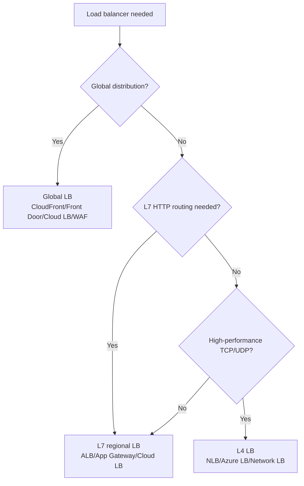

> Last reviewed: August 2026

## Overview

When there are multiple servers, a **load balancer** is what distributes user requests across them. On-premises, hardware appliances like F5 or Citrix are used, but in the cloud, this is provided as a managed service.

When paired with auto scaling, traffic distribution targets are automatically adjusted as servers are added or removed.

### Differences from an On-Premises LB

| Item | On-premises (hardware LB) | Cloud (managed LB) |
| --- | --- | --- |
| **Capacity** | Fixed to appliance specs (upgrade = replace the appliance) | Automatically scales with traffic |
| **Availability** | Active-Standby redundancy configured manually | Vendor provides multi-AZ redundancy by default |
| **Configuration** | Connect directly to the appliance via CLI/GUI | Managed as code via API/IaC |
| **Cost** | Appliance purchase + maintenance contract | Usage-based pay-as-you-go |

:::note
DSR (Direct Server Return), which was used on-premises to avoid LB bandwidth bottlenecks, is unnecessary in the cloud. Cloud LBs scale automatically so there's no bottleneck, and functions like TLS termination and logging need to run on the response path too.
:::

## Product Comparison

### L7 (HTTP/HTTPS) Load Balancers

| Vendor | Product | Notes |
| --- | --- | --- |
| AWS | ALB (Application Load Balancer) | Path/host-based routing, WebSocket, gRPC |
| Azure | Application Gateway | WAF integration available |
| Google Cloud | External HTTP(S) Load Balancer | Global (serves the whole world from a single IP) |
| OCI | OCI Load Balancer | L7. Path/host-based routing, SSL termination |

### L4 (TCP/UDP) Load Balancers

| Vendor | Product | Notes |
| --- | --- | --- |
| AWS | NLB (Network Load Balancer) | Ultra-low latency, static IP |
| Azure | Azure Load Balancer | Standard/Basic tiers |
| Google Cloud | TCP/UDP Load Balancer | Regional or global |
| OCI | OCI Network Load Balancer | L4. Ultra-low latency, IP hash/5-tuple hash |

### Global Load Balancer / Accelerator

| Vendor | Product | Notes |
| --- | --- | --- |
| AWS | Global Accelerator | Routes to the nearest edge via Anycast IP |
| Azure | Front Door | Unifies global L7 + CDN + WAF |
| Google Cloud | Cloud Load Balancing | Global by default (single Anycast IP) |
| OCI | OCI DNS Traffic Management | DNS-based global traffic distribution |

:::note
Global accelerators are easily confused with a CDN. For details on caching, target protocols, and selection criteria, see [CDN — Global Network Accelerator](../../networking/cdn/#global-network-accelerator).
:::

## Core Components

A load balancer needs to configure where to send traffic (rules) and to whom (target group). L7 and L4 differ in routing approach.

### L7 (HTTP/HTTPS)

| Concept | AWS ALB | Azure App Gateway | Google Cloud HTTP(S) LB | OCI Load Balancer |
| --- | --- | --- | --- | --- |
| **Routing rule** | Listener Rule (path/host/header) | URL Path Map | URL Map | Routing Policy (path/host) |
| **Target group** | Target Group | Backend Pool | Backend Service | Backend Set |
| **Health check** | HTTP/HTTPS health check | Health Probe | Health Check | Health Check |

You can distribute traffic in fine detail based on path (`/api/*`), host (`api.example.com`), or header values.

### L4 (TCP/UDP)

| Concept | AWS NLB | Azure LB | Google Cloud TCP/UDP LB | OCI Network LB |
| --- | --- | --- | --- | --- |
| **Routing** | Port-based | Frontend IP + Port | Forwarding Rule | Listener (port-based) |
| **Target group** | Target Group (IP/instance) | Backend Pool | Backend Service | Backend Set |
| **Characteristics** | Static IP, ultra-low latency, TLS passthrough | Standard/Basic tiers | Regional or global | Ultra-low latency, IP hash |

L4 doesn't inspect packet content and distributes by port, so latency is very low. Used for non-HTTP protocols such as DB, gRPC, and game servers.

## SSL/TLS Handling

A load balancer can choose how TLS encryption is terminated/passed through.

| Method | Description | Advantages | Disadvantages |
| --- | --- | --- | --- |
| **TLS Termination** | LB decrypts TLS; the backend gets HTTP | Reduces backend burden, LB handles L7 processing | The LB-backend segment is plaintext (generally acceptable within a VPC) |
| **TLS Passthrough** | The LB forwards encrypted traffic as-is; the backend decrypts | End-to-end encryption | No L7 routing/inspection possible (L4 only) |
| **End-to-end TLS (re-encryption)** | LB decrypts, then re-encrypts when forwarding to the backend | L7 processing + encryption across the entire path | Increased CPU load |

### Certificate Management

| Vendor | Free managed certificate |
| --- | --- |
| AWS | AWS Certificate Manager (ACM) |
| Azure | App Service Managed Certificate, Key Vault |
| Google Cloud | Certificate Manager |
| OCI | OCI Certificates |

All support automatic renewal and integrate natively with the LB.

## Health Checks

:::caution
When the load balancer terminates TLS, the segment between the load balancer and the backend server communicates in plaintext (HTTP). This is generally acceptable if that segment is within a VPC, but if there's a regulatory requirement, apply End-to-end TLS (re-encryption).
:::

The load balancer periodically checks backend health and excludes unhealthy instances.

### Health Check Types

| Type | Description | Use |
| --- | --- | --- |
| **TCP** | Only checks whether a TCP connection can be made | L4 LB, simple checks |
| **HTTP/HTTPS** | Checks the response code for a specific path (usually 200) | L7 LB, app-level checks |
| **gRPC** | gRPC Health Checking Protocol | gRPC services |

### Health Check Design Tips

- Use a **dedicated health-check endpoint** (`/health`, `/healthz`). Avoid business endpoints
- **Whether to include DB dependency** — distinguish a shallow check (app is alive) from a deep check (DB is connected)
- **Interval and threshold** — too short causes false positives, too long delays incident detection
- **Whether to treat 404/500 as healthy** — the server may be fine even if a specific path doesn't exist

## Selection Guide

### Decision Tree

### Selection by Requirement

| Requirement | Recommendation | Notes |
| --- | --- | --- |
| HTTP/HTTPS routing, path-based distribution | L7 (ALB, App Gateway, Cloud LB, OCI LB) | URL/header-based routing, SSL termination |
| High-performance TCP/UDP, low latency | L4 (NLB, Azure LB, Network LB, OCI NLB) | Packet-level processing, static IP |
| Global traffic distribution + CDN + WAF | Global LB (CloudFront+ALB, Front Door, Cloud LB, OCI WAF) | Region-optimal routing |
| Internal service-to-service communication only | Internal LB | No public IP needed, within a private subnet |
| gRPC, WebSocket | L7 (verify gRPC support) | ALB, Cloud LB natively support gRPC |

:::note
Global traffic distribution can be implemented not only through an LB but also via DNS routing (geographic routing, failover). For DNS-based traffic management, see [DNS](../../networking/dns/).
:::

## Common Mistakes

- **Choosing an L4 load balancer when L7 is needed** — Path/host-based routing, TLS termination, and WAF integration aren't possible. Choose L7 (ALB/App Gateway) by default for HTTP workloads.
- **Setting the health-check path to a business endpoint** — A healthy instance can be excluded due to an authentication failure or a transient error. Use a dedicated `/health` endpoint.
- **Ignoring regulatory requirements by not encrypting the backend segment after TLS termination** — Even within a VPC, financial/healthcare regulated environments may require End-to-end TLS (re-encryption).

## Checklist

- [ ] Does the health check use a dedicated endpoint (`/health`) with appropriate interval/threshold settings?
- [ ] Is the TLS certificate automatically renewed via a managed service (ACM, Certificate Manager)?
- [ ] Is cross-AZ load balancing enabled so service continues even during a single-AZ outage?

## Related Documents

- [DNS](../../networking/dns/)
- [CDN](../../networking/cdn/)
- [Auto Scaling](../../compute/auto-scaling/)

## References

### AWS

- [Elastic Load Balancing Documentation](https://docs.aws.amazon.com/ko_kr/elasticloadbalancing/)
- [AWS Global Accelerator Documentation](https://docs.aws.amazon.com/ko_kr/global-accelerator/)

### Azure

- [Azure Load Balancer Documentation](https://learn.microsoft.com/ko-kr/azure/load-balancer/)
- [Azure Front Door Documentation](https://learn.microsoft.com/ko-kr/azure/frontdoor/)

### Google Cloud

- [Google Cloud Load Balancing Documentation](https://cloud.google.com/load-balancing/docs)

### OCI

- [OCI Load Balancer Documentation](https://docs.oracle.com/en-us/iaas/Content/Balance/home.htm)
- [OCI Network Load Balancer Documentation](https://docs.oracle.com/en-us/iaas/Content/NetworkLoadBalancer/home.htm)
