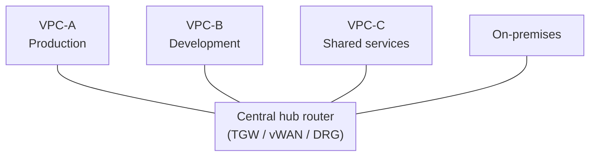

> Last reviewed: August 2026

## Overview

On-premises, a network is built from physical networking equipment (switches, routers, firewalls). In the cloud, all of this is defined in software.

A **VPC** (Virtual Private Cloud) is a logically isolated virtual network you create inside the cloud. Each VPC is completely separated from other customers' VPCs, and **inter-VPC communication is impossible unless a connection is explicitly configured**. It corresponds to an on-premises corporate network, and you design the IP range, subnets, routing, and firewall rules yourself.

A **subnet** is a network segment that further divides the IP range within a VPC. Distributing subnets across multiple availability zones (AZs) separates failure domains, achieving high availability. The concepts of regions and availability zones are covered in [Regions and Availability Zones](../../about-cloud/regions-and-zones/).

:::note
This document covers **VPC design within a single cloud**. For network isolation requirements in regulated environments, see [Network Segregation and Isolation](../../security/network-isolation/); for connectivity across multiple clouds, see [Multicloud Networking](../../networking/multicloud-networking/).
:::

## VPC Comparison by Vendor

| Vendor | Product | VPC scope | Subnet unit | Notes |
| --- | --- | --- | --- | --- |
| AWS | VPC | Regional | AZ | Peering/TGW needed across regions |
| Azure | VNet | Regional | Freely placed within the region | Global peering possible |
| Google Cloud | VPC | **Global** | Regional | A single VPC can place subnets across multiple regions |
| OCI | VCN | Regional | Regional or AD | Combination of Security Lists and NSG |

:::caution
**Azure VNet change (2026.03~):** Starting with API version `2025-07-01`, subnets in newly created virtual networks now default to **private** (enforcement date: March 31, 2026). Previously, VMs in a subnet could be assigned a public IP; now outbound internet access requires explicitly configuring a NAT Gateway or a public IP. Existing VNets are unaffected — this applies only to newly created ones. [Official announcement](https://techcommunity.microsoft.com/blog/azurenetworkingblog/private-subnets-by-default-in-azure-virtual-networks-what-changed-and-how-to-use/4513778)
:::

## Subnet Design

### Three-Tier Separation

It's common to split subnets into three tiers: **public**, **private**, and **isolated**.

| Tier | Purpose | Internet access | Resources placed |
| --- | --- | --- | --- |
| **Public** | Receives external traffic | Bidirectional | Load balancer, NAT Gateway, Bastion |
| **Private** | Application layer | Outbound only, via NAT | App servers, container worker nodes |
| **Isolated** | DB, internal systems | No internet access | Managed DB, cache |

### Subnet Sizing Principles

VPC size cannot be rigidly prescribed by a single CIDR block; it must be calculated using a composite demand formula: **Number of AZs × Number of Tiers × IPs per Subnet + Managed Endpoints + Failure & Growth Buffer**.

#### 1. Workload-Based VPC CIDR Starting Point Guide

| Workload Scale | Recommended Starting CIDR (Example) | Usable IP Count | Architectural Layout & Considerations |
| --- | --- | --- | --- |
| **Small Spoke / Sandbox / PoC** | `/22`–`/24` | 1,024–256 | 1–2 AZs, simple 2-tier (web/app) setup. Isolated environment with low IP exhaustion risk |
| **Standard Enterprise App (3 AZ × 3 Tiers)** | `/19`–`/20` | 8,192–4,096 | Symmetrically placing `/24` (256 IPs) across 3 AZs × 3 tiers (Public/Private/Isolated) requires 9 subnets = 2,304 IPs minimum → `/20` (4,096) or `/19` for growth buffer |
| **High-Density Containers / Large Landing Zone** | `/16`–`/18` | 65,536–16,384 | EKS VPC CNI and environments allocating real VPC private IPs per Pod, or utilize secondary CIDRs |

#### 2. Subnet Allocation Principles

| Consideration | Sizing Principle & Recommendation | Description |
| --- | --- | --- |
| **General Workload Subnets** | Start with `/24` (256 IPs) | Standard size for web/app tiers. For high-density container/pod environments, evaluate secondary CIDR blocks. |
| **Dedicated Infrastructure Subnets** | Minimal allocation by purpose (`/26`–`/28`) | • **AWS TGW Attachment**: `/28` (consumes only 1 ENI per AZ to eliminate IP waste) • **PrivateLink / Endpoints**: `/27`–`/28` sized to projected interface endpoint counts • **Vendor Requirements**: Azure `GatewaySubnet` (min `/27`), `AzureFirewallSubnet` (min `/26`), GCP Proxy-only subnet (`/24`) |
| **Vendor-Reserved IPs** | 3–5 reserved IPs per vendor | AWS and Azure reserve 5 IPs per subnet, GCP reserves 4 (first 2 and last 2), OCI reserves 3. In a `/28` (16 IPs), usable host IPs are only 11 (AWS), which must be accounted for. |
| **AZ Distribution** | Deploy symmetrically across at least 2, recommended 3 AZs | Symmetrically allocate subnets across AZs to maintain fault domain isolation. |

### CIDR Planning

CIDR design is the hardest architectural decision to change later.

| Strategy | Allocation Example | Description |
| --- | --- | --- |
| **Separate ranges per environment** | `10.0.0.0/20` (prod), `10.0.16.0/20` (dev) | Routing isolation and conflict prevention between environments |
| **Allocation per team/service** | `10.1.0.0/21` (Payment), `10.1.8.0/21` (Logistics) | Ensures team autonomy while enabling route summarization |
| **Avoiding the on-premises range** | If on-premises uses `172.16.0.0/12`, assign unused cloud blocks in `10.0.0.0/8` | Prevents routing collisions over Direct Connect, ExpressRoute, or VPN |

:::caution
Monolithically duplicating `10.0.0.0/16` templates causes immediate route collisions when establishing VPC Peering or Transit Gateway connections. Maintain a centralized IPAM (IP Address Management) registry across your organization.
:::

For multicloud CIDR splitting principles, see [Multicloud Network Design Foundations](../../networking/multicloud-networking/).

## Security (Network Firewall)

| Layer | AWS | Azure | Google Cloud | OCI | Role |
| --- | --- | --- | --- | --- | --- |
| **Instance** | Security Groups | NSG | Firewall Rules | Security Lists / NSG | Inbound/outbound rules |
| **Subnet** | Network ACL | NSG (subnet association) | — | Security Lists | Subnet-boundary filtering |
| **VPC (L7)** | Network Firewall | Azure Firewall | Cloud Firewall | OCI Network Firewall | IDS/IPS, domain filtering |
| **DDoS** | Shield | DDoS Protection | Cloud Armor | OCI WAF | Automatic L3/L4 mitigation |
| **WAF** | AWS WAF | Azure WAF | Cloud Armor WAF | OCI WAF | Blocks L7 attacks |

### Remote Access

To access resources in a private subnet, use a Bastion Host or an agent-based access service. See [Remote Access Management](../../devops/remote-access/) for details.

## Routing

The rules that determine where outbound traffic from a subnet gets forwarded.

### Common Concepts

- **Traffic within the VPC** is routed automatically (no separate configuration needed)
- **Traffic going out externally** needs an explicit route
- **Different routing per subnet tier** controls the level of isolation

### Routing Model by Vendor

| Item | AWS | Azure | Google Cloud | OCI |
| --- | --- | --- | --- | --- |
| **Routing unit** | Per subnet | Per subnet (UDR) | VPC-wide (implicit) + custom | Per subnet |
| **Default internet route** | Must be added explicitly | Provided by default (controlled via NSG) | Provided by default (controlled via firewall) | Must be added explicitly |
| **NAT** | NAT Gateway (per AZ) | NAT Gateway (per subnet) | Cloud NAT (per region) | NAT Gateway (per VCN) |
| **Distinctive point** | Fine-grained per-subnet control | System Routes auto-generated | Automatic across regions since the VPC is global | Security List is separate |

### Anti-patterns

| Anti-pattern | Problem | Correct approach |
| --- | --- | --- |
| Same routing for every subnet | Isolation tiers become meaningless | Separate routing per tier |
| Internet route on the DB subnet | Unnecessary exposure | No route + private service connectivity |
| Propagating the on-premises route to every subnet | Unnecessary exposure | Propagate selectively only to the subnets that need it |

## VPC-to-VPC Connectivity

### Peering vs Hub-and-Spoke

| Distinction | VPC peering | Hub-and-spoke (TGW / vWAN / DRG) |
| --- | --- | --- |
| **Connection structure** | 1:1 (mesh) | Hub-and-spoke (star) |
| **Transitive routing** | Not possible | Possible (via the hub) |
| **Connecting 10 VPCs** | 45 peerings | 10 connections |
| **On-premises connection** | A VPN needed per VPC | 1 at the hub |
| **Cost** | Data transfer only | Hourly + data processing (can be more expensive than peering) |
| **Suitable for** | 2-3 VPCs, simple structure | 4+ VPCs, centralized management needed |

| Vendor | Peering | Hub service |
| --- | --- | --- |
| AWS | VPC Peering | Transit Gateway |
| Azure | VNet Peering (global) | Virtual WAN |
| Google Cloud | VPC Peering / Shared VPC | Mostly unnecessary due to the global VPC |
| OCI | Local/Remote Peering Gateway | DRG v2 |

## Private Service Connectivity

When accessing cloud-managed services (storage, DB, etc.), traffic goes through a NAT Gateway by default. Using **private service connectivity** keeps traffic from leaving the vendor's internal network, providing both security and cost benefits.

| Vendor | Product | Notes |
| --- | --- | --- |
| AWS | VPC Endpoint (Gateway/Interface) / PrivateLink | Gateway type (S3, DynamoDB) is free |
| Azure | Private Endpoint / Private Link | A Private Endpoint is created per service |
| Google Cloud | Private Service Connect / Private Google Access | Private Google Access is enabled with configuration only |
| OCI | Service Gateway / Private Endpoint | Service Gateway is for accessing Oracle services |

:::caution
DNS may not automatically resolve even after creating a private endpoint. Also check the private DNS zone configuration. See [DNS](../../networking/dns/) for details.
:::

## On-Premises Connectivity (Dedicated Line / VPN)

| Distinction | Dedicated line | VPN (IPSec) |
| --- | --- | --- |
| **Path** | A physical circuit to the vendor's PoP | An encrypted tunnel over the internet |
| **Bandwidth** | 1-100 Gbps | Generally 1-5 Gbps |
| **Latency/stability** | Low and consistent | Varies with internet conditions |
| **Cost** | Circuit fee + port fee (fixed monthly) | Hourly billing (relatively cheap) |
| **Build time** | Weeks to months | Minutes to hours |
| **Suitable for** | Production, large volume | PoC, backup path |

| Vendor | Dedicated line | VPN |
| --- | --- | --- |
| AWS | Direct Connect | Site-to-Site VPN |
| Azure | ExpressRoute | VPN Gateway |
| Google Cloud | Cloud Interconnect | Cloud VPN (HA VPN) |
| OCI | FastConnect | Site-to-Site VPN |

:::caution
A dedicated line only provides "the connection to the vendor." The physical circuit from the on-premises site to the vendor's PoP must be contracted separately with a carrier, and provisioning takes weeks to months.
:::

:::note
Vendor PoP locations: [AWS](https://aws.amazon.com/directconnect/locations/) · [Azure](https://learn.microsoft.com/azure/expressroute/expressroute-locations) · [Google Cloud](https://cloud.google.com/network-connectivity/docs/interconnect/concepts/choosing-colocation-facilities) · [OCI](https://docs.oracle.com/en-us/iaas/Content/Network/Concepts/fastconnectprovider.htm)
:::

:::note
For global network management (Cloud WAN, Virtual WAN, etc.) and multi-site connectivity details, see [Multicloud Networking](../../networking/multicloud-networking/).
:::

## Production VPC Design Checklist

- [ ] Was the CIDR range designed with future expansion and peering in mind?
- [ ] Are public/private/isolated subnets separated?
- [ ] Are subnets placed across each AZ to achieve high availability?
- [ ] Is a NAT Gateway placed per AZ (to avoid a single point of failure)?
- [ ] Are instance/subnet firewalls set to least privilege?
- [ ] Is network flow logging enabled?
- [ ] Is a private DNS zone configured?
- [ ] Is private service connectivity used for accessing managed services?
- [ ] Is a tagging policy applied (env, owner, cost-center)?
- [ ] Has CIDR conflict been checked for peering/hub connections?

## Common Mistakes

- **Placing every workload in a single VPC** — Placing production, development, and test in the same VPC removes the security boundary, and mistakes in the dev environment can affect production.
- **Designing the CIDR too small** — Designing the VPC CIDR as small as `/24` runs out of IPs when subnetting, peering, or the service expands. Changing the CIDR later is very difficult.
- **Allowing 0.0.0.0/0 on a security group** — Allowing all IPs in an inbound rule maximizes the attack surface. Allow only the necessary source IPs/security groups.

## Checklist

- [ ] Are VPCs separated by environment (prod/dev/staging)?
- [ ] Was the VPC CIDR designed with sufficient margin for future expansion and peering?
- [ ] Are subnets separated by role (public/private/data)?
- [ ] Is VPC flow logging enabled?

## References

### AWS

- [Amazon VPC Documentation](https://docs.aws.amazon.com/ko_kr/vpc/)

### Azure

- [Azure Virtual Network Documentation](https://learn.microsoft.com/ko-kr/azure/virtual-network/)

### Google Cloud

- [Google Cloud VPC Documentation](https://cloud.google.com/vpc/docs)

### OCI

- [OCI VCN Documentation](https://docs.oracle.com/en-us/iaas/Content/Network/Concepts/overview.htm)
