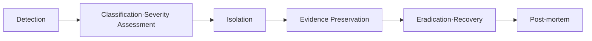

> Last reviewed: August 2026

## Overview

Even with prevention and detection through [Security Posture Management](../../security/security-posture/), security incidents can still happen. Cloud environments require response procedures that differ from on-premises — account isolation, token revocation, API-based evidence preservation, automated isolation, and more.

## Response Flow

:::caution
Security incident response **cannot be prepared for after an incident has occurred.** Runbooks (response procedures), role assignments, communication plans, and isolation scripts must be written in advance and rehearsed regularly. Facing an incident without preparation leads to delayed decisions, lost evidence, and expanded damage.
:::

| Stage | Activity | Cloud-specific points |
| --- | --- | --- |
| **Detection** | GuardDuty/Defender/SCC alerts, SIEM correlation analysis | Leverage automated detection services |
| **Classification** | Determine severity (Critical/High/Medium/Low), assess scope of impact | Which accounts/regions/services are affected |
| **Isolation** | Separate compromised resources from the network/permissions | SG changes, disabling IAM keys, revoking role sessions |
| **Evidence preservation** | Secure data for forensics | Disk snapshots, memory dumps, preserving audit logs |
| **Eradication/recovery** | Remove the threat and restore service | Replace infected instances (immutable), rotate keys |
| **Post-mortem** | Root cause analysis, prevent recurrence | Reconstruct the timeline, improve policy |

## Cloud Isolation Patterns

### IAM-Based Isolation

| Situation | Action | Vendor-specific method |
| --- | --- | --- |
| **API key/credential leak** | Immediately disable the key + invalidate active sessions | AWS: disable Access Key + revoke sessions, Azure: revoke Entra ID session, Google Cloud: delete Service Account key |
| **Role/permission hijack** | Add a Deny policy to the role or force session expiration | AWS: SCP Deny, Azure: Conditional Access block, Google Cloud: Organization Policy |
| **Full account compromise** | Isolate the account/subscription/project from the organization | AWS: full SCP Deny, Azure: disable subscription, Google Cloud: suspend project |

### Network-Based Isolation

| Action | Method |
| --- | --- |
| **Instance isolation** | Replace firewall rules with "block all inbound/outbound" (don't delete them — preserve evidence) |
| **Subnet isolation** | Block all traffic in the subnet with a subnet-level ACL |
| **DNS sinkhole** | Redirect malicious domains to a sinkhole in internal DNS |

:::caution
**Do not terminate an instance during isolation.** Memory, disk, and network connection information will be lost. Take a snapshot first, then isolate.
:::

## Evidence Preservation

| Evidence type | Collection method | Storage location |
| --- | --- | --- |
| **Disk** | EBS/Managed Disk snapshot | Encrypted storage in a dedicated forensics account |
| **Memory** | Memory dump via SSM Run Command (e.g., LiME) | S3/Blob (encrypted) |
| **Logs** | Extend CloudTrail/Activity Log/Audit Log retention | Separate log archive account (tamper-resistant) |
| **Network** | VPC Flow Logs, DNS query logs | Long-term retention storage |
| **Timeline** | Chronological reconstruction of events | Incident response documentation |

## Vendor Incident Response Tools

| Area | AWS | Azure | Google Cloud | OCI |
| --- | --- | --- | --- | --- |
| **Detection** | GuardDuty | Defender for Cloud | Security Command Center | Cloud Guard |
| **Investigation** | Detective | Sentinel (Investigation) | Google Unified Security (formerly Chronicle) | Logging Analytics |
| **Automated response** | EventBridge → Lambda/Step Functions | Sentinel Playbook (Logic Apps) | Cloud Functions / Workflows | Events → Functions |
| **Forensics** | Snapshot + SSM + Athena (log queries) | Disk Snapshot + Log Analytics | Disk Snapshot + BigQuery | Block Volume Backup + Logging |
| **Long-term log retention** | S3 + Glacier (Object Lock) | Immutable Blob Storage | Cloud Storage (Retention Lock) | Object Storage (Retention Rules) |

## Advance Preparation

Things to prepare **before** an incident occurs:

- [ ] **Dedicated forensics account** — a separate account/subscription/project for isolating and preserving evidence
- [ ] **Break-glass account** — inactive by default, activated only during an incident. Post-use auditing is mandatory
- [ ] **Log retention policy** — retain audit logs (CloudTrail/Activity Log/Audit Log/OCI Audit) for at least one year (with tamper-resistance settings)
- [ ] **Communication plan** — contact information for the security team, executives, legal, and vendor support
- [ ] **Runbook** — documented response procedures per incident type (IAM key leak, data breach, ransomware, etc.)
- [ ] **Regular drills** — a tabletop exercise (scenario-based simulation) at least once per quarter

## Ongoing Practices

- **Regular drills (tabletop exercises)** — run scenario-based simulations at least once a quarter to maintain response capability.
- **Playbook updates** — immediately incorporate improvements discovered from real incidents or drills into the playbook.
- **Feed back post-mortem findings** — feed root cause analysis results from incidents back into detection rules and response procedures.

## Common Mistakes

- **Writing the runbook only after an incident occurs** — facing an incident without advance preparation leads to delayed decisions, lost evidence, and expanded damage
- **Immediately terminating a compromised instance** — memory, disk, and network connection information is lost, making forensics impossible. Take a snapshot first, then isolate
- **Short audit log retention periods** — leaving the default 90-day retention means past logs are already deleted by the time an incident is investigated

## Checklist

- [ ] Have you written runbooks per incident type (IAM key leak, data breach, ransomware) in advance and conducted regular drills?
- [ ] Do you keep a dedicated forensics account separate, and retain audit logs for at least one year with tamper-resistance settings?
- [ ] Is a break-glass account prepared, with a defined post-use audit procedure?

## References

### AWS

- [AWS Security Incident Response Guide](https://docs.aws.amazon.com/whitepapers/latest/aws-security-incident-response-guide/aws-security-incident-response-guide.html)
- [AWS Security Incident Response Service](https://aws.amazon.com/security-incident-response/) — A managed service combining automated detection and triage, AI-powered investigation, containment capabilities, and 24/7 access to Security Incident Response engineers

### Azure

- [Azure Security Incident Response](https://learn.microsoft.com/azure/security/fundamentals/incident-response-overview)

### Google Cloud

- [Google Cloud Responding to Security Incidents](https://cloud.google.com/security/incident-response)

### OCI

- [OCI Security Best Practices](https://docs.oracle.com/en-us/iaas/Content/Security/Concepts/security_guide.htm)

### Standards and community

- [NIST SP 800-61 Rev.3 — Incident Response Recommendations and Considerations for Cybersecurity Risk Management (CSF 2.0 Community Profile)](https://csrc.nist.gov/pubs/sp/800/61/r3/final)
- [SANS Incident Handler's Handbook](https://www.sans.org/white-papers/33901/)

:::note
NIST SP 800-61 Rev.3 was finalized in April 2025. It supersedes Rev.2 and transitions from a "Computer Security Incident Handling Guide" to an "Incident Response Recommendations and Considerations for Cybersecurity Risk Management" document aligned with the NIST CSF 2.0. Review your response procedures against the new framework.
:::
