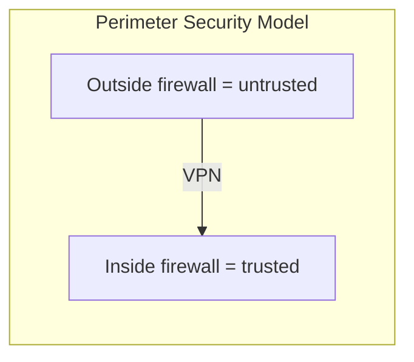
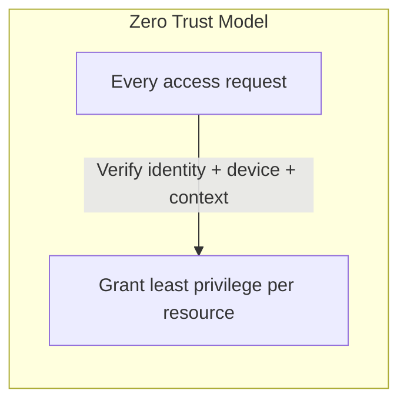

> Last reviewed: August 2026

## Overview

Traditional network security follows a **Perimeter Security** model: trust everything inside the firewall, block everything outside. But with cloud, remote work, and SaaS adoption, the boundary between "inside" and "outside" has disappeared.

**Zero Trust** follows the principle "Never trust, always verify." Every access request is verified regardless of network location.

## Core Principles

| Principle | Description | Implementation examples |
| --- | --- | --- |
| **Identity-based access** | Control access by user/workload identity, not network location | IAM roles, Workload Identity |
| **Least privilege** | Grant access only to the resources needed, only for as long as needed | JIT access, time-limited tokens |
| **Explicit verification** | Verify every request every time (no cached trust) | MFA, device posture checks, location-based policies |
| **Assume breach** | Design as if a breach has already occurred | Microsegmentation, encryption, logging |
| **Continuous verification** | Continuously reassess trust level even during a session | Conditional Access, anomaly detection |

## Zero Trust Services by Vendor

| Area | AWS | Azure | Google Cloud | OCI |
| --- | --- | --- | --- | --- |
| **Network access (ZTNA)** | [Verified Access](https://docs.aws.amazon.com/verified-access/latest/ug/what-is-verified-access.html) — supports HTTP(S) plus **TCP/SSH/RDP/DB** (TCP protocol support reached GA in December 2024), can replace VPN | [Entra Private Access](https://learn.microsoft.com/entra/global-secure-access/concept-private-access) | [BeyondCorp Enterprise](https://cloud.google.com/beyondcorp-enterprise/docs) | [Zero Trust Packet Routing](https://docs.oracle.com/en-us/iaas/Content/zero-trust-packet-routing/home.htm) |
| **Identity-based access** | IAM + Identity Center | Entra ID + Conditional Access | IAM + Workload Identity Federation | Identity Domains + dynamic groups |
| **Microsegmentation** | Security Groups + PrivateLink | NSG + Private Endpoints | VPC Service Controls + Firewall Rules | NSG + Network Path Analyzer |
| **Device trust** | Verified Access device policies | Intune + Conditional Access | BeyondCorp device certificates | — (third-party integration) |
| **Workload-to-workload authentication** | IAM Role + STS | Managed Identity | Workload Identity Federation | Instance Principal |

## Relationship to the Existing VPC Model

Zero Trust does not **replace** VPC/subnet-based network security — it **complements** it.

| Layer | Role | Tools |
| --- | --- | --- |
| **Network layer** (existing) | Bandwidth control, DDoS defense, basic isolation | VPC, subnets, Security Group, WAF |
| **Identity layer** (Zero Trust) | Who accesses what, under what conditions | IAM, Conditional Access, ZTNA |

:::note
**This does not mean removing the VPC.** Network isolation (VPC/subnets) is still one layer of defense in depth. Zero Trust adds identity-based access control on top of it, so that even resources inside the network are never trusted unconditionally.
:::

## Adoption Stages

| Stage | Activities | Goal |
| --- | --- | --- |
| **1. Identity consolidation** | Consolidate all users/services into a central identity system | Know who is accessing what |
| **2. MFA + conditional access** | Enforce MFA on all access, add location/device conditions | Build a baseline verification framework |
| **3. Apply least privilege** | Remove excessive permissions, introduce JIT access | Minimize blast radius in a breach |
| **4. Microsegmentation** | Allow only explicitly permitted communication between workloads | Block lateral movement |
| **5. Continuous monitoring** | Collect all access logs, detect anomalous behavior | Detect breaches early |

### Concrete Actions per Stage

#### Stage 1: Identity consolidation

- Apply MFA to all user accounts (no exceptions)
- Build an inventory of service accounts/workload identities
- Integrate SSO with an external IdP (Microsoft Entra ID, Okta, etc.)

#### Stage 2: Conditional access

- Verify device posture through MDM (mobile device management) integration
- Apply conditional access policies based on location/time/device posture
- Remove policies that grant trust based on VPN connection alone

#### Stage 3: Least privilege

- Use IAM permission audit tools (IAM Access Analyzer, Entra ID Access Reviews)
- Detect and remove unused permissions (90-day unused threshold)
- Minimize standing privileges through JIT (Just-In-Time) access

#### Stage 4: Microsegmentation

- Separate VPC subnets by workload type
- Whitelist inter-service communication (deny by default, allow explicitly)
- Implement via a service mesh (Istio, Linkerd) or network policies

#### Stage 5: Continuous monitoring

- Enable anomaly detection tools (GuardDuty, Defender, SCC)
- Integrate with a SIEM for centralized log analysis
- Establish access pattern baselines and alert on deviations

## Zero Trust Adoption Checklist

- [ ] Applied MFA to all user accounts (prioritize phishing-resistant MFA)
- [ ] Built an inventory of service accounts/workload identities
- [ ] Applied short-lived credentials to non-human identities (service accounts, AI agents, CI/CD bots)
- [ ] Removed trust based on network location (no trust granted from VPN connection alone)
- [ ] Applied conditional access policies (device posture, location, time-based)
- [ ] Applied workload identity (SPIFFE/OIDC/Instance Principal) to inter-workload communication
- [ ] Achieved visibility into east-west traffic (internal communication)
- [ ] Centralized access logs and configured anomaly detection (including ITDR)

## Common Mistakes

- **"We have a VPN, so we're Zero Trust"** — VPN only creates a network boundary and is a different concept from Zero Trust. Every request must still be verified even inside the VPN.
- **"The internal network is safe"** — a traditional approach that ignores insider threats and account takeover scenarios.
- **"Roll it out organization-wide all at once"** — attempting a full rollout without a staged approach carries a high risk of operational disruption. Apply it progressively, starting with critical systems.

## 2025-2026 Trend: Identity-first Zero Trust

The center of gravity in Zero Trust is shifting from network-based controls to **identity-based controls** (NIST SP 800-207, CISA ZTMM).

### Non-Human Identity

Managing non-human identities — AI agents, service accounts, CI/CD pipeline bots — has become a new challenge.

| Challenge | Response |
| --- | --- |
| Long-lived credentials left unmanaged | Shift to short-lived tokens (STS), OIDC federation, and instance-metadata-based authentication |
| Over-privileged service accounts | Detect unused permissions (IAM Access Analyzer, Entra Access Reviews), JIT access |
| Verifying AI agent identity | Workload identity + conditional access + least-privilege per tool |
| Detecting anomalous non-human identity behavior | ITDR (Identity Threat Detection & Response) |

#### Microsoft Entra Agent ID

Microsoft introduced [Entra Agent ID](https://learn.microsoft.com/entra/identity-platform/agent-id/), which treats AI agents as independently managed first-class identities in the directory (announced at Build 2025). Agents receive the same conditional access, lifecycle management, and audit logging as human identities. For details on agent adoption governance, see the [AI Agent Adoption Guide](../../ai/agent-adoption/).

### Strengthening Workload Identity

| Vendor | Change |
| --- | --- |
| **Microsoft** | Applied Conditional Access + Continuous Access Evaluation (CAE) to Entra Workload ID |
| **AWS** | Made MFA mandatory for member account root users, increased IAM role/OIDC provider quotas |
| **Google Cloud** | Expanded Workforce Identity Federation — attribute-based SSO without synchronization, context-aware IAM |

In multicloud/hybrid environments, **SPIFFE/SPIRE** (a CNCF Graduated project) can standardize mutual authentication between workloads. It automatically issues and rotates short-lived credentials (X.509 SVID, JWT), eliminating long-lived secrets.

### Trend Toward Security Tool Consolidation

Cloud security capabilities that were operated as separate, siloed tools are consolidating into **CNAPP** (Cloud-Native Application Protection Platform) — the foundation for automating Zero Trust's "always verify" principle.

| Component | Role | Relation to Zero Trust |
| --- | --- | --- |
| **CSPM** | Detects cloud misconfigurations | Proactively blocks improperly opened access paths |
| **CIEM** | Manages cloud identity/permissions | Detects excessive permissions, including for non-human identities. Azure: Entra Permissions Management **stopped selling as a standalone SKU** from April 2025 and folded its core CIEM capabilities into Defender for Cloud CSPM. Existing customers can continue under their existing license terms |
| **CWPP** | Protects workload runtime | Runtime defense under an assume-breach posture |

The current direction is to manage these three components together around identity, since misconfiguration and privilege sprawl are cited as the leading paths to cloud breaches.

## Relationship to IAM

Zero Trust is a **security model** (a philosophy), and IAM is the **implementation mechanism**. IAM is the key tool that realizes Zero Trust's principle of "always verify." For practical IAM design, see [IAM in Depth](../../security/iam/).

## References

### AWS

- [AWS Verified Access documentation](https://docs.aws.amazon.com/verified-access/latest/ug/what-is-verified-access.html)

### Azure

- [Microsoft Zero Trust guidance](https://learn.microsoft.com/security/zero-trust/)

### Google Cloud

- [Google BeyondCorp Enterprise](https://cloud.google.com/beyondcorp-enterprise/docs)

### OCI

- [OCI Zero Trust Packet Routing](https://docs.oracle.com/en-us/iaas/Content/zero-trust-packet-routing/home.htm)

### Standards and Community

- [NIST SP 800-207 — Zero Trust Architecture](https://csrc.nist.gov/publications/detail/sp/800-207/final)
- [CISA Zero Trust Maturity Model](https://www.cisa.gov/zero-trust-maturity-model)
