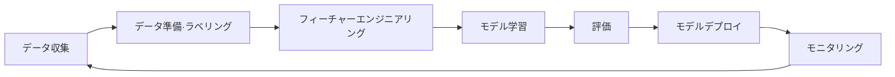

> 文書基準: 2026年8月 | この文書は変化の速い領域であり、四半期ごとのレビュー対象です。

## 概要

:::note
**AIが初めての方は** まず[AIを始める](../../ai/getting-started/)をお読みになることをお勧めします。本文書はAIサービスの比較に焦点を当てています。
:::

### 従来型MLから生成AIまで

| 世代 | 主要技術 | 特徴 | クラウドサービス例 |
| --- | --- | --- | --- |
| **従来型ML** | 回帰、分類、クラスタリング | 定型データベース、フィーチャーエンジニアリングが必要 | SageMaker, Azure ML, Vertex AI |
| **ディープラーニング** | CNN, RNN, Transformer | 非定型データ(画像、テキスト、音声)の処理。GPU必須 | GPUインスタンス、マネージド学習プラットフォーム |
| **生成AI** | ファウンデーションモデル (LLM、マルチモーダル) | テキスト/画像/コード生成。API呼び出しで利用 | Bedrock, Microsoft Foundry, Gemini |
| **エージェンティックAI** | LLM + ツール呼び出し + 自律実行 | 目標を与えると自ら計画・実行・検証 | AgentCore, Foundry Agents, [詳細→](../../ai/agents/) |

**パラダイムシフト:** 従来型MLは「データを集めてモデルを直接学習する」方式でした。2017年にGoogleが発表した**Transformerアーキテクチャ**("Attention Is All You Need")が転換点となりました。大規模テキストを並列で学習できるようになったことでGPT、BERTなどのファウンデーションモデルが誕生し、その後「すでに学習済みのモデルをAPIで呼び出す」生成AI時代が幕を開けました。エージェンティックAIでは、このモデルがツールを使って「自ら作業を完遂する」段階へと進化しています。

### こんな状況で役立ちます

- **チャットボット/問い合わせ自動化** — 顧客問い合わせに24時間対応したいとき
- **文書要約/分類** — 大量の報告書、メール、契約書を素早く分析したいとき
- **翻訳/コンテンツ生成** — 多言語対応、マーケティングコピー生成、製品説明の自動化
- **コード作成/レビュー** — 開発生産性の向上、セキュリティ脆弱性の検出
- **データ分析** — 自然言語の質問でデータインサイトを得る

オンプレミスでAI/MLを行うには、GPUサーバーの購入、フレームワークのインストール、学習インフラの構成を自ら行う必要があります。クラウドではGPUを時間単位でレンタルし、マネージドプラットフォームでモデルを学習・デプロイできます。

## 生成AIモデルの種類

| 種類 | 入力 → 出力 | 代表的サービス | ユースケース |
| --- | --- | --- | --- |
| **テキスト (LLM)** | テキスト → テキスト | GPT-5.6, Claude Fable 5, Gemini 3.5 | チャットボット、要約、コード生成 |
| **画像生成** | テキスト → 画像 | DALL-E, MAI-Image, Imagen, Titan Image | マーケティング、デザイン |
| **音声 (TTS/STT)** | テキスト ↔ 音声 | Polly, MAI-Voice, Azure Speech, Cloud TTS | 議事録、ARS、アクセシビリティ |
| **動画生成** | テキスト → 動画 | Nova Reel, Veo 3.1, Gemini Omni | 広告、ショート動画 |
| **マルチモーダル** | テキスト+画像+音声 → テキスト | GPT-5.6, Gemini 3.5 Pro, Claude Fable 5 | 文書理解、画像分析 |
| **エンベディング** | テキスト/画像 → ベクトル | Titan Embeddings, Gemini Embedding, Cohere Embed | RAG、類似度検索 |

## 生成AIサービス

### ファウンデーションモデルAPI

自らモデルを学習させることなく、ベンダーがホスティングする大規模言語モデル(LLM)をAPIで呼び出します。各ベンダーは自社開発モデルとパートナーモデルを併せて提供しており、エコシステムが急速に拡大しています。

| モデル提供社 | 主要モデル | 1P (直接) | 3P (クラウド提供) |
| --- | --- | --- | --- |
| **OpenAI** | GPT-5.6 (Sol/Terra/Luna), GPT-5.5, oシリーズ | [api.openai.com](https://platform.openai.com/) | Azure Foundry, Bedrock |
| **Anthropic** | Claude Fable 5, Opus 5, Opus 4.8, Sonnet 5, Haiku | [api.anthropic.com](https://platform.claude.com/) | Bedrock, Vertex AI |
| **Google** | Gemini 3.5 Pro/Flash, 3.1 Pro, Gemini Omni (Preview/GAは[公式文書](https://ai.google.dev/)で確認) | [Gemini API](https://ai.google.dev/) | Vertex AI (ネイティブ) |
| **xAI** | Grok 4.3, Grok 4.1 Fast, Imagine | [x.ai/api](https://x.ai/api) | OCI, Vertex AI, Bedrock, Azure |
| **Meta** | Llama 4 (オープンウェイト) | [llama.meta.com](https://llama.meta.com/) | Bedrock, Vertex, Azure, OCI (ホスティング) |
| **Amazon** | Nova 1(Premier/Pro/Lite/Micro/Sonic等) + **Nova 2**(Lite, Pro等 — 世代区分) | — (Bedrock専用) | Bedrock |
| **Microsoft** | MAI (Image/Voice/Transcribe) | — (Foundry専用) | Azure Foundry |
| **Mistral** | Large, Small, Codestral | [api.mistral.ai](https://api.mistral.ai/) | Bedrock, Azure, Vertex |
| **Upstage** | Solar Pro 3/2/Mini | [console.upstage.ai](https://console.upstage.ai/) | AWS/Azure Marketplace |
| **LG AI Research** | EXAONE 4.x | 直接契約 | Marketplace、セルフホスティング |

:::note
**1P(直接)と3P(クラウド提供)の違い** — 同じモデルでもチャネルによって機能範囲、クォータ、請求方式が異なります。チャネル選択基準は[LLMチャネル選択ガイド](../../ai/1p-vs-3p/)を参照してください。
:::

### クラウドプラットフォーム別の特徴

上記のモデルをホスティングするクラウドプラットフォームは、それぞれ独自の付加価値を提供します。

| プラットフォーム | 強み |
| --- | --- |
| [Amazon Bedrock](https://aws.amazon.com/bedrock/) | マルチモデル単一API、AgentCore、AWS IAM/VPC統合、EDP消化 |
| [Microsoft Foundry](https://azure.microsoft.com/products/ai-services/openai-service) | OpenAI主力チャネル、M365/GitHub統合、Foundry Local(閉域網)、PTU |
| [Vertex AI / Gemini Platform](https://cloud.google.com/vertex-ai) | Geminiネイティブ、2Mトークン、Model Garden 200+モデル、ADK |
| [OCI Enterprise AI](https://docs.oracle.com/iaas/Content/generative-ai/home.htm) | Oracle DB統合、専用GPUクラスター(RDMA)、イグレス10TB無料 |

### AIエージェント / RAG

| ベンダー | エージェントプラットフォーム | RAG |
| --- | --- | --- |
| AWS | [Bedrock AgentCore](https://aws.amazon.com/bedrock/agentcore/) | [Bedrock Knowledge Bases](https://aws.amazon.com/bedrock/knowledge-bases/) — Managed KB(Smart Parsing, Agentic Retriever), Web Search |
| Azure | [Microsoft Foundry Agents](https://learn.microsoft.com/azure/ai-foundry/agents/) | Azure AI Search |
| Google Cloud | [Gemini Enterprise Agent Platform](https://cloud.google.com/products/agent-builder) | Vertex AI RAG Engine |
| OCI | [OCI Enterprise AI Agents](https://docs.oracle.com/iaas/Content/generative-ai/agents.htm) | OCI Search連携 |

### コードアシスタント / AIエージェント

コーディングエージェント(Kiro, Claude Code, Codex, Copilotなど)とエージェントプラットフォーム(AgentCore, Foundry Agentsなど)は[AIエージェント](../../ai/agents/)で扱います。

## MLプラットフォーム

自らモデルを学習・デプロイする必要がある場合に使用します。

| ベンダー | 製品 | 備考 |
| --- | --- | --- |
| AWS | SageMaker AI | 学習、チューニング、デプロイ、MLOps統合プラットフォーム |
| Azure | Azure Machine Learning | ノートブック、AutoML、パイプライン、モデルレジストリ |
| Google Cloud | Vertex AI | 学習、デプロイ、パイプライン、Feature Store統合 |
| OCI | OCI Data Science | ノートブック、モデル学習/デプロイ、パイプライン |

### GPU / AIアクセラレータ

| ベンダー | 製品 | 備考 |
| --- | --- | --- |
| AWS | P6 (NVIDIA B200), P6e (GB200 UltraServer), P5 (H100), Trn2 (Trainium), Inf2 (Inferentia) | Blackwell: P6-B200(8×B200)、P6e-GB200(最大72 GPU NVLink)。学習: Trainium、推論: Inferentiaでコスト最適化 |
| Azure | ND GB200-v6, ND H200 v5, ND H100 v5 | GB200-v6: Blackwellフラッグシップ。DL学習/生成AI/HPC |
| Google Cloud | A4X (GB200 NVL72), A4 (B200), A3 (H100), TPU v5p/v6e | A4: Blackwell単一GPU、A4X: GB200 NVL72初のクラウド提供。TPU: Google自社AIアクセラレータ |
| OCI | GPU Instances (B200, H100, A100) | NVIDIA Blackwell + Bare Metal + RDMAクラスター対応 |

## 主な違い

**Amazon Bedrock** — 自社開発の**Amazon Nova**モデル(第1世代Premier/Pro/Lite/Micro/Sonic等と**Nova 2** Lite/Pro等 — [公式モデル一覧](https://aws.amazon.com/nova/models/)で世代・提供状況を確認)と、Anthropic Claude、OpenAI GPTシリーズなど多様な提供社のモデルに単一APIでアクセスできます。モデル選択の幅が広く、AIエージェント構築のためのAgentCoreなどの運用体系が強みです。

**Microsoft Foundry** — 旧Azure AI Foundryがブランドを統合した上位プラットフォームです。OpenAI GPT-5.5/5.4シリーズをエンタープライズ環境で利用できる主要な経路であり、Anthropic、Metaなど他社モデルも幅広く提供します。自社の**MAIモデル群**(Image-2.5, Voice-1, Transcribe-1)と**Foundry Local**(ローカル/閉域網実行)が追加されました。Microsoft 365、GitHub、Power Platformなど既存のMicrosoftエコシステムとの深い統合が最大の強みです。

**Gemini Enterprise Agent Platform** — 旧Vertex AIがエージェント中心に全面刷新されたプラットフォームです。Google自社の**Gemini 3.x/2.5**シリーズ(3.5 Pro/3.5 Flash/3.1 Pro等 — 各バリエーションのPreview/GA・上限は[公式文書](https://cloud.google.com/vertex-ai/generative-ai/docs)で確認)のネイティブなマルチモーダル能力とTPUインフラが強みです。長文コンテキスト・推論モード・**Gemini Omni**(マルチモーダル)や、Agent Studioを通じたローコードエージェント開発、Google Search/BigQueryとの連携が差別化ポイントです。

**OCI Enterprise AI** — 旧OCI Generative AIが拡張されたプラットフォームです。Cohere、Meta Llama、xAI Grok 4.3、Google GeminiなどのモデルをOCIインフラでホスティングし、専用AIクラスター(Dedicated AI Cluster)とRDMAベースのBare Metal GPUで高性能ワークロードを支援します。**AI Guardrails**(コンテンツモデレーション、PII検出、プロンプトインジェクション防御)と**Enterprise AI Agents**(GA)が追加されました。OpenAIとのパートナーシップにより、GPT-5.5/5.4およびCodexをOCI MarketplaceでOracle Universal Creditsとして利用できるようになる予定であり、Oracle Database/アプリケーションとのネイティブ統合が強みです。

## MLパイプラインとMLOps

自らモデルを学習・運用する際は、MLOpsパイプラインを構成します。

### MLライフサイクル

### 段階別ツール

| 段階 | AWS | Azure | Google Cloud | OCI |
| --- | --- | --- | --- | --- |
| **データ準備** | SageMaker AI Data Wrangler, Ground Truth | Azure ML Data Labeling | Vertex AI Data Labeling | OCI Data Labeling |
| **フィーチャーストア** | SageMaker AI Feature Store | Azure ML Feature Store | Vertex AI Feature Store | OCI Feature Store |
| **学習/チューニング** | SageMaker AI Training + Automatic Model Tuning | Azure ML + AutoML | Vertex AI Training + Hyperparameter Tuning | OCI Data Science Training |
| **モデルレジストリ** | SageMaker AI Model Registry | Azure ML Model Registry | Vertex AI Model Registry | OCI Model Catalog |
| **デプロイ** | SageMaker AI Endpoints + Serverless | Azure ML Online/Batch Endpoints | Vertex AI Endpoints | OCI Model Deployment |
| **モニタリング** | SageMaker AI Model Monitor | Azure ML Data Drift Detection | Vertex AI Model Monitoring | OCI Model Monitoring |
| **パイプライン** | SageMaker AI Pipelines | Azure ML Pipelines | Vertex AI Pipelines (Kubeflowベース) | OCI Data Science Jobs + Pipelines |

### 生成AI vs 従来型MLの選択

| 要件 | 推奨アプローチ |
| --- | --- |
| 自然言語対話、要約、翻訳 | ファウンデーションモデルAPI (Bedrock/Microsoft Foundry/Vertex AI) |
| ドメイン特化知識 + 汎用LLM | RAG (ファウンデーションモデル + ベクトルストア) |
| 特定タスクへの高度な最適化 | Fine-tuningまたはカスタムモデル学習 |
| 画像/オブジェクト認識 | 事前学習済みビジョンモデルまたはComputer Vision API |
| 時系列予測、異常検知 | 従来型ML (SageMaker AI/Vertex AI等) |
| 超軽量エッジデプロイ | 従来型ML + モデル量子化 |

### AI開発ライフサイクル (AI-DLC)

AIプロジェクトの全体ライフサイクル(問題定義→データ→モデル→評価→デプロイ→モニタリング→改善)と運用の詳細は[LLMOps](../../ai/llmops/)を参照してください。
- **コストガバナンス** — AIコストは使用量に比例するため予測が難しいです。日次/月次の予算上限、タスク別トークン上限、コスト超過アラートを必ず設定してください。
- **データドリフト** — RAG用文書が古くなると回答品質が徐々に低下します。定期的なデータ更新パイプラインを構成してください。
- **コンプライアンス** — 入出力ログのPIIマスキング、データ保持ポリシー、モデルの学習データ使用有無を継続的に管理する必要があります。

:::note
生成AIのDLCは従来型MLよりも**反復サイクルが短いです**。モデル学習に数か月かかる従来型MLとは異なり、プロンプト変更は数分、RAGデータの更新は数時間で反映されます。この速いサイクルに合った評価・デプロイ・ロールバック体系が必要です。
:::

:::caution
AIサービスは他のクラウドサービスよりも**変更頻度が非常に高いです。** モデル名、APIエンドポイント、価格が随時変わるため、本文書の基準時点以降の変更事項は各ベンダーの公式文書を確認してください。
:::

## AI活用の拡張方向

### Applied AI (業界別完成型サービス)

| 領域 | ベンダーサービス | トレンド (2025-2026) |
| --- | --- | --- |
| コンタクトセンター | Amazon Connect, Azure Contact Center, Google CCAI | コパイロット → 自律エージェントへの転換 |
| 文書処理 | Textract, Document Intelligence, Document AI | LLM/マルチモーダル推論の結合 |
| BI | Amazon Quick, Copilot in Power BI, Gemini in Looker | エージェンティック分析、ダッシュボードエージェント |
| ヘルスケア | Amazon Connect Health, Azure Health Bot | HIPAAエージェント |

### Physical AI (物理世界との接続)

センサー・ロボット・設備など物理世界とAIを接続するPhysical AI(エッジ推論、デジタルツイン・シミュレーション、ロボティクス基盤モデル)は、別文書[Physical AI](../../ai/physical-ai/)でベンダー中立の視点から詳しく扱います。

## マルチクラウドモデルアクセスの変化 (2025-2026)

2025~2026年にかけて、モデル提供社とクラウドベンダー間の関係が変化しています。最大の変化はOpenAI-Microsoft独占の終了であり、その他の提供社もチャネルを拡大しています。

| 時期 | イベント | 影響 |
| --- | --- | --- |
| 2026.04 | **OpenAI-Microsoft独占終了** | OpenAIモデルをAzure以外のプラットフォームでも提供可能に |
| 2026.04 | **OpenAIモデル → Bedrock提供開始** | 独占終了直後にGPT-5.xがBedrockに登場 |
| 2025-2026 | **xAI Grokのマルチクラウド展開** | Azure AI Foundry(2025.09), Vertex AI, OCI, Bedrock(2026.06 Grok 4.3 GA) |
| 2025-2026 | **Anthropic Claudeのチャネル強化** | 既存のBedrock/Vertexに加え、OCIなどの追加チャネル |

**運用上の示唆:**

- 単一のクラウドベンダーに縛られず、複数の経路で同一モデルにアクセスできるようになりました
- モデル選択時に「どのモデルか」だけでなく「どのプラットフォームからアクセスするとコスト/SLA/リージョンが有利か」が意思決定基準となります
- [マルチクラウドAI](../../ai/multicloud-ai/)でベンダーの組み合わせ戦略を詳しく扱います

## 推論コスト最適化

生成AIの主なコストは**推論(inference)** で発生します。2025-2026年にベンダーが導入したコスト削減オプションです。

| 戦略 | 説明 | ベンダー対応 |
| --- | --- | --- |
| **Flex/バッチ推論** | レイテンシに敏感でないワークロードを低優先度で処理してコスト削減 | Bedrock Flex Inference, Azure Batch API, Vertex Batch Predictions |
| **モデルルーティング** | 単純なクエリは軽量モデル(Flash/Haiku/mini)、複雑なクエリのみ高性能モデルに分岐 | Bedrock IntelligentPromptRouter, 自社構築 |
| **プロンプトキャッシング** | 同一のシステムプロンプト/コンテキストをキャッシュして繰り返しトークンのコストを削減 | Anthropic Prompt Caching, OpenAI Cached Tokens, Gemini Context Caching |
| **長期コンテキスト vs RAG** | モデルのコンテキストウィンドウ拡張(1~2M+トークン)によりRAGなしでも十分な場合が発生 | Gemini 3.5 Pro, Claude Opus系 |
| **GPU価格競争** | ハイパースケーラー間でのGPUインスタンス価格引き下げ傾向 | AWS, Azure, GCP競争的値下げ |

:::note
推論コストはモデル別、ベンダー別に随時変更されます。正確な現在の価格は各ベンダーの公式価格ページを確認してください。コストトラッキングと予算管理は[LLMOps](../../ai/llmops/)で詳しく扱います。
:::

## よくある間違い

- **Fine-tuningから開始** — RAGで十分な問題をFine-tuningで解決しようとし、コストと時間を浪費。RAGをまず試すべき
- **モデルバージョンを固定しない** — ベンダーがモデルを更新すると既存プロンプトの挙動が変わり、プロダクション品質が突然低下する
- **単一モデルで全ワークロードを処理** — 単純な分類作業にも最大級のモデルを使用し、コストが不必要に増加。タスク別のモデル分離が必要

## チェックリスト

- [ ] ワークロード特性(対話、要約、コード生成など)に合ったモデルを選択し、コスト/品質を比較したか
- [ ] モデルID/バージョンをコードに固定し、アップグレード時は評価を経て切り替えているか
- [ ] RAG → Fine-tuning → 直接学習の順で段階的にアプローチしているか

## 参考資料

### AWS

- [Amazon Bedrock文書](https://docs.aws.amazon.com/ko_kr/bedrock/)
- [Amazon SageMaker AI文書](https://docs.aws.amazon.com/ko_kr/sagemaker/)
- [Kiro](https://kiro.dev/)

### Azure

- [Microsoft Foundry(旧Azure OpenAI) Service文書](https://learn.microsoft.com/ko-kr/azure/ai-services/openai/)
- [Azure Machine Learning文書](https://learn.microsoft.com/ko-kr/azure/machine-learning/)

### Google Cloud

- [Vertex AI文書](https://cloud.google.com/vertex-ai/docs)
- [Gemini API文書](https://cloud.google.com/vertex-ai/generative-ai/docs)

### OCI

- [OCI AI Services文書](https://www.oracle.com/artificial-intelligence/ai-services/)
- [OCI Data Science文書](https://docs.oracle.com/en-us/iaas/data-science/using/data-science.htm)
- [OCI Enterprise AI(旧OCI Generative AI)文書](https://docs.oracle.com/en-us/iaas/Content/generative-ai/home.htm)
