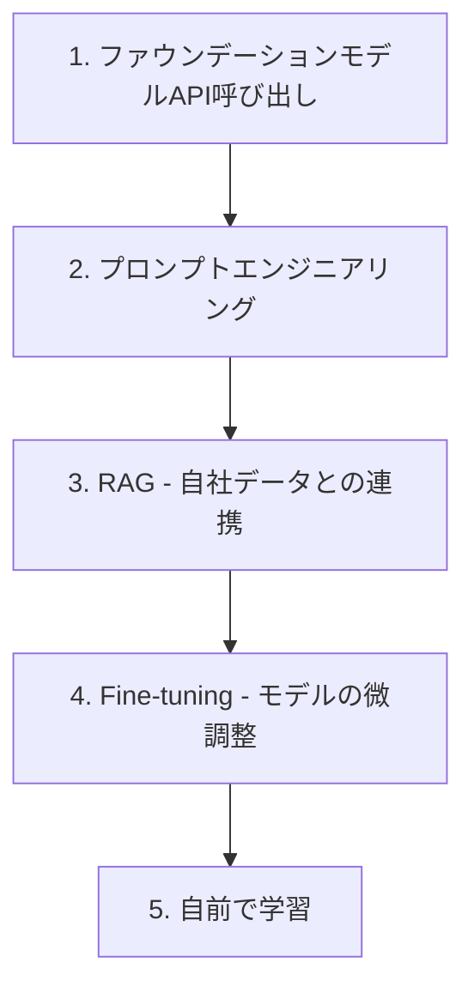

> 文書基準: 2026年8月

## まず判断する: この課題にAIは適しているか

インターフェースやモデルを選ぶ前に、**そもそもこれがAIで解く課題なのか**を確認します。生成AIはもっともらしいテキスト・コード・画像を作ることには強いですが、**検証済みの事実、社内の最新データ、決定論的な計算の源ではありません。** 次の4つの質問で選別します。

1. ルールや計算で正確に解ける課題か、それとも生成・要約・分類のように不確実性を許容する課題か？
2. 最新情報や社内の根拠が必要か？
3. 誤答や誤った実行を人が確認できるか、あるいは権限で制限できるか？
4. 成功基準、代表的なテスト入力、コスト上限を定義できるか？

| 課題の性質 | 推奨アプローチ |
| --- | --- |
| 決定論的なルール・計算で完結する | 一般的なソフトウェア(AI不要) |
| 構造化データの予測・分類 | 従来型ML([MLプラットフォーム](../../ai/ai-ml/#mlプラットフォーム)) |
| 生成・要約・コーディング補助 | 生成AI(下記の3つの方法で) |
| 最新・社内の根拠が必要 | 生成AI + RAG・ツール連携 |
| 高影響の判断・変更を伴う作業 | 人の承認と最小権限が必須([AIセキュリティ](../../security/ai-security/)) |

:::note
このゲートは導入判断のみを扱います。適合性・ROI・ガバナンスの詳細な判定は[AIシステムライフサイクル](../../ai/lifecycle/#1-問題定義およびガバナンス-problem-framing--governance)を、有用なユースケースの一覧は[AIプラットフォームとモデル比較](../../ai/ai-ml/#こんな状況で役立ちます)を参照してください。
:::

ルールや統計で完結する課題なら、ここで止めて一般的なソフトウェアを使ってください。AIが適していると判断したら、下記で**どのインターフェースで使うか**を決めます。

## AIを使う3つの方法

AI導入で最初に決めるべきは「どの技術か」ではなく、**「私たちがAIをどのインターフェースで使うか」** です。大きく3つあり、1つの組織が3つを併用することが多くあります。

| 使う方法 | 何か | 主な利用者 | 代表例 |
| --- | --- | --- | --- |
| **① 対話型AIアプリ・プラットフォーム** | 完成されたチャットボット・Copilotを購読してすぐ使う。ノーコードビルダーで社内ボットも作成 | 非エンジニア・一般社員、業務企画者 | ChatGPT、Geminiアプリ、Microsoft 365 Copilot、Copilot Studio |
| **② AIコーディングツール** | 開発者がIDE・ターミナルでAIにコードの作成・修正を委任 | ソフトウェアエンジニア | GitHub Copilot、Claude Code、Codex、Kiro、Grok Build |
| **③ API・SDK** | アプリ・エージェントがプログラムからモデルを呼び出して製品に組み込む | 開発チーム、システムインテグレーション | Amazon Bedrock API、Azure Foundry SDK、api.openai.com |

:::note
- **①→②→③は順番(成熟度の段階)ではありません。** 「誰が、何をしようとしているか」に応じた**主な利用インターフェース**基準の選択です。
- **境界事例**: Copilot Studioのようなノーコードビルダーは①(非エンジニアが利用)でありながら開発要素もあり、AIコーディングツール(②)は内部でAPI(③)を呼び出します。つまり類型は排他的な分類ではなく「主な利用方式」基準です。
- 各類型の中にも**完成品の購読(Buy)から自前の構築・学習(Build/Train)までのスペクトラム**があります。制御権・責任境界別の詳細マトリクスは[AIシステムライフサイクルとエンジニアリング](../../ai/lifecycle/#4段階エンタープライズ導入マトリクス)を参照してください。
- **エージェントで業務を自動化**するには[AIエージェント](../../ai/agents/)と[エージェント導入ガイド](../../ai/agent-adoption/)を参照してください。
:::

本文書は①②の概念と始め方、そして③(APIで直接構築)の活用方法を以下で扱います。

## なぜクラウドでAIを使うのか

フロンティア級の基盤モデルを一から事前学習（Pre-training）するには、数千万ドル以上の大規模GPUクラスタ、数兆トークンの学習データ、数か月のコンピュート時間が必要です。大部分の組織はこのプロセスを自前で行わず、**クラウドベンダーが提供する準備済みのAIサービス**を利用します。

たとえるなら、電気を自分で発電せず発電所（電力網）から受電するのと同じです。私たちは「どう電気を作るか」ではなく「電気で何をするか」に集中します。

## 最初に理解すべき3つの概念

### 1. ファウンデーションモデル (Foundation Model)

大量のデータですでに学習済みの汎用AIモデルです。代表的なものに**LLM**(Large Language Model、大規模言語モデル)があります。GPT(OpenAI)、Claude(Anthropic)、Gemini(Google)、Nova(Amazon)といった名前がこれに該当します。

- 自分で学習させる必要はなく、APIを呼び出して使用します。
- 「質問すれば答えてくれる賢いアシスタント」と考えるとよいでしょう。

### 2. プロンプト (Prompt)

モデルに送る入力メッセージです。「韓国の首都を教えて」のように自然言語で記述します。どう尋ねるかによって回答品質が大きく変わります。

### 3. トークン (Token)

モデルがテキストを処理する単位です。おおよそ単語1つが1～2トークンです。ほとんどのAPIは**入出力トークン数で課金**されます。

## 背景: AI技術の系譜

「AI」は単一の技術ではありません。数十年かけて発展してきた複数の技術の総称であり、各世代は前世代を置き換えるのではなく**共存**します。上記の3つの使う方法は主に最新世代である生成AI・エージェンティックAIを扱いますが、従来型ML・ディープラーニングも依然として使われます。

| 世代 | 中核技術 | できること | クラウドサービス |
| --- | --- | --- | --- |
| **従来型ML** | 回帰、分類、クラスタリング、ツリー | 構造化データの予測・分類(離脱予測、異常検知、レコメンド) | SageMaker AI、Azure ML、Vertex AI、OCI Data Science |
| **ディープラーニング** | CNN、RNN、Transformer | 非構造化データ処理(画像認識、音声、翻訳) | GPUインスタンス + MLプラットフォーム |
| **生成AI** | ファウンデーションモデル(LLM、マルチモーダル) | テキスト/画像/コード/音声の生成 | Bedrock、Microsoft Foundry、Gemini |
| **エージェンティックAI** | LLM + ツール呼び出し + 自律実行 | 目標を与えると自ら計画・実行・検証 | AgentCore、Foundry Agents、Gemini Agent Platform |

:::note
従来型MLはすでにデータパイプラインがある組織で、ディープラーニングは画像/音声など特化ワークロードで依然として活発です。世代別のベンダーサービス・モデルの詳細比較は[AIプラットフォームとモデル比較](../../ai/ai-ml/)を参照してください。構造化データの予測・自前モデルの学習(従来型MLパイプライン)は[MLプラットフォーム](../../ai/ai-ml/#mlプラットフォーム)を参照してください。
:::

## 方法: 何でAIを拡張するか

同じファウンデーションモデルでも、**どの方法で自社の課題に合わせるか**によって結果が変わります。以下の方法は特定の使い方専用ではなく、**3つの使う方法すべてを貫きます** — たとえばプロンプト改善は①対話型アプリの「カスタム指示」、自社データ連携は①の「ファイルアップロード」やノーコードビルダーの知識連携、③APIのRAGパイプラインとしてそれぞれ現れます。

下に行くほどコストと複雑度が増し、主に③(API・SDK)で直接構築する際に段階が明確になります。

### ステップ1: API呼び出し

最も簡単な出発点です。Amazon Bedrock、Microsoft Foundry、Gemini Enterprise、OCI Enterprise AIのいずれかのAPIに質問を送り、答えを受け取ります。チャットボット・文書要約・翻訳などの用途にそのまま使えます。ベンダー別サービス比較は[AIプラットフォームとモデル比較](../../ai/ai-ml/)を、有用なユースケース全般は[こんな状況で役立ちます](../../ai/ai-ml/#こんな状況で役立ちます)を参照してください。

### ステップ2: プロンプトエンジニアリング

同じAPIでも、どう尋ねるかによって答えが大きく変わります。役割と指示を明確に与えると、コードを書かずに品質が向上します。設計技法の詳細は[プロンプトエンジニアリング](../../ai/prompt-engineering/)を参照してください。

### ステップ3: RAG (Retrieval Augmented Generation)

ファウンデーションモデルは一般知識には長けていますが、**自社データは知りません**。RAGは自社文書を検索して関連部分をプロンプトに含めた上でモデルに渡す技術です(たとえ: 「オープンブック試験」)。社内文書ベースのチャットボット、製品FAQ、法律・医療文書の照会などに使われます。

RAGは[ベクトルストア](../../ai/vector-store/)と共に動作します。実装パターンの詳細は[RAG高度パターン](../../ai/rag-patterns/)を参照してください。

### ステップ4: Fine-tuning

自社データでモデルを微調整します。特定業務に最適化できますが、コストと時間が大きく増加します。

**利用例:**
- 特定業界の専門用語の理解
- 自社固有の言い回し/スタイルの反映
- 特定形式の出力の強制

### ステップ5: 自前で学習

ほとんどの組織には不要です。Google、OpenAI、Anthropicのような企業が行っていることです。

モデルの運用・評価・コスト追跡は[LLMOps](../../ai/llmops/)を、AIセキュリティとガードレールは[AIセキュリティ](../../security/ai-security/)を参照してください。

## いつどの方法を使うか

以下は初心者が**学習順序**(単純→高度)で方法を選ぶ視点です。実務で要件別にアプローチ・技術・文書をすぐ探すルーティングの視点は[AIシステムライフサイクル — 技術タスク別選択ガイド](../../ai/lifecycle/#技術タスク別選択ガイド)を参照してください。

| 状況 | 推奨方法 |
| --- | --- |
| 素早くプロトタイプを作りたい | ステップ1(API呼び出し) |
| APIは使っているが品質が物足りない | ステップ2(プロンプトエンジニアリング) |
| 自社文書を参照させて答えさせたい | ステップ3(RAG) |
| 汎用モデルがよく知らない専門ドメインである | ステップ4(Fine-tuning) |
| モデル自体が存在しない新しい問題である | ステップ5(自前で学習) |

:::note
**現実的なアドバイス:** ほとんどの業務はステップ3(RAG)までで十分です。Fine-tuningは構築・運用コストが大きいため、まずRAGで試し、限界が明確になった場合にのみ検討してください。
:::

## なぜAIモデルを自前で作らないのか

| 項目 | 自前学習 | クラウドAPI |
| --- | --- | --- |
| **初期コスト** | 数千万ドル規模のGPUインフラ投資 | API呼び出しあたり数セント～数十セント |
| **所要時間** | 数か月～数年 | 数分(API連携) |
| **データ** | 数兆トークンの学習データが必要 | モデルがすでに学習済み |
| **専門人材** | MLエンジニア、研究者多数 | 一般の開発者で対応可能 |
| **アップデート** | 再学習が必要 | ベンダーが自動アップデート |
| **効果** | 最先端が可能 | ほとんどの業務に十分 |

## よくある間違い

- **プロンプトエンジニアリングを飛ばしていきなりFine-tuning** — プロンプト改善だけで品質が十分向上する場合が多いにもかかわらず、コストと時間のかかるFine-tuningから試みる
- **トークンコストを考慮せずに設計** — 長いシステムプロンプトを毎リクエスト送信したり、不要に長い文書をコンテキストに含めてコストが急増する
- **RAGなしでモデルの内部知識のみに依存** — ファウンデーションモデルは学習時点以降の情報や社内データを知らないため、ハルシネーション(Hallucination)が発生する

## チェックリスト

- [ ] API呼び出し → プロンプトエンジニアリング → RAG → Fine-tuningの順に段階的にアプローチしているか
- [ ] トークン使用量とコストをモニタリングし、予算上限を設定したか
- [ ] 社内データに基づく回答が必要な場合、RAGパイプラインを構成したか

## 参考資料

### AWS

- [Amazon Bedrock 紹介](https://aws.amazon.com/bedrock/)
- [Amazon Nova 2 モデルガイド](https://docs.aws.amazon.com/bedrock/latest/userguide/model-parameters-nova.html)

### Azure

- [Microsoft Foundry 公式文書](https://learn.microsoft.com/azure/ai-studio/)
- [Microsoft Foundry Portal](https://ai.azure.com/)

### Google Cloud

- [Gemini Enterprise Agent Platform 文書](https://cloud.google.com/vertex-ai/docs)
- [Gemini モデル公式サイト](https://deepmind.google/technologies/gemini/)

### OCI

- [OCI Enterprise AI 概要](https://www.oracle.com/artificial-intelligence/generative-ai/generative-ai-service/)
- [Oracle AI Database (ベクトル検索)](https://www.oracle.com/database/ai-vector-search/)

### 入門資料

- [AWS — What is Generative AI?](https://aws.amazon.com/what-is/generative-ai/)
- [Microsoft Learn — Azure OpenAI Service overview](https://learn.microsoft.com/azure/ai-services/openai/overview)
- [Google Cloud — Gen AI Overview](https://cloud.google.com/ai/generative-ai)
- [Oracle — What Is Generative AI?](https://www.oracle.com/artificial-intelligence/generative-ai/what-is-generative-ai/)

### 用語集

- [CloudPick 用語集](../../glossary/) — AI/ML関連用語を含む
