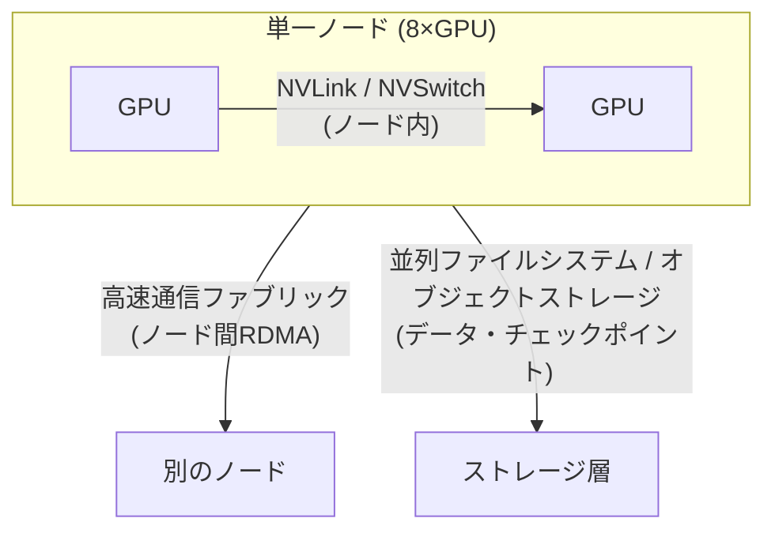

> 文書基準: 2026年9月 | この文書は変化の速い領域であり、四半期ごとのレビュー対象です。

:::note
この文書はGPUインフラ設計の応用的な内容です。GPUインスタンスの世代別スペック・リージョン可用性・予約/スポットオプションは[マルチクラウドAI — GPU可用性](../../ai/multicloud-ai/#gpu可用性)に、AIプラットフォーム・モデル選択は[AIプラットフォームとモデル比較](../../ai/ai-ml/)に整理されています。この文書は「複数のGPUをどのように一つのクラスターとして束ね、学習・推論を行うか」に焦点を当てます。
:::

## 概要

単一のGPUで処理できないワークロードは、複数のGPUと複数のノードを一つのクラスターとして束ねる必要があります。このとき性能を決めるのは、個々のGPUの演算能力ではなく、**GPU間・ノード間の通信帯域と遅延**、そして**データをGPUまで押し込むストレージのスループット**です。この文書ではワークロード特性をまず分類し、それに合ったクラスターアーキテクチャを3層に分けてベンダー別に比較します。

### 移植性の基準線とこの文書の範囲

この文書は**CUDA + NCCLを移植性の基準線（baseline）**とします。ほとんどの分散学習・推論スタックはこの組み合わせの上で動作し、クラウドを変えてもアプリケーションコードのレベルではおおむね移植できます。一方、**高速通信ファブリック、配置グループ、マネージドクラスター製品はベンダーごとに名称と実装が異なり、互いに1対1で対応しません。**

:::caution
ベンダー固有実装の詳細設定（例: 特定インスタンスのEFAキュー数、InfiniBandのパーティションキー）はこの文書の範囲外です。この文書はベンダー間の概念を正規化・比較することに焦点を当て、ベンダー固有の詳細チューニングは各ベンダーの公式ドキュメントに委ねます。性能数値はインスタンス・ドライバ・NCCLバージョン・ストレージ・トポロジの条件に大きく左右されるため、導入前に実際のワークロードで測定してください。
:::

## GPUワークロードの3分類

ワークロードごとにボトルネックとなるリソースが異なるため、インフラ設計の出発点はワークロード特性の把握です。

| ワークロード | 支配的なボトルネック | 通信要求 | ストレージ要求 | 代表的なインフラ特性 |
| --- | --- | --- | --- | --- |
| **事前学習 (Pre-training)** | 演算 + ノード間通信 | 非常に高い（全ノードcollective） | 高い（大容量データセットのストリーミング） | 多数ノード、高速ファブリック必須、チェックポイント帯域が重要 |
| **ファインチューニング (Fine-tuning)** | 演算 + メモリ | 中程度（数ノード以内が多い） | 中程度 | 小～中規模クラスター、単一ノードで可能な場合が多い |
| **推論 (Inference)** | メモリ帯域 + 遅延 | 低い（モデル並列時のみ） | 低い（重みロード後は常駐） | 遅延・スループットのバランス、オートスケール中心 |

:::note
ほとんどのエンタープライズワークロードはファインチューニングと推論に集中し、この2つは単一ノードまたは小規模ノードで十分な場合が多いです。ノード間の高速ファブリックが性能を左右するのは、主に大規模な事前学習です。ワークロードに合った最小構成を選択してください。
:::

## リファレンスアーキテクチャ — 3層通信モデル

GPUクラスターのデータ移動は3つの層に区分されます。各層は異なる技術で処理され、ベンダー比較の際にこの層を混同してはいけません。

- **ノード内 (intra-node)** — 一つのサーバー内のGPU同士はNVLink/NVSwitchで接続されます。帯域が最も大きく、ベンダーに関係なくNVIDIAプラットフォームの特性で決まります。
- **ノード間 (inter-node backend fabric)** — サーバーとサーバーの間はRDMAベースの高速通信ファブリックで接続されます。**ベンダーごとに実装が異なる層であり、大規模学習の性能を左右します。**
- **ストレージ (storage I/O)** — 学習データのストリーミングとチェックポイントの保存/復元に使われます。大規模学習でチェックポイント帯域が不足すると、GPUがアイドル状態で待機します。

### ノード間高速通信ファブリック — ベンダーマッピング

| 層 | AWS | Azure | Google Cloud | OCI |
| --- | --- | --- | --- | --- |
| **ノード間ファブリック** | [EFA (Elastic Fabric Adapter)](https://docs.aws.amazon.com/AWSEC2/latest/UserGuide/efa.html) | [InfiniBand](https://learn.microsoft.com/azure/virtual-machines/sizes/gpu-accelerated/) (NDシリーズ) | [GPUDirect-TCPX / RDMA](https://cloud.google.com/compute/docs/gpus) | [RDMA Cluster Network](https://docs.oracle.com/en-us/iaas/Content/Compute/Tasks/managingclusternetworks.htm) |
| **通信ライブラリ** | NCCL | NCCL | NCCL | NCCL |
| **同一概念か** | 近似対応 — 名称・実装・性能特性が相違 | 近似対応 | 近似対応 | 近似対応 |

:::caution
上表の4つのファブリックは**同じ役割を果たす異なる技術**であり、1対1の等価ではありません。例えばInfiniBandとEFAはプロトコル・輻輳制御・対応インスタンスが異なります。「AベンダーのX = BベンダーのY」のように単純に置き換えず、NCCLの上で動作するアプリケーションの移植性を基準としつつ、ファブリック性能はベンダーごとに測定してください。
:::

### 配置・トポロジ — 物理的近接性とNUMA

ノード間通信の性能を活かすには、GPUノードが**物理的に近くに配置**され、ノード内ではGPUとネットワークインターフェイス（NIC）が**同じNUMAドメイン**に整列している必要があります。

| 項目 | AWS | Azure | Google Cloud | OCI |
| --- | --- | --- | --- | --- |
| **近接配置** | Placement Group (Cluster) | Proximity Placement Group + VMSS | Compact Placement Policy | Cluster Network（近接プロビジョニング内蔵） |
| **NUMA・GPU-NIC整列** | インスタンストポロジ公開、NCCLトポロジ認識 | トポロジ公開 | gVNIC + トポロジ認識 | Bare Metalトポロジ固定 |

- **近接配置** — 学習ノードを低遅延で束ねるには、近接配置を明示的に要求する必要があります。配置グループなしで散らばったノードはcollective通信の遅延が大きくなり、学習スループットが低下します。
- **NUMA・GPU-NIC affinity** — GPUとそのGPUが使用するNICが異なるNUMAノードにあると、データがCPUソケット間のリンクを経由し、遅延・帯域の損失が発生します。NCCLトポロジ認識とプロセスバインディングで整列します。

## マネージドGPUクラスター

ノード・ファブリック・スケジューラを自ら組み立てる代わりに、ベンダーが提供するマネージドGPUクラスターを使うと、トポロジ・ヘルスチェック・再起動が事前に統合されます。大規模学習では第一級の選択肢です。

| ベンダー | マネージドクラスター製品 | 特徴 |
| --- | --- | --- |
| AWS | [SageMaker HyperPod](https://aws.amazon.com/sagemaker/hyperpod/) | ノードヘルスチェック・自動交換、チェックポイントベースの再開を内蔵 |
| Azure | [CycleCloud](https://learn.microsoft.com/azure/cyclecloud/) + NDシリーズ | HPC/AIクラスターのオーケストレーション、スケジューラ統合（ノード自動交換は非内蔵 — スケジューラ・スクリプトで構成） |
| Google Cloud | [AI Hypercomputer / Cluster Director](https://cloud.google.com/ai-hypercomputer) | 統合インフラスタック、トポロジ認識プロビジョニング |
| OCI | [Supercluster](https://www.oracle.com/cloud/compute/gpu/) | RDMAクラスターネットワーク、大規模GPUの超低遅延接続（Bare Metal） |

:::note
OCIの**Dedicated AI Cluster**は上記の学習インフラとは異なる層です。これはOCI Enterprise AIサービス内で、事前学習済みのファウンデーションモデルをファインチューニング・ホスティングするマネージド（PaaS）リソースであり、自ら組み立てる学習インフラではありません。大規模学習インフラに相当するのはSuperclusterです。
:::

:::note
マネージドクラスターは初期の組み立て・運用負担を大きく減らしますが、ベンダー依存が高くなります。純粋なKubernetesで自ら構成すると移植性は高くなりますが、トポロジ・ヘルスチェック・gang schedulingを自ら担う必要があります。移植性と運用の容易さのトレードオフは、ワークロード規模とチームの能力で判断してください。Kubernetesベースの構成は[GPU Kubernetesとスケジューリング](../../ai/gpu-infra/kubernetes-and-scheduling/)を参照してください。
:::

## 関連文書

- **分散学習の並列化（TP/PP/DP）** — [分散学習の標準アーキテクチャ](../../ai/gpu-infra/distributed-training/)
- **Kubernetes・スケジューリング・クォータ** — [GPU Kubernetesとスケジューリング](../../ai/gpu-infra/kubernetes-and-scheduling/)
- **推論サービング・障害・容量・コスト** — [推論サービング・信頼性・コスト最適化](../../ai/gpu-infra/serving-reliability-cost/)
- **機密GPUコンピューティング** — [データ保護 — 機密コンピューティング](../../security/data-protection/#機密コンピューティング-confidential-computing)

## よくある間違い

- **ワークロード特性の分析なしに最上位GPU世代から選択** — ファインチューニング・推論に十分なワークロードに大規模事前学習用の構成を導入し、コストが急増
- **配置グループなしで多数ノード学習** — ノードが物理的に散らばり、collective通信の遅延が大きくなって学習スループットが低下
- **ファブリックをベンダー間で1対1に置き換え** — EFA・InfiniBand・RDMAを同一とみなし、性能予測が外れる
- **ストレージ帯域の過小設計** — チェックポイント保存中にGPUがアイドルで待機し、実効利用率が低下

## チェックリスト

- [ ] ワークロードを事前学習/ファインチューニング/推論に分類し、支配的なボトルネック（演算・メモリ・通信）を特定したか
- [ ] ノード内/ノード間/ストレージの3層をそれぞれ分離して設計したか
- [ ] 多数ノード学習時に近接配置（placement group/cluster network）を明示的に要求したか
- [ ] GPU-NICのNUMA整列とNCCLトポロジ認識を確認したか
- [ ] マネージドクラスターと自己構成の移植性・運用トレードオフを評価したか

## 参考リンク

### AWS

- [Elastic Fabric Adapter (EFA)](https://docs.aws.amazon.com/AWSEC2/latest/UserGuide/efa.html)
- [SageMaker HyperPod](https://aws.amazon.com/sagemaker/hyperpod/)

### Azure

- [GPU最適化VMサイズ](https://learn.microsoft.com/azure/virtual-machines/sizes/gpu-accelerated/)
- [Azure CycleCloud](https://learn.microsoft.com/azure/cyclecloud/)

### Google Cloud

- [Cloud GPUs](https://cloud.google.com/compute/docs/gpus)
- [AI Hypercomputer](https://cloud.google.com/ai-hypercomputer)

### OCI

- [Cluster Networks](https://docs.oracle.com/en-us/iaas/Content/Compute/Tasks/managingclusternetworks.htm)
- [OCI GPU Compute](https://www.oracle.com/cloud/compute/gpu/)

### 共通

- [NVIDIA NCCL ドキュメント](https://docs.nvidia.com/deeplearning/nccl/user-guide/docs/index.html)
