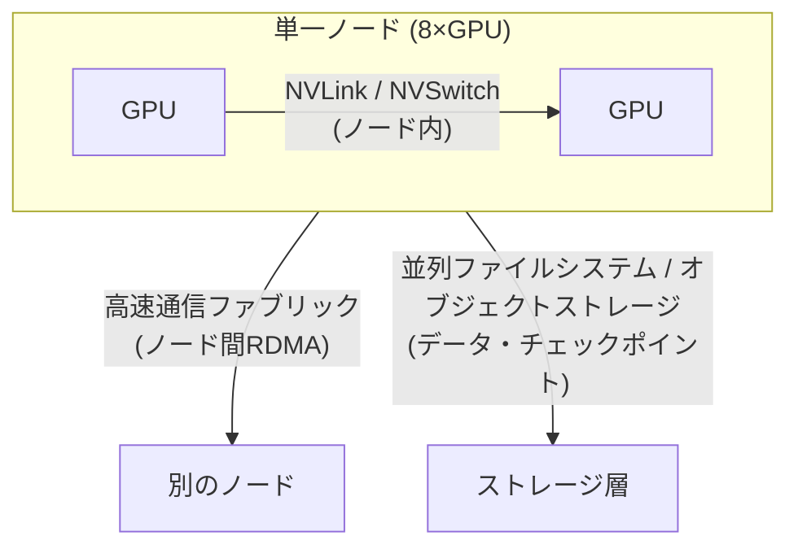

> 文書基準: 2026年9月 | この文書は変化の速い領域であり、四半期ごとのレビュー対象です。

:::tip[GPUインフラシリーズ 読む順序]
この文書は4部構成のGPUインフラシリーズの第1部です。

1. **GPUワークロードの特性とリファレンスアーキテクチャ**（この文書） — ワークロード分類、通信の3層、配置
2. [分散学習の標準アーキテクチャ](../distributed-training/) — 並列化（TP/PP/DP）、チェックポイント
3. [GPU Kubernetesとスケジューリング](../kubernetes-and-scheduling/) — ノードプール、クォータ、gang scheduling
4. [推論サービング・信頼性・コスト最適化](../serving-reliability-cost/) — サービング、障害、容量、コスト

順に読むことを推奨しますが、**すでに学習を回しているなら第2部から**、**クラスター運用・SREなら第3–4部から**読んでも構いません。
:::

:::note
この文書はGPUインフラ設計の応用的な内容です。GPUインスタンスの世代別スペック・リージョン可用性・予約/スポットオプションは[マルチクラウドAI — GPU可用性](../../../ai/multicloud-ai/#gpu可用性)に、AIプラットフォーム・モデル選択は[AIプラットフォームとモデル比較](../../../ai/ai-ml/)に整理されています。この文書は「複数のGPUをどのように一つのクラスターとして束ね、学習・推論を行うか」に焦点を当てます。
:::

## 概要

この文書は、モデルやデータがGPU 1枚（またはサーバー1台）の容量を超えるときに必要です。その場合、複数のGPUとサーバーを一つにまとめて仕事を分担させる必要があります。

このときよくある誤解が「もっと速いGPUを、もっとたくさん入れればその分だけ速くなる」というものです。実際はそうではありません。複数のGPUが協力するには互いに計算結果を絶えずやり取りする必要があり、**GPU数を増やしてもノード間の通信帯域とストレージのスループットが一緒に増えなければ、GPUの遊休時間だけが増え、性能は線形にスケールしません。**（料理人をいくら増やしても、厨房が狭く食材を運ぶ通路が詰まっていればその分速くはならないのと同じです。）

そのためGPUインフラ設計は「どのGPUを使うか」よりも**GPUをどう繋ぎ、データをどう流すか**が肝心です。この文書ではまずワークロードがどの種類かを分け（学習か推論かなど）、それに合った接続構造を**ノード内 → ノード間 → ストレージ**の3段階に分けて4ベンダーを比較します。

:::note
この文書では**ノード**（node）はGPUが複数枚挿さったサーバー1台を、**クラスター**（cluster）はそのようなノードを複数台まとめたものを指します。
:::

### クラウドを変えても同じもの、ベンダーごとに違うもの

クラウドを移すとき何が付いてきて何を学び直すかを先に整理すると、以降の内容が楽になります。

- **そのまま移るもの（移植性の基準線）** — 学習・推論コードは大半が**CUDAとNCCL**という共通基盤の上で動きます。（CUDA = NVIDIA GPUで計算を回す標準ソフトウェア、NCCL = 複数GPUが計算結果をやり取りできるようにする通信ライブラリ。）この2つの上で書いたコードは、クラウドを変えても大体そのまま移ります。
- **ベンダーごとに違うもの** — GPUを物理的に繋ぐ**高速通信網、サーバーを近くに配置する方法、丸ごと管理してくれるクラスター製品**はベンダーごとに名前も実装も異なり、互いに1対1で置き換えられません。

:::caution
ベンダー固有実装の細かな設定値（例: 特定インスタンスの通信キュー数、パーティションキー）はこの文書の範囲外です。この文書はベンダー間の概念を並べて比較することに集中し、詳細なチューニングは各ベンダーの公式ドキュメントに委ねます。また性能数値はインスタンス・ドライバ・ライブラリバージョン・ストレージ・配置の条件に大きく左右されるため、導入前に実際のワークロードで直接測定してください。
:::

## GPUワークロードの3分類

ワークロードごとにボトルネックとなるリソースが異なるため、インフラ設計の出発点はワークロード特性の把握です。

| ワークロード | 支配的なボトルネック | 通信要求 | ストレージ要求 | 代表的なインフラ特性 |
| --- | --- | --- | --- | --- |
| **事前学習 (Pre-training)** | 演算 + ノード間通信 | 非常に高い（全ノードが一緒に通信） | 高い（大容量データセットのストリーミング） | 多数ノード、高速通信網必須、チェックポイント帯域が重要 |
| **ファインチューニング (Fine-tuning)** | 演算 + メモリ | 中程度（数ノード以内が多い） | 中程度 | 小～中規模クラスター、単一ノードで可能な場合が多い |
| **推論 (Inference)** | メモリ帯域 + 遅延 | 低い（モデル並列時のみ） | 低い（重みロード後は常駐） | 遅延・スループットのバランス、オートスケール中心 |

:::note
ほとんどのエンタープライズワークロードはファインチューニングと推論に集中し、この2つは単一ノードまたは小規模ノードで十分な場合が多いです。ノード間の高速ファブリックが性能を左右するのは、主に大規模な事前学習です。ワークロードに合った最小構成を選択してください。
:::

## リファレンスアーキテクチャ — 3層通信モデル

GPUクラスターでデータが行き交う道は大きく3種類です。各道は異なる技術で作られ、速度も役割も違います。ベンダーを比較するとき、この3層を混ぜて見ると誤った比較になるため、必ず分けて見ます。

- **ノード内（1台のサーバー内）** — 1台のサーバー内のGPU同士はNVLink/NVSwitchという超高速の専用線で繋がれます。3層の中で最も速く、ベンダーに関係なくNVIDIAハードウェアの特性で決まります。
- **ノード間（サーバーとサーバーの間）** — サーバー同士は**高速通信ファブリック**で繋ぎます。ここでファブリック（fabric）は「サーバー群を密に織り込む専用の高速ネットワーク」を指し、RDMA（Remote Direct Memory Access）は「CPUを介さずサーバーのメモリ同士で直接データをやり取りする」技術です。**この層はベンダーごとに実装が異なり、大規模学習の性能を左右します。**
- **ストレージ（データ保管庫）** — 学習データを読み込み、途中の保存（チェックポイント）を書き、また読み戻す道です。この道が遅いと、GPUがデータを待って遊んでしまいます。

### ノード間高速通信ファブリック — ベンダーマッピング

| 層 | AWS | Azure | Google Cloud | OCI |
| --- | --- | --- | --- | --- |
| **ノード間ファブリック** | [EFA (Elastic Fabric Adapter)](https://docs.aws.amazon.com/AWSEC2/latest/UserGuide/efa.html) | [InfiniBand](https://learn.microsoft.com/azure/virtual-machines/sizes/overview) (NDシリーズ) | [GPUDirect-TCPX / RDMA](https://cloud.google.com/compute/docs/gpus) | [RDMA Cluster Network](https://docs.oracle.com/en-us/iaas/Content/Compute/Tasks/managingclusternetworks.htm) |
| **通信ライブラリ** | NCCL | NCCL | NCCL | NCCL |
| **同一概念か** | 近似対応 — 名称・実装・性能特性が相違 | 近似対応 | 近似対応 | 近似対応 |

:::caution
上表の4つのファブリックは**同じ役割を果たす異なる技術**であり、1対1の等価ではありません。例えばInfiniBandとEFAはプロトコル・輻輳制御・対応インスタンスが異なります。「AベンダーのX = BベンダーのY」のように単純に置き換えず、NCCLの上で動作するアプリケーションの移植性を基準としつつ、ファブリック性能はベンダーごとに測定してください。
:::

### 配置・トポロジ — 物理的近接性とNUMA

ノード間通信の性能を活かすには、2つが揃う必要があります。1つ目は、GPUサーバー同士がデータセンター内で**物理的に近く**にあること（遠く散らばっていると往復の時間が長くなります）。2つ目は、1台のサーバー内でGPUとそのGPUが使うネットワークカード（NIC）が**同じ区画**にくっついていること。ここでNUMA（Non-Uniform Memory Access）は「1台のサーバー内でもCPU・メモリが複数の区画に分かれていて、同じ区画同士は速く、別の区画を経由すると遅くなる構造」を指します。

| 項目 | AWS | Azure | Google Cloud | OCI |
| --- | --- | --- | --- | --- |
| **近接配置** | Placement Group (Cluster) | Proximity Placement Group + VMSS | Compact Placement Policy | Cluster Network（近接プロビジョニング内蔵） |
| **NUMA・GPU-NIC整列** | インスタンストポロジ公開、NCCLトポロジ認識 | トポロジ公開 | gVNIC + トポロジ認識 | Bare Metalトポロジ固定 |

- **近接配置** — 学習ノードを低遅延で束ねるには、近接配置を明示的に要求する必要があります。配置グループなしで散らばったノードはcollective通信の遅延が大きくなり、学習スループットが低下します。
- **NUMA・GPU-NIC affinity** — GPUとそのGPUが使用するNICが異なるNUMAノードにあると、データがCPUソケット間のリンクを経由し、遅延・帯域の損失が発生します。NCCLトポロジ認識とプロセスバインディングで整列します。

## マネージドGPUクラスター

ノード・ファブリック・スケジューラを自ら組み立てる代わりに、ベンダーが提供するマネージドGPUクラスターを使うと、トポロジ・ヘルスチェック・再起動が事前に統合されます。大規模学習では第一級の選択肢です。

| ベンダー | マネージドクラスター製品 | 特徴 |
| --- | --- | --- |
| AWS | [SageMaker HyperPod](https://aws.amazon.com/sagemaker/hyperpod/) | ノードヘルスチェック・自動交換、チェックポイントベースの再開を内蔵 |
| Azure | [CycleCloud](https://learn.microsoft.com/azure/cyclecloud/) + NDシリーズ | HPC/AIクラスターのオーケストレーション、スケジューラ統合（ノード自動交換は非内蔵 — スケジューラ・スクリプトで構成） |
| Google Cloud | [AI Hypercomputer / Cluster Director](https://cloud.google.com/ai-hypercomputer) | 統合インフラスタック、トポロジ認識プロビジョニング |
| OCI | [Supercluster](https://www.oracle.com/cloud/compute/gpu/) | RDMAクラスターネットワーク、大規模GPUの超低遅延接続（Bare Metal） |

:::note
OCIの**Dedicated AI Cluster**は上記の学習インフラとは異なる層です。これはOCI Enterprise AIサービス内で、事前学習済みのファウンデーションモデルをファインチューニング・ホスティングするマネージド（PaaS）リソースであり、自ら組み立てる学習インフラではありません。大規模学習インフラに相当するのはSuperclusterです。
:::

:::note
マネージドクラスターは初期の組み立て・運用負担を大きく減らしますが、ベンダー依存が高くなります。純粋なKubernetesで自ら構成すると移植性は高くなりますが、トポロジ・ヘルスチェック・gang schedulingを自ら担う必要があります。移植性と運用の容易さのトレードオフは、ワークロード規模とチームの能力で判断してください。Kubernetesベースの構成は[GPU Kubernetesとスケジューリング](../kubernetes-and-scheduling/)を参照してください。
:::

## 関連文書

- **次: 分散学習の並列化（TP/PP/DP）** — [分散学習の標準アーキテクチャ](../distributed-training/)
- **Kubernetes・スケジューリング・クォータ** — [GPU Kubernetesとスケジューリング](../kubernetes-and-scheduling/)
- **推論サービング・障害・容量・コスト** — [推論サービング・信頼性・コスト最適化](../serving-reliability-cost/)
- **機密GPUコンピューティング** — [データ保護 — 機密コンピューティング](../../../security/data-protection/#機密コンピューティング-confidential-computing)

## よくある間違い

- **ワークロード特性の分析なしに最上位GPU世代から選択** — ファインチューニング・推論に十分なワークロードに大規模事前学習用の構成を導入し、コストが急増
- **配置グループなしで多数ノード学習** — ノードが物理的に散らばり、collective通信の遅延が大きくなって学習スループットが低下
- **ファブリックをベンダー間で1対1に置き換え** — EFA・InfiniBand・RDMAを同一とみなし、性能予測が外れる
- **ストレージ帯域の過小設計** — チェックポイント保存中にGPUがアイドルで待機し、実効利用率が低下

## チェックリスト

- [ ] ワークロードを事前学習/ファインチューニング/推論に分類し、支配的なボトルネック（演算・メモリ・通信）を特定したか
- [ ] ノード内/ノード間/ストレージの3層をそれぞれ分離して設計したか
- [ ] 多数ノード学習時に近接配置（placement group/cluster network）を明示的に要求したか
- [ ] GPU-NICのNUMA整列とNCCLトポロジ認識を確認したか
- [ ] マネージドクラスターと自己構成の移植性・運用トレードオフを評価したか

## 参考リンク

### AWS

- [Elastic Fabric Adapter (EFA)](https://docs.aws.amazon.com/AWSEC2/latest/UserGuide/efa.html)
- [SageMaker HyperPod](https://aws.amazon.com/sagemaker/hyperpod/)

### Azure

- [GPU最適化VMサイズ](https://learn.microsoft.com/azure/virtual-machines/sizes/overview)
- [Azure CycleCloud](https://learn.microsoft.com/azure/cyclecloud/)

### Google Cloud

- [Cloud GPUs](https://cloud.google.com/compute/docs/gpus)
- [AI Hypercomputer](https://cloud.google.com/ai-hypercomputer)

### OCI

- [Cluster Networks](https://docs.oracle.com/en-us/iaas/Content/Compute/Tasks/managingclusternetworks.htm)
- [OCI GPU Compute](https://www.oracle.com/cloud/compute/gpu/)

### 共通

- [NVIDIA NCCL ドキュメント](https://docs.nvidia.com/deeplearning/nccl/user-guide/docs/index.html)
