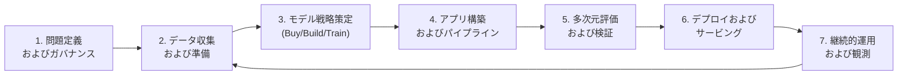
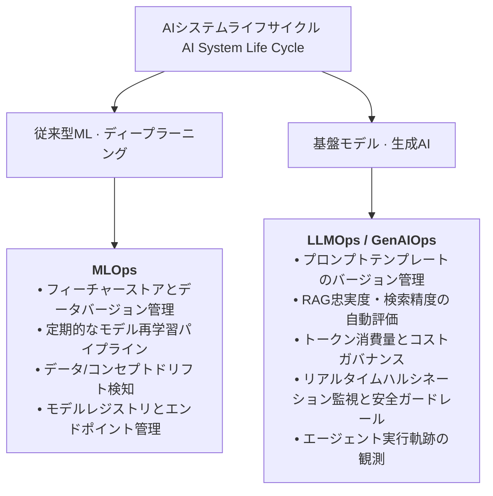

> 文書基準: 2026年8月

## 概要

ソフトウェアエンジニアリングにおいて要件分析から保守運用まで**SDLC (Software Development Life Cycle)**に従うのと同様に、AIシステムも体系的なライフサイクルを経由します。

しかし、AIシステムには従来のソフトウェアと決定的な違いがあります:
- **確率的（Probabilistic）な振る舞い** — 同一の入力に対しても可変的な出力が発生し得るため、決定論的な単体テストだけでは品質を保証できません。
- **データ依存性とドリフト** — コードの変更がなくても、学習データの陳腐化や実世界データの分布変化（Data Drift、Concept Drift）によってシステム性能が経時劣化します。
- **多次元ガバナンス** — ハルシネーション（幻覚）、バイアス、個人情報（PII）の漏洩、プロンプトインジェクションなど、従来のソフトウェアには存在しなかった安全性・セキュリティ脅威を常時統制する必要があります。

NIST AI RMF 1.0（Govern–Map–Measure–Manage）やISO/IEC 5338（AIシステムライフサイクルプロセス）などのグローバル標準フレームワークを参照して実務的に整理した**AIシステムライフサイクル (AI System Life Cycle)**は、次のような全体プロセスを持ちます。

---

## AIシステムライフサイクル 7段階

### 1. 問題定義およびガバナンス (Problem Framing & Governance)
- **ビジネス価値評価** — AI導入の投資対効果（ROI）、重要業績評価指標（KPI: 応答遅延、タスク完了率、コスト上限）を定義します。
- **規制・コンプライアンス要件の特定** — 個人情報保護、ネットワーク隔離、知的財産権（IP）保護の要件を事前に策定します。
- **AI適合性判定** — ルールベースのロジックや単純な統計で解決可能な課題に対して、不必要に高価な大規模言語モデル（LLM）を適用しようとするアンチパターンを防止します。初心者向けの導入判断は[AI入門 — まず判断する](../../ai/getting-started/#まず判断する-この課題にaiは適しているか)の4つの質問ゲートを参照してください。

### 2. データ収集およびガバナンス (Data Prep & Governance)
- **データパイプライン構築** — 構造化・非構造化データの収集、クレンジング、チャンキング（Chunking）、メタデータ付与を実行します。
- **プライバシーとセキュリティの徹底** — 収集段階から機密情報（PII）のマスキングや属性ベースアクセス制御（ABAC/RBAC）を強制します。
- **品質管理** — RAGのためのベクトル埋め込み生成および最新ドキュメントカタログを整備します。詳細は[ベクトルストア](../../ai/vector-store/)を参照してください。

### 3. モデル戦略策定 (Model Strategy Selection)
- **導入パスの決定** — 既製品SaaSの採用（Buy）、マネージドRAGの組み立て（Assemble）、APIを活用した独自開発（Build）、自前モデルの学習・Fine-tuning（Train）から組織のケイパビリティとTCOに応じて選択します。
- **モデルサイズの最適化** — すべてのタスクに最上位フロンティアモデルを適用するのではなく、タスクに応じて軽量モデル（Small/Flash）や推論特化型モデルをルーティングする複合アーキテクチャを設計します。[1P vs 3Pモデル比較](../../ai/1p-vs-3p/)を参照してください。

### 4. アプリケーション構築およびパイプライン (Application Engineering)
- **プロンプトおよびRAGパイプライン** — Few-shotプロンプト、ReActフレームワーク、セマンティックルーティング、ハイブリッド検索を実装します。詳細は[RAG高度なパターン](../../ai/rag-patterns/)を参照してください。
- **ツール連携およびエージェント設計** — Function Calling、バックエンドREST API、データベースコネクタを連携し、自律実行エージェントを構築します。[AIエージェント](../../ai/agents/)を参照してください。
- **学習パイプライン構築** — 独自モデルをトレーニングまたはFine-tuningする場合、分散学習パイプラインを構築します。

### 5. 多次元評価および検証 (Multi-Dimensional Evaluation)
- **オフラインベンチマーク (Golden Set)** — 正解データセットを基に精度、再現率、適合率を測定します。
- **LLM-as-a-JudgeおよびRAG評価指標** — ハルシネーション（Faithfulness）、回答関連性（Answer Relevance）、文脈適合率（Context Precision）を継続評価します。
- **レッドチーム（Red Teaming）演習** — 悪意のあるプロンプトインジェクション、脱獄（Jailbreak）、データ抽出攻撃に対する堅牢性を検証します。[AIセキュリティ](../../security/ai-security/)を参照してください。

### 6. デプロイおよびサービング (Deployment & Serving)
- **推論アーキテクチャ** — サーバーレスAPIエンドポイント呼び出し、コンテナベースの専用推論エンジン（vLLM、TensorRT-LLM）配置、またはエッジデバイス実行環境を構成します。
- **トラフィック制御** — カナリアデプロイ、ブルー/グリーン展開、レート制限（Rate Limiting）、トークンクォータ管理を適用します。

### 7. 継続的運用および観測 (Continual Operations & Observability)
- **継続的モニタリング** — トークン消費量、応答遅延（P99 Latency）、ユーザーフィードバック（Good/Bad）をリアルタイムに追跡します。
- **フィードバックループ** — 本番運用で収集された低品質な応答データを回帰テストセットに追加し、プロンプトとナレッジベースを継続的に改善します。

---

## 4段階エンタープライズ導入マトリクス

AIシステムの導入アプローチは、技術的課題の性質だけでなく、**対象ユーザー（ペルソナ）**と**制御権および運用責任の境界**に応じて決まります。

| 導入形態 | 対象ユーザー（ペルソナ） | 制御権および責任の境界 | UI/UX接点形態 | 代表的なベンダーソリューション | 適したエンタープライズユースケース |
| --- | --- | --- | --- | --- | --- |
| **Tier 1 (Buy)** | **非エンジニア・一般社員** (営業、人事、法務、一般事務) | • **ベンダー完全責任 (Turnkey SaaS)** • モデル重み・インフラはベンダー運用 • 顧客はプロンプトと業務データのみ管理 | • 業務ツール内蔵型Copilot • 独立型全社WebチャットUI | • Microsoft 365 Copilot • Google Workspace Gemini • Salesforce Agentforce • ChatGPT Enterprise | • 全社向け文書・メール作成 • 会議要約およびスケジュール抽出 • CRM顧客接点の自動ブリーフィング |
| **Tier 2 (Assemble)** | **シチズンデベロッパー / 企画者** (ビジネスドメイン専門家) | • **共同責任 (Managed Assemble)** • モデルホスティング・エンジンはベンダー運用 • 顧客はナレッジDB・ワークフロー・連携管理 | • ドラッグ＆ドロップビジュアルStudio • 社内メッセンジャー(Teams/Slack)ボット | • Microsoft Copilot Studio • Amazon Bedrock IDE (SageMaker Unified Studio) • Vertex AI Agent Builder • Dify, Flowise | • 人事FAQ・就業規則応答ボット • カスタマーサポート1次FAQ自動応答 • 部門別業務データ収集ボット |
| **Tier 3 (Build)** | **ソフトウェアエンジニア** (アプリ・バックエンド開発チーム) | • **顧客主導開発 (Custom Orchestration)** • 基盤モデルAPIを活用 • カスタムコード・LoRA調整・ガードレール制御 | • 自社Web/モバイルアプリUX • バックグラウンドHeadlessエージェント • バックエンドREST/gRPC API | • Amazon Bedrock API + AgentCore • Microsoft Foundry SDK • Gemini Enterprise API • LangChain / Semantic Kernel | • 社内ERP連携の在庫管理エージェント • 顧客向けアプリ内AI検索・推薦 • システム障害自動トリアージエージェント |
| **Tier 4 (Train & Ops)** | **MLエンジニア / データサイエンティスト** (インフラ & モデル専門家) | • **顧客完全制御 (Weights & Infrastructure)** • GPUクラスタ・モデル重みを自社所有 • 独自MLOpsパイプラインとサービングを全館運用 | • Jupyter/VS Code IDE • MLOpsオーケストレーションパイプライン • 専用推論エンドポイント | • AWS SageMaker AI • Azure Machine Learning • Google Vertex AI Pipelines • OCI Data Science | • 金融不正検知(FDS)、信用スコアリング • 大規模物流需要の時系列予測 • 特殊ドメイン専用のオンプレミスFine-tuning |

:::note[Tier選択の本質: 成熟度ラダーではなく責任と制御のトレードオフ]
上記の4段階は、すべての企業が順番に登るべき成熟度ラダーではありません。**組織が許容できる運用負担(TCO)と、必要な制御権(IP保護、精密な最適化)との間の最適なバランス点**を見つける軸です。多くのグローバルエンタープライズは、一般的な生産性向上にはTier 1/2を迅速に導入し、差別化の源泉となるコア業務にはTier 3/4を集中させるハイブリッドポートフォリオ戦略を採用しています。
:::

---

## 技術タスク別選択ガイド

以下は実務の要件別にアプローチ・技術・文書をすぐ探す**ルーティング**の視点です。AIが初めてで単純→高度の**学習順序**で習得したい場合は[AIを始める — いつどの方法を使うか](../../ai/getting-started/#いつどの方法を使うか)を参照してください。

| 要件 | 推奨アプローチ | 主要技術・文書 |
| --- | --- | --- |
| 自然言語対話、要約、翻訳 | ファウンデーションモデルAPI | [AIプラットフォームとモデル比較](../../ai/ai-ml/) |
| 社内文書に基づくナレッジ検索 | RAG（ファウンデーションモデル + ベクトルストア） | [RAG高度なパターン](../../ai/rag-patterns/), [ベクトルストア](../../ai/vector-store/) |
| マルチステップ自律業務の自動化 | AIエージェント（ツール呼び出し + 計画） | [AIエージェント](../../ai/agents/), [エージェント導入ガイド](../../ai/agent-adoption/) |
| 特定ドメインの文体・形式の固定 | Fine-tuningまたはLoRAアダプター | ファウンデーションモデルのFine-tuning |
| 画像/オブジェクト認識、OCR | 事前学習済みビジョンモデルまたはCV API | Document AI, Amazon Rekognition等 |
| 時系列予測、数値の異常検知 | 従来型MLアルゴリズム | SageMaker AI, Vertex AI等のMLプラットフォーム |
| 超軽量エッジ・オンデバイス配置 | 軽量オープンモデル + 量子化（Quantization） | ONNX Runtime, TensorRT-LLM, vLLM |

---

## ワークロード別運用フレームワーク: MLOps vs LLMOps

AIシステムの運用フェーズは、扱うモデルとデータの性質に応じて**MLOps**と**LLMOps / GenAIOps**という2つの特化実行柱に分かれます。

### コアな差異の比較

| 比較領域 | 従来型ML (MLOps) | 生成AI (LLMOps / GenAIOps) |
| --- | --- | --- |
| **中核資産** | データセット、特徴量（Feature）、モデル重みバイナリ | プロンプトテンプレート、ベクトルインデックス、埋め込み、ガードレール |
| **反復サイクル** | 数週間～数か月単位のモデル再学習 | 数分単位のプロンプト調整、数時間単位のRAGデータ更新 |
| **品質評価** | F1-Score、RMSE、AUC-ROCなどの統計指標 | Golden Set、LLM-as-a-Judge、ハルシネーション率、安全性評価 |
| **コスト特性** | 主に学習時のGPU投資（CAPEX的性質） | 呼び出しごとのトークン消費に基づく運用コスト（OPEX的性質） |
| **主要ツール** | Kubeflow、MLflow、SageMaker Pipelines | LangSmith、Arize Phoenix、Promptflow、AgentOps |

詳細なLLMOpsアーキテクチャとトレーシング手法は[LLMOps](../../ai/llmops/)を参照してください。

---

## DevOpsとの連携

AIシステムは孤立して稼働するものではなく、組織全体のDevOpsおよびプラットフォームエンジニアリング体系と直接統合される必要があります。

- **CI/CD連携** — アプリケーションのデプロイパイプライン（[CI/CD](../../devops/cicd/)）にプロンプト回帰テストやRAG自動評価ステップを組み込み、品質低下をリリース前に防止します。
- **インフラのコード化 (IaC)** — ベクトルデータベース、GPUノードプール、サービングエンドポイントを[IaC](../../devops/iac/)でプロビジョニングし、環境の一貫性を保証します。
- **統合可観測性 (Observability)** — 従来のインフラメトリクス（CPU、GPU、メモリ）とAIアプリケーション指標（トークン消費量、ハルシネーション率、ユーザー満足度）を単一のダッシュボード（[可観測性](../../devops/observability/)）に統合します。

---

## 関連資料

- [AIをはじめよう](../../ai/getting-started/) — 初学者のためのAIコア概念と意思決定パス
- [AIプラットフォームとモデル比較](../../ai/ai-ml/) — クラウド4社のAIプラットフォームと最新基盤モデルのスペック比較
- [LLMOps](../../ai/llmops/) — 生成AIおよびエージェントの本番運用体系
- [AIセキュリティ](../../security/ai-security/) — プロンプトインジェクション、脱獄、AIガードレールの構築
- [DevOpsをはじめよう](../../devops/getting-started/) — クラウドソフトウェア開発とデリバリーパイプライン
