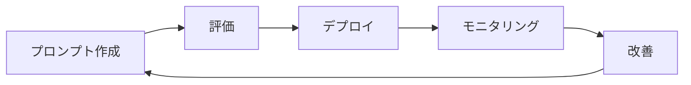

> 文書基準: 2026年8月 | 本文書は変化の速い領域であり、四半期ごとのレビュー対象です。

## 概要

[AIプラットフォームとモデル比較](../../ai/ai-ml/)でモデルを選び、[RAG高度なパターン](../../ai/rag-patterns/)でパイプラインを構築した後は、**プロダクションで継続的に品質を維持し改善**する必要があります。これをLLMOpsと呼びます。

:::note[前提知識および関連ドキュメント]
モデル選定については[AIプラットフォームとモデル比較](../../ai/ai-ml/)を、RAGパイプライン構築については[RAG高度なパターン](../../ai/rag-patterns/)を、AIセキュリティについては[AIセキュリティ](../../security/ai-security/)を参照してください。調達・課金モデル(Seat/APIティア、予約容量、Showback/Chargeback)は[LLMライセンスとコスト管理](../../ai/licensing/)が扱い、本文書は**プロダクションランタイムのコスト運用**(Budget Guardrail、Fallback、リクエストあたりコスト)に焦点を当てます。
:::

## 評価(Evaluation)

### オフライン評価

デプロイ前に品質を検証します。

| 評価タイプ | 方法 | ツール |
| --- | --- | --- |
| **Golden Set** | 正解のあるテストセットで正確度を測定 | 自前構築 + 自動採点 |
| **LLM-as-Judge** | 別のLLMが応答品質を評価 | Bedrock Evaluations, Vertex AI Eval |
| **Human Review** | 人がサンプルをレビュー | ラベリングツール(Label Studioなど) |
| **回帰テスト** | プロンプト/モデル変更後、既存の品質維持を確認 | CIパイプラインに統合 |

### RAG評価指標

RAGの検索・応答品質指標(Recall@K、MRR、NDCG、Faithfulness、Answer Relevance、Context Precision/Recall)と評価ツールは[RAG高度パターン — 評価](../../ai/rag-patterns/#評価)で詳しく扱います。

### ベンダー別評価ツール

| ベンダー | サービス | 特徴 |
| --- | --- | --- |
| AWS | [Bedrock Evaluations](https://docs.aws.amazon.com/bedrock/latest/userguide/evaluation.html) | 自動評価 + 人による評価。モデル比較 |
| Azure | [Azure AI Evaluation SDK](https://learn.microsoft.com/azure/ai-studio/how-to/evaluate-generative-ai-app) | Python SDKベース。CI/CD統合 |
| Google Cloud | [Vertex AI Evaluation Service](https://cloud.google.com/vertex-ai/generative-ai/docs/models/evaluation-overview) | 自動指標 + 人による評価 |
| ベンダー中立 | [Ragas](https://docs.ragas.io/), [DeepEval](https://docs.confident-ai.com/) | オープンソースRAG評価フレームワーク |

## プロンプト/モデルバージョン管理

| 管理対象 | 方法 | ツール |
| --- | --- | --- |
| **プロンプトバージョン** | Gitでプロンプトテンプレートを管理。変更時に評価を自動実行 | Git + CI |
| **モデルバージョン** | モデルID/バージョンをコードに固定。アップグレード時にA/Bテスト | Bedrock Model ID, Azure Deployment |
| **デプロイ戦略** | Canary(10%のトラフィックで新バージョンを検証) → 全面切り替え | ルーティング設定 |
| **ロールバック** | 以前のプロンプト/モデルバージョンへ即座に復帰 | デプロイパイプライン |

## 運用指標(モニタリング)

| 指標 | 意味 | アラート基準の例 |
| --- | --- | --- |
| **Latency (p50/p99)** | 応答時間 | p99 > 5秒 |
| **Token Usage** | 入出力トークン消費量 | 日平均比200%超過 |
| **Error Rate** | APIエラー率 | > 1% |
| **Cache Hit Rate** | プロンプトキャッシュのヒット率 | < 50%(期待より低い) |
| **Cost per Request** | リクエストあたりのコスト | 予算超過 |
| **Fallback Rate** | 主モデル失敗 → 代替モデル切り替え率 | > 5% |

ベンダー別モニタリング:
- AWS: CloudWatch + Bedrockメトリクス(InvocationLatency, InputTokenCount, OutputTokenCount)
- Azure: Azure Monitor + AI Studioメトリクス
- Google Cloud: Cloud Monitoring + Vertex AIメトリクス

### LLM Observabilityプラットフォーム

ベンダーネイティブのモニタリングに加え、LLMワークロードに特化した専門的なObservabilityツールがあります。プロンプトトレーシング、RAG品質分析、コスト追跡、評価自動化を統合的に提供します。

| 製品 | 種類 | 主な機能 | 参考 |
| --- | --- | --- | --- |
| [Arize AI](https://arize.com/) | 商用 | トレーシング、評価、ドリフト検出、RAG分析、ガードレールモニタリング | [Phoenix](https://github.com/Arize-ai/phoenix)(オープンソース版) |
| [LangSmith](https://smith.langchain.com/) | 商用(LangChain) | LangChain/LangGraphネイティブのトレーシング・評価、プロンプトハブ | LangChainエコシステム利用時の自然な選択 |
| [Langfuse](https://langfuse.com/) | オープンソース | セルフホスティング可能、プロンプト管理・トレーシング・コスト追跡 | ベンダーロックインなしで自前運用可能 |
| [Weights & Biases (Weave)](https://wandb.ai/site/weave) | 商用 | 実験追跡 + LLMトレーシング + 評価 | ML実験管理との統合 |

**選定基準:**

- ベンダーネイティブ(CloudWatch/Azure Monitor)で基本的なメトリクスは十分だが、**プロンプト単位のトレーシング**と**RAGパイプラインのデバッグ**には専門ツールが必要
- LangChainベースならLangSmith、フレームワーク非依存ならArize/Langfuse
- データ主権が重要ならLangfuse(セルフホスティング)またはArize Phoenix(オープンソース)

### エージェント観測(Agent Observability)

AIエージェントは単一のLLM呼び出しとは異なり、**マルチステップのトラジェクトリ**(計画→ツール呼び出し→結果観察→反復)を持つため、追跡すべき指標が異なります。

| 指標 | 説明 | 重要な理由 |
| --- | --- | --- |
| **ツール呼び出し成功率** | 正しいツールを正しいパラメータで呼び出した割合 | 最も早いドリフトの兆候 |
| **トラジェクトリ長** | タスク完了までのステップ数、リトライ回数 | ループ/非効率の検出 |
| **ステップ別レイテンシ** | 各段階(モデル推論、ツール実行)のP50/P99 | ボトルネックの特定 |
| **セッションあたりのコスト** | トークン(モデル別) + ツール呼び出しコストの合計 | 予算超過の早期警告 |
| **タスク完了率** | 目標達成の有無(成功/失敗/タイムアウト) | 主要ビジネスメトリクス |
| **ドリフト** | エンベディング/クラスタの変化、モデルバージョン切り替え後の挙動変化 | 品質低下の早期検出 |
| **オンライン評価スコア** | プロダクショントラフィックのサンプリング + LLM-as-Judge | 継続的な品質保証 |

**エージェント観測に強いツール:**

| ツール | エージェント特化機能 |
| --- | --- |
| [LangSmith](https://www.langchain.com/langsmith) | LangGraphトラジェクトリのリプレイ、ツール選択分析、オンライン評価 |
| [Datadog LLM Observability](https://docs.datadoghq.com/llm_observability/) | エージェント意思決定グラフ、ループ検出、APM/インフラとの相関分析 |
| [Braintrust](https://www.braintrust.dev/) | トレース→評価データセット→CIゲート自動化、Topicsクラスタリング |
| [Arize AX](https://arize.com/) | 継続的評価、トラジェクトリ精度、ドリフト検出 |
| [Galileo](https://www.galileo.ai/) | Luna評価器(低コスト/低レイテンシ)、ツール選択品質、失敗クラスタリング |
| [AgentCore Observability](https://docs.aws.amazon.com/bedrock-agentcore/latest/devguide/observability-get-started.html)(AWS) | CloudWatch + OTEL自動計装、セッション/ツール/メモリメトリクス |
| [Azure Foundry Monitoring](https://learn.microsoft.com/azure/ai-foundry/concepts/observability)(Azure) | OTELベースのマルチエージェントトレーシング、継続的評価、Azure Monitor連携 |
| [Vertex AI Tracing](https://cloud.google.com/vertex-ai/docs/model-monitoring/overview)(Google) | Cloud Trace連携、ADKトレーシング、モデル+ツールタイムライン |
| [Langfuse](https://langfuse.com/)(オープンソース) | セルフホスティング、フレームワーク非依存トレーシング、コスト追跡、プロンプト管理 |
| [Phoenix](https://github.com/Arize-ai/phoenix)(オープンソース) | OpenInferenceベース、セルフホスティング、トレース+評価+ドリフト |

:::note
**OTEL(OpenTelemetry) GenAIセマンティックコンベンション**が、エージェント観測の標準レイヤーとして定着しつつあります。フレームワーク・ベンダーに依存せずトレースを出力するには、OTELベースの計装(OpenLLMetryなど)を選択してください。
:::

## 運用パターン

| パターン | 説明 |
| --- | --- |
| **モデルFallback** | 主モデルの障害/遅延時に代替モデルへ自動切り替え(例: メインのClaude系 → GPT系 → Gemini系) |
| **Rate Limit対応** | ベンダーのRate Limitに達した際にキューイングまたは代替プロバイダへルーティング |
| **Budget Guardrail** | 日次/月次コスト上限を設定。超過時にリクエストを拒否するか、より安価なモデルへ切り替え |
| **PIIマスキング** | プロンプト/応答ログの個人情報を自動マスキングしてから保存 |

## よくある間違い

- **評価なしにプロンプト/モデルを変更してデプロイ** — 回帰テストを行わず、これまで正常に動作していた応答品質が突然低下する
- **プロンプト/応答ログにPIIをそのまま保存** — マスキングなしにログを保存し、個人情報保護法違反およびデータ漏洩のリスク
- **モデルFallback戦略なしに単一モデルに依存** — ベンダーのRate Limitや障害時にサービス全体が停止する

## チェックリスト

- [ ] プロンプト/モデル変更時にGolden Setベースの回帰テストをCIパイプラインで自動実行しているか
- [ ] プロンプト/応答ログにPIIマスキングを適用しているか
- [ ] 主モデル障害時に代替モデルへ自動切り替えするFallback戦略を構成したか

## 関連ドキュメント

- [LLMライセンスとコスト管理](../../ai/licensing/) — 調達・課金モデル(Seat/APIティア、予約容量、Showback/Chargeback)
- [LLMチャネル選択ガイド](../../ai/1p-vs-3p/) — 同一FMを1P(直接) vs 3P(クラウド経由)で消費する際の違い
- [AIプラットフォームとモデル比較](../../ai/ai-ml/) — モデルカタログ、推論単価の最適化(キャッシュ・バッチ・ルーティング)
- [FinOps](../../governance/finops/) — クラウドコストガバナンス全般

## 参考資料

### AWS

- [AWS Bedrock Evaluationsドキュメント](https://docs.aws.amazon.com/bedrock/latest/userguide/evaluation.html)

### Azure

- [Azure AI Evaluation SDK](https://learn.microsoft.com/azure/ai-studio/how-to/evaluate-generative-ai-app)

### Google Cloud

- [Vertex AI Evaluation Service](https://cloud.google.com/vertex-ai/generative-ai/docs/models/evaluation-overview)
- [Google SRE Book — Monitoring Distributed Systems](https://sre.google/sre-book/monitoring-distributed-systems/)

### 標準とコミュニティ

- [Ragas — RAG評価フレームワーク](https://docs.ragas.io/)
