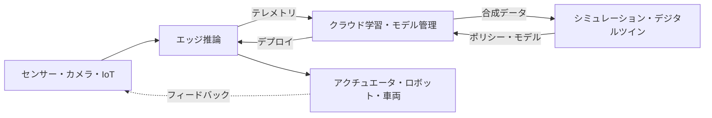

> 文書基準: 2026年9月 | この文書は変化の速い領域であり、四半期ごとのレビュー対象です。

## Physical AIとは

Physical AI(フィジカルAI)とは、テキストや画像といったデジタルデータにとどまっていたAIを、**センサー・ロボット・車両・設備など物理世界と接続**し、知覚し・判断し・物理的に行動させる流れを指します。チャットボットや文書処理のようなデジタルAIと異なり、Physical AIは**遅延(latency)・安全(safety)・リアルタイム性**の失敗が人や設備に直接的なリスクとなり得る点が根本的に異なります。

Physical AIは単一の製品ではなく、複数の層が噛み合ったパイプラインです。データが物理世界から入り、学習・シミュレーションを経て、再び物理世界へ行動として出ていきます。

:::note
この文書は**概念とベンダー中立の比較**に焦点を当てます。エッジ・ハイブリッドインフラの一般パターンは[ハイブリッド・エッジコンピューティング](../../compute/hybrid-and-edge/)、自律実行の概念は[AIエージェント](../../ai/agents/)、モデルカタログ・推論コストは[AIプラットフォームとモデル比較](../../ai/ai-ml/)を参照してください。この領域は製品名・モデル名の変化が特に速いため、導入前に各ベンダー公式ドキュメントで再確認が必要です。
:::

## レイヤー1 — エッジ推論とIoT

物理世界のデータは大量かつリアルタイムであり、すべてをクラウドへ送って処理するのは困難です。現場(エッジ)でまず推論し、必要なデータだけをクラウドへ上げる構造が基本です。

| 項目 | AWS | Azure | Google Cloud | OCI |
| --- | --- | --- | --- | --- |
| エッジランタイム | [IoT Greengrass](https://docs.aws.amazon.com/greengrass/v2/developerguide/) | [Azure IoT Operations](https://learn.microsoft.com/azure/iot-operations/) / [IoT Edge](https://learn.microsoft.com/azure/iot-edge/) | [Google Distributed Cloud (Edge)](https://cloud.google.com/distributed-cloud) | [Roving Edge Infrastructure](https://www.oracle.com/cloud/roving-edge-infrastructure/) |
| エッジML推論 | Greengrass MLコンポーネント(SageMaker AIモデルのデプロイ) | IoT Edgeモジュール + Azure AIサービス | Edge TPU / Coral | RED上のコンピュートで自己構成 |
| 産業データ収集 | [IoT SiteWise](https://aws.amazon.com/iot-sitewise/) (OPC UA) | IoT Operations (OPC UA) | — (パートナー・自己構成) | — (自己構成) |

:::caution
**Azure Perceptは2023年3月に提供終了**しました。過去の資料でPerceptをエッジAIハードウェアとして紹介していても、現在はAzure IoT Edge / IoT OperationsおよびAzure Certified Deviceのパートナーハードウェアで類似機能を構成します(Microsoftが単一の公式後継製品を指定したわけではありません)。終了した製品名をアーキテクチャの前提にしないでください。
:::

## レイヤー2 — デジタルツインとシミュレーション

ロボット・車両を実世界だけで学習させると、コスト・リスク・時間が大きくなります。そのため物理環境を仮想的に複製した**デジタルツイン**と**シミュレーション**で大量のシナリオを生成・学習し、現実へ移すsim-to-realのアプローチが定着しました。

| 項目 | AWS | Azure | Google Cloud | OCI | クロスベンダー |
| --- | --- | --- | --- | --- | --- |
| デジタルツイン | [IoT TwinMaker](https://aws.amazon.com/iot-twinmaker/) | [Azure Digital Twins](https://learn.microsoft.com/azure/digital-twins/) | — (Spanner Graph・BigQuery等で自己構成) | — | [NVIDIA Omniverse](https://www.nvidia.com/en-us/omniverse/) |
| ロボット・物理シミュレーション | — (RoboMaker提供終了、自己構成) | — (パートナー・自己構成) | — (パートナー・自己構成) | — | [NVIDIA Isaac Sim / Isaac Lab](https://developer.nvidia.com/isaac/sim) |

:::caution
**AWS RoboMakerは2025年9月10日に提供終了(サポート終了)**しました。現在AWSでのロボットシミュレーションは専用のマネージドサービスなしに、GPUインスタンス + オープンソース(Isaac Sim、Gazebo等)で自己構成します。EOL(サポート終了)されたサービスを新規設計に含めないよう注意してください。
:::

:::note
デジタルツイン・ロボットシミュレーション層は**NVIDIA Omniverse・Isaacエコシステムが広く活用されています**。クラウド3社ともこのスタックをGPUインスタンス上で実行する形で対応しており、特定クラウドの専用マネージド製品に依存するよりも、**どのクラウドでも移して実行できるか(移植性)**をまず確認することがロックイン低減の近道です。
:::

## レイヤー3 — ロボティクス基盤モデル

LLMが言語を一般化したように、ロボットの知覚・計画・動作を一般化しようとする**ロボット基盤モデル**が台頭しています。自然言語の指示を受け、視覚(Vision)・言語(Language)・行動(Action)を接続するVLA(Vision-Language-Action)方式が代表的です。

| 項目 | 現況 |
| --- | --- |
| 代表スタック | [NVIDIA Isaac GR00T](https://developer.nvidia.com/isaac/gr00t) — ロボット向けオープン基盤モデル(VLA)、Omniverse・Cosmosベースのシミュレーション・合成データ、Jetson Thorによるオンデバイス推論 |
| クラウド3社 | 自社の汎用ロボット基盤モデルはまだ限定的 — 概ねNVIDIAスタックをGPUインフラ上で実行するか、パートナーシップで提供 |
| 国家政策 | 日本はGENIACでロボティクス基盤モデル開発を国策課題として採択([日本のAI地形](../../japan/ai-landscape/)を参照) |

### 物理世界とエージェントの接続

ロボット基盤モデルが知覚・計画・動作を担うとすれば、その上で**目標を受け取り自ら手順を計画し、ツール・センサー・アクチュエータを呼び出して実行する**自律実行層がエージェントです。Physical AIではエージェントの行動が**物理世界に即座に反映**されるため、接続方式と権限境界が安全に直結します。

- **エッジエージェント ↔ クラウドオーケストレーション** — リアルタイムの判断・制御ループは現場(エッジ)で自律的に回り、長期計画・複数ロボットの調整・モデル更新はクラウドが担う分業が一般的です。ネットワークが切れてもエッジエージェントが安全に動作を続けるか、安全に停止できる必要があります。
- **ツール・アクチュエータの接続(MCPなど)** — エージェントがセンサー値を読み、上位のタスクを指示するには標準化された接続層が必要です。ただしMCPのようなプロトコルは**高水準のタスク指示・ツール呼び出し層**であり、リアルタイムのアクチュエータ制御(モーター・関節など)は遅延・安全が保証される**別の決定論的な低水準制御層**(フィールドバス・ロボットミドルウェアなど)が担います。この2つを混同してはいけません。自律実行・ツール呼び出しの一般概念は[AIエージェント](../../ai/agents/)を、エージェント-ツール連携プロトコルは[AIエージェント連携 (MCP)](../../mcp/)を参照してください。

:::caution
エージェントに物理アクチュエータ(モーター・バルブ・車両制御など)を直接呼び出させる場合は、**権限範囲(action space)を明示的に制限**し、危険な動作には人による承認・安全層による事前検証を置いてください。デジタルエージェントの誤ったツール呼び出しは再試行で済みますが、物理エージェントの誤作動は取り返しのつかない被害につながり得ます。
:::

:::caution
ロボット基盤モデルと**ワールドモデル(world model)**は、2026年9月時点で急速に発展中の初期領域です。モデル名・バージョン・性能数値はベンダー発表ごとに大きく変わるため、この文書は成熟した比較が可能な範囲のみを扱い、詳細な数値は公式ソースリンクで代替します。
:::

## 安全レイヤー — 自動運転とロボティクス

物理世界で動くAIは人命・設備に直結するため、**機能安全(functional safety)**が中心です。自動運転は[ISO 26262](https://www.iso.org/standard/68383.html)、産業機械・ロボットは[ISO 13849](https://www.iso.org/standard/73481.html)・IEC 61508などドメイン別の安全規格と認証体系が別途適用され、AIモデルの判断とは無関係に動作する**独立した安全層**(安全停止、ハードウェアインターロック、安全PLCなど)を置くのが原則です。

各ベンダー・サプライヤーはこれを実装した商用スタックを提供します。例えばNVIDIAは安全システム**Halos**を提供します。

- **自動運転(AV)**: [DRIVE](https://www.nvidia.com/en-us/solutions/autonomous-vehicles/)プラットフォーム(AGX・Hyperion)とHalos安全システム(クラウドから車両までの全区間、ISO 26262志向)、シミュレーションはOmniverse・Cosmos。
- **ロボティクス**: NVIDIAは2026年6月、自動運転の安全基盤を産業用ロボット・ヒューマノイド・AMRへ拡張した**[Halos for Robotics](https://developer.nvidia.com/blog/inside-nvidia-halos-for-robotics-a-full-stack-functional-safety-system-for-physical-ai/)**(IGX Thor・Holoscan Sensor Bridge・Halos OS・AI Systems Inspection Lab)を発表しました。

:::note
安全層は**基盤モデルではなく別の安全システム**です。ロボットの知覚・計画・動作は基盤モデル(例: [Isaac GR00T](https://developer.nvidia.com/isaac/gr00t))が担い、その上で機能安全を担う層は役割が異なります。安全層は、エージェントやモデルが計画した動作であっても**許可された行動範囲(action space)を外れれば遮断・制限**する最終ゲートの役割を果たします。上記のHalosはこの安全層の商用実装例であり、自動運転から始まり2026年にロボティクスへ適用範囲が拡張されました。
:::

## マルチクラウド・エッジアーキテクチャの考慮点

### 何をエッジに、何をクラウドに置くか

Physical AI設計の出発点は、各タスクをエッジとクラウドのどちらに置くかを決めることです。判断基準は遅延感度、データ量(帯域)、安全要求、ネットワーク切断時の動作です。

| タスク | 主な配置 | 理由 |
| --- | --- | --- |
| リアルタイムの知覚・制御ループ | エッジ | 遅延に敏感で、ネットワーク切断でも止まってはいけない |
| 安全停止・緊急遮断 | エッジ | クラウド往復の遅延を許容できない |
| センサーデータの一次フィルタリング・集約 | エッジ | 原本をすべて上げると帯域・コストが過大 |
| モデル学習・再学習 | クラウド | 大規模GPU・データセットが必要([GPUインフラ](../gpu-infra/workload-and-architecture/)を参照) |
| 合成データ生成・シミュレーション | クラウド | デジタルツイン・シミュレータに大規模演算が必要 |
| 複数ロボット・フリート調整、長期計画 | クラウド | 個々のエッジの視野を超える全体調整 |
| モデルバージョン管理・デプロイ(OTA) | クラウド → エッジ | 中央で管理し現場へ配布 |

### クローズドループ(closed-loop)運用サイクル

Physical AIは一度デプロイして終わりではなく、現場のデータが再びモデルへ戻る循環構造で運用されます。上部のフロー図の各段階は次の運用サイクルに対応します。

1. **エッジ推論** (`エッジ推論`) — 現場でリアルタイムに知覚・判断・制御し、有意なイベント・異常データのみを選別します。
2. **テレメトリ収集** (`テレメトリ`) — 選別したデータ・走行/作業ログをクラウドへ上げます。
3. **クラウド再学習・シミュレーション** (`クラウド学習・モデル管理` ↔ `シミュレーション・デジタルツイン`) — 収集データでモデルを改善し、デジタルツイン・シミュレーションで新しいシナリオを検証します。
4. **OTAデプロイ** (`デプロイ` → `エッジ推論`) — 検証したモデル・ポリシーを再びエッジへ配布します。デプロイ失敗・回帰に備えた署名・ロールバックなどの一般パターンは[ハイブリッド・エッジコンピューティング](../../compute/hybrid-and-edge/)を参照してください。

:::note
ネットワークが切れるとこのサイクルの2–4段階は一時中断しますが、1段階(エッジ推論・制御)は**オフラインでも自律的に継続**しなければなりません。切断を例外ではなく通常状態の一つと想定し、エッジが独立して安全に動作するよう設計してください。
:::

- **データ重力と遅延** — センサーデータは大量で遅延に敏感なため、現場のエッジ推論とクラウド学習を分担する設計が基本です。何をエッジで処理し、何を上げるかをまず決めてください。
- **シミュレータの移植性** — デジタルツイン・シミュレーションが特定クラウドの専用サービスに縛られると移植が困難です。NVIDIA Omniverse・IsaacのようにGPUさえあればどこでも実行可能なスタックを優先検討するとロックインが減ります。
- **オンデバイス vs クラウド学習の分担** — 学習・合成データ生成はクラウドGPU、リアルタイム推論はオンデバイス(例: Jetson系)に分けるのが一般的です。
- **安全・規制** — 自動運転・産業ロボットは機能安全認証と規制が別途適用されます。アーキテクチャの初期に認証要件を反映してください。
- **製品ライフサイクルの確認** — この領域は提供終了(EOL)された製品が多くあります(例: Azure Percept、AWS RoboMaker)。設計前に各サービスの現行サポート状況を必ず確認してください。

## よくある失敗

- **すべてのデータをクラウドへ送る** — 遅延・帯域・コストを無視した設計はリアルタイム制御で失敗します。エッジ推論の分担が先です。
- **EOL製品を新規設計に使用** — RoboMaker・Perceptのようにサポート終了したサービスを古い資料だけで採用しないでください。
- **単一ベンダーのシミュレータに依存** — 特定クラウド専用のシミュレーションに学習パイプラインを縛ると、移植・比較が難しくなります。
- **安全を後付けにする** — 自動運転・ロボットは安全をアーキテクチャの初期から設計する必要があります(「bolt-on」ではなく「built-in」)。
- **物理エージェントに無制限の権限を付与** — 自律実行エージェントにアクチュエータを制約なく呼び出させると、誤作動が物理的被害に直結します。行動範囲の制限と安全層の検証が必須です。

## チェックリスト

- [ ] エッジで処理する推論とクラウドへ上げるデータを区別したか?
- [ ] ネットワーク切断時にエッジが自律的に(オフラインで)安全に動作するか?
- [ ] エージェントが物理アクチュエータを呼び出す場合、行動範囲(action space)を制限し安全層の検証を置いたか?
- [ ] デジタルツイン・シミュレーションスタックは他のクラウドへ移植可能か(ロックイン点検)?
- [ ] 使用するIoT・ロボティクスサービスは現行サポート状況か(EOL確認)?
- [ ] 自動運転・産業ロボットなら機能安全認証の要件を設計に反映したか?
- [ ] オンデバイス推論とクラウド学習の役割分担は明確か?

## 関連ドキュメント

- [ハイブリッド・エッジコンピューティング](../../compute/hybrid-and-edge/) — エッジインフラの一般パターン
- [AIエージェント](../../ai/agents/) — 自律的な計画・実行の概念
- [AIエージェント連携 (MCP)](../../mcp/) — エージェント-ツール・システム連携プロトコル
- [GPUインフラ](../gpu-infra/workload-and-architecture/) — クラウド学習・シミュレーション用GPUクラスター
- [AIプラットフォームとモデル比較](../../ai/ai-ml/) — モデルカタログ・推論コスト
- [日本のAI地形](../../japan/ai-landscape/) — ロボティクス基盤モデルの国策課題(GENIAC)

## 参考資料

### AWS

- [AWS IoT Greengrass開発者ガイド](https://docs.aws.amazon.com/greengrass/v2/developerguide/)
- [AWS IoT TwinMaker](https://aws.amazon.com/iot-twinmaker/)
- [AWS IoT SiteWise](https://aws.amazon.com/iot-sitewise/)

### Azure

- [Azure IoT Operationsドキュメント](https://learn.microsoft.com/azure/iot-operations/)
- [Azure Digital Twinsドキュメント](https://learn.microsoft.com/azure/digital-twins/)

### Google Cloud

- [Google Distributed Cloud](https://cloud.google.com/distributed-cloud)
- [Coral / Edge TPU](https://cloud.google.com/edge-tpu)

### OCI

- [Oracle Roving Edge Infrastructure](https://www.oracle.com/cloud/roving-edge-infrastructure/)

### クロスベンダー (NVIDIA)

- [NVIDIA Isaac GR00T (開発者ページ)](https://developer.nvidia.com/isaac/gr00t)
- [NVIDIA Omniverse](https://www.nvidia.com/en-us/omniverse/)
- [NVIDIA 自動運転(DRIVE・Halos)ソリューション](https://www.nvidia.com/en-us/solutions/autonomous-vehicles/)
