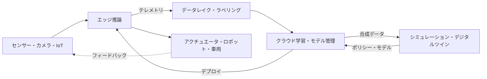

> 文書基準: 2026年9月 | この文書は変化の速い領域であり、四半期ごとのレビュー対象です。

## Physical AIとは

Physical AI(フィジカルAI)とは、テキストや画像といったデジタルデータにとどまっていたAIを、**センサー・ロボット・車両・設備など物理世界と接続**し、知覚し・判断し・物理的に行動させる流れを指します。チャットボットや文書処理のようなデジタルAIと異なり、Physical AIは**遅延(latency)・安全(safety)・リアルタイム性**の失敗が人や設備に直接的なリスクとなり得る点が根本的に異なります。

Physical AIは単一の製品ではなく、複数の層が噛み合ったパイプラインです。データが物理世界から入り、保存・整備と学習・シミュレーションを経て、再び物理世界へ行動として出ていきます。

:::note
この文書は**概念とベンダー中立の比較**に焦点を当てます。エッジ・ハイブリッドインフラの一般パターンは[ハイブリッド・エッジコンピューティング](../../compute/hybrid-and-edge/)、自律実行の概念は[AIエージェント](../../ai/agents/)、モデルカタログ・推論コストは[AIプラットフォームとモデル比較](../../ai/ai-ml/)を参照してください。この領域は製品名・モデル名の変化が特に速いため、導入前に各ベンダー公式ドキュメントで再確認が必要です。
:::

## レイヤー1 — エッジ推論とIoT

物理世界のデータは大量かつリアルタイムであり、すべてをクラウドへ送って処理するのは困難です。現場(エッジ)でまず推論し、必要なデータのみをクラウドへ上げる構造が基本です。

| 項目 | AWS | Azure | Google Cloud | OCI |
| --- | --- | --- | --- | --- |
| エッジランタイム | [IoT Greengrass](https://docs.aws.amazon.com/greengrass/v2/developerguide/) | [Azure IoT Operations](https://learn.microsoft.com/azure/iot-operations/) / [IoT Edge](https://learn.microsoft.com/azure/iot-edge/) | [Google Distributed Cloud (Edge)](https://cloud.google.com/distributed-cloud) | [Roving Edge Infrastructure](https://www.oracle.com/cloud/roving-edge-infrastructure/) |
| エッジML推論 | Greengrass MLコンポーネント (SageMaker AIモデルのデプロイ) | IoT Edgeモジュール + Azure AIサービス | Edge TPU / Coral (現行サポート状況の確認が必要) | RED上のコンピュートで自前構成 |
| 産業データ収集 | [IoT SiteWise](https://aws.amazon.com/iot-sitewise/) (OPC UA) | IoT Operations (OPC UA) | — (パートナー・自前構成) | — (自前構成) |

:::caution
**Azure Perceptは2023年3月に提供終了**しました。過去の資料でPerceptがエッジAIハードウェアとして紹介されていても、現在はAzure IoT Edge / IoT OperationsとAzure Certified Deviceパートナーハードウェアで同様の機能を構成します(Microsoftが単一の公式後継製品を指定したわけではありません)。古い製品名をアーキテクチャの前提にしないでください。
:::

### エッジ推論ハードウェア

エッジランタイムがソフトウェア層だとすれば、その下で実際に推論を実行する**アクセラレータハードウェア**の選択が実現可能性とTCOを左右します。判断基準は4つです — 目標モデルを動かす**演算性能**、モデルが載る**メモリ容量**、ロボットの**電力・発熱予算**、そして**ソフトウェアエコシステムの寿命**です。

| 系統 | 性格 | 留意点 |
| --- | --- | --- |
| ロボティクス向けエッジモジュール(例: [NVIDIA Jetson](https://developer.nvidia.com/embedded/jetson-modules)系) | 低電力の小型モジュールから高性能モジュールまで幅が広く、ロボティクスVLAのオンデバイス推論でよく検討される選択肢 | 世代・モジュール間で性能とメモリの差が大きく、価格帯も大きく開きます。目標モデルが該当モジュールのメモリに載るかを先に確認してください |
| 汎用CPU内蔵NPU・小型アクセラレータ | 分類・検出のような軽量ビジョンには十分で、電力・単価が低い | 大規模マルチモーダル・VLA推論にはメモリと帯域が不足する場合が少なくありません |
| FPGA・産業用SoC | 決定論的な遅延と長期供給の保証が重要な設備に有利 | 開発難度が高く、モデル移植のコストが大きくなります |
| クラウド事業者のエッジアプライアンス | クラウドの運用ツール・管理体系を現場へ拡張 | 現場サーバー・ゲートウェイ用途であり、ロボット搭載のリアルタイム制御を代替しません |

:::caution
**TOPSの数値だけで比較しないでください。** ベンダーが示す演算性能は精度(INT8・FP4など)と希薄化(sparsity)適用の有無で基準が変わるため、条件の異なる数値を並べても比較は成立しません。実際の推論速度はメモリ容量・帯域とモデルの適合性に左右されることが多いため、**目標モデルを対象モジュール上で実測する**ほうが確実です。
:::

:::caution
エッジアクセラレータでは、**ソフトウェアエコシステムの寿命**がハードウェアの寿命と同じくらい重要です。ドライバ・ランタイムの更新が止まった製品は新しいカーネルや新しいモデルフォーマットに対応できず、早期の置き換え圧力が生じます。上のレイヤー1の表にある[Google Edge TPU / Coral](https://developers.google.com/coral/guides/faq)がその例で、公式の製品EOL告知がない状態でも[レガシーAPIリポジトリがアーカイブされ「メンテナンスされていない」と明記](https://github.com/google-coral/edgetpu)されています。名称が似ている**Coral NPUはシリコンパートナー向けのオープンソースNPU IPで別物**であり、Edge TPUモジュール製品群の公式な後継ではないため、同一製品の後継として読まないでください。新規設計に入れる前に**現行のサポート状況とドライバ更新履歴を直接確認**してください。価格も固定値ではなく世代交代の時期に調整された事例があるため、大量展開の計画は見積もりを取り直して検証する必要があります。
:::

### センサーデータパイプライン — 収集・保存・ラベリング

エッジから上がってきたデータをそのまま学習に使うことはできません。Physical AIのデータは**1D時系列(関節角度・電流・温度)、2D映像、3D点群、設備メタデータが混在するマルチモーダル**であり、収集 → 保存 → 整備・ラベリングの段階を経てはじめて学習パイプラインに入ります。

| 段階 | AWS | Azure | Google Cloud | OCI |
| --- | --- | --- | --- | --- |
| ストリーム・映像収集 | [IoT Core](https://aws.amazon.com/iot-core/) (エッジ入口) / [Kinesis Video Streams](https://aws.amazon.com/kinesis/video-streams/)・[Data Streams](https://aws.amazon.com/kinesis/data-streams/) (ダウンストリーム格納) | [Event Hubs](https://learn.microsoft.com/azure/event-hubs/) + IoT Operations | [Pub/Sub](https://cloud.google.com/pubsub) | [OCI Streaming](https://www.oracle.com/cloud/streaming/) |
| データレイク | [S3](https://aws.amazon.com/s3/) | [Data Lake Storage](https://learn.microsoft.com/azure/storage/blobs/data-lake-storage-introduction) | [Cloud Storage](https://cloud.google.com/storage) | [Object Storage](https://www.oracle.com/cloud/storage/object-storage/) |
| 学習用並列ファイルシステム | [FSx for Lustre](https://aws.amazon.com/fsx/lustre/) | [Azure Managed Lustre](https://azure.microsoft.com/products/managed-lustre) | [Managed Lustre](https://cloud.google.com/products/managed-lustre) / [Parallelstore](https://cloud.google.com/parallelstore) | [File Storage with Lustre](https://www.oracle.com/cloud/storage/file-storage-with-lustre/) |
| ラベリング | [SageMaker Ground Truth](https://docs.aws.amazon.com/sagemaker/latest/dg/sms.html) (新規顧客の受付終了) | [Azure MLデータラベリング](https://learn.microsoft.com/azure/machine-learning/how-to-label-data) | — (マネージドは終了、パートナー・OSS) | [OCI Data Labeling](https://www.oracle.com/artificial-intelligence/data-labeling/) |

:::caution
**マネージドのラベリングサービスはむしろ減少傾向にあります。** Google CloudのVertex AIデータラベリングは[2024年10月3日に終了](https://cloud.google.com/vertex-ai/docs/deprecations)しており、AWS SageMaker Ground Truthは2026年7月30日から新規顧客を受け付けません(既存顧客は継続利用可、新機能の追加予定なし)。Ground Truth Plusは2026年6月30日にサポートが終了しました。ラベリングを特定クラウドのマネージドサービスに縛って設計せず、**OSS・パートナーツールで代替可能な構造**を既定にしてください。
:::

:::note
GPU学習のボトルネックは演算ではなく**データロードとチェックポイント書き込み**であることが少なくありません。オブジェクトストレージから直接読むとGPUが遊ぶため、学習区間では並列ファイルシステムを前段に置きオブジェクトストレージと連携する構成が一般的です。ストレージ層の一般比較は[ブロック・ファイルストレージ](../../storage/block-and-file/)、チェックポイント戦略は[分散学習](../gpu-infra/distributed-training/)を参照してください。
:::

## レイヤー2 — デジタルツインとシミュレーション

ロボット・車両を実世界だけで学習させると、コスト・リスク・時間が大きくなります。そのため物理環境を仮想に複製した**デジタルツイン**と**シミュレーション**で大量のシナリオを生成・学習し、現実へ移すsim-to-realのアプローチが定着しました。

| 項目 | AWS | Azure | Google Cloud | OCI | クロスベンダー |
| --- | --- | --- | --- | --- | --- |
| デジタルツイン | [IoT TwinMaker](https://aws.amazon.com/iot-twinmaker/) | [Azure Digital Twins](https://learn.microsoft.com/azure/digital-twins/) | — (Spanner Graph・BigQueryなどで自前構成) | — | [NVIDIA Omniverse](https://www.nvidia.com/en-us/omniverse/) |
| ロボット・物理シミュレーション | — (RoboMakerサポート終了、自前構成) | — (パートナー・自前構成) | — (パートナー・自前構成) | — | [NVIDIA Isaac Sim / Isaac Lab](https://developer.nvidia.com/isaac/sim) |

:::caution
**AWS RoboMakerは2025年9月10日にサポートが終了**しました。現在AWSでのロボットシミュレーションは、専用のマネージドサービスなしにGPUインスタンス + OSS(Isaac Sim、Gazeboなど)で自前構成します。EOL(サポート終了)のサービスを新規設計に入れないよう注意してください。
:::

:::note
デジタルツイン・ロボットシミュレーション層は**NVIDIA Omniverse・Isaacエコシステムが広く活用されています。** 主要クラウドはいずれもこのスタックをGPUインスタンス上で実行する形で対応しており、特定クラウド専用のマネージド製品に依存するよりも、**どのクラウドでも移して実行できるか(可搬性)** を先に確認することがロックイン低減につながります。
:::

### 学習データはなぜ不足するのか

シミュレーションが選択肢ではなく前提になる理由は**データ希少性**にあります。言語モデルはインターネット上のテキストという事実上無限の事前学習データから出発しましたが、「ロボットが実際に物を掴んで運んだ」データは桁違いに少ないのが実情です。Physical AIの学習は、安価で豊富なデータで不足を補う設計から始まります。

| データ層 | 性格 | 限界 |
| --- | --- | --- |
| インターネット映像・画像・テキスト | 事実上無限で安価。一般常識・物体知識を提供 | ロボットの身体・関節指令と直接結びつかない |
| 人の作業映像(一人称) | 相対的に多い。動作順序・意図の手がかりを提供 | 人の身体基準のため、ロボットのembodimentへそのまま移せない |
| ロボットのteleopエピソード | 実際の関節指令を含み最も正確 | 人がロボットを直接操作して作るため、収集コストが最も高い |

**teleoperation(遠隔操作)** とは、人がコントローラやVR機器でロボットを直接動かして実演データを作る方式であり、そのデータをそのまま模倣するよう学習させるのが**模倣学習(imitation learning)** です。最も確実な方法ですが、人の時間がそのままコストになるため規模を拡大しにくいという制約があります。

:::note
クラウドのコスト算定の観点では、この構造は**GPUコストとは別の軸が存在する**ことを意味します。データ収集(機材・人件費)、保存・転送、ラベリングのコストが学習演算コストとは独立に発生するため、GPU時間だけでTCOを見積もると大きく外れます。
:::

### 公開データセットとベンチマークのエコシステム

データ希少性は一つの組織だけで埋めるのが難しいため、複数の機関がデータを持ち寄り評価課題を共有する公開エコシステムが形成されています。スタックを選ぶ際、**「このスタックでどの公開資産をそのまま使えるか」** はロックインを判断する実質的な基準になります。

| 区分 | 代表的な資産 | 何に使うか |
| --- | --- | --- |
| クロスロボットデータセット | [Open X-Embodiment](https://github.com/google-deepmind/open_x_embodiment) ([論文](https://arxiv.org/abs/2310.08864)) | 複数機関のロボットデータを統合したコレクション。cross-embodiment事前学習の基準線 |
| 大規模操作データセット | [DROID](https://github.com/droid-dataset/droid) | 多様な環境で収集したteleopデータ |
| シミュレーションベンチマーク | [LIBERO](https://github.com/Lifelong-Robot-Learning/LIBERO)、[CALVIN](https://github.com/mees/calvin)、[RoboCasa](https://github.com/robocasa/robocasa)、[Meta-World](https://github.com/Farama-Foundation/Metaworld) | 標準課題セットでの作業成功率によりポリシーを比較 |
| 人の作業映像 | [Ego4D](https://ego4d-data.org/) | 一人称の作業映像。上記データ3層の中間層に相当 |
| オープンツールチェーン | [LeRobot](https://github.com/huggingface/lerobot) | データ形式・学習・評価をまとめたOSSスタック |

:::caution
公開データセットは**ライセンス条件が資産ごとに異なります。** 研究用途のみ許諾される場合や、出典表示・派生物の公開を求める場合があるため、商用製品の学習資産として使う前に、各データセットのライセンスとその構成要素(個々の機関が寄与した部分)の条件を併せて確認する必要があります。例えばOpen X-Embodimentは単一ライセンスではなく**構成データセットごとに条件が異なり**、Ego4Dは商用利用に別途の規約が適用される場合があります。
:::

:::note
公開データセットで事前学習されたモデルを使えば初期のデータ収集量を減らせますが、**自社ロボットのembodimentと対象作業がそのデータに含まれているか**が実際の効果を分けます。ベンチマークの成績も同様に、測定条件が異なれば比較対象になりません([何をもって合格と判定するか](#何をもって合格と判定するか)参照)。
:::

### Sim-to-Real Gap

シミュレーションの価値は明確ですが、**シミュレータの物理・センサー・材質モデルは現実と微妙に異なります。** 摩擦係数、照明、センサーノイズ、部品のガタつきといった差が積み重なり、シミュレーションで成功したポリシーが実機で失敗する現象を**Sim-to-Real Gap**と呼びます。

一般的な緩和策は3つあります。

- **ドメインランダム化** — 摩擦・質量・照明・テクスチャなどの物理パラメータを学習中にランダムに揺らし、現実がその分布に収まるようにします。
- **実機データによる少量のファインチューニング** — シミュレーションで事前学習したポリシーを、実機データで仕上げ調整します。
- **実機検証ゲート** — シミュレーション成功率とは別に、実機での成功率をデプロイ基準として設けます。

:::caution
**シミュレーション成功率をそのままデプロイ根拠にしないでください。** シミュレーションの指標は回帰検知には有用ですが、現実の性能を保証しません。シミュレータを選ぶ際も、レンダリング品質だけでなく**対象ドメインの物理精度**(接触・摩擦・変形など)を併せて確認する必要があります。
:::

## レイヤー3 — ロボティクス基盤モデル

### 基本用語 — policyとembodiment

ロボットが「いまの状況で何をするか」を決める関数を**policy(方策)** と呼びます。**観測(observation)** — カメラ映像、距離センサー、関節角度など — を入力として受け取り、**行動(action)** — 関節指令、移動指令など — を出力するのが、ロボット知能の最小単位です。以降に出てくるモデルはすべて、このpolicyをどう作るかという問題です。

ロボットの身体はそれぞれ異なります。ロボットアーム(manipulator)、四足歩行、ヒューマノイド、自律移動ロボット(AMR)は関節数(自由度)も制御方式も異なり、これら異なる身体を**embodiment**と呼びます。ある身体で学んだポリシーを別の身体へ移す**cross-embodiment転移**は、この分野の代表的な未解決課題です。

:::note
調達の観点では、embodimentは**モデルの再利用性を左右する変数**です。同じ作業でもロボット機種を変えると、蓄積したデータや学習済みポリシーをそのまま使えない場合があるため、ハードウェア選定時に「この身体に紐づく資産は何か」を併せて検討する必要があります。
:::

LLMが言語を一般化したように、ロボットの認識・計画・動作を一般化しようとする**ロボット基盤モデル**が台頭しています。自然言語の指示を受けて視覚(Vision)・言語(Language)・行動(Action)を接続するVLA(Vision-Language-Action)方式が代表例です。

| 項目 | 現況 |
| --- | --- |
| 代表スタック | [NVIDIA Isaac GR00T](https://developer.nvidia.com/isaac/gr00t) — ロボット向けオープン基盤モデル(VLA)、Omniverse・Cosmosベースのシミュレーション・合成データ、Jetson Thorのオンデバイス推論 |
| 主要クラウド | 自社の汎用ロボット基盤モデルはまだ限定的 — 概ねNVIDIAスタックをGPUインフラ上で実行するか、パートナーシップで提供 |
| 国家政策 | 日本はGENIACでロボティクス基盤モデル開発を国家プロジェクトとして採択([日本のAI動向](../../japan/ai-landscape/)参照) |

### 物理世界とエージェントの接続

ロボット基盤モデルが認識・計画・動作を担うとすれば、その上で**目標を受け取り自ら手順を計画し、ツール・センサー・アクチュエータを呼び出して実行する**自律実行層がエージェントです。Physical AIにおけるエージェントはデジタルエージェントと異なり**行動が物理世界へ即座に反映される**ため、接続方式と権限境界が安全に直結します。

- **エッジエージェント ↔ クラウドオーケストレーション** — リアルタイムの判断・制御ループは現場(エッジ)で自律的に回り、長期計画・複数ロボットの調整・モデル更新はクラウドが担う分業が一般的です。ネットワークが切れてもエッジエージェントが安全に動作を継続、あるいは停止できる必要があります。
- **ツール・アクチュエータ接続(MCPなど)** — エージェントがセンサー値を読み上位タスクを指示するには標準化された接続層が必要です。ただしMCPのようなプロトコルは**高レベルのタスク指示・ツール呼び出し層**であり、リアルタイムのアクチュエータ制御(モーター・関節など)は遅延・安全が保証される**別の決定論的な低レベル制御層**(フィールドバス・ロボットミドルウェアなど)が担います。この2つを混同してはいけません。自律実行・ツール呼び出しの一般概念は[AIエージェント](../../ai/agents/)、エージェント-ツール連携プロトコルは[AIエージェント連携 (MCP)](../../mcp/)を参照してください。

#### なぜ層を分けるのか — 制御周期の不一致

この分離は設計の好みではなく、**動作周期が物理的に異なるため**です。モーター・関節を保持する低レベル制御ループはミリ秒未満の周期で決定論的に回る必要がある一方、大規模マルチモーダルモデルの推論はそれよりはるかに遅く、遅延のばらつきも大きくなります。そのため一般的な構成は2層に分かれます。

- **遅い層(理解・計画)** — 場面を理解し次の目標を決めます。モデルが重く周期が遅くても構いません。クラウドに置くこともできます。
- **速い層(実行・制御)** — 与えられた目標を実際の関節軌道へ変換し、一定周期で実行します。必ず現場にあり、遅延が揺れてはなりません。

:::caution
大規模モデルを制御ループの中へそのまま入れようとする設計は、よくある失敗要因です。モデルをオンデバイスに載せるとリアルタイム周期を満たしにくく、クラウドへ出すとネットワーク遅延・断絶がそのまま制御品質の問題になります。**どの判断が何ミリ秒以内に終わる必要があるかを先に定義**したうえで配置を決めてください。
:::

#### エージェント-ハードウェア接続の標準

MCPがエージェントとデータ・ソフトウェアツールをつなぐ標準として定着したのに続き、**エージェントと物理機器をつなぐ標準**も現れ始めています。Anthropicは2026年8月に**[Model Hardware Standard(MHS)](https://www.anthropic.com/news/model-hardware-standard-research-preview)** のリサーチプレビューを公開しました。機器ごとにカスタムアダプタを作る代わりに共通ドライバで機器を公開し、1つのエージェントが複数機器を並列に扱えるようにすることが狙いです。安全上の限界はエージェントより下の**ドライバレベルで強制**され、モデルがプロンプトで限界を越えられないよう設計されています。

:::caution
MHSは2026年9月時点で**リサーチプレビュー**であり、適用対象も科学実験機器・先端製造設備が中心です。産業用ロボット制御の既存標準(フィールドバス・安全PLC・ロボットミドルウェア)を置き換えるものではなく、機能安全の認証体系とも別です。アーキテクチャの前提とするよりも、**エージェント-ハードウェア接続層が標準化へ向かう方向**を示すシグナルとして読むのが適切です。
:::

:::caution
エージェントに物理アクチュエータ(モーター・バルブ・車両制御など)を直接呼び出させる際は、**権限範囲(action space)を明示的に制限**し、危険な動作には人の承認・安全層による事前検証を設ける必要があります。デジタルエージェントの誤ったツール呼び出しは再試行で済みますが、物理エージェントの誤動作は取り返しのつかない被害につながり得ます。
:::

:::caution
ロボット基盤モデルと**ワールドモデル(world model)** は2026年9月時点で急速に発展中の初期領域です。モデル名・バージョン・性能数値はベンダー発表ごとに大きく変わるため、この文書は成熟した比較が可能な範囲のみを扱い、詳細な数値は公式ソースへのリンクで代えます。
:::

## 安全レイヤー — 自動運転とロボティクス

物理世界で動くAIは人命・設備に直結するため**機能安全(functional safety)** が中核となります。自動運転は[ISO 26262](https://www.iso.org/standard/68383.html)、産業機械・ロボットは[ISO 13849](https://www.iso.org/standard/73481.html)・IEC 61508などドメイン別の安全規格と認証体系が別途適用され、AIモデルの判断とは無関係に動作する**独立した安全層**(安全停止、ハードウェアインターロック、安全PLCなど)を設けるのが原則です。

各ベンダー・サプライヤーはこれを実装した商用スタックを提供しています。例えばNVIDIAは安全システム**Halos**を提供しています。

- **自動運転(AV)**: [DRIVE](https://www.nvidia.com/en-us/solutions/autonomous-vehicles/)プラットフォーム(AGX・Hyperion)とHalos安全システム(クラウド-車両の全区間、ISO 26262志向)、シミュレーションはOmniverse・Cosmos。
- **ロボティクス**: NVIDIAは2026年6月、自動運転の安全基盤を産業用ロボット・ヒューマノイド・AMRへ拡張した**[Halos for Robotics](https://developer.nvidia.com/blog/inside-nvidia-halos-for-robotics-a-full-stack-functional-safety-system-for-physical-ai/)**(IGX Thor・Holoscan Sensor Bridge・Halos OS・AI Systems Inspection Lab)を発表しました。

:::note
安全層は**基盤モデルではなく別個の安全システム**です。ロボットの認識・計画・動作は基盤モデル(例: [Isaac GR00T](https://developer.nvidia.com/isaac/gr00t))が担い、その上で機能安全を担う層は役割が異なります。安全層は、エージェントやモデルが計画した動作であっても**許容された行動範囲(action space)を外れれば遮断・制限する**最終ゲートの役割を果たします。上記のHalosはこの安全層の商用実装例であり、自動運転から始まり2026年にロボティクスへ適用範囲が拡大しました。
:::

## マルチクラウド・エッジアーキテクチャの考慮事項

### 何をエッジに、何をクラウドに置くか

Physical AI設計の出発点は、各タスクをエッジとクラウドのどちらに置くかを決めることです。判断基準は遅延感度、データ量(帯域)、安全要件、ネットワーク断絶時の動作です。

| タスク | 主な配置 | 理由 |
| --- | --- | --- |
| リアルタイムの認識・制御ループ | エッジ | 遅延に敏感で、ネットワーク断絶時も止まってはならない |
| 安全停止・緊急遮断 | エッジ | クラウド往復の遅延を許容できない |
| センサーデータの一次フィルタリング・集約 | エッジ | 生データをすべて上げると帯域・コストが過大 |
| データ保存・ラベリング | クラウド | 多数の機器のデータを集約し学習資産として管理 |
| モデル学習・再学習 | クラウド | 大規模GPU・データセットが必要([GPUインフラ](../gpu-infra/workload-and-architecture/)参照) |
| 合成データ生成・シミュレーション | クラウド | デジタルツイン・シミュレータに大規模演算が必要 |
| 複数ロボット・フリートの調整、長期計画 | クラウド | 個々のエッジの視野を超えた全体調整 |
| モデルのバージョン管理・配信(OTA) | クラウド → エッジ | 中央で管理し現場へ配信 |

### 閉ループ(closed-loop)の運用サイクル

Physical AIは一度デプロイして終わりではなく、現場データが再びモデルへ戻る循環構造で運用されます。上部のフロー図の各段階は、次の運用サイクルに対応します。

1. **エッジ推論** (フロー図の `エッジ推論`) — 現場でリアルタイムに認識・判断・制御し、有意なイベント・異常データのみを選別します。
2. **テレメトリ収集・整備** (`テレメトリ` → `データレイク・ラベリング`) — 選別したデータ・走行/作業ログをクラウドへ上げて保存し、学習に使えるよう整備・ラベリングします。
3. **クラウド再学習・シミュレーション** (`クラウド学習・モデル管理` ↔ `シミュレーション・デジタルツイン`) — 収集データでモデルを改善し、デジタルツイン・シミュレーションで新しいシナリオを検証します。
4. **OTAデプロイ** (`デプロイ` → `エッジ推論`) — 検証済みのモデル・ポリシーを再びエッジへ配信します。デプロイ失敗・回帰に備えた署名・ロールバックなどの一般パターンは[ハイブリッド・エッジコンピューティング](../../compute/hybrid-and-edge/)を参照してください。

:::note
ネットワークが切れるとこのサイクルの2–4段階は一時中断しますが、1段階(エッジ推論・制御)は**オフラインでも自律的に継続する**必要があります。断絶を例外ではなく正常状態の一つと想定し、エッジが独立して安全に動作するよう設計してください。
:::

### 何をもって合格と判定するか

閉ループを回すには「このモデルを出してよいか」を判定する基準が必要です。ところがPhysical AIでは、**学習損失(loss)が下がっても実際の成功率が上がるとは限りません。** 実演データをよく模倣するよう学習したモデルでも、実演になかった状態に陥ると回復できないためです。

したがって判定基準は損失値ではなく、**最後まで実行した結果(rollout)の成功率**でなければなりません。実務では次の3層を分けて記録します。

| 判定層 | 何を測るか | 限界 |
| --- | --- | --- |
| オフライン指標 | 検証データに対する損失・予測精度 | 成功率との相関が弱い。回帰検知用途に限る |
| シミュレーションrollout | シミュレータで作業を最後まで遂行した成功率 | Sim-to-Real Gapの分だけ実際と乖離する |
| 実機rollout | 実機での成功率・介入回数・復旧時間 | 最も信頼できるが最もコストが高い |

:::caution
ロボティクスの評価ベンチマークは、言語モデルに比べ**標準化が進んでいません。** ベンダーが提示する成功率はタスク定義・初期条件・再試行の可否によって大きく変わるため、数値そのものより**測定条件が公開されているか**を先に確認してください。条件が異なれば2つのモデルの成功率は比較対象になりません。モデル評価の一般論は[LLMOps](../llmops/)を参照してください。
:::

### 規模に見合う学習インフラ

Physical AIでありがちな誤解が「ロボットモデルの学習には必ず大規模GPUクラスタが要る」というものです。実際には**事前学習済みのロボット基盤モデルを自社のロボット・作業に合わせるファインチューニング**が大半であり、この区間はLLMの事前学習とは規模がまったく異なります。小規模なPEFT・アダプタ学習は、単一GPUの短時間ジョブで終わることが多くあります。

| 段階 | 作業の性格 | インフラパターン | コスト戦略 |
| --- | --- | --- | --- |
| 初期検証 | 実演データが少量、LoRA・PEFTアダプタの学習 | 単一GPUインスタンス1台 | スポット・プリエンプティブルインスタンスを既定に。中断されても再開コストが小さい |
| 作業特化 | 実演データが中規模、全体のファインチューニング | 単一ノード複数GPU + マネージド学習ジョブ | 自動チェックポイント・再開のあるマネージド学習サービス |
| プラットフォーム化 | 多数のロボット・多数の作業、反復的な再学習 | 複数ノード + 高速インターコネクト | 予約・コミット割引。ノードの自動復旧が必要([分散学習](../gpu-infra/distributed-training/)参照) |

:::note
このはしごの実質的な含意は、**最初の段階で大規模なコミットをしない**ことです。初期・作業特化の区間はスポット/プリエンプティブルインスタンスと従量課金で十分な場合が多く、予約・コミットは再学習サイクルが定例化してから検討しても遅くありません。逆にシミュレーションは並列環境数を増やすほどGPUを長く占有するため、学習よりシミュレーションがコストを支配するケースが頻繁にあります。GPUインスタンスファミリー・インターコネクトのベンダーマッピングは[GPUワークロードとアーキテクチャ](../gpu-infra/workload-and-architecture/)を参照してください。
:::

### フリートデプロイ — 中断とロールバックは別の層

ロボット1台にモデルを載せることと、数千–数万台のフリートへ配信することは別の問題です。フリート規模では、**誤ったモデルがどれだけ速く広がるか**と**広がった後に戻せるか**が設計の核心になります。

- **段階的ロールアウト** — 全体へ一度に配信せず、小規模グループから拡大し、失敗率が基準を超えたら拡散を止めます。
- **中断(abort)** — 拡散を止める仕組みです。ただし多くのフリートOTAサービスで中断は**まだ開始していない対象のみをキャンセル**し、すでに進行中のデプロイはそのまま完了するため、利用するサービスの中断動作の範囲をベンダーのドキュメントで確認する必要があります。
- **ロールバック(rollback)** — すでに新バージョンを受け取った機器を以前の状態へ戻す仕組みです。中断とは別の層であり、機器側に**旧バージョンの保持やA/Bパーティション**といった復旧経路があってはじめて実際に機能します。

:::caution
「中断基準を設定したから安全」は最もよくある誤解です。中断は拡散を止めるだけで、**すでにデプロイされた機器を戻すことはできません。** ロールバック経路は、クラウド側のデプロイポリシーと機器側の復旧メカニズムの両方に別々に設計する必要があります。
:::

:::note
フリートデプロイのサービスには、**調整できない上限**が設けられている場合が少なくありません(ジョブ1件あたりの対象数、動的グループ数、デプロイパッケージのサイズなど)。こうした上限を後から発見するとデプロイ構造そのものを変えることになるため、パイロット段階で**目標フリート規模を基準に各ベンダーの現行サービスクォータ文書を先に確認**してください。また、新規機器がデプロイグループへ自動編入される構成では、編入のタイミングによって段階的ロールアウトを飛ばして即時にデプロイが出る動作があり得ます。
:::

### その他の考慮事項

- **データ重力と遅延** — センサーデータは大量かつ遅延に敏感なため、現場のエッジ推論とクラウド学習を分担する設計が基本です。何をエッジで処理し何を上げるかを先に決めてください。
- **シミュレータの可搬性** — デジタルツイン・シミュレーションが特定クラウドの専用サービスに縛られると移行が困難になります。NVIDIA Omniverse・IsaacのようにGPUさえあればどこでも実行できるスタックを優先検討すればロックインが減ります。
- **オンデバイスとクラウド学習の分担** — 学習・合成データ生成はクラウドGPU、リアルタイム推論はオンデバイス(例: Jetson系)に分けるのが一般的です。
- **安全・規制** — 自動運転・産業用ロボットには機能安全の認証と規制が別途適用されます。アーキテクチャの初期段階で認証要件を反映してください。
- **製品ライフサイクルの確認** — この領域は提供終了(EOL)の製品が多くあります(例: Azure Percept、AWS RoboMaker、マネージドのラベリングサービス)。設計前に各サービスの現行サポート状況を必ず確認してください。

## まだ解かれていない問題

Physical AIは活発な研究段階にあり、導入判断には「いま何ができるか」と同じくらい**「いま何ができないか」** が重要です。残された難題は概ね次の5つの筋に整理できます。ベンダーのデモや提案書を見る際、どのマスを実際に前進させたのかを問うグリッドとして使えます。

| 筋 | 中心的な問い | 現在の限界 |
| --- | --- | --- |
| 行動表現 | 行動をどのような形で表現すれば、よく学習でき、よく移せるのか | 表現方式ごとに精度・一般化・速度のトレードオフが異なり、正解が定まっていない |
| 実行 | 遅い理解・計画と速いリアルタイム制御の周期差をどう埋めるのか | 大きなモデルはオンデバイスのリアルタイム実行が難しく、クラウドへ出すと遅延・断絶の問題が生じる |
| 一般化 | あるロボット・ある環境で学んだことを、別の身体・新しい物体・新しい場面へどれだけ移せるのか | Sim-to-Real Gapとcross-embodiment転移が未解決 |
| 安全 | 物理的な力を扱う機械が危険なく行動すると、どう保証するのか | 失敗がそのまま物理的被害となる。モデル性能とは別の独立課題 |
| データ・評価 | データをどう十分に集め、モデルをどう公平に比較するのか | 収集コストが高く、成功率の測定・ベンチマークがまだ標準化の途上 |

:::note
この5つは相互に絡み合っています。例えば評価が正直でなければ安全を語れず、一般化ができなければデータ収集コストが作業ごとに繰り返されます。導入計画を立てる際は、**対象作業がこのグリッドのどのマスに依存するか**を先に確認するほうが安全です。
:::

## よくある間違い

- **すべてのデータをクラウドへ送る** — 遅延・帯域・コストを無視した設計はリアルタイム制御で破綻します。エッジ推論の分担が先です。
- **EOL製品を新規設計に使う** — RoboMaker・Percept・マネージドのラベリングサービスのように、サポートが終了または縮小したサービスを古い資料だけで採用しないでください。
- **単一ベンダーのシミュレータに依存** — 特定クラウド専用のシミュレーションに学習パイプラインを縛ると、移行・比較が困難になります。
- **安全を後付けにする** — 自動運転・ロボットは安全をアーキテクチャの初期から設計する必要があります(「bolt-on」ではなく「built-in」)。
- **物理エージェントに無制限の権限を与える** — 自律実行エージェントが制約なくアクチュエータを呼び出せると、誤動作が物理的被害に直結します。行動範囲の制限と安全層の検証が必須です。
- **GPUコストだけでTCOを見積もる** — データ収集・保存・ラベリングとシミュレーションの占有コストが、学習演算とは別に発生します。
- **シミュレーション成功率をデプロイ根拠に使う** — 実機rolloutの検証ゲートなしにデプロイすると、Sim-to-Real Gapが現場で顕在化します。
- **中断基準だけ設けてロールバック経路を設計しない** — 拡散は止まっても、すでにデプロイされた機器は戻りません。
- **大規模モデルをリアルタイム制御ループへ直接配置** — 制御周期を満たせず安全上の問題につながります。遅い計画層と速い制御層を分離してください。

## チェックリスト

### エッジとクラウドの配置

- [ ] エッジで処理する推論とクラウドへ上げるデータを区分したか?
- [ ] ネットワーク断絶時にエッジが自律的に(オフラインで)安全に動作するか?
- [ ] 各判断が何ミリ秒以内に終わる必要があるかを定義し、遅い計画層と速い制御層を分離したか?
- [ ] オンデバイス推論とクラウド学習の役割分担が明確か?

### 安全・規制

- [ ] エージェントが物理アクチュエータを呼び出すなら、行動範囲(action space)を制限し安全層の検証を設けたか?
- [ ] 自動運転・産業用ロボットであれば、機能安全の認証要件を設計に反映したか?

### データ・コスト

- [ ] センサーデータの保存・整備・ラベリング層を設計し、ラベリングツールの代替可能性を確認したか?
- [ ] データ収集・保存・ラベリング・シミュレーションのコストをGPUコストとは別に算定したか?
- [ ] 利用する公開データセット・ベンチマークのライセンスと自社embodimentのカバー範囲を確認したか?

### 学習・評価・デプロイ

- [ ] モデルの合格基準を損失値ではなくrollout成功率で定義し、実機検証ゲートを設けたか?
- [ ] 学習規模に見合うインフラ段階を選んだか(初期検証で過度なコミットをしていないか)?
- [ ] フリートデプロイに段階的ロールアウトと**ロールバック経路**をそれぞれ設計したか(中断だけで十分と仮定していないか)?
- [ ] 目標フリート規模が各ベンダーの調整不可なサービスクォータに収まるか?
- [ ] エッジアクセラレータをTOPSの数値ではなく目標モデルの実測で選定し、ドライバ・ランタイムのサポート寿命を確認したか?
- [ ] デジタルツイン・シミュレーションスタックが他のクラウドへ移行可能か(ロックイン点検)?
- [ ] 利用予定のIoT・ロボティクスサービスは現行サポート状態か(EOL確認)?

## 関連文書

- [ハイブリッド・エッジコンピューティング](../../compute/hybrid-and-edge/) — エッジインフラの一般パターン
- [AIエージェント](../../ai/agents/) — 自律計画・実行の概念
- [AIエージェント連携 (MCP)](../../mcp/) — エージェント-ツール・システム連携プロトコル
- [GPUインフラ](../gpu-infra/workload-and-architecture/) — クラウド学習・シミュレーション用GPUクラスタ
- [分散学習](../gpu-infra/distributed-training/) — 複数ノード学習・チェックポイント戦略
- [ブロック・ファイルストレージ](../../storage/block-and-file/) — 並列ファイルシステムの比較
- [LLMOps](../llmops/) — モデル評価・運用の一般論
- [AIプラットフォームとモデル比較](../../ai/ai-ml/) — モデルカタログ・推論コスト
- [日本のAI動向](../../japan/ai-landscape/) — ロボティクス基盤モデルの国家プロジェクト(GENIAC)

## 参考リンク

### AWS

- [AWS IoT Greengrass開発者ガイド](https://docs.aws.amazon.com/greengrass/v2/developerguide/)
- [AWS IoT TwinMaker](https://aws.amazon.com/iot-twinmaker/)
- [AWS IoT SiteWise](https://aws.amazon.com/iot-sitewise/)
- [Amazon FSx for Lustre](https://aws.amazon.com/fsx/lustre/)
- [Amazon SageMaker Ground Truthドキュメント](https://docs.aws.amazon.com/sagemaker/latest/dg/sms.html)

### Azure

- [Azure IoT Operationsドキュメント](https://learn.microsoft.com/azure/iot-operations/)
- [Azure Digital Twinsドキュメント](https://learn.microsoft.com/azure/digital-twins/)
- [Azure Managed Lustre](https://azure.microsoft.com/products/managed-lustre)
- [Azure Machine Learningデータラベリング](https://learn.microsoft.com/azure/machine-learning/how-to-label-data)

### Google Cloud

- [Google Distributed Cloud](https://cloud.google.com/distributed-cloud)
- [Coral / Edge TPU](https://cloud.google.com/edge-tpu)
- [Google Cloud Managed Lustre](https://cloud.google.com/products/managed-lustre)
- [Google Cloud Parallelstore](https://cloud.google.com/parallelstore)

### OCI

- [Oracle Roving Edge Infrastructure](https://www.oracle.com/cloud/roving-edge-infrastructure/)
- [OCI File Storage with Lustre](https://www.oracle.com/cloud/storage/file-storage-with-lustre/)
- [OCI Data Labeling](https://www.oracle.com/artificial-intelligence/data-labeling/)

### クロスベンダー

- [NVIDIA Isaac GR00T (開発者ページ)](https://developer.nvidia.com/isaac/gr00t)
- [NVIDIA Omniverse](https://www.nvidia.com/en-us/omniverse/)
- [NVIDIA 自動運転(DRIVE・Halos)ソリューション](https://www.nvidia.com/en-us/solutions/autonomous-vehicles/)
- [NVIDIA Jetsonモジュールラインナップ](https://developer.nvidia.com/embedded/jetson-modules)
- [Anthropic Model Hardware Standard (リサーチプレビュー)](https://www.anthropic.com/news/model-hardware-standard-research-preview)

### 公開データセット・ツールチェーン

- [Open X-Embodiment (リポジトリ)](https://github.com/google-deepmind/open_x_embodiment) · [論文](https://arxiv.org/abs/2310.08864)
- [LeRobot (OSSロボティクスツールチェーン)](https://github.com/huggingface/lerobot)
- [Ego4D](https://ego4d-data.org/)
