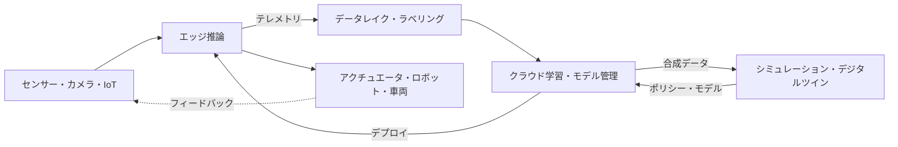

> 文書基準: 2026年9月 | この文書は変化の速い領域であり、四半期ごとのレビュー対象です。

## Physical AIとは

Physical AI(フィジカルAI)とは、テキストや画像といったデジタルデータにとどまっていたAIを、**センサー・ロボット・車両・設備など物理世界と接続**し、知覚し・判断し・物理的に行動させる流れを指します。チャットボットや文書処理のようなデジタルAIと異なり、Physical AIは**遅延(latency)・安全(safety)・リアルタイム性**の失敗が人や設備に直接的なリスクとなり得る点が根本的に異なります。

Physical AIは単一の製品ではなく、複数の層が噛み合ったパイプラインです。データが物理世界から入り、保存・整備と学習・シミュレーションを経て、再び物理世界へ行動として出ていきます。

:::note
この文書群は**概念とベンダー中立の比較**に焦点を当てます。エッジ・ハイブリッドインフラの一般パターンは[ハイブリッド・エッジコンピューティング](../../../compute/hybrid-and-edge/)、自律実行の概念は[AIエージェント](../../../ai/agents/)、モデルカタログ・推論コストは[AIプラットフォームとモデル比較](../../../ai/ai-ml/)を参照してください。この領域は製品名・モデル名の変化が特に速いため、導入前に各ベンダー公式ドキュメントで再確認が必要です。
:::

## この文書群の構成

Physical AIはパイプライン全体が長いため、データ・学習層とデプロイ・運用層に分けて扱います。

- **[データと学習](../data-and-training/)** — レイヤー1(エッジ推論・IoT・ハードウェア・センサーデータパイプライン)とレイヤー2(デジタルツイン・シミュレーション・公開データセット・Sim-to-Real)、および規模に見合う学習インフラの選択。
- **[デプロイと運用](../deploy-and-operate/)** — レイヤー3(ロボティクス基盤モデル・エージェント接続)、安全レイヤー、マルチクラウド・エッジアーキテクチャ、閉ループ運用とフリートデプロイ。

## まだ解かれていない問題

Physical AIは活発な研究段階にあり、導入判断には「いま何ができるか」と同じくらい**「いま何ができないか」** が重要です。残された難題は概ね次の5つの筋に整理できます。ベンダーのデモや提案書を見る際、どのマスを実際に前進させたのかを問うグリッドとして使えます。

| 筋 | 中心的な問い | 現在の限界 |
| --- | --- | --- |
| 行動表現 | 行動をどのような形で表現すれば、よく学習でき、よく移せるのか | 表現方式ごとに精度・一般化・速度のトレードオフが異なり、正解が定まっていない |
| 実行 | 遅い理解・計画と速いリアルタイム制御の周期差をどう埋めるのか | 大きなモデルはオンデバイスのリアルタイム実行が難しく、クラウドへ出すと遅延・断絶の問題が生じる |
| 一般化 | あるロボット・ある環境で学んだことを、別の身体・新しい物体・新しい場面へどれだけ移せるのか | Sim-to-Real Gapとcross-embodiment転移が未解決 |
| 安全 | 物理的な力を扱う機械が危険なく行動すると、どう保証するのか | 失敗がそのまま物理的被害となる。モデル性能とは別の独立課題 |
| データ・評価 | データをどう十分に集め、モデルをどう公平に比較するのか | 収集コストが高く、成功率の測定・ベンチマークがまだ標準化の途上 |

:::note
この5つは相互に絡み合っています。例えば評価が正直でなければ安全を語れず、一般化ができなければデータ収集コストが作業ごとに繰り返されます。導入計画を立てる際は、**対象作業がこのグリッドのどのマスに依存するか**を先に確認するほうが安全です。
:::

## 関連文書

- [データと学習](../data-and-training/) — エッジ・データパイプライン・シミュレーション・学習インフラ
- [デプロイと運用](../deploy-and-operate/) — ロボティクス基盤モデル・安全・アーキテクチャ・フリートデプロイ
- [ハイブリッド・エッジコンピューティング](../../../compute/hybrid-and-edge/) — エッジインフラの一般パターン
- [AIエージェント](../../../ai/agents/) — 自律計画・実行の概念
- [GPUインフラ](../../gpu-infra/workload-and-architecture/) — クラウド学習・シミュレーション用GPUクラスタ
- [AIプラットフォームとモデル比較](../../../ai/ai-ml/) — モデルカタログ・推論コスト

## 参考リンク

### クロスベンダー

- [NVIDIA Isaac GR00T (開発者ページ)](https://developer.nvidia.com/isaac/gr00t)
- [NVIDIA Omniverse](https://www.nvidia.com/en-us/omniverse/)
- [NVIDIA Jetsonモジュールラインナップ](https://developer.nvidia.com/embedded/jetson-modules)
