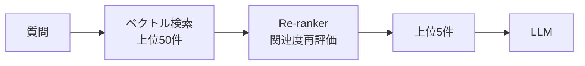

> 文書基準: 2026年8月 | 本文書は変化の速い領域であり、四半期ごとのレビュー対象です。

:::note
RAGの基礎は[AI入門](../../ai/getting-started/)のRAGセクションと[ベクトルストアとエンベディング](../../ai/vector-store/)を先にお読みください。
:::

## 基本的なRAGの限界

単純に「文書 → エンベディング → 検索 → LLMに渡す」だけでは、実務レベルの品質を満たすことは困難です。AzureとAWSの公式ガイドが共通して指摘する問題:

- **チャンキング(Chunking)を誤ると、文脈が途切れて検索品質が低下します。**
- **検索された文書のうち本当に関連性の高いものを上位に上げるRe-rankingがなければ、LLMが見当違いの文脈を参照します。**
- **ユーザーの質問が曖昧な場合、ベクトル検索だけでは答えを見つけるのが困難です。**(例: 代名詞、省略語)

出典:
- [Azure — Develop a RAG Solution: Chunking Phase](https://learn.microsoft.com/azure/architecture/ai-ml/guide/rag/rag-chunking-phase)
- [AWS — Writing best practices to optimize RAG applications](https://docs.aws.amazon.com/prescriptive-guidance/latest/writing-best-practices-rag/introduction.html)

## チャンキング戦略

文書をどれくらい、どのように分割するかが検索品質を左右します。

### 主なチャンキング方式

| 方式 | 説明 | 適した文書タイプ |
| --- | --- | --- |
| **Fixed-size** | 固定サイズ(例: 512トークン)で単純分割 | 一般的なテキスト、ブログ |
| **Sentence-based** | 文単位で分割 | 自然言語文書 |
| **Recursive** | 段落 → 文 → 単語の順で階層的に分割 | 構造化された文書 |
| **Semantic** | 意味が近い文をまとめて分割 | 長い説明文 |
| **Document-structure** | 見出し、セクションベースの分割 | マニュアル、Wiki、技術文書 |

Azureの公式ガイドは、`Fixed-size` → `Recursive` → `Document-structure` の順に難易度を上げながら試すことを推奨しています([Chunking Phaseドキュメント](https://learn.microsoft.com/azure/architecture/ai-ml/guide/rag/rag-chunking-phase))。

### チャンクサイズガイド

- **小さすぎると** — 文脈が不足し、検索された断片が意味を失う
- **大きすぎると** — 1つのチャンクに複数のトピックが混在し検索精度が低下、LLMのトークン消費が増加

一般的な出発点(Azureガイド):
- チャンクサイズ: **500～1500トークン**
- 重複(Overlap): チャンク間で10～20%重ねることで文脈の欠落を防止

:::note
チャンクサイズは一度決めたら終わりではありません。代表的な質問で検索品質を測定し、調整を繰り返す作業が必要です。
:::

### ベンダー提供のチャンキングオプション

| ベンダー | 対応方式 | 参考 |
| --- | --- | --- |
| AWS Bedrock Knowledge Bases | 基本、固定サイズ、階層的(Hierarchical)、セマンティック(Semantic)チャンキング | [Knowledge Basesチャンキングオプション](https://docs.aws.amazon.com/bedrock/latest/userguide/kb-chunking-parsing.html) |
| Azure AI Search (Foundry IQ) | 統合ベクトル化時の自動チャンキング、ユーザー定義可能 | [Azure AI Searchチャンキング](https://learn.microsoft.com/azure/search/vector-search-how-to-chunk-documents) |
| Vertex AI RAG Engine | チャンクサイズ/重複の設定、RagManagedDbで自動管理 | [RAG Engineドキュメント](https://docs.cloud.google.com/gemini-enterprise-agent-platform/build/rag-engine/rag-overview) |

### マネージドRAGパイプライン

チャンキング、エンベディング、検索、リランキングを自前で構築する代わりに、**マネージドサービス**にパイプライン全体を委ねることができます。

| ベンダー | サービス | 特徴 |
| --- | --- | --- |
| AWS | [Amazon Bedrock Managed Knowledge Base](https://aws.amazon.com/bedrock/knowledge-bases/) | **2026年6月GA**。6つのネイティブデータコネクタ(S3、SharePoint、Confluence、Web Crawler、Google Drive、OneDrive)、**Smart Parsing**(マルチフォーマット自動パース)、**Agentic Retriever**(複雑なマルチステップクエリをエージェントが分解・検索)、マネージドベクトルストア。AgentCore Gateway MCP統合 |
| Azure | [Azure AI Search (Foundry IQ)](https://learn.microsoft.com/azure/search/) | 統合ベクトル化、セマンティックランカー内蔵、カスタムスキルパイプライン。Microsoft Foundryポータルのマネージドナレッジレイヤーとしても利用可能 |
| Google Cloud | [RAG Engine (Gemini Enterprise Agent Platform)](https://docs.cloud.google.com/gemini-enterprise-agent-platform/build/rag-engine/rag-overview) | ソース接続 → エンベディング → 検索を統合管理。**Cross Corpus Retrieval**(複数RAGコーパスの同時検索、プレビュー)。RagManagedDbでインフラ自動管理 |

:::note
マネージドRAGは迅速なプロトタイピングに適していますが、チャンキングロジックや検索アルゴリズムを細かく調整する必要がある場合は、自前構築の方が有利な場合があります。
:::

## Re-ranking

ベクトル検索は高速ですが、「本当に関連性の高い順」に並べ替えることはできません。**Re-ranking** は検索結果の上位N件を別のモデルで再ランキングし、精度を高めます。

### ベンダー別Re-rankingサービス

| ベンダー | サービス | 参考 |
| --- | --- | --- |
| AWS | Bedrock Knowledge Bases Reranker(Amazon Rerank, Cohere Rerank) | [Rerankerガイド](https://docs.aws.amazon.com/bedrock/latest/userguide/kb-reranker.html) |
| Azure | Azure AI Search Semantic Ranker | [Semantic Ranker](https://learn.microsoft.com/azure/search/semantic-search-overview) |
| Google Cloud | Vertex AI Ranking API | [Ranking API](https://cloud.google.com/generative-ai-app-builder/docs/ranking) |
| OCI | Cohere Rerank(OCI Enterprise AI) | [OCI Enterprise AIモデル](https://docs.oracle.com/en-us/iaas/Content/generative-ai/pretrained-models.htm) |

## ハイブリッド検索

ベクトル検索だけでは、製品コード(`SKU-12345`)、固有名詞、正確な文字列マッチングに弱いという課題があります。**ハイブリッド検索** は、ベクトル検索と従来のキーワード検索(BM25)を組み合わせます。

| ベンダー | ハイブリッド対応方式 | 参考 |
| --- | --- | --- |
| AWS | OpenSearch Vector + BM25(RRFアルゴリズム) | [Hybrid Search](https://docs.aws.amazon.com/opensearch-service/latest/developerguide/knn-retrieval.html) |
| Azure | Azure AI Searchハイブリッドクエリ | [Hybrid Search](https://learn.microsoft.com/azure/search/hybrid-search-overview) |
| Google Cloud | Vertex AI Search(自動ハイブリッド) | [Vertex AI Search](https://cloud.google.com/enterprise-search) |
| OCI | OCI AI Vector SearchでSQLにより組み合わせ | [OCI AI Vector Search](https://docs.oracle.com/en-us/iaas/autonomous-database-serverless/doc/oracle-ai-vector-search-autonomous-database.html) |

## クエリ拡張と変換

ユーザーの質問が短い、または曖昧な場合に、LLMで質問を書き換えたり拡張したりします。

- **Query Rewriting** — 代名詞/省略語を明示的に展開する(例: 「それ」→「前回の会議で議論したポリシーX」)
- **Multi-Query** — 1つの質問を複数のバージョンに生成し、それぞれ検索
- **HyDE(Hypothetical Document Embeddings)** — LLMが仮の回答を生成した後、その回答をエンベディングして検索

公式ガイド:
- [Azure — Enrichment Phase of RAG](https://learn.microsoft.com/azure/architecture/ai-ml/guide/rag/rag-enrichment-phase)
- [AWS — RAG最適化ガイド](https://docs.aws.amazon.com/prescriptive-guidance/latest/writing-best-practices-rag/introduction.html)

## 評価

RAGシステムは単に「答えが出る」だけでなく、**検索品質**と**応答品質**を分離して測定する必要があります。

### 検索品質指標

| 指標 | 意味 |
| --- | --- |
| **Recall@K** | 上位K件の結果のうち正解文書を含む割合 |
| **MRR**(Mean Reciprocal Rank) | 正解文書の平均順位の逆数 |
| **NDCG**(Normalized Discounted Cumulative Gain) | 上位の結果ほど重みを与えるランキング品質 |

### 応答品質指標

| 指標 | 意味 |
| --- | --- |
| **Faithfulness** | 生成された回答が検索された文書に基づいているか |
| **Answer Relevance** | 回答が質問に実際に答えているか |
| **Context Precision / Recall** | 検索された文脈がどれだけ正確かつ十分か |

### 評価ツール

| ツール | 説明 | 参考 |
| --- | --- | --- |
| **RAGAS** | オープンソースのRAG評価フレームワーク | [RAGAS](https://github.com/explodinggradients/ragas) |
| **Azure AI Evaluation SDK** | Faithfulness、Relevanceなどの組み込みメトリクス | [Evaluation SDK](https://learn.microsoft.com/azure/ai-studio/how-to/develop/evaluate-sdk) |
| **Amazon Bedrock Evaluations** | モデル/RAG評価の統合 | [Bedrock Evaluations](https://docs.aws.amazon.com/bedrock/latest/userguide/model-evaluation.html) |
| **Vertex AI Evaluation Service** | Gen AI評価フレームワーク | [Vertex AI Eval](https://cloud.google.com/vertex-ai/generative-ai/docs/models/evaluation-overview) |

## よくある間違い

- **チャンクサイズを一度決めたきり調整しない** — 代表的な質問で検索品質を測定しないため、文脈が途切れたり複数のトピックが混在したチャンクが返される
- **Re-rankingなしでベクトル検索結果をそのままLLMに渡す** — 上位結果に無関係な文書が混在し、幻覚(Hallucination)が発生
- **ハイブリッド検索を検討しない** — 製品コード、固有名詞など正確な文字列マッチングが必要な場合、ベクトル検索だけでは見つけられない

## チェックリスト

- [ ] チャンクサイズと重複(Overlap)を代表的な質問で検索品質を測定しながら調整したか
- [ ] Re-ranking(Semantic Ranker、Cohere Rerankなど)を適用して検索結果の精度を高めたか
- [ ] Faithfulness、Answer RelevanceなどのRAG評価指標を定期的に測定しているか

## 参考資料

### AWS

- [AWS Prescriptive Guidance: RAG options and architectures](https://docs.aws.amazon.com/prescriptive-guidance/latest/retrieval-augmented-generation-options/introduction.html)
- [Writing best practices to optimize RAG applications](https://docs.aws.amazon.com/prescriptive-guidance/latest/writing-best-practices-rag/introduction.html)
- [Bedrock Knowledge Basesチャンキングオプション](https://docs.aws.amazon.com/bedrock/latest/userguide/kb-chunking-parsing.html)
- [Bedrock Knowledge Bases Reranker](https://docs.aws.amazon.com/bedrock/latest/userguide/kb-reranker.html)

### Azure

- [Azure Architecture Center: Design and Develop a RAG Solution](https://learn.microsoft.com/azure/architecture/ai-ml/guide/rag/rag-solution-design-and-evaluation-guide)
- [RAG Chunking Phase](https://learn.microsoft.com/azure/architecture/ai-ml/guide/rag/rag-chunking-phase)
- [Azure AI Search Hybrid Search](https://learn.microsoft.com/azure/search/hybrid-search-overview)
- [Azure AI Search Semantic Ranker](https://learn.microsoft.com/azure/search/semantic-search-overview)

### Google Cloud

- [RAG Engine (Gemini Enterprise Agent Platform)](https://docs.cloud.google.com/gemini-enterprise-agent-platform/build/rag-engine/rag-overview)
- [Vertex AI Ranking API](https://cloud.google.com/generative-ai-app-builder/docs/ranking)
- [Vertex AI Evaluation Service](https://cloud.google.com/vertex-ai/generative-ai/docs/models/evaluation-overview)

### OCI

- [OCI AI Vector Search](https://docs.oracle.com/en-us/iaas/autonomous-database-serverless/doc/oracle-ai-vector-search-autonomous-database.html)
- [OCI Enterprise AIモデル](https://docs.oracle.com/en-us/iaas/Content/generative-ai/pretrained-models.htm)
