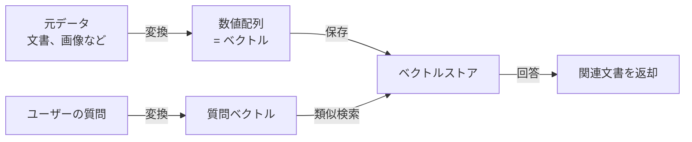

> 文書基準: 2026年8月

## 概要

:::note
**ベクトル・エンベディングが初めての方は** [AI入門](../../ai/getting-started/)のRAGセクションを先にお読みください。本文書(ベクトルストアの基礎)を読んだ後、チャンキング・リランキング・ハイブリッド検索などの高度な実装は[RAG高度パターン](../../ai/rag-patterns/)へと続きます。
:::

### こんな状況で役立ちます

- **社内文書ベースのチャットボット** — 「昨年の休暇ポリシーは何だったか?」に会社の文書を検索して答えさせる
- **製品FAQ自動応答** — 数百ページの製品マニュアルをもとに顧客問い合わせを処理
- **セマンティック検索** — 「安い宿」で検索した際に「コスパの良いホテル」「手頃な価格のペンション」も一緒に見つける
- **レコメンドシステム** — 似た商品・コンテンツ・ユーザーを自動でおすすめ

## ベクトルストアとは

### わかりやすく理解する

図書館の司書を思い浮かべてください。司書に「機械学習の本はありますか?」と尋ねると、タイトルに「機械学習」が入っていなくても似たテーマの本を探してくれます。「人工知能」「ディープラーニング」「AI基礎」といった本たちをです。

**ベクトルストアは、こうした司書の役割を果たすデータベース**です。文書の「意味」を記憶しておき、似た意味の文書を素早く見つけてくれます。

### 通常検索 vs ベクトル検索

| 方式 | 検索基準 | 例 |
| --- | --- | --- |
| **キーワード検索**(通常のDB) | 単語が完全一致 | 「安い宿」→「安い」が含まれる文書のみ |
| **ベクトル検索**(ベクトルストア) | 意味が類似 | 「安い宿」→「コスパの良いホテル」「お得なペンション」も検索 |

## 動作方式

3行要約:
1. 元データ(テキスト、画像)を**数値配列(ベクトル)** に変換します。この過程を**エンベディング**と呼びます。
2. ベクトルをベクトルストアに保存します。
3. 質問も同じ方式でベクトル化し、**最も似ているベクトル**を探して元データを返します。

:::note
「なぜ数値配列なのか?」と疑問に思うかもしれません。コンピュータが「似た意味」を計算するには、意味を数値化する必要があります。1つの単語を1536個の数値で表現すると、似た意味の単語は似た数値の組み合わせを持つようになります。
:::

## どんな選択肢があるか

ベクトルを保存する方法は大きく2つあります。

### 1. 専用ベクトルストア

ベクトル検索に特化した製品です。大規模・高性能が必要な場合に使用します。

| ベンダー | 製品 | 特徴 |
| --- | --- | --- |
| AWS | [OpenSearch Serverless ベクトルエンジン](https://docs.aws.amazon.com/opensearch-service/latest/developerguide/serverless-vector-search.html) | 大規模ベクトル検索 |
| AWS | [S3 Vectors (Preview)](https://docs.aws.amazon.com/AmazonS3/latest/userguide/s3-vectors.html) | S3の耐久性 + 低コスト |
| Azure | [Azure AI Search](https://learn.microsoft.com/azure/search/vector-search-overview) | ベクトル + キーワード + セマンティックランキング統合 |
| Google Cloud | [Vertex AI Vector Search](https://cloud.google.com/vertex-ai/docs/vector-search/overview) | Google ScaNNアルゴリズムによる高性能 |
| OCI | [OCI AI Vector Search](https://docs.oracle.com/en-us/iaas/autonomous-database-serverless/doc/oracle-ai-vector-search-autonomous-database.html) | Autonomous Database内蔵、SQLベース |

### 2. 既存DBのベクトル拡張

既に使用しているDBにベクトル機能を追加する方式です。別途インフラなしで始められます。

| ベンダー | 製品 | 特徴 |
| --- | --- | --- |
| AWS | [Aurora PostgreSQL (pgvector)](https://aws.amazon.com/about-aws/whats-new/2023/07/amazon-aurora-postgresql-pgvector-vector-storage-similarity-search/) | リレーショナル + ベクトルを1つのDBで |
| AWS | [ElastiCache for Valkey](https://aws.amazon.com/elasticache/what-is-valkey/) | インメモリベクトル、超低遅延 |
| Azure | [Cosmos DB ベクトル検索](https://learn.microsoft.com/azure/cosmos-db/vector-search) | グローバル分散 + ベクトル |
| Google Cloud | [AlloyDB(ベクトル検索)](https://cloud.google.com/alloydb/docs/ai) | PostgreSQL互換 + 高性能 |
| Google Cloud | [Cloud SQL (pgvector)](https://cloud.google.com/sql/docs/postgres/extensions#pgvector) | 簡単に始められる |

### 3. RAG自動パイプライン

複雑な設定なしに「文書をアップロードすれば自動でベクトル化」してくれるマネージドサービスです。

| ベンダー | 製品 | 特徴 |
| --- | --- | --- |
| AWS | [Bedrock Knowledge Bases](https://docs.aws.amazon.com/bedrock/latest/userguide/knowledge-base.html) | 文書 → エンベディング → 保存 → RAGを自動化 |
| Azure | [Azure AI Search + OpenAI "On Your Data"](https://learn.microsoft.com/azure/ai-services/openai/concepts/use-your-data) | 最速のRAG構成 |
| Google Cloud | [Vertex AI RAG Engine](https://cloud.google.com/vertex-ai/generative-ai/docs/rag-overview) | 文書 → エンベディング → 検索を統合 |
| OCI | [OCI Enterprise AI Agents](https://www.oracle.com/artificial-intelligence/generative-ai/agents/) | OCI Search連携RAG |

## いつ何を選ぶか

| 状況 | 推奨される選択 |
| --- | --- |
| 初めて導入し、設定なしで素早く | RAG自動パイプライン(Bedrock Knowledge Basesなど) |
| 既にPostgreSQLを使用している | 既存DBのベクトル拡張(pgvector) |
| ベクトルが数百万件以上、性能が重要 | 専用ベクトルストア(OpenSearch、Vertex AI Vector Search) |
| Oracle DBを使用している | OCI AI Vector Search |
| 超低遅延が必要(リアルタイムレコメンドなど) | Valkeyベースのインメモリ |

:::note
**最初はシンプルに始めましょう。** ほとんどの業務はRAG自動パイプラインやpgvectorで十分です。専用ベクトルストアは数百万ベクトル以上の規模で必要になります。
:::

## 発展編: アルゴリズムと性能

ベクトルストアの性能を深く理解したり、チューニングが必要な際に知っておくとよい内容です。

### ANNアルゴリズム

数百万のベクトルの中から「最も近いもの」を正確に見つけるには、すべてのベクトルと比較する必要があり低速です。これを解決するために**ANN**(近似最近傍探索、Approximate Nearest Neighbor)アルゴリズムを使用します。精度をわずかに犠牲にして速度を大きく得る方式です。

| アルゴリズム | 特徴 | 主な使用先 |
| --- | --- | --- |
| **HNSW** | グラフベース。精度/速度のバランスが良い | pgvector, OpenSearch, Azure AI Search |
| **IVF** | クラスタベース。メモリ効率が良い | pgvector, FAISS |
| **IVFPQ** | IVF + ベクトル圧縮でメモリ削減 | Neptune Analytics, FAISS |
| **ScaNN** | Google開発。TPU最適化 | Vertex AI Vector Search |

### エンベディングの次元と保存容量

エンベディングモデルが生成するベクトルのサイズ(次元数)が、保存容量と検索速度を決定します。

簡単な計算: 1,000,000件 × 1536次元 × 4バイト = **約6GB**

| ベンダー | モデル | 次元 | 特徴 |
| --- | --- | --- | --- |
| AWS | Titan Embeddings V2 | 256–1024 | 可変次元、Bedrockネイティブ |
| Azure | text-embedding-3-large | 256–3072 | OpenAI、可変次元 |
| Google | Gemini Embedding 2 | 768 | Vertex AIネイティブ |
| Cohere | Embed 4 | 1024 | マルチモーダル、多言語、OCI/Bedrock |
| オープンソース | BGE-M3, E5など | 768–1024 | セルフホスティング可能 |

**選定基準:** 韓国語性能が重要であれば多言語モデル(Cohere、BGE-M3)、コスト優先なら低次元、精度優先なら高次元。モデル変更時は全ベクトルの再インデックスが必要です。

### ハイブリッド検索

ベクトル検索は意味に強い一方、製品コード(`SKU-12345`)のような**正確な文字列**には弱いです。**ハイブリッド検索**は、ベクトル検索 + 従来のキーワード検索(BM25)を組み合わせて精度を高めます。

:::note
ハイブリッド検索のベンダー別サポート方式、実装パターン、RRFアルゴリズムなどの詳細は[RAG高度なパターン](../../ai/rag-patterns/)を参照してください。
:::

## よくある間違い

- **最初から専用ベクトルストアを導入** — 数万件規模ではpgvectorやRAG自動パイプラインで十分なのに、過剰なインフラを構築してコストを浪費
- **エンベディングモデルを変更したのに既存ベクトルを再生成しない** — モデルが変わるとベクトル空間が変わるため、全体の再インデックスが必須
- **メタデータフィルタリングを設計しない** — 権限ベースの文書フィルタリングやカテゴリフィルタなしに全ベクトルを検索し、不要な結果を返す

## チェックリスト

- [ ] データ規模と性能要件に合ったベクトルストアの種類(RAG自動パイプライン / DB拡張 / 専用)を選択したか
- [ ] エンベディングモデル変更時に全ベクトル再生成パイプラインを用意したか
- [ ] メタデータ(権限、カテゴリ、日付)をベクトルと共に保存し、フィルタリング検索が可能か

## 参考資料

### AWS

- [S3 Vectorsドキュメント](https://docs.aws.amazon.com/AmazonS3/latest/userguide/s3-vectors.html)
- [Bedrock Knowledge Basesドキュメント](https://docs.aws.amazon.com/ko_kr/bedrock/latest/userguide/knowledge-base.html)
- [OpenSearch ベクトル検索](https://docs.aws.amazon.com/ko_kr/opensearch-service/latest/developerguide/knn.html)

### Azure

- [Azure AI Search ベクトル検索](https://learn.microsoft.com/ko-kr/azure/search/vector-search-overview)
- [Microsoft Foundry On Your Data](https://learn.microsoft.com/ko-kr/azure/ai-services/openai/concepts/use-your-data)

### Google Cloud

- [Vertex AI Vector Searchドキュメント](https://cloud.google.com/vertex-ai/docs/vector-search/overview)
- [AlloyDB AIドキュメント](https://cloud.google.com/alloydb/docs/ai)

### OCI

- [OCI AI Vector Searchドキュメント](https://docs.oracle.com/en-us/iaas/autonomous-database-serverless/doc/oracle-ai-vector-search-autonomous-database.html)
