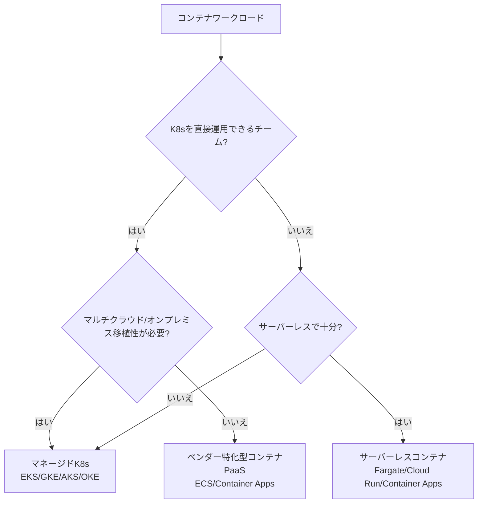

> 文書基準: 2026年8月

## 概要

VMは柔軟ですが、一つのアプリを展開するためにOS全体を含む重いイメージを管理する必要があります。アプリが10個あればVMも10個、OSパッチも10回です。環境間の「自分のPCでは動くのにサーバーでは動かない」問題も頻繁に発生します。

**コンテナ**は、アプリとその依存関係だけを軽量にパッケージ化し、どこでも同一に実行できるようにします。VMより軽く、起動が速く、環境差異の問題を解決します。

:::note
EKSをご存知の方向け: AzureはAKS、Google CloudはGKE、OCIはOKEです。
:::

コンテナが数十～数百個に増えると、これを管理するオーケストレーションが必要になります。自分でKubernetesをインストールして運用することもできますが、クラウドベンダーの**マネージドサービス**を使えば、コントロールプレーンの管理、アップグレード、セキュリティパッチをベンダーが担当します。ユーザーはアプリの展開だけに集中できます。

## 製品比較

### マネージドKubernetes

| ベンダー | 製品 | 備考 |
| --- | --- | --- |
| AWS | EKS (Elastic Kubernetes Service) | コントロールプレーン有料。K8s 1.36対応 (2026.06) |
| Azure | AKS (Azure Kubernetes Service) | コントロールプレーン無料 |
| Google Cloud | GKE (Google Kubernetes Engine) | Autopilotモード: ノード管理不要、Pod単位課金。Rapid: K8s 1.36 |
| OCI | OKE (Oracle Kubernetes Engine) | コントロールプレーン無料。Virtual Nodesでサーバーレス運用が可能 |

### サーバーレス/簡易コンテナ実行

サーバー(ノード)を直接管理せずにコンテナを実行するサービスです。AWS Fargate、Azure Container Apps、Google Cloud Cloud Run、OCI Container Instancesなどがあり、各製品の詳細比較は[サーバーレス](../../compute/serverless/#サーバーレスコンテナ)文書を参照してください。

| ベンダー | 代表製品 |
| --- | --- |
| AWS | Fargate · ECS · App Runner |
| Azure | Container Apps · Container Instances (ACI) |
| Google Cloud | Cloud Run |
| OCI | OCI Container Instances |

### コンテナレジストリ

| ベンダー | 製品 | 備考 |
| --- | --- | --- |
| AWS | ECR (Elastic Container Registry) | |
| Azure | ACR (Azure Container Registry) | |
| Google Cloud | Artifact Registry | コンテナ以外のパッケージもサポート |
| OCI | OCI Container Registry (OCIR) | |

## 主な違い

- **AWS** — ECS(独自オーケストレーター)とEKS(Kubernetes)の2つの選択肢を提供します。ECS service auto scalingは高解像度(20秒)メトリクスをサポートし、従来比でスケールアウトのトリガーが約4倍速くなりました(363秒→86秒)。
- **Azure** — Container AppsによりK8sを知らなくてもコンテナを運用できます。
- **Google Cloud** — Cloud Runにより最もシンプルにコンテナをサーバーレス環境で実行できます。
- **OCI** — OKEのコントロールプレーンが無料であり、Virtual Nodesによりサーバーレス Kubernetes運用が可能です。

## 決定木

## いつ何を選ぶべきか

| 状況 | 推奨 |
| --- | --- |
| Kubernetesなしでシンプルにコンテナを運用したいとき | AWS ECSまたはAzure Container Apps |
| 既存のコンテナアプリをコード変更なしでサーバーレスとして実行したいとき | Google Cloud Cloud Run |
| Kubernetesが必要だがコントロールプレーンのコストを節約したいとき | Azure AKSまたはOCI OKE (コントロールプレーン無料) |
| ノード管理なしでPod単位のみで課金されたいとき | GKE AutopilotまたはAWS Fargate |
| サーバーレスKubernetesを希望するとき | OCI OKE Virtual Nodes |
| ソースコードから直接デプロイしたいとき | AWS App Runner |

## Kubernetesコントロールプレーン vs データプレーン

マネージドKubernetesは2つの層で構成されます。

| 層 | 担当 | 管理主体 |
| --- | --- | --- |
| **コントロールプレーン** | APIサーバー、etcd、スケジューラー、コントローラーマネージャー | ベンダーが管理 |
| **データプレーン** | ワーカーノード(VM)、kubelet、コンテナランタイム | ユーザーが管理 (またはサーバーレスノードに委任) |

### コントロールプレーンのコスト

| ベンダー | コントロールプレーンコスト | 備考 |
| --- | --- | --- |
| AWS EKS | 有料 (クラスターごとの時間課金) | [EKS料金](https://aws.amazon.com/eks/pricing/) |
| Azure AKS | 無料 | Uptime SLA有効化時は有料 |
| Google Cloud GKE Standard | 有料 (クラスターごとの管理料金) | すべてのモードにクラスター管理料金。月次クレジットでzonal/Autopilot1つ相当を相殺可能。[GKE料金](https://cloud.google.com/kubernetes-engine/pricing) |
| Google Cloud GKE Autopilot | 有料 (クラスター管理料金+Podリクエストリソース課金) | ノードなし。無料枠クレジットで管理料金の一部を相殺可能。[GKE料金](https://cloud.google.com/kubernetes-engine/pricing) |
| OCI OKE | 無料 | Enhancedクラスターの場合は有料 |

## ノード管理戦略

データプレーンのノードを管理する方法によって運用負担が変わります。

| 戦略 | 説明 | メリット | デメリット |
| --- | --- | --- | --- |
| **セルフマネージドノード** | ユーザーがノードAMI、パッチ、スケーリングを直接管理 | 完全な制御 | 運用負担が大きい |
| **マネージドノードグループ** | ベンダーがノードのプロビジョニング/アップグレードを管理 (AWS Managed Node Groups、AKS Node Pools、GKE Node Pools) | 自動アップグレード、ローリングアップデート | 依然としてノード数の管理が必要 |
| **サーバーレスノード (Fargate/Virtual Nodes/Autopilot)** | ノードの概念自体がない。Pod単位で実行 | 運用負担が最小限 | Podごとのオーバーヘッドコスト、一部制約(hostNetwork、DaemonSetなど) |

### ノードプール構成

単一のワークロードタイプではなく、多様な要件(GPU、Spot、ストレージタイプ)に応じて複数のノードプールを構成します。

- **汎用ノードプール** — ほとんどのアプリケーション
- **GPUノードプール** — ML推論/学習Pod
- **Spot/Preemptibleノードプール** — バッチジョブ、CI
- **ARMノードプール** — コスト最適化 (Graviton、Cobalt、Ampere、Axion)

## コンテナランタイムの移行

Kubernetes 1.24でDockershimが削除されて以降、**containerd**が事実上の標準ランタイムです。2025年8月のcontainerd 1.6 EOLを機に**containerd 2.x**への移行が本格化しました。

### containerd 2.xの主な変更点

| 変更 | 影響 | 対応 |
| --- | --- | --- |
| Docker Image Manifest Schema 1のデフォルト無効化 (2.0)、完全削除 (2.1) | 非常に古いイメージ(2017年以前のビルド)がPullに失敗。containerd 2.0は環境変数で再有効化できるが2.1で削除。マネージドK8sのノードイメージはベンダー・バージョンによって再有効化が制限される場合あり | `docker manifest inspect`でSchemaバージョンを確認。Schema 2またはOCIイメージで再ビルド。ベンダーのノードOS/ランタイムのリリースノートを確認 |
| CRIプラグイン設定構造の変更 | 既存の`containerd config.toml`との互換性がない可能性 | ノードアップグレード前に設定移行を検証 |
| 新しいサンドボックス(sandbox) API | Pod分離の強化 | マネージドK8s使用時はベンダーが処理 |

### ベンダー別ランタイムの現状

| ベンダー | デフォルトランタイム | 備考 |
| --- | --- | --- |
| AWS EKS | containerd | AMI自動更新でcontainerd 2.xへ移行 |
| Azure AKS | containerd (Azure Linux 3.0) | AKS 1.32+からAzure Linux 3.0がデフォルト。Azure Linux 2.0は2025.11 EOL |
| Google Cloud GKE | containerd | COS(Container-Optimized OS)自動管理 |
| OCI OKE | containerd (Oracle Linux 8/9) | ノードプールOSイメージのアップグレードで移行 |

:::caution
**Docker Schema 1イメージを使用している場合**、containerd 2.xでPullが失敗します。レジストリで`mediaType: "application/vnd.docker.distribution.manifest.v1+json"`イメージを検索し再ビルドしてください。
:::

## Kubernetes本番運用準備チェックリスト

- [ ] ノードをマルチAZに分散配置したか
- [ ] Podにリソースリクエスト(requests)と制限(limits)を設定したか
- [ ] Liveness/Readiness Probeを設定したか
- [ ] Horizontal Pod Autoscalerを構成したか
- [ ] Network PolicyでPod間通信を制限したか
- [ ] Workload IdentityでクラウドIAMと連携したか (Service Account Key未使用)
- [ ] イメージをプライベートレジストリからのみPullするよう制限したか
- [ ] ログ/メトリクス/トレースの収集を構成したか
- [ ] etcd/PVバックアップ戦略を策定したか (Veleroなど)
- [ ] クラスターアップグレード戦略を決定したか
- [ ] containerd 2.x互換性を確認したか (Docker Schema 1イメージ非対応)

:::note
Day-2運用の詳細は[Kubernetes運用](../../devops/kubernetes-operations/)を参照してください。
:::

## よくある間違い

- **K8sなしで済むものをK8sで** — シンプルなWebアプリや小規模サービスにKubernetesを導入すると運用の複雑さだけが増します。ECS、Cloud Run、Container Appsで十分かをまず検討してください。
- **リソース制限の未設定** — Podにrequests/limitsを設定しないと、一つのPodがノード全体のリソースを占有し、他のPodがOOMKillされたりスケジューリングに失敗したりします。
- **latestタグの使用** — イメージタグを`latest`にすると、どのバージョンがデプロイされたか追跡できず、ロールバックもできません。

## チェックリスト

- [ ] すべてのPodにリソースrequests/limitsを設定したか
- [ ] コンテナイメージタグをSHAまたはセマンティックバージョンで固定したか
- [ ] Liveness/Readiness Probe(ヘルスチェック)を設定したか
- [ ] ネームスペースを環境/チーム別に分離したか

## 関連ドキュメント

- [CI/CD](../../devops/cicd/)
- [IaC](../../devops/iac/)
- [サーバーレス](../../compute/serverless/)

## 参考資料

### AWS

- [Amazon EKS 文書](https://docs.aws.amazon.com/ko_kr/eks/)
- [Amazon ECS 文書](https://docs.aws.amazon.com/ko_kr/ecs/)
- [AWS Fargate 文書](https://docs.aws.amazon.com/ko_kr/AmazonECS/latest/userguide/AWS_Fargate.html)

### Azure

- [AKS 文書](https://learn.microsoft.com/ko-kr/azure/aks/)
- [Container Apps 文書](https://learn.microsoft.com/ko-kr/azure/container-apps/)
- [Container Instances 文書](https://learn.microsoft.com/ko-kr/azure/container-instances/)

### Google Cloud

- [Google Kubernetes Engine 文書](https://cloud.google.com/kubernetes-engine/docs)
- [Google Cloud Run 文書](https://cloud.google.com/run/docs)
- [Google Artifact Registry 文書](https://cloud.google.com/artifact-registry/docs)

### OCI

- [OKE (Oracle Kubernetes Engine) 文書](https://docs.oracle.com/en-us/iaas/Content/ContEng/home.htm)
- [OCI Container Instances 文書](https://docs.oracle.com/en-us/iaas/Content/container-instances/home.htm)
- [OCI Container Registry 文書](https://docs.oracle.com/en-us/iaas/Content/Registry/home.htm)
