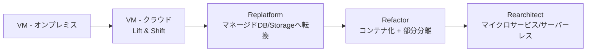
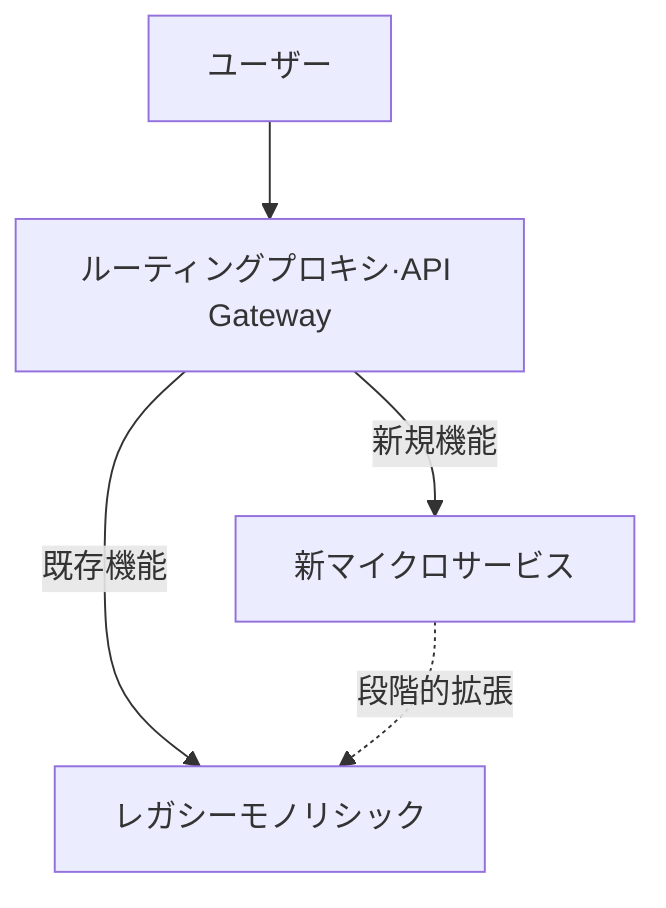
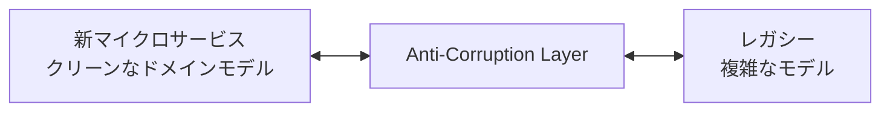

> 文書基準: 2026年5月

## モダナイゼーションとは

**モダナイゼーション** (Modernization)は、既存アプリケーションをクラウド環境に合わせて再構成し、拡張性、デプロイ速度、運用効率を改善する作業です。新しい機能を追加することではなく、既存ワークロードをクラウドのベストプラクティスに合わせて整えることが核心です。

:::note
各ベンダーはモダナイゼーションフレームワークを提供しています: [AWS Migration Hub](https://docs.aws.amazon.com/migrationhub/)、[Azure CAF Modernize](https://learn.microsoft.com/azure/cloud-adoption-framework/modernize/)、[Google Cloud Application Modernization](https://cloud.google.com/solutions/application-modernization)。
:::

### マイグレーションとの違い

| 区分 | マイグレーション | モダナイゼーション |
| --- | --- | --- |
| **目的** | クラウドへの移動 | クラウドネイティブの利点の活用 |
| **範囲** | インフラの置き換え | アーキテクチャ/運用方式の改善 |
| **時期** | 移行中 | 移行後または同時 |
| **代表的な活動** | Lift & Shift | Replatform、Refactor、Rearchitect |

:::note
マイグレーション戦略(7R)は[アプリケーションマイグレーション](../../compute/migration/)を参考にしてください。
:::

## なぜモダナイゼーションが必要か

単純なLift & Shiftだけではクラウドの利点を十分に得られません。VMベースのみで運用すると:

- **拡張性** — オートスケーリングは可能ですが、VMの起動に数分かかります。
- **デプロイ速度** — デプロイ周期が遅く、ロールバックが複雑です。
- **運用負担** — OSパッチ、セキュリティ、モニタリングを自ら管理する必要があります。
- **コスト** — マネージド/サーバーレスに比べて非効率です。

Google Cloudの公式ガイドはモダナイゼーションを次のように説明しています。

*「レガシーアプリケーションの限界を脱し、拡張可能で、復元力があり、柔軟なシステムへ転換する段階的な旅」* — [Google Cloud Architecture](https://cloud.google.com/architecture/modernization-path-dotnet-applications-google-cloud)

## よくある失敗事例

複数のベンダーガイドが共通して言及する失敗パターン:

- **システム全体の同時書き換え** — リスクが大きく、スケジュールが崩れます。Strangler Figパターンで段階的に移行してください。
- **ビジネス価値が低い過度な分解** — 変更がほとんどないレガシーをマイクロサービスに分割することは、運用コストの増加にしかつながりません。
- **モノリシックでの状態保持問題の放置** — コンテナに移しても、セッションがインスタンスに紐づいていればオートスケーリングが機能しません。
- **可観測性の不備** — 分散システムでは障害原因の特定が難しくなります。分散トレーシング/ログ集約を先に構築してください。
- **組織構造変化の欠如** — Conway's Law: システム構造は組織構造に従います。技術だけを変えてチーム構造を維持すると、モダナイゼーションが定着しません。

## モダナイゼーション戦略

Microsoft Cloud Adoption Frameworkが提示する3つの主要戦略:

| 戦略 | 説明 | 難易度 | 対象 |
| --- | --- | --- | --- |
| **Replatform** (リプラットフォーム) | エンジンは維持しつつマネージドサービスへ転換。軽微な最適化 | 中 | DBをRDSへ、VMをApp Service/Container Appsへ |
| **Refactor** (リファクタ) | アプリケーション構造を一部書き換え。サービス分解の開始 | 中~高 | モノリシックから特定機能を分離 |
| **Rearchitect** (リアーキテクト) | アーキテクチャをゼロから再設計。マイクロサービス、サーバーレス | 高 | 拡張性/復元力の根本的な改善が必要 |

出典: [Azure CAF Modernization Strategies](https://learn.microsoft.com/azure/cloud-adoption-framework/modernize/modernization-cloud-replatform-refactor-rearchitect)

### 段階的な移行経路

一般的には次のような順序で進みます。

:::caution
すべてのワークロードがE段階まで進む必要はありません。**ビジネス価値**と**変更頻度**に応じて適切な地点を選んでください。変更がほとんどないレガシーはB段階で止めるのが現実的です。
:::

## 主要パターン

### Strangler Figパターン

Martin Fowlerが提示したパターンで、巨大なモノリシックアプリケーションを**一度に置き換えるのではなく段階的に新しいシステムへ置き換える**方式です。

**手順:**
1. レガシーの前段にルーティング層(API Gateway)を配置
2. 新機能をマイクロサービスとして開発し、プロキシがルーティング
3. 既存機能を1つずつマイクロサービスとして抽出
4. すべての機能が移行されたらレガシーを撤去

**利点:** リスク最小化、ビジネス中断なし
**欠点:** 移行期間中は二重システムを維持

出典:
- [AWS Prescriptive Guidance — Strangler Fig Pattern](https://docs.aws.amazon.com/prescriptive-guidance/latest/cloud-design-patterns/strangler-fig.html)
- [AWS — Decomposing monoliths: Strangler Fig](https://docs.aws.amazon.com/prescriptive-guidance/latest/modernization-decomposing-monoliths/strangler-fig.html)

### Anti-Corruption Layer

新マイクロサービスとレガシーシステムを分離する中間層です。レガシーの古いモデルが新サービスに影響を与えないよう遮断します。

### Sagaパターン

マイクロサービス環境で複数サービスにまたがるトランザクションを処理するパターンです。既存DBの分散トランザクションの代わりに**補償トランザクション(Compensating Transaction)** で一貫性を維持します。

出典: [AWS Prescriptive Guidance — Saga Pattern](https://docs.aws.amazon.com/prescriptive-guidance/latest/cloud-design-patterns/saga.html)

### Event-Driven Architecture

サービス間の直接呼び出しの代わりに**イベント**を介して非同期通信を行います。拡張性と疎結合(loose coupling)が得られます。

| 要素 | ベンダー別製品 |
| --- | --- |
| メッセージング | Amazon SQS/SNS/EventBridge、Azure Service Bus/Event Grid、Google Cloud Pub/Sub/Eventarc、OCI Events/Streaming |
| イベントストリーミング | Amazon MSK/Kinesis、Azure Event Hubs、Google Cloud Pub/Sub、OCI Streaming |

## 12-Factor App原則

[12-Factor App](https://12factor.net/ko/)はクラウドネイティブアプリケーションの設計原則です。モダナイゼーション時に各原則を点検してください。

| # | 原則 | 要点 |
| --- | --- | --- |
| 1 | コードベース | 1つのリポジトリ、複数のデプロイ |
| 2 | 依存関係 | 明示的に宣言し分離 |
| 3 | 設定 | 環境変数として分離 |
| 4 | バックエンドサービス | 接続されたリソースとして扱う |
| 5 | ビルド、リリース、実行 | 段階を分離 |
| 6 | プロセス | ステートレス(Stateless)で実行 |
| 7 | ポートバインディング | 自身のポートでサービスを提供 |
| 8 | 並行性 | プロセスモデルで拡張 |
| 9 | 廃棄可能性 | 高速な起動と正常な終了 |
| 10 | 開発/本番の一致 | 環境差異を最小化 |
| 11 | ログ | イベントストリームとして扱う |
| 12 | 管理プロセス | 一回限りの作業も同一コードベースで |

特に**6番(ステートレス)** がクラウドスケーリングの核心です。セッション、キャッシュ、ファイルを外部ストレージへ分離してこそ水平スケーリングが可能になります。

## ベンダー別モダナイゼーションツール

### AWS

| 製品 | 目的 |
| --- | --- |
| [App2Container](https://aws.amazon.com/app2container/) | Java/.NETアプリをコンテナへ自動変換 |
| [Migration Hub Refactor Spaces](https://aws.amazon.com/migration-hub/features/#Migration_Hub_Refactor_Spaces) | Strangler Figパターンをマネージドインフラで支援 |
| [AWS Mainframe Modernization](https://aws.amazon.com/mainframe-modernization/) | メインフレームアプリケーションのマイグレーション/モダナイゼーション |
| [AWS Transform](https://aws.amazon.com/transform/) | AIベースのレガシーコード変換(.NET/メインフレーム) |

### Azure

| 製品 | 目的 |
| --- | --- |
| [Azure App Service](https://azure.microsoft.com/products/app-service/) | Webアプリのマネージドホスティング(Replatform) |
| [Azure Container Apps](https://azure.microsoft.com/products/container-apps/) | サーバーレスコンテナ |
| [Azure Migrate: Containerization](https://learn.microsoft.com/azure/migrate/tutorial-app-containerization-aspnet-kubernetes) | ASP.NET/Javaアプリのコンテナ化 |
| [Azure Service Fabric](https://azure.microsoft.com/products/service-fabric/) | マイクロサービスプラットフォーム |

### Google Cloud

| 製品 | 目的 |
| --- | --- |
| [Cloud Application Modernization Program (CAMP)](https://cloud.google.com/solutions/camp) | 評価からモダナイゼーションまでの総合フレームワーク |
| [Migrate to Containers](https://cloud.google.com/migrate/containers/docs) | VM → GKEコンテナ |
| [Cloud Run](https://cloud.google.com/run/docs) | サーバーレスコンテナ(Refactorの移行先) |
| [Apigee](https://cloud.google.com/apigee) | API管理 + Strangler Figルーティング |

### OCI

| 製品 | 目的 |
| --- | --- |
| [OKE (Oracle Kubernetes Engine)](https://docs.oracle.com/en-us/iaas/Content/ContEng/home.htm) | コンテナプラットフォーム |
| [OCI API Gateway](https://docs.oracle.com/en-us/iaas/Content/APIGateway/home.htm) | Strangler Figルーティング |
| [OCI Functions](https://docs.oracle.com/en-us/iaas/Content/Functions/home.htm) | サーバーレスへの書き換え |

## よくある間違い

- **変更頻度が低いレガシーを無理にマイクロサービスへ分解** — 運用の複雑さが増すだけでビジネス価値はありません。変更がほとんどないシステムはRehost/Replatformで止めましょう。
- **可観測性なしに分散システムへ転換** — 分散トレーシング、ログ集約、メトリクス収集がなければ障害原因の特定が不可能になります。
- **組織構造の変化なしに技術だけを転換** — Conway's Lawに従い、システムは組織構造に従います。チーム境界をサービス境界に合わせなければモダナイゼーションが定着しません。

## チェックリスト

- [ ] モダナイゼーション対象ワークロードのビジネス価値と変更頻度を評価したか
- [ ] Strangler Figパターン適用のためのルーティング層(API Gatewayなど)が準備されているか
- [ ] 分散トレーシング・ログ集約・メトリクス収集など可観測性の基盤が構築されているか

## 参考資料

### AWS

- [AWS Prescriptive Guidance — Cloud Design Patterns](https://docs.aws.amazon.com/prescriptive-guidance/latest/cloud-design-patterns/welcome.html)
- [AWS Prescriptive Guidance — Modernization strategy](https://docs.aws.amazon.com/whitepapers/latest/microservices-on-aws/microservices-on-aws.html)
- [AWS — Decomposing monoliths into microservices](https://docs.aws.amazon.com/whitepapers/latest/microservices-on-aws/microservices-on-aws.html)
- [AWS App2Container](https://aws.amazon.com/app2container/)

### Azure

- [Cloud Adoption Framework: Modernize](https://learn.microsoft.com/azure/cloud-adoption-framework/modernize/)
- [Modernization guidance: Replatform, Refactor, Rearchitect](https://learn.microsoft.com/azure/cloud-adoption-framework/modernize/modernization-cloud-replatform-refactor-rearchitect)
- [Azure Architecture Center — Application Modernization](https://learn.microsoft.com/azure/architecture/guide/)

### Google Cloud

- [Cloud Application Modernization Program (CAMP)](https://cloud.google.com/solutions/camp)
- [Application Modernization Solutions](https://cloud.google.com/solutions/application-modernization/)
- [Modernization path for .NET applications](https://cloud.google.com/architecture/modernization-path-dotnet-applications-google-cloud)

### OCI

- [Oracle Modernization](https://www.oracle.com/cloud/migrate-applications-to-oracle-cloud/)
- [OCI Cloud Adoption Framework](https://docs.oracle.com/en-us/iaas/Content/cloud-adoption-framework/home.htm)

### 設計原則

- [The Twelve-Factor App](https://12factor.net/ko/)
- [Martin Fowler — Strangler Fig Application](https://martinfowler.com/bliki/StranglerFigApplication.html)
