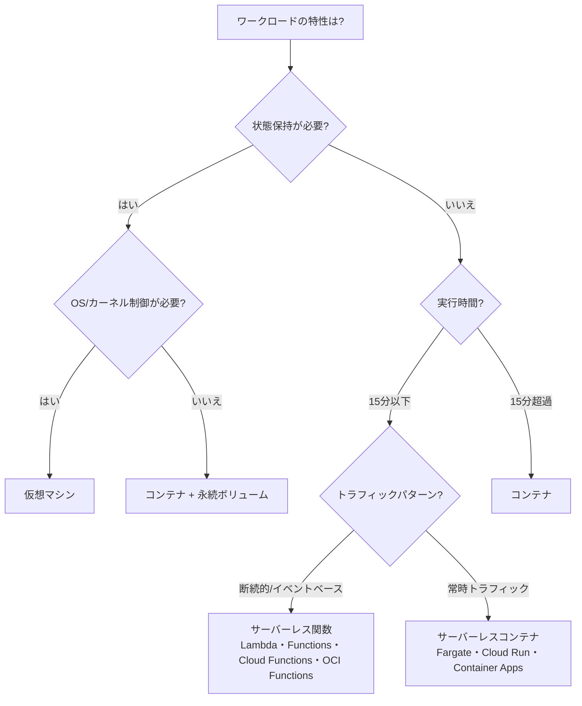

> 文書基準: 2026年8月

## 概要

VMとコンテナはサーバーの生成とデプロイを自動化しましたが、依然として「サーバーが何台必要か」「いつスケーリングするか」をユーザーが決定する必要があります。オートスケーリングは助けになりますが、最小インスタンスを維持するコストは残ります。

**サーバーレス**は、この最後の管理負担さえも取り除きます。サーバーの存在を意識せず、リクエストがあったときだけコードが実行されます。関数のライフサイクルは**リクエスト受信 → インスタンス生成(Cold Start) → コード実行 → アイドル待機 → 一定時間後に解放(Evict)** です。このプロセスをベンダーが自動的に管理します。

| 段階 | 管理対象 | 課金方式 | アイドルコスト |
| --- | --- | --- | --- |
| **インスタンス (VM)** | OS、パッチ、スケーリング全般 | 時間単位(起動中は課金) | あり |
| **コンテナ** | アプリ + オーケストレーション | ノード時間またはPod単位 | 一部あり |
| **サーバーレス** | コードのみ | リクエスト数 + 実行時間 (GB-seconds) | なし (Provisioned Concurrency未使用時) |

## なぜサーバーレスなのか

- **コスト** — トラフィックがなければコストは0。使用した分だけ課金されます(GB-secondsまたはリクエスト数ベース)。
- **運用** — OSパッチ、セキュリティアップデート、スケーリングをベンダーがすべて処理します。
- **速度** — インフラ設定なしにコードだけをデプロイすれば即座に実行されます。

:::caution
サーバーレスが常に安いとは限りません。常時高負荷のワークロードではVM/コンテナよりコストが高くなる場合があります。また、Provisioned Concurrencyを設定するとアイドル時にもコストが発生します。トラフィックパターンに応じてコストをシミュレーションしてください。
:::

## サーバーレスがまだ難しい場合

- **Cold Start** — 一定時間呼び出しがないとインスタンスが解放され、再度呼び出す際に数百ms～数秒の遅延が発生します。(この文書でのCold Startは関数の初期化遅延を指します。VM起動遅延については[オートスケーリング](../../compute/auto-scaling/)を参照してください。)
- **実行時間制限** — 長時間実行されるタスクには制限があります。
- **常時負荷** — 24時間一定のトラフィックであればVMの方が経済的な場合があります。
- **リトライと冪等性** — 非同期・イベントトリガーはベンダー・サービスによって配信保証が異なります。リトライがある経路では関数を冪等に設計してください。失敗先はDLQ、on-failure destination、サブスクリプションdead-letterなど、サービスごとのオプションを確認してください。
- **VPC接続時の遅延の影響** — VPC連携はベンダーごとに実装が異なります。AWS LambdaはHyperplane ENIを関数の生成/更新時点で準備するモデルであり、「呼び出しごとにENI生成」という説明は古い情報です。初期構成・長時間アイドル後の初回呼び出し、サブネット/セキュリティグループの制約など、環境ごとの遅延は個別に測定してください。

これらの制約は徐々に緩和されており(Provisioned Concurrency、実行時間の延長など)、サーバーレスの適用範囲は拡大し続けています。

## 製品比較

### FaaS (Function as a Service)

| ベンダー | 製品 | 備考 |
| --- | --- | --- |
| AWS | Lambda | 最大15分。200以上のAWSサービスイベント連携。**Lambda durable functions**(GA): チェックポイント、自動復旧、待機中のコストなし |
| Azure | Azure Functions | Premium: 無制限実行。Durable Functions/Durable Tasks(状態保持ワークフロー)。**サーバーレスエージェント**、MCPコネクタ、Go言語サポート追加(Build 2026) |
| Google Cloud | Cloud Functions | 第2世代: 最大60分。Eventarc連携 |
| OCI | OCI Functions | Fn Projectベース。Dockerコンテナで実行。同期5分、**非同期(Detached)最大60分** |

### サーバーレスコンテナ

| ベンダー | 製品 | 備考 |
| --- | --- | --- |
| AWS | Fargate | ECS/EKSでサーバーなしにコンテナを実行 |
| AWS | App Runner | ソース/イメージから直接デプロイ |
| Azure | Container Apps | イベントベースのスケーリングを内蔵 |
| Google Cloud | Cloud Run | HTTPベース。既存のコンテナアプリを修正なしにサーバーレスへ転換 |
| OCI | OCI Container Instances | サーバー管理なしにコンテナを実行 |

### ワークフローオーケストレーション

| ベンダー | 製品 | 備考 |
| --- | --- | --- |
| AWS | Step Functions | ビジュアルワークフローエディタ |
| Azure | Durable Functions / Logic Apps | コードベース / ローコード |
| Google Cloud | Workflows | YAMLベースのサービスオーケストレーション |
| OCI | OCI Events + OCI Functions | イベントベースの関数チェイニング |

## 主な違い

- **AWS Lambda** — AWSサービスとのイベントソース連携が豊富です。API Gateway、S3、DynamoDB Streamsなど多様なトリガーをネイティブにサポートします。
- **Google Cloud Cloud Run** — 既存のコンテナイメージを修正なしにそのままデプロイできるため、移行経路がシンプルです。
- **Azure Functions** — Durable Functionsにより長時間の状態保持ワークフローまでサーバーレスで処理できます。
- **OCI Functions** — Fn Project(オープンソース)ベースでDockerコンテナをそのまま関数として実行できるため、ベンダーロックインが低いです。

## サーバーレス vs コンテナ vs VM

## いつ何を選ぶべきか

| こんなとき | これを選ぶ |
| --- | --- |
| AWSサービスとのイベント連携が核心のとき | AWS Lambda |
| 既存のコンテナアプリを修正なしにサーバーレスへ転換したいとき | Google Cloud Cloud Run |
| 長時間の状態保持ワークフローをサーバーレスで処理するとき | Azure Durable Functions |
| ベンダーロックインを最小化しDockerベースで関数を実行するとき | OCI Functions (Fn Projectベース) |
| ビジュアルワークフローオーケストレーションが必要なとき | AWS Step Functions |
| イベントベースの自動スケーリングコンテナが必要なとき | Azure Container Apps |

:::note
**Cold Startは徐々に緩和されています。** Provisioned Concurrency、Pre-warmedインスタンスなど、各ベンダーが緩和策を提供しています。しかし完全になくなるわけではないため、応答遅延に敏感なワークロードは事前プロビジョニングを設定するか、Keep-warm戦略を適用してください。
:::

## Cold Start緩和戦略

Cold Startはサーバーレスの最大の欠点です。ベンダー別の緩和方法をまとめます。

| 戦略 | 説明 | AWS Lambda | Azure Functions | Google Cloud Cloud Functions/Run | OCI Functions |
| --- | --- | --- | --- | --- | --- |
| **事前プロビジョニング** | 事前にウォームアップされたインスタンスを維持(アイドル時もコスト発生) | Provisioned Concurrency | Premium Plan (Pre-warmed) | Min Instances | — |
| **Keep-warm呼び出し** | 定期的に関数を呼び出しウォーム状態を維持 | EventBridgeスケジュール | Timer Trigger | Cloud Scheduler | OCI Events |
| **ランタイム選択** | 高速初期化ランタイムを使用 | Go、Rustは Cold Startが速い。Java/.NETは遅い | 同様 | 同様 | 同様 |
| **軽量化** | パッケージサイズ縮小、依存関係の最小化 | Lambda Layers活用 | 同様 | 同様 | 同様 |
| **SnapStart** | スナップショットベースの高速起動 | Lambda SnapStart (Java) | — | — | — |

## 並行性の制限とスループット

サーバーレスは自動的にスケールしますが無制限ではありません。1秒あたりどれだけのリクエストを処理できるかを把握しておく必要があります。

| ベンダー | デフォルト並行性制限 | 拡張可否 |
| --- | --- | --- |
| AWS Lambda | アカウントあたり1,000同時実行(リージョン別) | サポートリクエストで増加可能 |
| Azure Functions | Consumption Plan: 制限あり。Premium: より高い | Elastic Premium Plan |
| Google Cloud Cloud Functions (第2世代) | インスタンスあたりのconcurrent request上限と関数/プロジェクトのスケーリング上限は別([公式quotas](https://cloud.google.com/functions/quotas)を確認) | 調整可能 |
| OCI Functions | テナンシー別制限 | サポートリクエストで増加 |

### 並行性制限戦略

- **Reserved Concurrency** (AWS Lambda) — 特定の関数に同時実行数を予約または制限
- **Throttling** — サポートされているリトライポリシーを使用(指数バックオフ)
- **キューベースのバッファリング** — SQS/Service Bus/Pub/Subでトラフィックスパイクを吸収
- **ダウンストリームの保護** — 並行性1,000 = DBコネクション1,000個。RDS Proxy、Cloud SQL Auth Proxy、PgBouncerなど、LambdaとDBの間に必ずコネクションプーラーを配置してください

## コンテナイメージのサポート

すべてのベンダーがコンテナイメージベースのサーバーレス関数をサポートしています。既存のコンテナワークロードをサーバーレスへ転換しやすくなっています。

| ベンダー | 最大イメージサイズ | 備考 |
| --- | --- | --- |
| AWS Lambda | 10GB | ECRから取得 |
| Azure Functions | — (Custom Container) | すべてのイメージ |
| Google Cloud Cloud Run | — | Artifact Registryから取得 |
| OCI Functions | — | OCI Registryまたは外部 |

## 運用上の考慮事項

サーバーレスはインフラ管理が減りますが、運用がなくなるわけではありません。

- **IAM最小権限** — 関数に必要な最小限の権限のみ付与。1つのロールを複数の関数で共有しないでください。
- **VPC接続** — DBアクセスなどが必要な場合のみVPCを接続し、ベンダー別のネットワーキング遅延・制約(サブネット、NAT、セキュリティグループ)を測定してください。
- **分散トレーシング** — サーバーレスは呼び出しチェーンが複雑になりやすいです。X-Ray、Cloud Traceなどでトレーシングを設定してください。
- **冪等性設計** — リトライ・重複配信がある経路では、同一イベントを複数回処理しても結果が同じになるよう設計してください。
- **コストモニタリング** — 予期しない呼び出しの急増がコストの急増につながることがあります。予算アラートを設定してください。

## よくある間違い

- **DB直接接続(コネクション枯渇)** — Lambda/FunctionからDBに直接接続すると、同時実行数分のコネクションが生成されDBコネクションプールが枯渇します。RDS Proxy、Cloud SQL Auth Proxy、PgBouncerなどのコネクションプーラーを必ず配置してください。
- **コールドスタートの無視** — 応答遅延に敏感なワークロードでコールドスタート緩和設定(Provisioned Concurrency、Min Instances)なしに運用すると、ユーザー体験が低下します。
- **1つの関数にすべてのロジック** — 1つの関数に複数の責務を持たせると、デバッグが難しくなり、タイムアウトのリスクが高まり、再利用が不可能になります。単一責任の原則を適用してください。

## チェックリスト

- [ ] コネクションプーラー(RDS Proxy、PgBouncerなど)をDBの前段に配置したか
- [ ] コールドスタート緩和設定(Provisioned Concurrency、Min Instances)を適用したか
- [ ] 関数タイムアウトをワークロードに合わせて設定したか
- [ ] 非同期パターン(キュー、イベント)を適用して同期呼び出しチェーンを減らしたか

## 参考資料

### AWS

- [AWS Lambda ドキュメント](https://docs.aws.amazon.com/ko_kr/lambda/)
- [AWS Step Functions ドキュメント](https://docs.aws.amazon.com/ko_kr/step-functions/)
- [サーバーレスアーキテクチャ](https://docs.aws.amazon.com/ko_kr/wellarchitected/latest/serverless-applications-lens/welcome.html)

### Azure

- [Azure Functions ドキュメント](https://learn.microsoft.com/ko-kr/azure/azure-functions/)
- [Azure Durable Functions ドキュメント](https://learn.microsoft.com/azure/azure-functions/durable/durable-functions-overview)

### Google Cloud

- [Google Cloud Functions ドキュメント](https://cloud.google.com/functions/docs)
- [Google Cloud Run ドキュメント](https://cloud.google.com/run/docs)
- [Google Cloud Workflows ドキュメント](https://cloud.google.com/workflows/docs)

### OCI

- [OCI Functions ドキュメント](https://docs.oracle.com/en-us/iaas/Content/Functions/home.htm)
