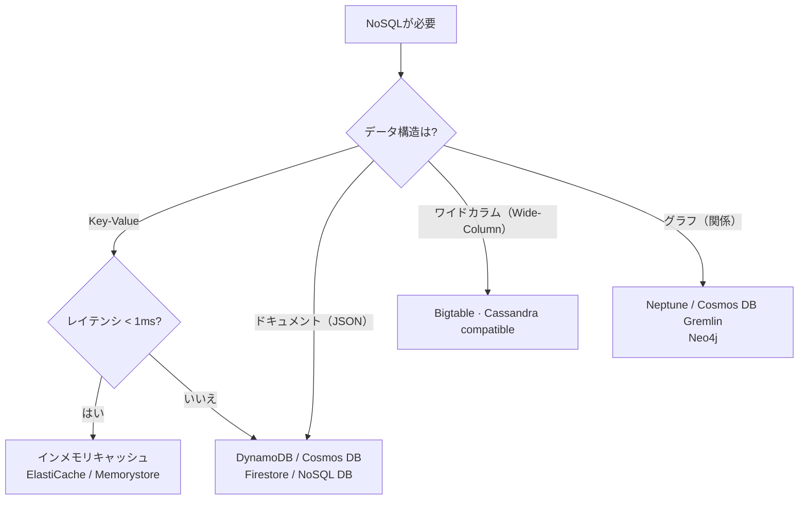

> 文書基準: 2026年5月

## 概要

リレーショナルDB(SQL)はテーブル、行、列でデータを構造化し、SQLで照会します。スキーマが厳格でトランザクション(ACID)を保証しますが、大規模トラフィックでの水平拡張が難しく、スキーマ変更が煩雑です。

**NoSQL** (Not Only SQL)は、RDBの中核要素 — 固定スキーマ、JOIN、完全なACIDトランザクション — を一部放棄する代わりに、水平拡張性と柔軟なデータモデルを得るアプローチです。「SQLを使わない」のではなく、「SQLだけでは解決しにくい問題を別の方法で解決する」という意味です。

### SQL vs NoSQL

| 項目 | SQL (リレーショナル) | NoSQL |
| --- | --- | --- |
| **スキーマ** | 厳格 (テーブル構造を事前定義) | 柔軟 (スキーマレスまたはスキーマオンリード) |
| **拡張** | 垂直拡張中心 (より大きなサーバー) | 水平拡張 (サーバー追加) |
| **トランザクション** | ACID保証 | 一部のみサポート (BASEモデル) |
| **結合** | 複雑な結合が可能 | 結合なしまたは限定的 |
| **適した場合** | 定型データ、複雑な関係、一貫性重視 | 大規模トラフィック、柔軟な構造、高速応答 |

### NoSQLの種類

| 種類 | データ構造 | 選択すべき場合 | 使用例 |
| --- | --- | --- | --- |
| **キー・バリュー** (Key-Value) | 単一キーで値を照会 | 単純な照会が超高速である必要がある場合 | セッション、キャッシュ、設定、ショッピングカート |
| **ドキュメント** (Document) | JSON/BSONドキュメント | スキーマが頻繁に変わる、またはネスト構造の場合 | ユーザープロファイル、カタログ、CMS |
| **ワイドカラム** (Wide Column) | 行ごとにカラムが異なる場合がある | 大規模な時系列/イベントデータの書き込み | IoT、ログ、分析、レコメンデーション |
| **グラフ** (Graph) | ノード + エッジ(関係) | データ間の関係/つながりが中核となる場合 | ソーシャルネットワーク、不正検知、ナレッジグラフ |

## 使用事例

| DB | 種類 | 代表的な使用事例 | なぜRDBではなくこれか |
| --- | --- | --- | --- |
| DynamoDB | キー・バリュー/ドキュメント | セッション、ショッピングカート、ゲーム状態、IoT | 無限スケール、1桁ミリ秒保証、柔軟なスキーマ |
| MongoDB (Atlas/DocumentDB/Cosmos DB) | ドキュメント | カタログ、CMS、ユーザープロファイル | スキーマレス、ネストされたドキュメント、迅速な開発 |
| Cassandra / Bigtable | ワイドカラム | 時系列、ログ、レコメンデーション | 大規模書き込み、リージョン分散 |
| Neptune / Cosmos DB Gremlin | グラフ | ソーシャル、不正検知、ナレッジグラフ | 関係探索がJOINより高速 |

### MongoDB管理型オプション

| ベンダー | サービス | 備考 |
| --- | --- | --- |
| AWS | DocumentDB | MongoDB互換API、完全なMongoDBではない |
| Azure | Cosmos DB for MongoDB | MongoDB API互換モード |
| MongoDB Atlas | Atlas (AWS/Azure/Google Cloud) | マルチクラウド管理型。互換性が完璧。ベンダー中立の選択肢 |

## 製品比較

### キー・バリュー / ドキュメントDB

| ベンダー | 製品 | 備考 |
| --- | --- | --- |
| AWS | DynamoDB | 完全サーバーレス。ミリ秒レイテンシ。容量自動拡張 |
| Azure | Cosmos DB | マルチモデル(ドキュメント、キー・バリュー、グラフ、ワイドカラム)。グローバル分散 |
| Google Cloud | Firestore | ドキュメントDB。モバイル/Webアプリに最適化。リアルタイム同期 |
| Google Cloud | Bigtable | ワイドカラム。大規模分析/時系列 |
| OCI | OCI NoSQL Database | キー・バリュー + ドキュメント + ワイドカラム。サーバーレス容量管理 |

### 検索/ログ分析エンジン

検索エンジン(Elasticsearch/OpenSearch系)はNoSQL隣接領域で、全文検索とログ分析に特化しています。ベンダー別サービス比較は[検索エンジン](../../database/search/)を参考にしてください。

### グラフDB

| ベンダー | 製品 | 備考 |
| --- | --- | --- |
| AWS | Neptune | |
| Azure | Cosmos DB (Gremlin API) | |

:::note
インメモリキャッシュ(Redis/Valkey)の詳細比較は[キャッシュとインメモリ](../../database/cache/)を参考にしてください。
:::

## 主な違い

**AWS DynamoDB** — 完全サーバーレスで容量管理が不要です。1桁ミリ秒のレイテンシを提供し、DAX(インメモリキャッシュ)を追加すればマイクロ秒レベルの応答も可能です。

**Azure Cosmos DB** — 1つのサービスでドキュメント、キー・バリュー、グラフ、ワイドカラムをすべてサポートします。グローバル分散(マルチリージョン書き込み)が標準機能として組み込まれています。

**Google Cloud Firestore** — モバイル/Webクライアントから直接アクセスできるリアルタイム同期が強みです。Bigtableは大規模分析ワークロードに特化しています。

**OCI NoSQL Database** — キー・バリュー、ドキュメント、ワイドカラムを1つのサービスでサポートし、サーバーレス容量管理と予測可能な低レイテンシ性能を提供します。

:::note
グローバル分散DB(DynamoDB Global Tables、Cosmos DB、Spannerなど)の一貫性トレードオフと選択基準は[マネージドRDB — グローバル分散DB](../../database/managed-rdb/#글로벌-분산-db)を参考にしてください。
:::

## 選択ガイド

| 状況 | 推奨 |
| --- | --- |
| 完全サーバーレスなキー・バリュー/ドキュメントDB + ミリ秒レイテンシ | AWS DynamoDB |
| 1つのDBでドキュメント、キー・バリュー、グラフをすべて処理 | Azure Cosmos DB |
| グローバルなマルチリージョン書き込み | Azure Cosmos DB |
| モバイル/Webアプリのリアルタイム同期 | Google Cloud Firestore |
| 大規模な時系列/IoTデータの書き込み | Google Cloud Bigtable |
| 全文検索 + ログ分析 | AWS OpenSearch / OCI Search |
| グラフDB | AWS Neptune / Azure Cosmos DB (Gremlin) |

## キー設計パターン

NoSQLはRDBと異なり、**クエリパターンを先に決めてからキーを設計**する必要があります。

### RDB vs NoSQL設計アプローチ

- **RDB**: データ正規化 → クエリは後でJOINにより解決
- **NoSQL**: アクセスパターン(どのクエリを実行するか)を先に定義 → それに合わせてキー/テーブルを設計

### DynamoDBスタイルのキー設計

- **Partition Key (PK)** — データ分散の単位。均等分散が鍵
- **Sort Key (SK)** — PK内でのソート/範囲照会
- **単一テーブル設計** — 複数のエンティティを1つのテーブルにPK/SKの組み合わせで格納
- **ホットパーティションのアンチパターン** — 特定のPKにトラフィックが集中 → スロットリング

### MongoDBスタイルのキー設計

- **\_idフィールドとインデックス戦略** — クエリパターンに合わせた複合インデックス設計
- **埋め込み vs 参照** — ネストされたドキュメント(1:1、1:少数) vs 別コレクション参照(1:多数)
- **シャードキーの選択** — カーディナリティ、書き込み分散、クエリ分離を考慮

:::note
キー設計のアンチパターンとDB運用全般(コネクションプール、キャッシュ戦略、HA)は[データベース運用](../../database/operations/)を参考にしてください。
:::

## よくある間違い

- **RDBのように正規化して設計** — NoSQLはJOINがない、または非効率です。クエリパターンを先に定義し、非正規化して設計する必要があります。
- **ホットパーティションを引き起こすキー設計** — タイムスタンプのみでPartition Keyを構成すると、特定のパーティションにトラフィックが集中しスロットリングが発生します。
- **NoSQLをすべてのワークロードに適用** — 複雑な関係とトランザクションが必要なワークロード(決済、在庫)にはRDBが適しています。NoSQLは万能ではありません。

## チェックリスト

- [ ] アクセスパターン(クエリ)を先に定義し、それに合わせてキー/テーブルを設計したか
- [ ] Partition Keyのカーディナリティが十分に高く均等分散されるか確認したか
- [ ] 容量モード(プロビジョニング vs オンデマンド)をトラフィックパターンに合わせて選択したか

## 参考資料

### AWS

- [Amazon DynamoDB 文書](https://docs.aws.amazon.com/ko_kr/dynamodb/)
- [Amazon Neptune 文書](https://docs.aws.amazon.com/ko_kr/neptune/)

### Azure

- [Azure Cosmos DB 文書](https://learn.microsoft.com/ko-kr/azure/cosmos-db/)

### Google Cloud

- [Firestore 文書](https://cloud.google.com/firestore/docs)
- [Bigtable 文書](https://cloud.google.com/bigtable/docs)

### OCI

- [OCI NoSQL Database 文書](https://docs.oracle.com/en-us/iaas/nosql-database/index.html)
