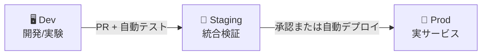

> 文書基準: 2026年6月

## 概要

オンプレミスでは、コードをビルドしてサーバーにデプロイする過程が手動であるか、Jenkinsのようなツールを直接インストール・運用する必要があります。**CI/CD**（Continuous Integration / Continuous Delivery）は、コード変更時に自動的にビルド、テスト、デプロイまで実行するパイプラインです。

クラウドベンダーは管理型CI/CDサービスを提供しており、ビルドサーバーの運用負担なしにパイプラインを構成できます。また、GitHub Actions、GitLab CIなどのサードパーティツールとの連携もよくサポートされています。

### CI vs CD

- **CI（Continuous Integration）** — コードコミット時に自動ビルド＋テスト。問題を早期に発見。
- **CD（Continuous Delivery）** — ビルドされたアーティファクトをステージング／プロダクションに自動デプロイ。

### 頻繁にデプロイすると何が良いのか

| 項目 | 月1回デプロイ | 1日数回デプロイ |
| --- | --- | --- |
| **変更規模** | 大きく危険 | 小さく安全 |
| **障害原因の特定** | 数百件の変更のどこか？ | 直前のコミットを確認 |
| **ロールバック** | 複雑（依存関係が多い） | 簡単（小さな変更を戻す） |
| **ユーザーフィードバック** | 数週間後 | 当日 |
| **市場対応** | 遅い | 競合より早く機能をリリース |

デプロイ頻度が高いほど、各デプロイのリスクが減り、ユーザーフィードバックを素早く反映できます。これはそのままビジネスの俊敏性につながります。DORAの調査によると、デプロイ頻度が高いチームほど障害復旧時間も短く、変更失敗率も低いという結果が出ています。

### 環境分離がなぜ重要か

CI/CDパイプラインは、コードがプロダクションに到達する前に複数の環境を経由するようにします。



- **Dev** — 開発者が自由に実験。壊れても問題なし。
- **Staging** — プロダクションと同一構成。デプロイ前の最終検証。
- **Prod** — 実際のユーザーがアクセスする環境。

オンプレミスでは環境をもう一つ作るためにサーバーを追加購入する必要がありましたが、クラウドではIaCで同一環境を数分以内に複製できます。テストが終わったら削除することでコストも削減できます。

環境が分離されると:
- 開発中のコードが誤ってプロダクションに影響を与えません。
- ステージングで発見されたバグはユーザーに到達しません。
- 各環境に異なる権限を付与してセキュリティを強化できます。

## 製品比較

### ビルド（CI）

| ベンダー | 製品 | 備考 |
| --- | --- | --- |
| AWS | CodeBuild | 完全管理型。分単位課金。Dockerイメージビルド対応 |
| Azure | Azure Pipelines | GitHub/Azure Repos連携。無料枠（月1,800分） |
| Google Cloud | Cloud Build | コンテナベース。1日120分無料 |
| OCI | OCI DevOps Build Pipelines | 管理型ビルド。OCIサービスとのネイティブ連携 |

### デプロイ（CD）

| ベンダー | 製品 | 備考 |
| --- | --- | --- |
| AWS | CodeDeploy | EC2、ECS、Lambdaへのデプロイ。Blue/Green、Rolling対応 |
| AWS | CodePipeline | ビルド→テスト→デプロイのパイプラインオーケストレーション |
| Azure | Azure Pipelines（Release） | マルチステージパイプライン。承認ゲート |
| Google Cloud | Cloud Deploy | GKE、Cloud Runへのデプロイ。プロモーションベース |
| OCI | OCI DevOps Deployment Pipelines | OKE、Compute、Functionsへのデプロイ。承認ステップ対応 |

### ソースリポジトリ

| ベンダー | 製品 | 備考 |
| --- | --- | --- |
| AWS | CodeCommit | 2024年に新規作成を停止。GitHub/GitLabの使用を推奨 |
| Azure | Azure Repos | Gitベース。Azure DevOpsに含まれる |
| Google Cloud | Cloud Source Repositories | ミラーリング対応。GitHub/GitLab連携 |
| OCI | OCI DevOps Code Repositories | Gitベース。OCI DevOpsに含まれる |

### アーティファクトリポジトリ

| ベンダー | 製品 | 備考 |
| --- | --- | --- |
| AWS | CodeArtifact | Maven、npm、PyPI、NuGetパッケージ |
| Azure | Azure Artifacts | Azure DevOpsに含まれる |
| Google Cloud | Artifact Registry | コンテナイメージ＋言語別パッケージの統合管理 |
| OCI | OCI Artifact Registry | コンテナイメージ＋汎用アーティファクト |

## 主な違い

**AWS** — CodeBuild/CodeDeploy/CodePipelineでフルパイプラインを構成できますが、実務ではGitHub Actions + CodeDeployの組み合わせがよく使われます。CodeCommitは新規作成が停止されています。

**Azure** — Azure DevOpsがソース管理、CI/CD、ボード（課題トラッキング）、テストを一つのプラットフォームに統合しています。GitHub Actionsとも緊密に連携します。

**Google Cloud** — Cloud Buildがビルドとデプロイの両方を処理できるためシンプルです。Cloud DeployはGKE/Cloud Runに特化したCDツールです。

**OCI** — OCI DevOpsがビルド／デプロイパイプラインを統合提供し、OKE、Compute、Functionsへのデプロイと承認ステップをネイティブにサポートします。

## 実務ガイド

### リポジトリ分離

| 戦略 | 説明 | 適した場合 |
| --- | --- | --- |
| **モノレポ** | アプリコード＋インフラコードを1つのリポジトリにまとめる | 小規模チーム、迅速なイテレーション |
| **アプリ／デプロイ分離** | アプリコードリポジトリとデプロイマニフェストリポジトリを分離 | GitOps、マルチ環境、権限分離が必要な場合 |

デプロイリポジトリを分離すると、アプリ開発者はコードだけに集中でき、デプロイ設定（Helm chart、Kustomizeなど）はプラットフォームチームが管理できます。GitOpsではデプロイリポジトリの分離が一般的です。

### ロールバック vs 高速再デプロイ

障害発生時には2つの選択肢があります。

- **ロールバック** — 以前のバージョンに戻す。安全だが、データマイグレーションがあった場合は複雑になる。
- **ロールフォワード（高速修正デプロイ）** — 問題を修正した新バージョンを迅速にデプロイ。CI/CDが速ければロールバックより有利な場合がある。

パイプラインが十分に速い場合（コミットからプロダクションまで10分以内）、ロールフォワードの方が実用的です。ただし、ロールバック経路は常に用意しておく必要があります。

### パイプラインで実行すべきテスト

| 段階 | テスト | 目的 |
| --- | --- | --- |
| **ビルド時** | ユニットテスト（Unit） | 個々の関数／モジュールの正常動作を確認 |
| **ビルド時** | 静的解析（Lint、[SAST](../../devops/devsecops/)） | コード品質、セキュリティ脆弱性の早期発見 |
| **ステージング** | 統合テスト（Integration） | サービス間連携の確認 |
| **ステージング** | E2Eテスト | ユーザーシナリオ全体のフロー検証 |
| **プロダクション** | カナリア／ブルーグリーン | 一部トラフィックで実環境検証後に全体切り替え |

### 承認（Approval）プロセス

| 承認タイプ | いつ必要か | 理由 |
| --- | --- | --- |
| **コードレビュー（PR）** | すべての変更 | 同僚がコード品質／セキュリティを検証。最も重要なゲート |
| **自動テスト通過** | すべての変更 | 人の判断なしに客観的な品質を保証 |
| **手動承認** | プロダクションデプロイ（任意） | 規制要件または高リスクな変更時のみ |

:::note
**マネージャーの手動承認が不要な理由** — コードレビュー＋自動テストが品質を保証しているなら、手動承認はボトルネックにしかなりません。マネージャーはコードを読まずに「承認」ボタンを押すだけになり、実質的な検証になりません。代わりに、自動化された品質ゲート（テストカバレッジ、セキュリティスキャン、パフォーマンス基準）が客観的に判断する方が安全です。
:::

## よくある間違い

- **テストなしのデプロイ** — 自動テストなしでビルドさえ通ればデプロイするパイプラインは、プロダクション障害を引き起こします。少なくともユニットテストと静的解析をゲートとして設定してください。
- **シークレットのハードコーディング** — パイプライン設定ファイルにAPIキーやパスワードを直接記述すると、リポジトリへのアクセス権を持つすべての人に露出します。
- **mainへの直接プッシュ** — コードレビューと自動テストを回避してmainブランチに直接プッシュすると、品質ゲートが無力化されます。

## チェックリスト

- [ ] ビルド-テスト-デプロイの各段階を明確に分離しているか
- [ ] シークレットをパイプラインのシークレット管理機能（GitHub Secrets、Azure Key Vaultなど）で管理しているか
- [ ] ロールバック戦略（以前のバージョンの再デプロイまたはロールフォワード）を策定しているか
- [ ] パイプラインの実行時間を監視し、ボトルネックを管理しているか

## 継続的に行うべきこと

パイプラインは一度構築したら終わりではありません。パイプライン自体も保守対象です。

- **依存関係のアップデート** — ビルドツール、プラグイン、ベースイメージを定期的に更新します。
- **実行時間の最適化** — パイプラインが遅くなると開発生産性が低下します。キャッシュ、並列化を点検します。
- **Flaky Testの管理** — 間欠的に失敗するテストは信頼性を低下させます。隔離するか修正します。

## AIエージェントとCI/CD — GitHub Agentic Workflows

2026年、CI/CDパイプラインに**AIコーディングエージェント**を統合するパターンが登場しました。[GitHub Agentic Workflows](https://github.github.com/gh-aw/)（2026.02 Technical Preview）は、既存の決定論的なCI/CDに「Continuous AI」能力を追加します。

### 概念

| 従来のCI/CD | + Agentic Workflows |
| --- | --- |
| イベント → ビルド → テスト → デプロイ | イベント → **エージェントによる分析／修正** → ビルド → テスト → デプロイ |
| 人がコードを書き、パイプラインを実行 | エージェントが課題分類、CI失敗分析、ドキュメント維持、テスト改善を実施 |

### 動作方式

GitHub Actionsのワークフロー上でAIエージェント（Copilot、Claude Code、OpenAI Codex）を**イベントトリガー**または**スケジュール**で実行します。エージェントは専用の一時環境（GitHub Actions runner）でコードを分析・修正し、PRを作成します。

```yaml
# 例: 毎朝エージェントが課題を分類し、テストを改善
on:
  schedule:
    - cron: '0 9 * * *'
  issues:
    types: [opened]
```

### ユースケース

- **課題の自動分類** — 新しい課題が開かれると、エージェントがラベリング・優先順位付けを実施
- **CI失敗の自動分析** — ビルド失敗時にエージェントが原因を分析し、修正PRを作成
- **ドキュメントの自動維持** — コード変更時に関連ドキュメントを自動更新
- **Copilot Code Review** — PRに対してエージェントが自動レビュー（6/1からActions minutesを消費）

:::caution
**セキュリティ上の注意:** AIエージェントがCI/CDで非信頼入力（課題本文、PR説明）を処理すると、**間接的なプロンプトインジェクション**によりシークレットが漏洩する可能性があります。エージェントには最小権限のみを付与し、非信頼入力をサニタイズしてください。詳細は[AIセキュリティ — CI/CDエージェントのセキュリティ](../../security/ai-security/)を参照してください。
:::

## 関連ドキュメント

- [コードで管理するインフラ（IaC）](../../devops/iac/)
- [SLI/SLOとエラーバジェット](../../devops/slo/)

## 参考資料

### AWS

- [AWS CodeBuildドキュメント](https://docs.aws.amazon.com/ko_kr/codebuild/)
- [AWS CodeDeployドキュメント](https://docs.aws.amazon.com/ko_kr/codedeploy/)
- [AWS CodePipelineドキュメント](https://docs.aws.amazon.com/ko_kr/codepipeline/)

### Azure

- [Azure Pipelinesドキュメント](https://learn.microsoft.com/ko-kr/azure/devops/pipelines/)
- [Azure DevOpsドキュメント](https://learn.microsoft.com/ko-kr/azure/devops/)

### Google Cloud

- [Cloud Buildドキュメント](https://cloud.google.com/build/docs)
- [Cloud Deployドキュメント](https://cloud.google.com/deploy/docs)
- [Artifact Registryドキュメント](https://cloud.google.com/artifact-registry/docs)

### OCI

- [OCI DevOpsドキュメント](https://docs.oracle.com/en-us/iaas/Content/devops/using/home.htm)
