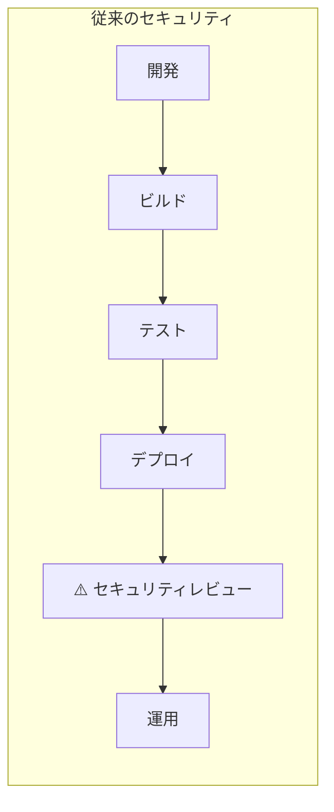
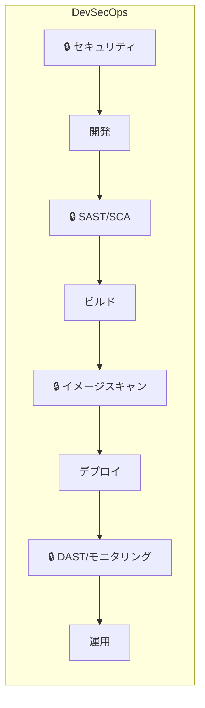
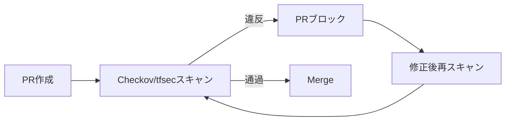

> 文書基準: 2026年5月

## 概要

DevSecOpsは、セキュリティ（Security）を開発（Dev）と運用（Ops）のパイプラインに**最初から組み込む**アプローチです。デプロイ後にセキュリティレビューを行う従来の方式の代わりに、コード作成時点からセキュリティ検証を自動化します。

:::note
デプロイ後の運用環境のセキュリティ監視は[セキュリティ態勢管理](../../security/security-posture/)を、OS/ランタイムのパッチは[パッチ管理と脆弱性対応](../../devops/patch-and-vulnerability/)を参照してください。
:::

### シフトレフト（Shift-Left）原則

セキュリティ検証を左（開発初期）に移動させるほど:

- **修正コストの削減** — プロダクションで発見された脆弱性は、開発段階に比べて10〜100倍のコストがかかる
- **デプロイ速度の維持** — 自動化されたセキュリティゲートが手動レビューのボトルネックを排除
- **開発者のスキル向上** — 即座のフィードバックによりセキュリティ意識が向上

## パイプライン段階別セキュリティツール

| 段階 | セキュリティ活動 | ツールタイプ |
| --- | --- | --- |
| **コード作成** | シークレット露出防止、セキュアコーディングパターン | Pre-commit hooks、IDEプラグイン |
| **コードレビュー/PR** | 静的解析（SAST）、シークレットスキャン | SAST、Secret scanning |
| **ビルド** | 依存関係の脆弱性（SCA）、ライセンス検査 | SCA（Software Composition Analysis） |
| **コンテナビルド** | イメージ脆弱性スキャン、ベースイメージ検証 | Container scanning |
| **IaC検証** | インフラコードのセキュリティ検査 | IaC scanning |
| **デプロイ前** | ポリシーゲート、承認ワークフロー | Policy-as-Code |
| **ランタイム** | DAST、侵入テスト、ランタイム保護 | DAST、RASP |

## SAST（Static Application Security Testing）

**静的解析。** ソースコードを実行せずにコード自体をスキャンしてセキュリティ脆弱性を見つけます。開発段階で素早く発見できますが、ランタイムでのみ明らかになる問題は発見できません。

| ベンダー/ツール | サービス | 特徴 |
| --- | --- | --- |
| AWS | [Amazon Inspector（コードスキャン）](https://docs.aws.amazon.com/inspector/latest/user/scanning-code.html) | Lambda/ECRコード脆弱性の自動スキャン。Python、Java、JavaScriptなど |
| Azure | [Microsoft Defender for DevOps](https://learn.microsoft.com/azure/defender-for-cloud/defender-for-devops-introduction) + GitHub Advanced Security | CodeQLベース。GitHub/Azure DevOpsネイティブ統合 |
| Google Cloud | ネイティブSASTなし — Cloud Buildに[Semgrep](https://semgrep.dev/)または[SonarQube](https://www.sonarsource.com/products/sonarqube/)を統合 | サードパーティツールをパイプラインに連携 |
| ベンダー中立 | [SonarQube](https://www.sonarsource.com/products/sonarqube/)、[Semgrep](https://semgrep.dev/)、[Snyk Code](https://snyk.io/product/snyk-code/) | マルチクラウド環境で一貫した分析 |

## DAST（Dynamic Application Security Testing）

**動的解析。** 実行中のアプリケーションを外部から実際に攻撃して脆弱性を見つけます。デプロイされた環境でのみ明らかになる問題（認証バイパス、設定ミスなど）を発見できます。

| ツール | 特徴 |
| --- | --- |
| [OWASP ZAP](https://www.zaproxy.org/) | オープンソース。CI/CDパイプラインに統合可能 |
| [Burp Suite](https://portswigger.net/burp) | 商用。手動侵入テスト＋自動スキャン |
| [Nuclei](https://nuclei.projectdiscovery.io/) | オープンソース。テンプレートベースの脆弱性スキャン。CI統合が容易 |

各CSPにはネイティブなDASTツールがないため、上記のベンダー中立ツールをステージング環境で実行するのが一般的です。

## SCA（Software Composition Analysis）

**依存関係分析。** オープンソースライブラリ／パッケージに含まれる既知の脆弱性（CVE）とライセンス違反を検出します。自分で書いたコードではなく、利用しているコードのリスクを管理します。

| ベンダー/ツール | サービス | 特徴 |
| --- | --- | --- |
| AWS | [Inspector SBOM](https://docs.aws.amazon.com/inspector/latest/user/sbom-generator.html) | SBOM生成＋CVEマッチング |
| Azure | [Defender for DevOps](https://learn.microsoft.com/azure/defender-for-cloud/defender-for-devops-introduction) + [GitHub Dependabot](https://docs.github.com/en/code-security/dependabot) | Defender for DevOpsでAzure DevOps/GitHubを統合。DependabotはGitHub機能 |
| Google Cloud | [Artifact Analysis](https://cloud.google.com/artifact-analysis/docs) | コンテナイメージ＋言語パッケージスキャン |
| ベンダー中立 | [Snyk Open Source](https://snyk.io/product/snyk-open-source/)、[Trivy](https://trivy.dev/)、[Grype](https://github.com/anchore/grype) | マルチレジストリ、マルチ言語対応 |

## IaCセキュリティ検証

Terraform、CloudFormation、Bicepなどの[インフラコード](../../devops/iac/)で、デプロイ前にセキュリティ設定ミスを検出します。

| ツール | 対象 | 特徴 |
| --- | --- | --- |
| [Checkov](https://www.checkov.io/) | Terraform、CloudFormation、Kubernetes、Helm | 1,000以上の組み込みポリシー。CIS Benchmarkマッピング |
| [tfsec](https://aquasecurity.github.io/tfsec/)（現Trivy） | Terraform | Trivyに統合。HCLネイティブ分析 |
| [KICS](https://kics.io/) | Terraform、CloudFormation、Ansible、Docker | オープンソース。マルチIaC対応 |
| [cfn-nag](https://github.com/stelligent/cfn_nag) | CloudFormation | AWS特化 |
| [Azure Policy（DeployIfNotExists）](https://learn.microsoft.com/azure/governance/policy/concepts/effects#deployifnotexists) | ARM/Bicep | デプロイ時のポリシー強制 |

### IaCセキュリティ検証パイプラインの例

## ポリシーコード化（Policy-as-Code）

セキュリティポリシーをコードとして定義し、自動的に強制します。

| ツール/サービス | ベンダー | 用途 |
| --- | --- | --- |
| [AWS SCP（Service Control Policies）](https://docs.aws.amazon.com/organizations/latest/userguide/orgs_manage_policies_scps.html) | AWS | Organizationレベルで許可/拒否アクションを強制 |
| [Azure Policy](https://learn.microsoft.com/azure/governance/policy/overview) | Azure | リソース作成／変更時にポリシーを評価。拒否／監査／自動是正 |
| [Google Cloud Organization Policy](https://cloud.google.com/resource-manager/docs/organization-policy/overview) | Google Cloud | 組織レベルの制約条件（リージョン制限、サービス制限など） |
| [OCI Security Zones](https://docs.oracle.com/en-us/iaas/security-zone/home.htm) | OCI | コンパートメントにセキュリティポリシーを付与。違反操作を拒否（予防的ポリシー強制） |
| [OPA（Open Policy Agent）](https://www.openpolicyagent.org/) | ベンダー中立 | Rego言語で汎用ポリシーを定義。Kubernetes、Terraform、APIゲートウェイなど |
| [HashiCorp Sentinel](https://www.hashicorp.com/sentinel) | ベンダー中立 | Terraform Enterprise/Cloudでポリシーを強制 |

### ポリシーコード化の適用例

| ポリシー | 実装 |
| --- | --- |
| 「すべてのS3バケットは暗号化必須」 | AWS Config Rule＋自動是正Lambda |
| 「プロダクションリソースは特定リージョンのみ許可」 | SCP / Organization Policy / Azure Policy |
| 「タグのないリソースの作成を拒否」 | Azure Policy（Deny）/ AWS Tag Policy |
| 「コンテナイメージは承認済みレジストリのみ」 | OPA Gatekeeper（Kubernetes Admission） |
| 「Terraform planでパブリックIP割り当て時に拒否」 | Sentinel / Checkov CIゲート |

## シークレットスキャン

コードリポジトリにコミットされたシークレット（APIキー、パスワード、トークン）を検出します。シークレットの安全な保存とローテーションは[シークレット管理](../../security/secrets/)を参照してください。

| ツール | 特徴 |
| --- | --- |
| [GitHub Secret Scanning](https://docs.github.com/en/code-security/secret-scanning) | Push時に自動検出。パートナープログラムによりベンダーへ自動通知 |
| [GitLeaks](https://gitleaks.io/) | オープンソース。Pre-commit hook＋CI統合 |
| [TruffleHog](https://trufflesecurity.com/trufflehog) | Gitヒストリー全体をスキャン。600以上のシークレットパターン |
| [Amazon Q Developer（コードスキャン）](https://aws.amazon.com/q/developer/) | コード内のシークレット・脆弱性検出（旧CodeGuru Security）。IDEプラグインは[Kiro](https://kiro.dev/)へ移行完了。Q Developer IDEプラグインは保守モード（EOS 2027.04） |

:::caution
**Pre-commit hookでシークレットのコミットを未然に防いでください。** 一度Gitヒストリーに入ったシークレットは、force pushで削除してもキャッシュに残る可能性があります。予防が最善です。
:::

## DevSecOps成熟度モデル

| 段階 | 特徴 | ツール例 |
| --- | --- | --- |
| **Level 1 — 手動** | デプロイ後の手動セキュリティレビュー。脆弱性発見時にホットフィックス | 手動侵入テスト |
| **Level 2 — 部分自動化** | CIにSAST/SCAを追加。結果はレポートのみ（ブロックしない） | SonarQube、Snyk（通知モード） |
| **Level 3 — ゲート適用** | Critical/High脆弱性発見時にパイプラインをブロック。ポリシーコード化を開始 | Checkov + PRブロック、OPA |
| **Level 4 — 完全自動化** | すべての段階にセキュリティゲート。自動是正。セキュリティメトリクスを追跡 | 全ツールチェーン + SIEM連携 |

## よくある間違い

- **SAST/SCA結果を通知のみでブロックしない** — Critical脆弱性がプロダクションまでデプロイされます。最低限Critical/Highはパイプラインをブロックしてください。
- **シークレットがGitヒストリーに残ったままforce pushのみで削除** — キャッシュとフォークに依然として残っています。シークレットを即座にローテーションすることが唯一の解決策です。
- **IaCセキュリティスキャンなしでterraform applyを実行** — パブリックS3バケット、過度なSecurity Groupなどがそのままデプロイされます。PR段階でCheckov/tfsecをゲートとして設定してください。

## チェックリスト

- [ ] Pre-commit hookにシークレットスキャン（GitLeaksなど）が設定されているか？
- [ ] CIパイプラインにSAST + SCA + IaCスキャンが含まれ、Critical発見時にビルドが失敗するか？
- [ ] コンテナイメージビルド時に脆弱性スキャンが自動実行されるか？

## 参考資料

### AWS

- [AWS DevSecOps Workshop](https://catalog.workshops.aws/devsecops)

### Azure

- [Microsoft Security Development Lifecycle](https://www.microsoft.com/en-us/securityengineering/sdl)

### Google Cloud

- [Google Cloud Security Best Practices](https://cloud.google.com/security/best-practices)

### 標準とコミュニティ

- [OWASP DevSecOps Guideline](https://owasp.org/www-project-devsecops-guideline/)
- [NIST SP 800-218（Secure Software Development Framework）](https://csrc.nist.gov/publications/detail/sp/800-218/final)
- [CIS Software Supply Chain Security Guide](https://www.cisecurity.org/cis-benchmarks)
- [SLSA（Supply-chain Levels for Software Artifacts）](https://slsa.dev/)
