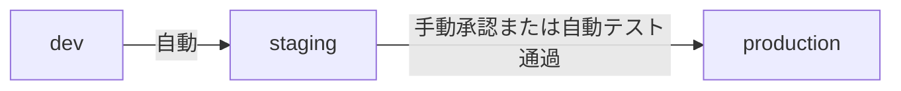

import { Tabs, TabItem } from '@astrojs/starlight/components';

> 文書基準: 2026年8月

## 概要

[コンテナサービス](../../compute/containers/)で管理型Kubernetesを選択した後は、**Day-2運用**が始まります。クラスタアップグレード、デプロイ自動化、セキュリティポリシー、観測可能性など、継続的に管理すべき領域です。

:::note
管理型Kubernetesの選定ガイドは[コンテナサービス](../../compute/containers/)を、サービス間通信のセキュリティは[サービスメッシュ](../../compute/service-mesh/)を参照してください。
:::

## クラスタアップグレード

Kubernetesは年3回マイナーバージョンをリリースし、各ベンダーは一定期間後に旧バージョンのサポートを終了します。

| ベンダー | サービス | サポートバージョン数 | アップグレード方式 |
| --- | --- | --- | --- |
| AWS | EKS | 直近4つ（+ Extended Supportは有料） | コントロールプレーン → ノードグループの順次 |
| Azure | AKS | 直近3つ | コントロールプレーン → ノードプールの順次。Auto-upgradeオプション |
| Google Cloud | GKE | 直近3つ（Rapid/Regular/Stableチャネル） | Release Channelベースの自動アップグレード |
| OCI | OKE | 直近3つ | コントロールプレーン → ノードプールの順次 |

**アップグレード戦略:**
- **Blue-Greenノードプール** — 新バージョンのノードプールを作成 → ワークロードを移動 → 旧ノードプールを削除
- **Rolling** — ノードを1つずつdrain → アップグレード → uncordon
- **GKE Autopilot** — Googleが自動的にアップグレードを管理

## デプロイ運用（GitOps）

Gitリポジトリを単一の真実の情報源として使用し、クラスタの状態を宣言的に管理します。GitOpsの概念とツール比較は[DevOpsを始める](../../devops/getting-started/#gitops)を、CI/CDパイプライン設計は[CI/CD](../../devops/cicd/)を参照してください。

**Kubernetesプロモーション戦略:**

## セキュリティ/ポリシー

| 領域 | ツール | 役割 |
| --- | --- | --- |
| **Admission Control** | [OPA Gatekeeper](https://open-policy-agent.github.io/gatekeeper/)、[Kyverno](https://kyverno.io/) | Pod作成時にポリシーを強制（イメージソース制限、リソース制限など） |
| **Network Policy** | Calico、Cilium、ベンダーネイティブ | Pod間通信の制御（デフォルト: 全許可 → 明示的許可のみ） |
| **Image Policy** | 署名検証（Cosign、Notation） | 承認済みレジストリ／署名済みイメージのみデプロイを許可 |
| **Workload Identity** | IRSA（AWS）、Workload Identity（Google Cloud/Azure） | PodにクラウドIAMロールをマッピング（Service Account Key不要） |

## プラットフォーム運用

| コンポーネント | 役割 | 代表的なツール |
| --- | --- | --- |
| **Ingress** | 外部トラフィック → クラスタ内サービスへのルーティング | NGINX Ingress、AWS ALB Controller、GKE Gateway |
| **cert-manager** | TLS証明書の自動発行/更新 | Let's Encrypt、ACM PCA連携 |
| **external-dns** | サービス作成時にDNSレコードを自動登録 | Route 53、Cloud DNS、Azure DNS連携 |
| **シークレット配布** | 外部シークレット → Podへの注入 | External Secrets Operator、CSI Secret Store Driver |
| **バックアップ** | etcd + PVバックアップ | Velero |

## 観測可能性

| 階層 | 収集対象 | ツール |
| --- | --- | --- |
| **クラスタ** | ノードCPU/メモリ、Pod状態、スケジューリング | Prometheus + Grafana、ベンダーネイティブ（Container Insights、GKE Monitoring） |
| **アプリケーション** | リクエスト遅延、エラー率、トレース | OpenTelemetry、Jaeger、X-Ray |
| **コントロールプレーン** | APIサーバー遅延、etcd状態、スケジューラー | 管理型ベンダーは限定的な露出。監査ログで補完 |
| **イベント** | Pod再起動、OOM Kill、スケジュール失敗 | Kubernetes Events → ログ収集 |

## VPCネットワーキング

Kubernetesクラスタは VPC サブネット上で動作し、Podネットワーキングの方式によってIP消費量とパフォーマンスが変わります。

### Pod CIDRとサブネットの関係

| 方式 | 説明 | ベンダー |
| --- | --- | --- |
| **VPCネイティブ（PodにVPC IPを割り当て）** | PodがVPC IPを直接使用。VPC内の他リソースと直接通信可能 | AWS VPC CNI、Azure CNI、Google Cloud Alias IP |
| **オーバーレイネットワーク** | Podに別のCIDRを割り当て。VPC IPを消費しないがカプセル化オーバーヘッドあり | Azure kubenet、Calico VXLAN、Flannel |

### サブネットIP枯渇問題

VPCネイティブ方式では、ノード＋Podがすべて VPC IPを消費するため、サブネットが不足する可能性があります。

| ベンダー | 対応方法 |
| --- | --- |
| AWS | Prefix Delegation（ノードごとに/28ブロックを割り当て）、Secondary CIDRの追加 |
| Azure | Azure CNI Overlay（Podにオーバーレイ IPを使用）、Azure CNI + Dynamic IP Allocation |
| Google Cloud | Alias IP ranges、/14デフォルトPod CIDR（十分に広い） |

### サービス公開パターン

| 段階 | 方式 | VPCリソース |
| --- | --- | --- |
| ClusterIP | クラスタ内部からのみアクセス | なし |
| NodePort | ノードIP＋ポートで外部公開 | Security Groupルールの追加 |
| LoadBalancer | クラウドLBを自動作成 | LB + Target Group + Security Group |
| Ingress/Gateway | L7ルーティング（パス/ホストベース） | ALB/App Gateway/Cloud LBを自動作成 |

### ネットワークポリシー

Pod間トラフィックを制御するKubernetesネイティブ機能です。VPC Security Groupとは役割が異なります。

| 区分 | Network Policy（Podレベル） | Security Group（VPCレベル） |
| --- | --- | --- |
| 適用対象 | Pod ↔ Pod | インスタンス/ENI ↔ 外部 |
| 実装 | Calico、Cilium、ベンダーネイティブ | ベンダーVPC機能 |
| デフォルト動作 | 全許可（ポリシーがない場合） | 全拒否（インバウンド） |

:::note
VPC/サブネット設計の基礎（CIDR計画、パブリック/プライベート分離、Transit Gateway）は[VPCとサブネット](../../networking/vpc-subnet/)を、管理型Kubernetesの選定とノード戦略は[コンテナサービス](../../compute/containers/)を参照してください。
:::

**ベンダー別Kubernetes VPC/サブネット設計ガイド:**

- [AWS EKS — VPC and Subnet Best Practices](https://docs.aws.amazon.com/eks/latest/best-practices/subnets.html)
- [Azure AKS — IP Address Planning](https://learn.microsoft.com/azure/aks/concepts-network-ip-address-planning)
- [Google Cloud GKE — VPC-native Cluster Networking](https://cloud.google.com/kubernetes-engine/docs/concepts/alias-ips)
- [OCI OKE — Network Configuration](https://docs.oracle.com/en-us/iaas/Content/ContEng/Concepts/contengnetworkconfig.htm)

## ベンダー別の違い

<Tabs>
<TabItem label="AWS EKS">
- コントロールプレーンは管理型、ノードはユーザー管理（Managed Node GroupまたはFargate）
- IRSAでPodごとにIAM Roleをマッピング
- VPC CNI（PodにVPC IPを直接割り当て）
- ALB Ingress ControllerでAWS ALBを自動作成
</TabItem>

<TabItem label="Azure AKS">
- コントロールプレーンは無料（ノード費用のみ）
- Entra ID統合（RBAC + Conditional Access）
- Azure CNIまたはkubenet
- KEDAネイティブ統合（イベント駆動オートスケーリング）
</TabItem>

<TabItem label="Google Cloud GKE">
- **Autopilotモード**: ノード管理を完全自動化（Pod単位課金）
- Workload IdentityでService Account Key不要
- Gateway APIネイティブ対応
- Release Channelで自動アップグレード管理
</TabItem>

<TabItem label="OCI OKE">
- コントロールプレーンは無料
- Virtual Node（サーバーレスノード）オプション
- OCI IAM動的グループでPod権限をマッピング
- FlannelまたはOCI VCN-Native Pod Networking
</TabItem>
</Tabs>

## よくある間違い

- **クラスタアップグレードを先延ばしにしてサポート終了バージョンに到達** — 強制アップグレードやセキュリティパッチの停止につながります。四半期ごとにアップグレード計画を立ててください。
- **Network Policyなしで運用** — デフォルトではすべてのPod間通信が許可されています。侵害時に横方向移動（lateral movement）が無制限に可能になります。
- **VPCサブネットIPを小さく設定してPodスケジューリングに失敗** — VPC CNI環境ではノード＋Podがすべて VPC IPを消費します。初期設計時に十分なCIDR（/20以上）を割り当ててください。

## チェックリスト

- [ ] クラスタバージョンがベンダーのサポート範囲内にあり、アップグレードスケジュールが策定されているか?
- [ ] OPA/Kyvernoなどで承認済みのイメージレジストリのみを許可するポリシーが適用されているか?
- [ ] Podごとのリソースリクエスト（requests）と制限（limits）が設定されているか?

## 参考資料

### Azure

- [Azure AKS Best Practices](https://learn.microsoft.com/azure/aks/best-practices)

### Google Cloud

- [GKE Best Practices](https://cloud.google.com/kubernetes-engine/docs/best-practices)

### OCI

- [OCI OKEドキュメント](https://docs.oracle.com/en-us/iaas/Content/ContEng/home.htm)

### 標準とコミュニティ

- [AWS EKS Best Practices Guide](https://aws.github.io/aws-eks-best-practices/)
- [Argo CDドキュメント](https://argo-cd.readthedocs.io/)
- [CNCF Kubernetes Security Best Practices](https://kubernetes.io/docs/concepts/security/)
