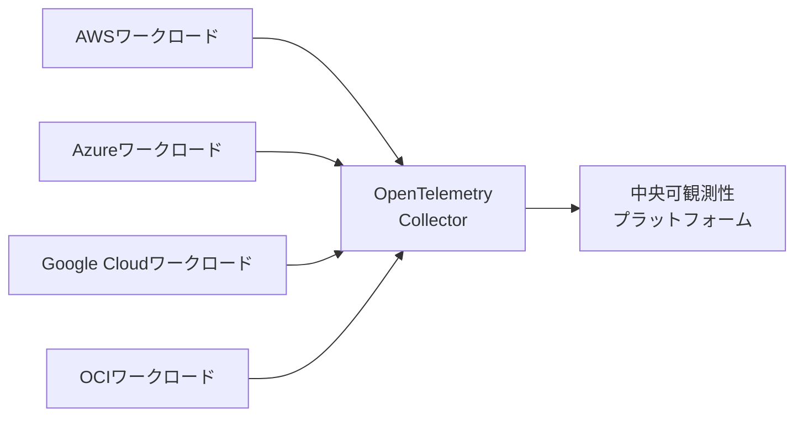
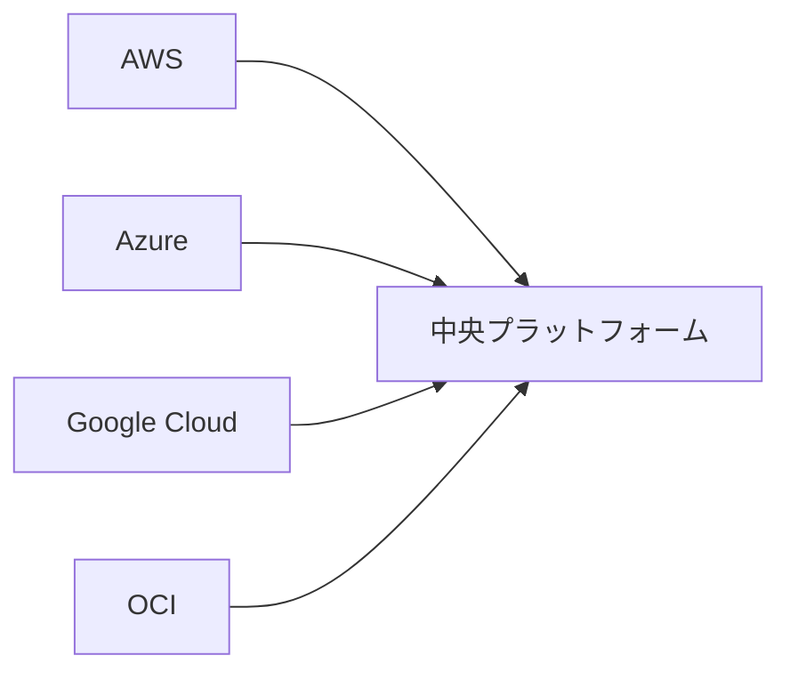
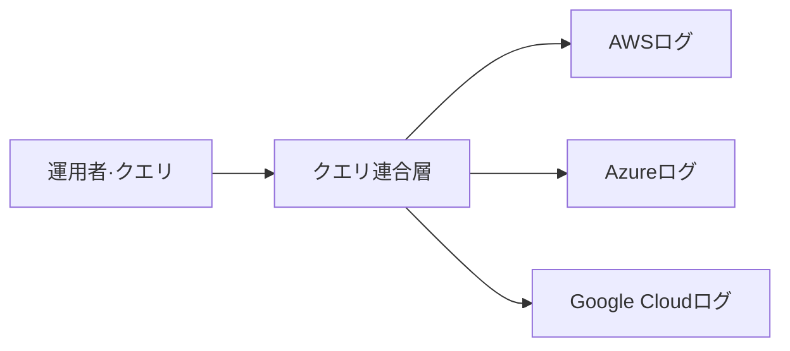

> 文書基準: 2026年8月

:::note
単一クラウドモニタリングの基礎は[モニタリング](../../devops/monitoring/)を参照してください。SLI/SLO/SLAの概念は[SLI/SLOとエラーバジェット](../../devops/slo/)で扱っています。本文書は**マルチクラウド環境でどのように可観測性を統合するか**に焦点を当てます。
:::

## なぜ統合が課題なのか

マルチクラウド環境では、各ベンダーが独自の可観測性ツールを提供します。

| ベンダー | ログ | メトリクス | トレース |
| --- | --- | --- | --- |
| AWS | CloudWatch Logs | CloudWatch Metrics | X-Ray |
| Azure | Azure Monitor Logs | Azure Monitor Metrics | Application Insights |
| Google Cloud | Cloud Logging | Cloud Monitoring | Cloud Trace |
| OCI | OCI Logging | OCI Monitoring | OCI APM |

これらのツールを個別に運用すると:

- **サイロ化** — 1つのリクエストが複数のクラウドを経由すると、全体の流れを追跡しにくい
- **重複コスト** — 各プラットフォームのライセンス、ストレージ、教育コスト
- **一貫性の欠如** — ダッシュボードとアラートが分散し、運用チームが混乱
- **ベンダーロックイン** — 特定のツールに深く依存すると移行コストが増加

## OpenTelemetry標準

[OpenTelemetry](https://opentelemetry.io/)はCNCFプロジェクトで、**ベンダー中立の可観測性標準**を提供します。ログ/メトリクス/トレースを統一された方式で収集します。

- **Language SDK** — 主要言語（Java、Python、Go、JavaScript、.NETなど）向けの計測ライブラリ
- **Collector** — データを収集・加工・転送するエージェント
- **Semantic Conventions** — 属性名/形式の標準（例: `http.method`, `service.name`）

ベンダー公式サポート:

- [AWS Distro for OpenTelemetry (ADOT)](https://aws-otel.github.io/)
- [Azure Monitor OpenTelemetry](https://learn.microsoft.com/azure/azure-monitor/app/opentelemetry-overview)
- [Google Cloud OpenTelemetry](https://cloud.google.com/stackdriver/docs/instrumentation/overview)
- [OCI OpenTelemetryサポート](https://docs.oracle.com/en-us/iaas/application-performance-monitoring/doc/configure-open-source-tracing-systems.html)

## 統合パターン

### 1. Fan-in（中央集約）

各クラウドワークロードのデータを1つの中央プラットフォームに送信します。

- **メリット** — 単一ダッシュボード、クロスクラウド相関分析
- **デメリット** — 中央プラットフォームが単一障害点になる、データ移動コスト
- **用途** — 一般的なマルチクラウド運用組織

### 2. Fan-out（クエリ連合）

各クラウドにデータを保持し、参照時点で複数のソースに同時クエリを実行します。

- **メリット** — データ移動なし、イグレスコスト削減
- **デメリット** — クエリの遅延、連合エンジンが必要
- **用途** — データ主権要件が厳格な場合（Grafanaのようなツールが対応）

### 3. ハイブリッド

重要なメトリクスのみ中央集約し、詳細ログは元の場所に保持します。

## サードパーティプラットフォーム比較

ほとんどの組織は、複数のクラウドで可観測性を統合するためにサードパーティプラットフォームを使用します。

| プラットフォーム | 特徴 | 備考 |
| --- | --- | --- |
| [Datadog](https://www.datadoghq.com/) | 統合ダッシュボード、幅広い連携、APMに強み | SaaS中心 |
| [New Relic](https://newrelic.com/) | フルスタックAPM、使用量ベースの価格 | SaaS |
| [Dynatrace](https://www.dynatrace.com/) | AIベースの自動異常検知（Davis AI） | エンタープライズ |
| [Splunk](https://www.splunk.com/) | ログ分析に強み、セキュリティ分析（SIEM）統合 | エンタープライズ |
| [Elastic Observability](https://www.elastic.co/observability) | オープンソースベース、柔軟な展開 | セルフホスティング可能 |
| [Grafana Cloud](https://grafana.com/products/cloud/) | Prometheus/Loki/Tempoのマネージド版 | OpenTelemetryフレンドリー |

## 自前構築スタック

クラウドの移植性とコスト管理が重要であれば、オープンソーススタックを自前で構築できます。

| 領域 | オープンソース |
| --- | --- |
| メトリクス | [Prometheus](https://prometheus.io/), [Thanos](https://thanos.io/), [VictoriaMetrics](https://victoriametrics.com/) |
| ログ | [Elasticsearch/OpenSearch](https://opensearch.org/), [Loki](https://grafana.com/oss/loki/) |
| トレース | [Jaeger](https://www.jaegertracing.io/), [Tempo](https://grafana.com/oss/tempo/) |
| ダッシュボード | [Grafana](https://grafana.com/) |
| コレクター | [OpenTelemetry Collector](https://opentelemetry.io/docs/collector/), [Fluent Bit](https://fluentbit.io/) |

CNCFの[Cloud Native Landscape — Observability](https://landscape.cncf.io/guide#observability-and-analysis)に全体のエコシステムがまとめられています。

## コストに関する考慮事項

可観測性のコストは通常、**収集量（GB）**と**保存期間（日数）**に比例します。マルチクラウドではイグレスコストまで考慮する必要があります。

### 主なコスト要因

- **ログ収集量** — アプリケーションのログレベル（DEBUG vs ERROR）によって10倍の差
- **メトリクスカーディナリティ** — タグの組み合わせが多いほど保存コストが増加（例: ユーザーID別メトリクス）
- **トレースサンプリング** — 全トレースの1〜10%のみ保存しても分析可能
- **クロスクラウドイグレス** — Fan-inパターンでは毎月数TBのデータが移動

### コスト削減戦略

- **サンプリング** — トレースは代表性のみ維持
- **圧縮/階層化** — 古いログは低コストのストレージへ移動
- **フィルタリング** — 収集段階で不要なログを除去
- **集約** — 生ログの代わりに集約済みメトリクスのみ中央へ送信
- **リージョン内処理** — 可能であればリージョン内で集約した後、メトリクスのみ送信

## マルチクラウド統合モニタリング（Single Pane of Glass）

AWS CloudWatch、Azure Monitor、Google Cloud Monitoringを個別に確認するのは非効率です。マルチクラウド環境では、**1か所ですべてのクラウドの状態を確認できる統合ダッシュボード**が必要です。

| アプローチ | 説明 | ツール |
| --- | --- | --- |
| **OpenTelemetry標準化** | ベンダー中立の計測 → 単一バックエンドで収集 | OTel Collector + Grafana/Datadog |
| **サードパーティ統合プラットフォーム** | すべてのベンダーのメトリクス/ログを1つのSaaSに統合 | Datadog, New Relic, Dynatrace, Splunk |
| **オープンソーススタック** | 自前運用、ベンダーロックインなし | Prometheus + Grafana + Loki + Tempo |

**統合モニタリング構成時の考慮事項:**

- 各ベンダーのネイティブメトリクスをOTelまたはPrometheus形式に変換
- アラートを単一チャネル（PagerDuty、Opsgenie）にルーティング
- ダッシュボードでベンダー別フィルタリングが可能なようにタグ/ラベルを標準化
- コスト: サードパーティSaaSはデータ収集量ベースの課金のため、ログボリュームの管理が必要

## 実装チェックリスト

マルチクラウド可観測性の導入時に確認すべき項目:

- [ ] OpenTelemetry標準を使用してベンダー依存の計測を回避する
- [ ] `service.name`、`environment`など共通タグ規約の定義
- [ ] トレースサンプリングポリシーの設定(ヘッドサンプリング/テールサンプリング)
- [ ] ログレベル別の収集/保存ポリシー策定(例: ERROR 90日、INFO 7日)
- [ ] クラウドネイティブメトリクス(CPU、ネットワーク)はベンダーツールを維持
- [ ] アプリケーションのメトリクス/トレースは中央プラットフォームに統合
- [ ] SLO定義とエラーバジェットダッシュボードの構成([SLI/SLOとエラーバジェット](../../devops/slo/)を参照)
- [ ] アラートルーティングの標準化(PagerDuty、Opsgenieなど単一統合)
- [ ] コストモニタリング(可観測性プラットフォーム自体のコスト)

## 継続的に取り組むべきこと

- **ダッシュボード/アラートの定期レビュー** — 四半期ごとにダッシュボードが現在のアーキテクチャを反映しているか確認します。
- **アラートノイズの除去** — 無視されるアラートは削除するか閾値を調整します。アラート疲れは実際の障害を見逃す原因になります。
- **SLOベースのアラートチューニング** — エラーバジェット消費速度ベースのアラートに切り替えるとノイズが減少します。

## よくある間違い

- **すべてのログをDEBUGレベルで中央プラットフォームに送信** — 収集コストが急増します。環境別のログレベルポリシー(本番はWARN以上)を策定してください。
- **メトリクスタグに高カーディナリティの値(ユーザーID、リクエストID)を使用** — 時系列の爆発により保存コストとクエリ性能が急激に悪化します。
- **トレースを100%サンプリングで運用** — ほとんどの正常なリクエストは分析価値が低いです。テールサンプリング(エラー/低速リクエストのみ保存)でコストを90%以上削減できます。

## 関連ドキュメント

- [モニタリング](../../devops/monitoring/)
- [SLI/SLO](../../devops/slo/)
- [プラットフォームエンジニアリング](../../devops/platform-engineering/)
- [セキュリティポスチャー管理](../../security/security-posture/)

## 参考資料

### 標準とオープンソース

- [OpenTelemetry公式ドキュメント](https://opentelemetry.io/docs/)
- [CNCF Observability TAG](https://github.com/cncf/tag-observability)
- [Cloud Native Observability Landscape](https://landscape.cncf.io/guide#observability-and-analysis)

### AWS

- [AWS Distro for OpenTelemetry (ADOT)](https://aws-otel.github.io/)
- [CloudWatchドキュメント](https://docs.aws.amazon.com/AmazonCloudWatch/latest/monitoring/)
- [AWS X-Rayドキュメント](https://docs.aws.amazon.com/xray/)

### Azure

- [Azure Monitor OpenTelemetry](https://learn.microsoft.com/azure/azure-monitor/app/opentelemetry-overview)
- [Application Insightsドキュメント](https://learn.microsoft.com/azure/azure-monitor/app/app-insights-overview)
- [Azure Monitorドキュメント](https://learn.microsoft.com/azure/azure-monitor/)

### Google Cloud

- [Google Cloud OpenTelemetry](https://cloud.google.com/stackdriver/docs/instrumentation/overview)
- [Cloud Loggingドキュメント](https://cloud.google.com/logging/docs)
- [Cloud Monitoringドキュメント](https://cloud.google.com/monitoring/docs)
- [Cloud Traceドキュメント](https://cloud.google.com/trace/docs)

### OCI

- [OCI APM OpenTelemetry](https://docs.oracle.com/en-us/iaas/application-performance-monitoring/doc/configure-open-source-tracing-systems.html)
- [OCI Loggingドキュメント](https://docs.oracle.com/en-us/iaas/Content/Logging/home.htm)
- [OCI Monitoringドキュメント](https://docs.oracle.com/en-us/iaas/Content/Monitoring/home.htm)
