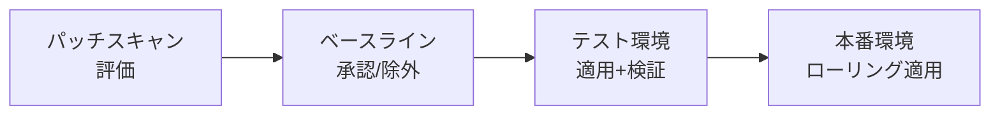
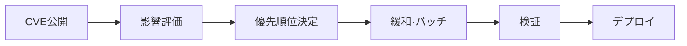

> 文書基準: 2026年8月

## 概要

クラウドインフラを運用すると、2つのセキュリティ課題が繰り返し発生します。

1. **定期パッチ** — OS、ランタイム、ミドルウェアのセキュリティアップデートを定期的に適用
2. **脆弱性対応** — CVEが公開された際に影響範囲を把握し、緊急パッチまたは緩和措置を実施

この2つは別個のプロセスですが、ツールとパイプラインが重なるため、あわせて扱います。

## 定期パッチ管理

### ベンダー別パッチ管理サービス

| ベンダー | サービス | 対象 | 特徴 |
| --- | --- | --- | --- |
| AWS | [Systems Manager Patch Manager](https://docs.aws.amazon.com/systems-manager/latest/userguide/systems-manager-patch.html) | EC2 (Linux/Windows) | パッチベースラインの定義、メンテナンスウィンドウのスケジューリング、コンプライアンスレポート |
| Azure | [Azure Update Manager](https://learn.microsoft.com/azure/update-manager/overview) | VM (Linux/Windows)、Arc接続サーバー | エージェントレス評価、スケジュールパッチ、事前/事後スクリプト |
| Google Cloud | [OS Patch Management](https://cloud.google.com/compute/docs/os-patch-management) | Compute Engine (Linux/Windows) | パッチジョブ(Patch Job) + パッチデプロイメント(Patch Deployment) |
| OCI | [OS Management Hub](https://docs.oracle.com/en-us/iaas/osmh/doc/home.htm) | Compute (Oracle Linux/Windows) | パッケージ管理、予約タスク、コンプライアンスレポート |

### パッチプロセス

1. **スキャン/評価** — 現在のインスタンスに不足しているパッチ一覧を確認
2. **ベースライン定義** — 自動承認するパッチ分類(Critical、Securityなど)と除外リストを設定
3. **テスト適用** — 非本番環境に先に適用し、互換性を検証
4. **本番ローリング** — メンテナンスウィンドウ内でグループごとに順次適用。失敗時は中断

### パッチ戦略

| 戦略 | 説明 | 適した環境 |
| --- | --- | --- |
| **Immutable Infrastructure** | パッチ済みの新しいAMI/イメージにインスタンスを置き換え | コンテナ、Auto Scalingグループ、サーバーレス |
| **In-place Patching** | 稼働中のインスタンスに直接パッチを適用 | 状態を保持するサーバー(DB、レガシーアプリ) |
| **Blue-Green** | パッチ済みの新環境を準備した後にトラフィックを切り替え | ダウンタイム最小化が必要な場合 |

:::note
**Immutable Infrastructureが可能であれば優先的に選択してください。** パッチ適用 = 新しいイメージのビルド + デプロイとなるため、パッチ状態が常に一貫し、ロールバックも容易です。コンテナ環境ではベースイメージのアップデート + 再デプロイがこれに該当します。イメージビルド時にセキュリティスキャンを自動化するには[DevSecOps](../../devops/devsecops/)を参照してください。
:::

## 脆弱性検知と対応

### ベンダー別脆弱性スキャンサービス

これらのサービスは[セキュリティポスチャー管理](../../security/security-posture/)のCWPP領域と重なります。ここではパッチ対応の観点から扱います。

| ベンダー | サービス | スキャン対象 | 特徴 |
| --- | --- | --- | --- |
| AWS | [Amazon Inspector](https://docs.aws.amazon.com/inspector/latest/user/what-is-inspector.html) | EC2、ECRイメージ、Lambda | エージェントレスの自動スキャン。CVE + ネットワーク到達可能性分析 |
| Azure | [Microsoft Defender for Cloud](https://learn.microsoft.com/azure/defender-for-cloud/defender-for-cloud-introduction) | VM、コンテナ、App Service、DB | CSPM + CWPP統合。脆弱性評価 + セキュリティ推奨事項 |
| Google Cloud | [Security Command Center](https://cloud.google.com/security-command-center/docs) + [Artifact Analysis](https://cloud.google.com/artifact-analysis/docs) | Compute Engine、GKE、Artifact Registry | 脆弱性 + 構成ミス + 脅威検知の統合 |
| OCI | [Vulnerability Scanning](https://docs.oracle.com/en-us/iaas/scanning/home.htm) | Compute、Container Registry | エージェントベースのホストスキャン + コンテナイメージスキャン |

### コンテナイメージの脆弱性スキャン

コンテナ環境では、イメージビルド時点で脆弱性を検知することが重要です。

| ベンダー | レジストリスキャン | CI/CD統合 |
| --- | --- | --- |
| AWS | ECRイメージスキャン(Inspector連携) | CodeBuild/CodePipelineでの自動スキャン |
| Azure | Defender for Containers(ACRスキャン) | Azure DevOps/GitHub Actions連携 |
| Google Cloud | Artifact Analysis(Artifact Registry) | Cloud Buildトリガーでの自動スキャン |
| OCI | Container Registryスキャン | DevOpsサービスパイプライン連携 |

### 脆弱性対応プロセス

| 段階 | 活動 | ツール例 |
| --- | --- | --- |
| **検知** | 脆弱性スキャナーがCVEをマッチング | Inspector, Defender, SCC |
| **影響評価** | CVSSスコア + 実際の露出有無(ネットワーク到達可能性、ランタイム使用有無) | Inspectorのネットワーク到達可能性、Defenderの攻撃経路分析 |
| **優先順位** | Critical + 外部露出 = 即時対応。Low + 内部のみ = 次回の定期パッチ | CVSS + EPSS + ビジネス影響度 |
| **緩和** | パッチ適用前の暫定措置(WAFルール、ネットワーク隔離、機能無効化) | WAF, Security Group, Feature Flag |
| **パッチ適用** | 定期パッチプロセスまたは緊急ホットフィックス | Patch Manager、イメージ再ビルド |
| **検証** | パッチ後の脆弱性再スキャン + サービス正常動作確認 | 再スキャン + スモークテスト |

### 緊急脆弱性(ゼロデイ)対応

定期パッチサイクルを待てない緊急事態への対応体制です。

| 段階 | 活動 |
| --- | --- |
| **1. 通知受信** | ベンダーのセキュリティ公告、CVEフィード、セキュリティニュースのモニタリング |
| **2. 影響範囲の把握** | 脆弱なパッケージ/バージョンを使用しているリソース一覧を即座に確認(SBOM活用) |
| **3. 即時緩和** | ネットワーク隔離、WAF仮想パッチ、脆弱な機能の無効化 |
| **4. 緊急パッチ** | ベンダーのパッチリリースを即座に適用(テスト縮小を許容するが、ロールバック計画は必須) |
| **5. 事後検証** | 全環境の再スキャン、侵害の痕跡(IOC)確認 |

:::caution
**SBOM (Software Bill of Materials)** を事前に管理していれば、緊急脆弱性発生時に影響範囲を数分以内に把握できます。AWS Inspector、Google Cloud Artifact AnalysisはSBOMの自動生成に対応しています。
:::

## 自動化のベストプラクティス

- **ゴールデンイメージパイプライン** — パッチ済みのベースイメージを定期的にビルドし、すべてのインスタンス/コンテナがこれを基盤にデプロイされる
- **コンプライアンスダッシュボード** — パッチ未適用インスタンスの比率をリアルタイムでモニタリング(目標: 95%以上の準拠)
- **SLAベースのパッチ期限** — Critical: 72時間以内、High: 7日以内、Medium: 30日以内(組織ポリシーに応じて調整)
- **自動チケット生成** — 脆弱性検知時にJira/ServiceNowチケットを自動生成して追跡
- **定期レポート** — 月間パッチ準拠率、平均パッチ適用時間(MTTP, Mean Time to Patch)、未解決脆弱性の推移

## よくある間違い

- **テストなしで本番環境に直接パッチを適用** — 互換性の問題によりサービス障害が発生します。必ず非本番環境で先に検証してください。
- **CVSSスコアのみで優先順位を決定** — 実際の攻撃可能性(EPSS)とネットワーク露出有無をあわせて考慮する必要があります。内部網専用サーバーのCritical CVEよりも、外部露出サーバーのHigh CVEの方が緊急性が高い場合があります。
- **SBOMを管理せず、緊急CVE発生時に影響範囲の把握に数日を要する** — Inspector/Artifact AnalysisのSBOM自動生成を有効化してください。

## チェックリスト

- [ ] パッチ未適用インスタンスの比率をリアルタイムでモニタリングしているか(目標: 95%以上の準拠)?
- [ ] Critical脆弱性に対するパッチSLA(例: 72時間以内)が定義されているか?
- [ ] コンテナベースイメージを定期的に再ビルドするゴールデンイメージパイプラインがあるか?

## 参考資料

### AWS

- [AWS Systems Manager Patch Manager](https://docs.aws.amazon.com/systems-manager/latest/userguide/systems-manager-patch.html)
- [Amazon Inspector](https://docs.aws.amazon.com/inspector/latest/user/what-is-inspector.html)

### Azure

- [Azure Update Manager](https://learn.microsoft.com/azure/update-manager/overview)
- [Microsoft Defender for Cloud](https://learn.microsoft.com/azure/defender-for-cloud/)

### Google Cloud

- [Google Cloud OS Patch Management](https://cloud.google.com/compute/docs/os-patch-management)
- [Google Cloud Security Command Center](https://cloud.google.com/security-command-center/docs)

### OCI

- [OCI OS Management Hub](https://docs.oracle.com/en-us/iaas/osmh/doc/home.htm)
- [OCI Vulnerability Scanning](https://docs.oracle.com/en-us/iaas/scanning/home.htm)

### 標準とコミュニティ

- [NIST Vulnerability Database (NVD)](https://nvd.nist.gov/)
- [FIRST EPSS (Exploit Prediction Scoring System)](https://www.first.org/epss/)
