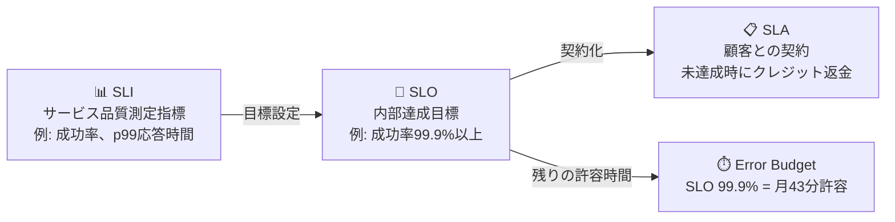

> 文書基準: 2026年8月

## 概要

:::note[前提知識と関連ドキュメント]
DevOpsの基本的な流れは[DevOpsを始める](../../devops/getting-started/)、メトリクス収集・モニタリングは[モニタリング](../../devops/monitoring/)と[可観測性](../../devops/observability/)を先に参照してください。本ドキュメントは、サービスの安定性を定量目標として定義するSLI/SLO/SLAに焦点を当てます。
:::

DevOps/SREにおいて「サービスが十分に安定しているか」を体系的に定義するフレームワークがSLI/SLO/SLAです。

| 用語 | 定義 | 例 |
| --- | --- | --- |
| **SLI** (Service Level Indicator) | サービス品質を測定する指標 | リクエスト成功率、応答時間p99、稼働時間比率 |
| **SLO** (Service Level Objective) | SLIに対する内部目標値 | 「月間リクエスト成功率99.9%以上」 |
| **SLA** (Service Level Agreement) | 顧客との契約。SLO未達成時の補償を含む | 「可用性99.95%未達成時にクレジット返金」 |

関係: **SLI**(測定) → **SLO**(目標) → **SLA**(契約)

## エラーバジェット (Error Budget)

SLO 99.9%は「1か月に約43分の障害が許容される」という意味です。この許容時間を**エラーバジェット**と呼びます。

| SLO | 月間許容障害時間 | 年間許容障害時間 |
| --- | --- | --- |
| 99% | 7時間18分 | 3日15時間 |
| 99.9% | 43分 | 8時間46分 |
| 99.95% | 21分 | 4時間23分 |
| 99.99% | 4分 | 52分 |

エラーバジェットが重要な理由:

- **デプロイ速度と安定性のバランス** — エラーバジェットが残っていれば新機能をデプロイでき、消尽すれば安定化に集中します。
- **チーム間の対立解消** — 「もっと速くデプロイしよう」vs「もっと安定的に運用しよう」の対立をデータで解決します。
- **投資判断の基準** — 99.9% → 99.99%に引き上げるにはコストが10倍以上増加する可能性があります。ビジネス要求に見合った適正水準を選択する必要があります。

## SLO設定の5段階

1. **SLIの選定** — ユーザー体験に直接影響を与える指標を選択します(例: API応答時間p99、エラー率、可用性)。
2. **現状水準の測定** — 直近30日間の実際のSLIを測定します。
3. **SLOの設定** — 現在の水準よりやや高めに設定します。最初から99.99%を目標にしないでください。
4. **エラーバジェットのモニタリング** — エラーバジェット消尽率をダッシュボードに表示し、消尽速度が速い場合はアラートを送信します。
5. **エラーバジェットポリシーの策定** — バジェット消尽時のデプロイ凍結、安定化スプリントなどのポリシーを事前に合意します。

:::note
**参考:** GoogleのSREの書籍[Site Reliability Engineering](https://sre.google/sre-book/table-of-contents/)でSLI/SLO/エラーバジェットの概念が体系化されました。
:::

## CSP SLA ≠ 自社サービスSLA

「CSPが99.99%のSLAを提供しているから自社サービスも99.99%だろう」というのはよくある誤解です。

| 区分 | CSP SLA | 自社サービスSLA |
| --- | --- | --- |
| **対象** | 個別コンポーネント(EC2、RDS、S3など) | エンドユーザーが体験するサービス全体 |
| **範囲** | 「このコンポーネントが停止しない」 | 「ユーザーが正常な応答を受け取る」 |
| **算出** | ベンダーが保証 | 自社がアーキテクチャで達成 |
| **補償** | SLA未達成時にクレジット返金 | 顧客離反、契約違反 |

### 直列構成における可用性の乗算

サービスがLB → App → DB → Cacheを経由する場合:

> 99.99% × 99.95% × 99.9% × 99.99% = **約99.83%**(年間約15時間のダウンタイム)

CSPがそれぞれ99.9%以上を保証していても、連結すると低下します。

### 可用性を高める方法

| パターン | 効果 | 例 |
| --- | --- | --- |
| 並列冗長化(Active-Active) | 1 - (1-A)² | マルチAZ、リージョン冗長化 |
| サーキットブレーカー / フォールバック | 依存関係の障害隔離 | キャッシュ障害時にDBを直接照会 |
| 非同期処理 | 同期依存の排除 | メッセージキューによる分離 |
| グレースフルデグレデーション | 一部機能のみ停止 | レコメンド失敗時にデフォルトリストを表示 |

### SLO > SLA(エラーバジェットの活用)

- 顧客に約束するSLA: 99.9%(年間8.7時間)
- 内部目標のSLO: 99.95%(年間4.4時間)
- 差分 = エラーバジェット → デプロイ、実験、メンテナンスに使用
- SLOをSLAと同じに設定するとエラーバジェットが0 → 何もできなくなる

## よくある間違い

- **SLOをSLAと同一に設定** — エラーバジェットが0になり、デプロイも実験もできなくなります。SLOはSLAより高く設定して余裕を確保しましょう。
- **サーバーメトリクス(CPU、メモリ)をSLIとして使用** — ユーザー体験と直接結びつきません。リクエスト成功率、応答時間p99などユーザー視点の指標を選択しましょう。
- **最初から99.99%を目標に設定** — 達成コストが指数関数的に増加します。現状水準を測定した上で段階的に引き上げましょう。

## チェックリスト

- [ ] SLIがユーザー体験に直接影響を与える指標(成功率、レイテンシ)として定義されているか?
- [ ] エラーバジェット消尽率をリアルタイムダッシュボードで確認できるか?
- [ ] エラーバジェット消尽時のデプロイ凍結などのポリシーがチーム間で事前合意されているか?

## 参考資料

- [Google SRE Book — Service Level Objectives](https://sre.google/sre-book/service-level-objectives/)
- [DORA Metrics](https://dora.dev/)
- [OpenSLO Specification](https://openslo.com/)
