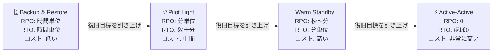

> 文書基準: 2026年5月

## DRとは

**災害復旧**（Disaster Recovery）とは、自然災害、ハードウェア障害、人的ミスなどによりサービスが中断した際に、あらかじめ定義した目標時間内にサービスを復旧させる計画とプロセスです。

## 災害の定義

DR計画を立てるには、まず「何を災害とみなすか」を定義する必要があります。災害は単一リソースの障害とは異なる次元の事象です。

### 災害の種類

| 分類 | 例 | 影響範囲 |
| --- | --- | --- |
| **自然災害** | 地震、洪水、台風、火災、停電 | 単一または複数のデータセンター、リージョン |
| **ハードウェア/インフラ障害** | 電源装置の故障、ネットワークバックボーンの断絶、ストレージクラスターの損傷 | 単一AZ〜リージョン |
| **ソフトウェア/プラットフォーム障害** | クラウドベンダーのリージョン単位のサービス障害、デプロイ失敗 | 単一サービス〜リージョン |
| **人的ミス** | 誤削除、誤った変更、構成ミス | 単一リソース〜アカウント全体 |
| **セキュリティインシデント** | ランサムウェア、データ漏洩、クレデンシャル窃取 | データ、アカウント、リージョン |
| **外部サプライチェーンの問題** | 外部API/サービスの停止、SaaSベンダーの障害 | 該当する依存範囲 |

### 災害レベルの分類

障害範囲に応じて災害のレベルを区分し、対応戦略を差別化して適用します。

| レベル | 定義 | 対応方針 |
| --- | --- | --- |
| **ローカル障害** | 単一サーバー、単一リソースの障害 | オートスケーリング、ヘルスチェックに基づく自動復旧 |
| **AZ障害** | 単一アベイラビリティゾーン全体の停止 | マルチAZ配置、AZ間の自動フェイルオーバー |
| **リージョン障害** | リージョン全体の停止（稀だが発生する） | クロスリージョンレプリケーション、リージョン間DR |
| **ベンダー障害** | クラウドベンダー全体の障害 | マルチクラウドDR（コスト/複雑度が高い） |

:::note
**要点:** AZ障害までは高可用性（HA）設計で、リージョン障害以上はDR設計で対応するのが一般的です。すべての障害をDRで解決しようとするとコストが過大になり、逆にDRなしでHAだけを構成すると、リージョン障害時に復旧不可能になります。
:::

### 災害と高可用性の違い

**高可用性**（High Availability、HA）は、個別の障害が発生してもサービスが中断しないようにする設計です。**DR**は、HAでは防げない規模の障害（リージョン単位の災害）に備える復旧戦略です。

| 観点 | 高可用性（HA） | 災害復旧（DR） |
| --- | --- | --- |
| **目標** | 中断のないサービス維持 | 災害後のサービス復旧 |
| **対象障害** | AZ以内の障害 | リージョン単位以上の障害 |
| **実装** | マルチAZ、ロードバランサー、自動フェイルオーバー | クロスリージョンレプリケーション、DRサイト |
| **コスト** | 相対的に低い | 高い（二重インフラ） |

## 主要指標: RPOとRTO

| 指標 | 定義 | ビジネス上の意味 |
| --- | --- | --- |
| **RPO**（Recovery Point Objective） | 復旧時に許容できる最大のデータ損失時間 | 「最大何分/何時間前のデータまで失ってよいか？」 |
| **RTO**（Recovery Time Objective） | 障害発生後、サービス復旧までに許容できる最大時間 | 「最大何分/何時間以内にサービスを復旧させる必要があるか？」 |

RPOとRTOはビジネス要件から導き出されます。技術チームが任意に決めるのではなく、ビジネス影響度分析（BIA）を通じて決定します。

## ビジネス目標とのアラインメント

### ビジネス影響度分析（BIA）

DR目標を設定する前に、まず次のことを定義する必要があります。

1. **主要ビジネスプロセスの特定** — どのシステムが停止すると売上/顧客に直接影響するか？
2. **中断コストの算定** — 時間当たり/分当たりの中断コストはいくらか？（売上損失、違約金、評判の毀損）
3. **RPO/RTOの導出** — 中断コストとDR構築コストのバランス点で目標を設定
4. **ティア分類** — すべてのシステムに同一のDRレベルを適用するとコストが過大になる。重要度別にティア分類する

| ティア | RPO | RTO | DR戦略 | 例 |
| --- | --- | --- | --- | --- |
| **Tier 1**（ミッションクリティカル） | 0（データ損失不可） | 数分 | Active-Active / Hot Standby | 決済システム、取引プラットフォーム |
| **Tier 2**（ビジネスクリティカル） | 数分〜1時間 | 1〜4時間 | Warm Standby | 注文管理、CRM |
| **Tier 3**（一般業務） | 数時間〜24時間 | 24時間 | Pilot Light / Backup & Restore | 内部ツール、開発環境 |

## DR戦略のタイプ

| 戦略 | RPO | RTO | コスト | 説明 |
| --- | --- | --- | --- | --- |
| **Backup & Restore** | 時間単位 | 時間単位 | 低い | 定期バックアップ後、障害時に復元。最も安価だが最も遅い |
| **Pilot Light** | 分単位 | 数十分 | 中間 | コアインフラのみ最小規模で常時稼働。障害時にスケールアップ |
| **Warm Standby** | 秒〜分 | 分単位 | 高い | 縮小規模の全環境を常時稼働。障害時にスケールアップ |
| **Active-Active** | 0 | ほぼ0 | 非常に高い | 2つのリージョンで同時にトラフィックを処理。障害時は自動フェイルオーバー |

## 戦略別実装 — ベンダーサービスのマッピング

上記の戦略を実際に実装する際に使用するベンダーサービスです。

### Backup & Restoreの実装

データを別リージョンに複製しておき、障害時にそのリージョンでインフラを新規作成して復元します。

| 役割 | AWS | Azure | Google Cloud | OCI |
| --- | --- | --- | --- | --- |
| ストレージレプリケーション | S3 Cross-Region Replication | Geo-Redundant Storage (GRS) | Multi-region Storage | Cross-Region Copy |
| DBバックアップレプリケーション | RDS自動バックアップのクロスリージョンコピー | Azure SQL Geo-Backup | Cloud SQLクロスリージョンバックアップ | Data Guard (Standby) |
| インフラ再生成 | CloudFormation / Terraform | ARM / Bicep / Terraform | Terraform | Resource Manager / Terraform |

### Pilot Light〜Warm Standbyの実装

DRリージョンにコアインフラを最小/縮小規模で常時稼働させ、障害時にスケールアップします。

| 役割 | AWS | Azure | Google Cloud | OCI |
| --- | --- | --- | --- | --- |
| DRオーケストレーション | Elastic Disaster Recovery (DRS) | Azure Site Recovery | —（アーキテクチャパターンとして構成） | Full Stack DR |
| DBリアルタイムレプリケーション | RDS Cross-Region Read Replica、Aurora Global DB | Azure SQL Geo-Replication | Cloud SQL Cross-Region Replica | Data Guard (Active) |
| トラフィック切り替え | Route 53 Failover | Traffic Manager / Front Door | Cloud DNS + Global LB | DNS Traffic Management |

### Active-Activeの実装

2つのリージョンで同時にトラフィックを処理し、片方が障害となった場合は残りが全体を吸収します。

| 役割 | AWS | Azure | Google Cloud | OCI |
| --- | --- | --- | --- | --- |
| グローバルルーティング | Route 53 + Global Accelerator | Front Door | Global HTTP(S) LB | DNS Traffic Management |
| グローバルDB | Aurora Global Database、DynamoDB Global Tables | Cosmos DB (Multi-region Write) | Spanner | Autonomous DB (Cross-Region) |
| 状態同期 | ElastiCache Global Datastore | Azure Cache Geo-Replication | Memorystore Cross-Region | — |

## DRテスト

DR計画はテストしなければ意味がありません。実際の障害時に計画通りに動作するかを定期的に検証する必要があります。

### テストの種類

| 種類 | 説明 | 頻度 |
| --- | --- | --- |
| **Tabletop Exercise** | シナリオベースの討議。実際のシステム変更なし | 四半期ごと |
| **Walkthrough Test** | 復旧手順を段階的に実行するが、本番環境への影響はなし | 半期ごと |
| **Simulation Test** | 実際のフェイルオーバーを実施するが、限定された範囲で | 年1回 |
| **Full Interruption Test** | 本番リージョンを実際に停止し、DRリージョンへ切り替え | 年1回（任意） |

### テスト時の確認事項

- 実際のRTOが目標RTO以内か？
- 実際のRPOが目標RPO以内か？（データ損失量の確認）
- フェイルバック（元のリージョンへの復帰）手順は動作するか？
- ランブック/自動化スクリプトは最新の状態か？
- 担当者は手順を熟知しているか？

:::note
DR計画は**必ず定期的にテスト**する必要があります。実際に障害が発生したときに初めて復旧手順を実行すると、RTOを達成できません。最低でも年1回、Simulation TestまたはWalkthrough Testを実施し、ランブックを最新の状態に保ちましょう。
:::

### Chaos Engineeringとの関係

DRテストを超えて、日常的に障害を注入してシステムの復元力を検証するのがChaos Engineeringです。

| ベンダー | ツール |
| --- | --- |
| AWS | [AWS Fault Injection Service](https://docs.aws.amazon.com/fis/) |
| Azure | [Azure Chaos Studio](https://learn.microsoft.com/en-us/azure/chaos-studio/) |
| Google Cloud | —（サードパーティ: Gremlin、LitmusChaos） |
| OCI | —（サードパーティ: Gremlin、LitmusChaos） |

## 国・規制別のDRリージョン

セカンダリリージョンを選ぶときは、遅延だけでなく**データが管轄外に出るか**を併せて見ます。同じ国内にリージョンペアがあれば in-country DR が可能で、近隣国リージョンを使うと国外移転要件が発生します。国別のプライマリ・セカンダリ候補は各ガイドを参照してください。

- [韓国](../../korea/) — ソウル・釜山・春川、国内DR可能なベンダー、個人情報の国外移転
- [米国](../../us/) — FedRAMP、データレジデンシー
- [EU](../../eu/) — GDPR、ソブリンクラウド
- [日本](../../japan/) — ISMAP、ガバメントクラウド
- [シンガポール](../../singapore/) — MTCS、PDPA

:::caution
管轄外リージョンをDR対象として使う場合は、当該国の個人情報国外移転・データレジデンシー要件を満たす必要があります。データ主権が厳しいワークロードは、in-country DRが可能なベンダーを優先的に検討してください。
:::

## よくある間違い

- **DR計画を立てたが一度もテストしない** — 実際の障害時にランブックが古くなっており手順が機能せず、RTOを達成できない
- **すべてのシステムに同一のDR戦略を適用する** — コストを考慮せず全てをActive-Activeで設計するか、逆に全てをBackup & Restoreのまま放置する
- **管轄外DRリージョン使用時にデータ主権を未検討** — 個人情報の国外移転・レジデンシー要件を確認せず規制違反となる

## チェックリスト

- [ ] ワークロードごとのRPO/RTOをビジネス影響度分析（BIA）に基づいて定義したか
- [ ] DRテスト（最低でもWalkthrough）を年1回以上実施し、ランブックを最新の状態に保っているか
- [ ] 管轄外DRリージョン使用時に、データの国外移転に関する法的要件を満たしているか

## 既存ドキュメントとの連携

- [リージョンとアベイラビリティゾーン](../../about-cloud/regions-and-zones/)
- [バックアップと復旧](../../storage/backup/)
- [Well-Architected Framework](../../about-cloud/well-architected/)

## 参考資料

### AWS

- [AWS Disaster Recovery ホワイトペーパー](https://docs.aws.amazon.com/whitepapers/latest/disaster-recovery-workloads-on-aws/disaster-recovery-workloads-on-aws.html)
- [AWS Elastic Disaster Recovery](https://docs.aws.amazon.com/drs/)
- [AWS Fault Injection Service](https://docs.aws.amazon.com/fis/)

### Azure

- [Azure Site Recovery ドキュメント](https://learn.microsoft.com/en-us/azure/site-recovery/)
- [Azure 事業継続性](https://learn.microsoft.com/en-us/azure/reliability/business-continuity-management-program)
- [Azure Chaos Studio](https://learn.microsoft.com/en-us/azure/chaos-studio/)

### Google Cloud

- [Google Cloud DR計画ガイド](https://cloud.google.com/architecture/dr-scenarios-planning-guide)
- [Google Cloud 災害復旧アーキテクチャ](https://cloud.google.com/architecture/disaster-recovery)

### OCI

- [OCI Full Stack DR](https://docs.oracle.com/en-us/iaas/disaster-recovery/index.html)
- [OCI 事業継続性ガイド](https://docs.oracle.com/en-us/iaas/disaster-recovery/index.html)
