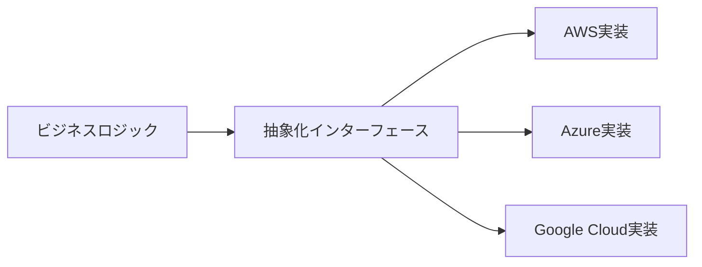

> 文書基準: 2026年5月

## なぜ出口戦略が必要か

単一ベンダーへの統合を深めるほど、**価格交渉力が低下し**、ベンダーのポリシー変更（値上げ、サービス終了、地域からの撤退）に対して脆弱になります。EU DORAなど一部の管轄では、金融業界に**Exit Planの文書化**を義務付けています。国別の義務は[韓国](../../korea/) · [米国](../../us/) · [EU](../../eu/) · [日本](../../japan/) · [シンガポール](../../singapore/)ガイドを参照してください。

重要な誤解:

:::caution
**「依存度0%」は非現実的であり、しばしば逆効果です。** マネージドサービスの利点（運用負担の軽減、セキュリティの自動化、高い可用性）を放棄してまで完全なポータビリティを追求すると、かえって競争力が低下します。目標は**依存の排除ではなく「許容可能な水準の依存」を選択すること**です。
:::

[AWS Prescriptive Guidance](https://docs.aws.amazon.com/prescriptive-guidance/latest/strategy-multicloud-fsi/vendor-lockin.html)も同様の立場を示しています——「*依存の防止は、技術的な決定よりも組織の人材・プロセスに大きく依存する*」。

## 依存の4つの側面

| 側面 | 説明 | 例 |
| --- | --- | --- |
| **データ依存** | データ形式、ストレージ、イグレスコスト | S3専用フォーマット、Cosmos DB専用API、ペタバイト級データのイグレス |
| **API依存** | 特定ベンダーのSDK/APIに合わせたコード | Lambdaイベントオブジェクト、Azure Durable Functionsの状態管理 |
| **アーキテクチャ依存** | ベンダー固有のサービスに基づく設計 | Step Functionsワークフロー、Cosmos DB専用機能 |
| **運用依存** | チームのスキルとツールチェーンの偏り | CloudFormationのみを使うチーム、Azure DevOpsパイプライン |

## 依存レベルとトレードオフ

サービスごとに依存の程度は異なります。一般的に**下位レイヤー（IaaS）ほど低く、上位レイヤー（マネージドサービス）ほど高くなります。**

| レベル | 依存度 | 移植性 | 管理負担 | 代表例 |
| --- | --- | --- | --- | --- |
| **IaaS（VM）** | 低い | 高い | 高い | EC2、Azure VM、Compute Engine |
| **コンテナ（Kubernetes）** | 非常に低い | 非常に高い | 中程度 | EKS/AKS/GKE/OKE |
| **オープンソースマネージド** | 中程度 | 中程度 | 低い | PostgreSQL/Valkey/Kafkaマネージド |
| **クラウドネイティブPaaS** | 高い | 低い | 非常に低い | Aurora、Cosmos DB、BigQuery |
| **サーバーレス（FaaS）** | 非常に高い | 非常に低い | 非常に低い | Lambda、Azure Functions、Cloud Run |

選択は「**管理負担の軽減 vs. 移植性の確保**」のトレードオフです。ほとんどの組織は一点に集中せず、ワークロードの特性に応じて複数の地点を併用します。

## ポータビリティのための設計原則

### 1. 標準オープンソースを優先

可能な箇所では**業界標準のオープンソースインターフェース**を選択します。

| カテゴリ | 移植性が高い選択 | 移植性が低い選択 |
| --- | --- | --- |
| コンテナオーケストレーション | Kubernetes (EKS/AKS/GKE/OKE) | ECS、Service Fabric |
| リレーショナルDB | PostgreSQL/MySQL互換（Aurora PostgreSQL、Cloud SQL） | Cosmos DB独自API、DynamoDB |
| キャッシュ | Valkey/Redis互換（ElastiCache、Cache for Redis） | ベンダー独自キャッシュ |
| メッセージキュー | Kafka互換（MSK、Event Hubs for Kafka） | SQS、Service Bus |
| コンテナイメージ | OCI標準イメージ（ECR、ACR、Artifact Registry） | ベンダー専用デプロイフォーマット |
| 認証 | OIDC/SAML | ベンダー専用SDK認証 |

### 2. IaCでインフラを定義

IaCはポータビリティの基盤です。Terraformはマルチクラウド定義を単一のツールで管理でき、移植性が最も高くなります。

| ツール | マルチクラウド対応 | 移植性 |
| --- | --- | --- |
| [Terraform / OpenTofu](https://www.terraform.io/) | 主要ベンダー＋サードパーティ | 非常に高い |
| [Pulumi](https://www.pulumi.com/) | 主要ベンダー | 高い |
| [Crossplane](https://www.crossplane.io/) | Kubernetesベースの抽象化 | 高い |
| AWS CloudFormation | AWS専用 | 低い |
| Azure Bicep / ARM | Azure専用 | 低い |
| Google Cloud Deployment Manager | Google Cloud専用 | 低い |
| OCI Resource Manager | OCI専用（Terraformベース） | 中程度 |

:::note
IaCツールの詳細な比較は[IaC](../../devops/iac/)を参照してください。
:::

### 3. 抽象化レイヤー

ベンダー依存のコードがアプリケーションのビジネスロジックに広がらないよう隔離します。

代表的な抽象化ライブラリ/フレームワーク:

- **ストレージ**: Go Cloud Development Kit、Apache Libcloud
- **メッセージ**: CloudEvents (CNCF)
- **AI**: LangChain、LlamaIndex（LLM抽象化）
- **Kubernetes**: Knative Serving、Dapr

:::note
抽象化は「**最小公倍数**」を強制するため、各ベンダー固有の機能が使いにくくなるという欠点があります。チームが実際に複数のベンダーへ移行する計画がない場合、抽象化のコストが依存のコストを上回ることがあります。
:::

### 4. データポータビリティ

- **標準フォーマット** — Parquet、Avro、JSON、CSV
- **定期バックアップを中立的な場所に保存** — 別リージョン/ベンダー/オンプレミス
- **イグレスコストの認識** — ペタバイト級のデータはイグレスコストが数千万円〜数億円に達する
- **オフライン転送の活用** — [ストレージマイグレーション](../../storage/migration/)を参照

## Exit実行計画

金融業界/規制産業で求められるExit Planの一般的な構成要素:

### 1. 資産インベントリ

- ワークロード、データ、依存サービスの一覧
- 各項目の依存レベル（高/中/低）
- 移行の優先順位と難易度

### 2. トリガーシナリオ

どのような状況でExitを実行するか:

- ベンダーによる一方的な値上げ（契約上の上限を超過）
- コアサービスの終了告知
- 規制変更によるベンダー利用制限
- ベンダーのセキュリティインシデント/信頼喪失
- M&Aによる戦略変更

### 3. 移行手順

- ターゲット環境の準備（別ベンダーまたはオンプレミス）
- データ移行の順序（マイグレーションウェーブ、[アプリケーションマイグレーション](../../compute/migration/)を参照）
- デュアルラン期間（2つの環境の並行運用）
- レガシー終了基準

### 4. コスト見積もり

- データイグレス
- マイグレーションツール/人員
- 運用停止コスト
- 新環境の構築

### 5. 定期検証

- 年1回のExit Planレビュー
- 主要アーキテクチャ変更時の影響分析
- 競合ベンダーとのPoCによる実際の移行可能性の確認

## よくある間違い

- **依存の排除を目標にマネージドサービスをすべて放棄する** — 移植性のためにすべてをKubernetes上で直接運用し、運用負担とコストがかえって増加する
- **Exit Planを文書化するだけで検証しない** — 年1回の競合ベンダーPoCや実際の移行テストを行わず、計画が現実と乖離する
- **イグレスコストを事前に見積もらない** — ペタバイト級データのイグレスコストが数億円に達し得ることを見落とす

## チェックリスト

- [ ] ワークロードごとの依存レベル（高/中/低）をインベントリとして管理しているか
- [ ] Exitトリガーシナリオ（値上げ、サービス終了、規制変更）を定義したか
- [ ] 年1回Exit Planをレビューし、主要アーキテクチャ変更時に影響分析を実施しているか

## 参考資料

### AWS

- [AWS Prescriptive Guidance — Building a multicloud strategy (FSI)](https://docs.aws.amazon.com/prescriptive-guidance/latest/strategy-multicloud-fsi/welcome.html)
- [AWS Prescriptive Guidance — Vendor lock-inの考慮事項](https://docs.aws.amazon.com/prescriptive-guidance/latest/strategy-multicloud-fsi/vendor-lockin.html)

### Azure

- [Microsoft EU Data Boundary](https://learn.microsoft.com/privacy/eudb/eu-data-boundary-learn)
- [Azureサービス終了告知](https://azure.microsoft.com/updates/?status=retirement)

### Google Cloud

- [Google Cloud Data Processing and Security Terms](https://cloud.google.com/terms/data-processing-addendum)
- [Google Cloudサービス終了告知](https://cloud.google.com/terms/deprecation)

### OCI

- [Oracle Cloud Hosting and Delivery Policies](https://www.oracle.com/corporate/contracts/cloud-services/)

### 標準および規制

- [CNCF Cloud Native Trail Map](https://landscape.cncf.io/)
- [EU DORA (Digital Operational Resilience Act)](https://www.eiopa.europa.eu/digital-operational-resilience-act-dora_en)
- [Martin Fowler — Strangler Fig Application](https://martinfowler.com/bliki/StranglerFigApplication.html)
