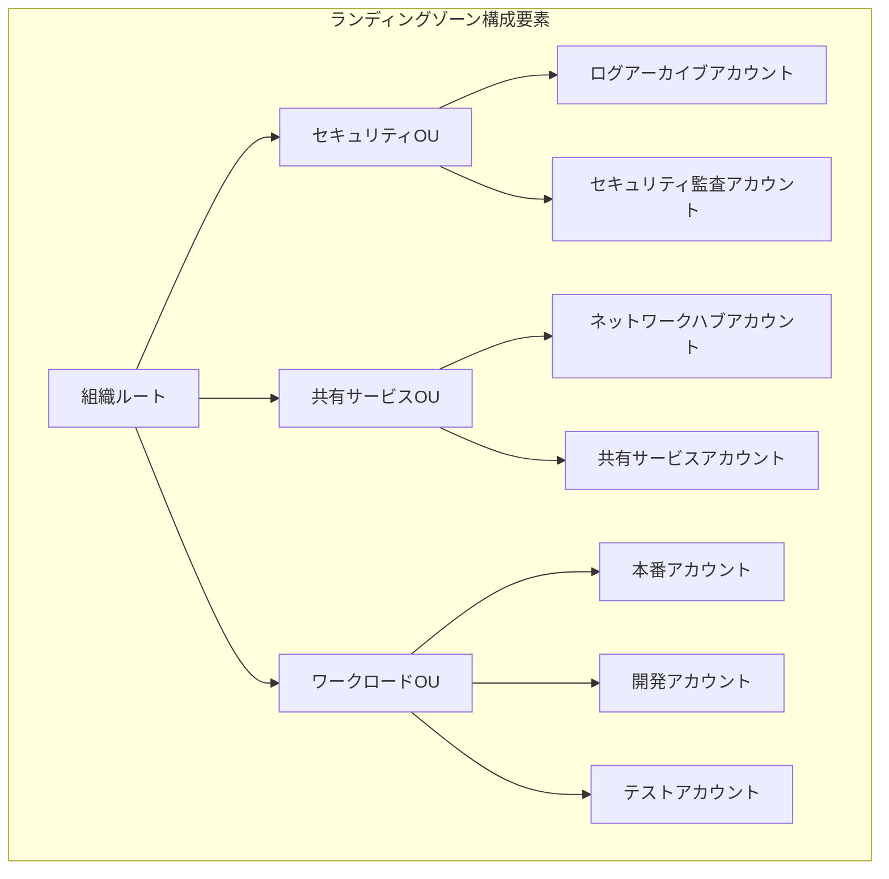

> 文書基準: 2026年7月

## ランディングゾーンとは

ランディングゾーン（Landing Zone）は、マルチアカウントクラウド環境を安全かつ一貫して運用するための基盤設定です。一般的に次の要素を含みます:

:::note
アカウント/組織の基本概念、請求構造、クォータ管理については[アカウントと組織構造](../../about-cloud/accounts-and-organizations/)を参考にしてください。本ドキュメントは、その上に構築する**実装ガイド**です。
:::

- **ネットワーク**: 標準化されたVPC/VNet構造、ハブ・スポークトポロジー、接続ポリシー
- **セキュリティ**: アカウント間のセキュリティ境界、暗号化ポリシー、脅威検知
- **ロギング**: 中央集約型のログ収集、監査証跡、コンプライアンス証跡
- **ガードレール**: 予防的・検知的ポリシーにより組織全体に一貫したガバナンスを適用

ランディングゾーンを通じて、新しいワークロードアカウントを迅速かつ安全にプロビジョニングでき、組織のセキュリティ・コンプライアンス要件を自動的に適用できます。

:::note
ランディングゾーンは特定の製品一つではなく、アカウント構造、ネットワーク、セキュリティ、ロギング、ポリシーを併せて設計した運用基盤です。
:::

## 主要CSPランディングゾーン比較

| 項目 | AWS | Azure | Google Cloud | OCI |
| --- | --- | --- | --- | --- |
| サービス名 | [AWS Control Tower](https://aws.amazon.com/controltower/) | [Azure Landing Zone](https://learn.microsoft.com/en-us/azure/cloud-adoption-framework/ready/landing-zone/) | [Google Cloud Foundation Toolkit](https://cloud.google.com/foundation-toolkit) | [OCI Landing Zone](https://docs.oracle.com/en/solutions/cis-oci-benchmark/) |
| アカウント構造 | AWS Organizations + OU | Management Group + Subscription | Organization + Folder + Project | Tenancy + Compartment |
| ガードレール | Controls（予防的/検知的/事前予防的） | Azure Policy + Deployment Stacks | Organization Policy | CIS Benchmarkベースのポリシー |
| ネットワーク基本構造 | VPC + Transit Gateway | Hub-Spoke VNet + Azure Firewall | Shared VPC + Cloud Interconnect | Hub-Spoke VCN + DRG |
| IaC提供 | AWS CloudFormation（標準搭載） | Bicep / Terraformモジュール | Terraformモジュール | Terraformモジュール |
| ロギング | AWS CloudTrail + Config | Activity Log + Defender for Cloud | Cloud Audit Logs + Security Command Center | Audit + Cloud Guard |

## 設計チェックリスト

ランディングゾーンを設計する際は、次の項目をまず整理します。

- **組織構造** — アカウント、サブスクリプション、プロジェクト、コンパートメントをどのような基準で分けるかを決定します。
- **環境分離** — 本番、開発、テスト、セキュリティ、共有サービスアカウントを分離します。
- **ネットワーク境界** — ハブ・スポーク、インターネット入口点、オンプレミス接続方式を定めます。
- **ID連携** — 社内IdP、SSO、MFA、管理者権限付与方式を標準化します。
- **ロギングと監査** — すべてのアカウントの監査ログを中央リポジトリに収集します。
- **ガードレール** — 禁止リージョン、パブリックストレージの遮断、暗号化強制といったポリシーを自動適用します。

## 導入順序

| 段階 | 説明 |
| --- | --- |
| 1 | 最小限のアカウント構造と中央ログリポジトリを最初に構築します。 |
| 2 | ネットワーク、セキュリティ、IAM標準をIaCでテンプレート化します。 |
| 3 | 新規ワークロードアカウントの作成手順を自動化します。 |
| 4 | ポリシー違反の検知と例外承認プロセスを運用します。 |

:::caution
ランディングゾーンを一度に完璧に作ろうとすると、導入が遅延する可能性があります。中央ロギング、管理者権限の統制、必須のセキュリティガードレールから始め、反復的に拡張していくのが現実的です。
:::

## マルチアカウントVPC分離パターン

ランディングゾーンにおいてVPC設計は中核要素です。ワークロードごとにVPCを分離してセキュリティ境界を作り、共有サービスは中央VPCに配置します。

### ワークロード別分離

| 分離基準 | 例 | 理由 |
| --- | --- | --- |
| 環境別 | dev / staging / prod VPC | 本番の隔離、ミス防止 |
| チーム/サービス別 | チームA VPC / チームB VPC | セキュリティ境界、独立運用 |
| 規制別 | PCI VPC / 一般VPC | コンプライアンス対象範囲の最小化 |

### 共有サービスVPC

ロギング、セキュリティツール、DNS、プロキシなどを中央VPCに配置し、他のVPCからアクセスするパターンです。

### ベンダー別実装

| ベンダー | アカウント/プロジェクト分離 | VPC共有 | ハブ接続 |
| --- | --- | --- | --- |
| AWS | Organizations + OU | RAMでサブネット共有 | Transit Gateway |
| Azure | サブスクリプション別分離 | Hub-Spoke VNet | Virtual WAN |
| Google Cloud | Shared VPC（ホスト+サービスプロジェクト） | ホストプロジェクトでサブネット共有 | VPC Peering / NCC |
| OCI | Compartment分離 | — | DRGハブ |

### CIDR計画

アカウント/プロジェクト間のIPアドレス帯の衝突を防ぐため、事前にCIDRブロックを割り当てます。

- 組織全体に`/8`または`/10`帯を予約し、アカウント/環境ごとに`/16`〜`/20`単位で配分
- VPCピアリング/Transit Gateway接続時にCIDRが重複しているとルーティング不可
- 将来の拡張を考慮して余裕を持って割り当て（サブネット追加、新規アカウント作成）

ネットワーク設計の詳細は[VPCとサブネット](../../networking/vpc-subnet/)を参考にしてください。

## ランディングゾーン導入チェックリスト

- [ ] 組織構造（OU/フォルダ/コンパートメント）の設計を完了したか
- [ ] 環境分離戦略を決定したか（本番/ステージング/開発/セキュリティ/共有サービス）
- [ ] ネットワークトポロジーを決定したか（Hub-Spoke、中央エグレス）
- [ ] ガードレール（予防的/検知的ポリシー）を定義したか
- [ ] 中央ロギングアカウントを構成したか（CloudTrail/Activity Logの集約）
- [ ] セキュリティ監査アカウントを分離したか
- [ ] IDプロバイダー（IdP）を連携したか（SSO/SAML）
- [ ] コスト配分タグポリシーを定義したか
- [ ] 新規アカウントの自動プロビジョニングパイプラインを構成したか（IaC）
- [ ] Break-glass（緊急アクセス）手順を文書化したか

## よくある間違い

- **CIDR計画なしにVPCを作成** — 後でVPCピアリング/Transit Gateway接続時にIPアドレス帯が衝突しルーティングが不可能になる
- **中央ロギングなしにワークロードアカウントから作成** — 監査ログが各アカウントに分散し、セキュリティインシデント発生時に統合調査が不可能
- **ガードレールなしにアカウントを展開** — 開発者が誤ってパブリックS3バケットを作成したり、禁止リージョンにリソースを作成する事故が発生

## 関連ドキュメント

- [IAM実務設計とセキュリティ運用](../../security/iam/)
- [VPCとサブネット](../../networking/vpc-subnet/)
- [FinOps](../../governance/finops/)

## 2025-2026年 ランディングゾーンの進化

### モジュール化: コントロール専用モデル

**AWS Control Tower Landing Zone 4.0**（2025年11月）は、「単一の強制されたブループリント」というアプローチから脱却し、**コントロールのみを適用し、残りは選択できる**モジュール型へと転換しました。

| 従来 | LZ 4.0以降 |
| --- | --- |
| Control Tower設定時に固定されたOU/アカウント構造を作成 | 既存の組織構造を維持しながらコントロールのみ適用可能 |
| すべてのサービス統合がパッケージとして提供 | サービス統合（Config、CloudTrailなど）を選択的に有効化 |
| 大規模組織でのカスタマイズが困難 | 既存のIaCパイプラインと並行可能 |

AzureのCloud Adoption Framework（CAF）もモジュール式のランディングゾーンアーキテクチャを継続的に拡張しており、Google Cloud Foundation ToolkitはTerraformモジュールベースで同様の選択的適用をサポートしています。

### ソブリンランディングゾーン (Sovereign Landing Zone)

データ主権（Data Sovereignty）の要求が強化される中、データの保存だけでなく**処理まで管轄権内で実行**するランディングゾーンが登場しました。

| ベンダー | ソリューション | 主要機能 | 時期 |
| --- | --- | --- | --- |
| Microsoft | [Cloud for Sovereignty — SLZ + Sovereign Public Cloud](https://learn.microsoft.com/en-us/industry/sovereignty/slz-overview) | データレジデンシーガードレール、機密コンピューティング、EU Data Boundary、Data Guardian、IaCポリシー | 2025-2026 |
| Google Cloud | [Sovereign Cloud Controls](https://cloud.google.com/blog/products/identity-security/delivering-a-secure-open-sovereign-digital-world) | 管轄権内での処理、鍵管理、アクセス透明性 | 2025-2026 |
| AWS | [Sovereign Controls (Control Tower + Nitro)](https://aws.amazon.com/compliance/digital-sovereignty/) | リージョン制限ガードレール、Nitro機密コンピューティング、データレジデンシーポリシー | 既存（継続的に強化） |
| OCI | EU Sovereign Cloud | 物理的に分離されたEU専用インフラ | 既存 |

:::note
ソブリンランディングゾーンとは、単に「EUリージョンに配置する」ことではありません。データ処理（compute）、鍵管理、管理アクセス（personnel access）に至るまで管轄権内に制限することです。2025年11月にESAs（EBA・EIOPA・ESMA）がAWS、Azure、GCPを**Critical ICT Third-Party Provider**に指定したことで、金融・公共分野におけるソブリン要件が今後さらに強化されると予想されます。
:::

### EU規制連携

| 規制 | ランディングゾーンへの影響 |
| --- | --- |
| **DORA**（2025年1月17日適用） | 金融機関のICTサードパーティリスク管理義務 → クラウドベンダーを重要ICT供給者として管理、出口戦略が必須 |
| **NIS2** | 重要インフラ運用者のセキュリティ義務強化 → ランディングゾーンレベルのガバナンス証跡が必要 |
| **EU AI Act**（GPAI透明性2026.08適用; 高リスクAIはDigital Omnibusにより延期 — 独立型2027.12、製品内蔵2028.08） | 高リスクAIシステムのデータガバナンス → ランディングゾーンにAIワークロード別のデータ分類/アクセス制御を含む |

## 参考資料

### AWS

- [AWS Control Tower ドキュメント](https://docs.aws.amazon.com/controltower/)
- [AWS Organizations ドキュメント](https://docs.aws.amazon.com/organizations/)

### Azure

- [Azure Landing Zone アーキテクチャ](https://learn.microsoft.com/en-us/azure/cloud-adoption-framework/ready/landing-zone/)
- [Cloud Adoption Framework](https://learn.microsoft.com/en-us/azure/cloud-adoption-framework/)

### Google Cloud

- [Foundation Toolkit ドキュメント](https://cloud.google.com/foundation-toolkit)
- [Security Foundation Blueprint](https://cloud.google.com/architecture/security-foundations)

### OCI

- [OCI Landing Zone ドキュメント](https://docs.oracle.com/en/solutions/cis-oci-benchmark/)
- [CIS OCI Benchmark](https://docs.oracle.com/en/solutions/cis-oci-benchmark/)
