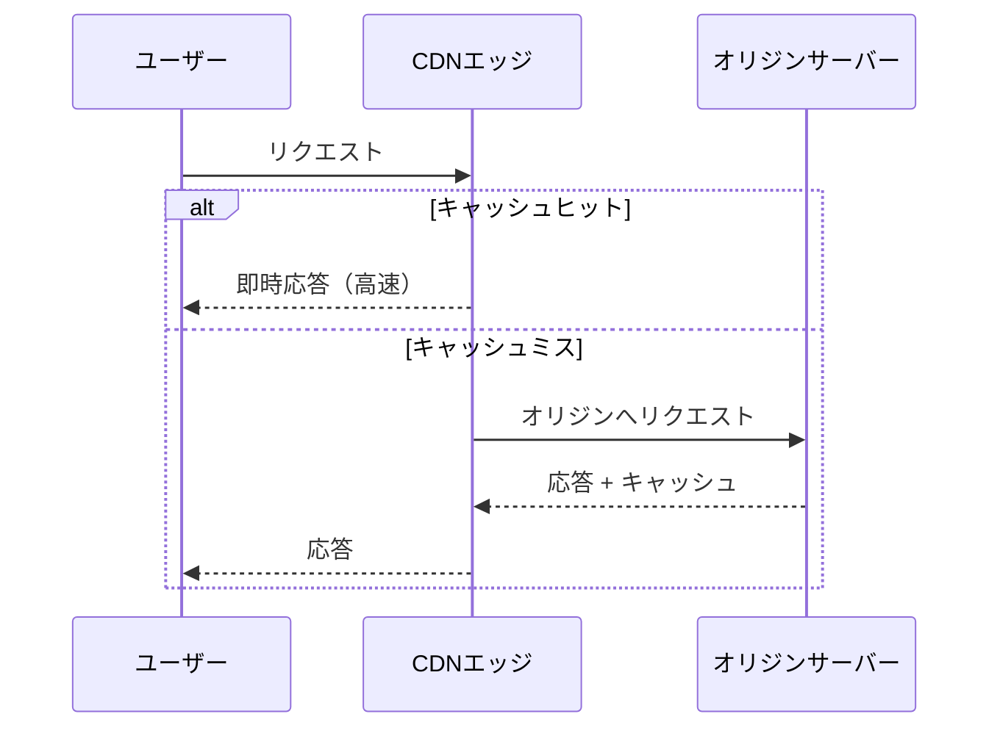

> 文書基準: 2026年5月

## 概要

Webサービスのユーザーは世界中に分散していますが、オリジンサーバーは特定のリージョンにあります。離れたリージョンのユーザーには、物理的な距離の分だけ遅延が発生します。

**CDN**（Content Delivery Network）は、世界中のエッジロケーションにコンテンツをキャッシュし、ユーザーに最も近い場所から高速に配信するサービスです。オリジンサーバーまで到達せずエッジで応答するため、レイテンシが大幅に短縮され、オリジンの負荷も軽減されます。

### 動作原理

### 主要概念

| 概念 | 説明 |
| --- | --- |
| **オリジン（Origin）** | 元のコンテンツがあるサーバー。オブジェクトストレージ、VM、ロードバランサーなど |
| **エッジ（Edge/PoP）** | ユーザーに近いキャッシュサーバー。世界中に数百拠点 |
| **キャッシュヒット/ミス** | エッジにコンテンツがあればヒット（高速）、なければミス（オリジンから取得） |
| **TTL（Time To Live）** | キャッシュの有効期間。期限切れになるとオリジンから再取得 |
| **キャッシュ無効化（Invalidation）** | TTL満了前に強制的にキャッシュを削除。世界的な伝播に時間がかかる |

クラウドCDNは**HTTPSを標準推奨**しており、無料のTLS証明書が統合提供されるため、別途証明書を購入せずにSSL/TLSを適用できます。HTTPにも対応していますが、セキュリティ上HTTPS専用構成を推奨します。

:::note
CDNエッジでTLSを終端すると、クライアント↔エッジ間のハンドシェイクRTTが減少しTTFBが改善します。キャッシュ不可能なTCP/UDPワークロードのネットワーク経路アクセラレーションについては、本文書下部の「グローバルネットワークアクセラレーター」セクションを参照してください。
:::

## 適用対象

CDNは静的ファイルだけでなく、さまざまなワークロードに適用できます。

| 対象 | 説明 |
| --- | --- |
| **静的ファイル** | 画像、CSS、JS。最も基本的なCDN活用 |
| **API応答** | 変更頻度の低いAPI応答をエッジでキャッシュ。オリジンの負荷軽減 |
| **動画ストリーミング** | MP4ダウンロード、HLS/DASHアダプティブストリーミング。大容量転送に必須 |
| **動的コンテンツ / API** | キャッシュはできないが、エッジでのTCP/TLS終端 + ベンダーバックボーン経由でレイテンシを削減。オリジンコネクションの再利用によりハンドシェイクコストを削減 |

:::caution
**REST APIにCDNを適用すべきか？** 2つのメリットがあります。
1. **キャッシュ可能なAPI**（公開データ、商品一覧、為替レート）— 短いTTL（5~60秒）でオリジンの負荷を軽減
2. **キャッシュ不可能なAPI**（認証ベース、パーソナライズ）— キャッシュなしでもエッジTCP/TLS終端 + バックボーン経路最適化でレイテンシを削減

すべての主要CDN（CloudFront、Front Door、Cloud CDN）が動的コンテンツアクセラレーションをサポートしています。`Cache-Control: no-store`でキャッシュを無効化しても、ネットワーク経路最適化のメリットは維持されます。
:::

## キャッシング戦略

### キャッシング階層

| 階層 | 位置 | 制御方法 |
| --- | --- | --- |
| **ブラウザキャッシュ** | ユーザーデバイス | `Cache-Control`、`ETag`ヘッダー |
| **CDNエッジキャッシュ** | ベンダーのエッジロケーション | TTLポリシー、キャッシュキー設定 |
| **オリジンキャッシュ** | オリジンサーバーの前段（任意） | リバースプロキシ、オリジンシールド |

### キャッシュキー戦略

| 戦略 | 方法 | TTL設定 |
| --- | --- | --- |
| **ハッシュファイル名** | `app.a3f2c1.js`（ビルド時にハッシュを挿入） | 非常に長く（1年）。無効化不要 |
| **バージョンクエリ** | `app.js?v=2` | 中程度。一部のCDNではキャッシュキーとして認識されない場合あり |
| **短いTTL** | 同一URL、TTL 5分 | API応答など頻繁に変わるコンテンツに適合 |
| **無効化** | 手動Invalidationリクエスト | 緊急修正時のみ。コストが発生する場合あり |

:::note
ほとんどのフロントエンドビルドツール（Webpack、Viteなど）はハッシュファイル名を自動生成します。`index.html`のみ短いTTLを設定し、残りの静的ファイルは長いTTL + ハッシュファイル名で運用するのが一般的なパターンです。
:::

## アーキテクチャパターン

### CDNが効果的な状況

| パターン | 説明 | CDNの効果 |
| --- | --- | --- |
| **単一リージョンオリジン + グローバルユーザー** | DB/アプリが1つのリージョンにのみあり、ユーザーは世界中 | エッジキャッシングによりオリジンリージョンまでの遅延を排除 |
| **1対多配信** | 同一コンテンツを数万~数百万のユーザーに配信 | オリジンの負荷をエッジに分散。オリジン1台でも大規模サービングが可能 |
| **トラフィックスパイクの吸収** | イベント/ニュースなど急激なトラフィック急増 | エッジがほとんどを吸収し、オリジンは通常の負荷を維持 |
| **静的サイトホスティング** | SPA/静的サイトをオブジェクトストレージから配信 | CDN + オブジェクトストレージのみでサーバーレス運用 |

### コンテンツ保護（Signed URL / Token）

CDNを通じて配信しながらもアクセスを制限する必要がある場合（有料コンテンツ、認証済みユーザーのみアクセス可）:

| 方法 | 説明 | AWS | Azure | Google Cloud |
| --- | --- | --- | --- | --- |
| **Signed URL** | 時間制限付きの署名済みURL | CloudFront Signed URL | Front Door Private Link | Cloud CDN Signed URL |
| **Signed Cookie** | Cookieベースの認証。複数ファイルへの同時適用 | CloudFront Signed Cookie | — | — |
| **Token認証** | エッジでのトークン検証 | CloudFront Functions | Front Door Rules Engine | — |
| **地域制限** | 特定の国/地域の許可またはブロック | 対応 | 対応 | 対応 |
| **WAF連携** | IP制限、レートリミット、ボットブロック | CloudFront + WAF | Front Door + WAF | Cloud Armor |

:::note
有料動画ストリーミングのようにコンテンツ保護が重要な場合は、Signed URL + DRM（Digital Rights Management）を組み合わせます。CDNは伝送経路を保護し、DRMはコンテンツ自体を保護します。
:::

## 製品比較

| ベンダー | 製品 | 備考 |
| --- | --- | --- |
| AWS | CloudFront | 400以上のエッジロケーション。Origin Shield（オリジン保護キャッシュ層） |
| Azure | Azure CDN / Front Door | Front DoorにCDN + WAF + グローバルLBを統合 |
| Google Cloud | Cloud CDN | Cloud Load Balancingと統合。キャッシュ無効化が高速 |
| OCI | OCI CDN（Akamai/Fastlyパートナーシップ） | グローバルCDNはパートナー連携。Edge ServicesでWAF/DDoSを統合 |

### 主要な違い

- **AWS CloudFront** — エッジロケーション数が多く、Lambda@Edge/CloudFront Functionsでエッジ上でコードを実行できます。Origin Shieldでオリジンの負荷をさらに軽減できます。
- **Azure Front Door** — CDN、グローバルロードバランサー、WAFを1つのサービスに統合します。別途CDN設定なしでFront Door単体で全トラフィックを管理できます。
- **Google Cloud Cloud CDN** — Cloud Load Balancingでチェックボックス1つで有効化でき、設定が簡単です。キャッシュ無効化が数秒以内に伝播します。
- **OCI** — 自社CDNサービスの代わりに、Akamai、Fastlyなど専門CDNとのパートナーシップを通じてグローバル配信をサポートします。Edge ServicesでWAFとDDoS保護を提供します。

## グローバルネットワークアクセラレーター

CDNはコンテンツを**キャッシュ**して高速に配信しますが、キャッシュが不可能なワークロード（ゲームサーバー、IoT、リアルタイムAPI）には**ネットワークアクセラレーター**が必要です。アクセラレーターはキャッシュなしでTCP/TLS接続をエッジで終端し、ベンダーバックボーンネットワークを通じてオリジンまで転送することで遅延を削減します。

### CDN vs ネットワークアクセラレーター

| 区分 | CDN | ネットワークアクセラレーター |
| --- | --- | --- |
| 目的 | コンテンツキャッシング + エッジサービング | TCP/TLS接続経路の最適化 |
| キャッシング | 対応 | — |
| 対象プロトコル | HTTP/HTTPS | TCP/UDP全プロトコル |
| 動作 | キャッシュヒット時はオリジン不要 | 常にオリジンへ転送、経路のみ最適化 |
| 使用例 | 静的ファイル、ストリーミング、APIキャッシング | ゲームサーバー、IoT、グローバルAPI（キャッシュ不可） |

### ベンダー別サービス

| ベンダー | サービス | アクセラレーション対象 | 制約 |
| --- | --- | --- | --- |
| AWS | Global Accelerator | TCP/UDP | L4のみ。HTTPルーティングが必要な場合はALBと組み合わせ |
| Azure | Front Door | HTTP + TCP | L7統合。TCPプロキシはPremium層 |
| Google Cloud | Cloud LB（Premium Tier） | HTTP/TCP/UDP | デフォルトでグローバル。Standard Tierはリージョン限定 |

### 選定基準

| 要件 | 選択 |
| --- | --- |
| HTTPコンテンツキャッシングが主目的 | CDN |
| TCP/UDPアプリのグローバル遅延削減（ゲーム、IoT） | グローバルアクセラレーター |
| HTTP + グローバル分散 + WAF統合 | Azure Front Door / CloudFront + GAの組み合わせ |
| 固定Anycast IPが必要（IPホワイトリスト） | Global Accelerator |

:::note
リージョン内のL4/L7分散は[ロードバランサー](../../networking/load-balancer/)を、DNSベースのグローバル分散は[DNS](../../networking/dns/)を参照してください。
:::

## エッジコンピューティング

CDNエッジでコードを実行してリクエスト/レスポンスを変換したり、シンプルなロジックをオリジンなしで処理したりできます。

| ベンダー | 製品 | 備考 |
| --- | --- | --- |
| AWS | CloudFront Functions | 軽量（リクエスト/レスポンスヘッダー変換、リダイレクト）。ミリ秒以内 |
| AWS | Lambda@Edge | フル機能（オリジンリクエスト/レスポンス変換、認証）。数ミリ秒 |
| Azure | Front Door Rules Engine | ルールベースのルーティング/変換 |
| Google Cloud | Cloud CDN + Cloud Functions | 別途組み合わせ |

## よくある間違い

- **`index.html`に長いTTLを設定** — 静的ファイルのハッシュが変わってもユーザーが旧バージョンのHTMLを受け取り続けます。`index.html`は短いTTL（数分）、残りの静的ファイルはハッシュファイル名 + 長いTTLで運用してください。
- **キャッシュ無効化（Invalidation）をデプロイのルーティンとして使用** — 世界的な伝播に時間がかかり、コストも発生します。ハッシュファイル名戦略が正解です。
- **認証が必要なAPIにCDNキャッシングを適用** — 他のユーザーの個人データがキャッシュから返される可能性があります。`Cache-Control: no-store`を明示するか、キャッシュキーに認証トークンを含めてください。

## チェックリスト

- [ ] 静的ファイルにハッシュファイル名（content hash）が適用され、キャッシュ無効化なしでデプロイ可能か?
- [ ] HTTPS専用構成が適用されており、HTTP→HTTPSリダイレクトが設定されているか?
- [ ] オリジン保護（Origin Shield、Signed URLなど）が適用され、オリジンへの直接アクセスが遮断されているか?

## 参考資料

### AWS

- [Amazon CloudFrontドキュメント](https://docs.aws.amazon.com/ko_kr/cloudfront/)
- [Lambda@Edgeドキュメント](https://docs.aws.amazon.com/ko_kr/lambda/latest/dg/lambda-edge.html)
- [CloudFront HTTP/HTTPS構成ガイド](https://docs.aws.amazon.com/AmazonCloudFront/latest/DeveloperGuide/using-https.html)

### Azure

- [Azure Front Doorドキュメント](https://learn.microsoft.com/ko-kr/azure/frontdoor/)
- [Azure CDNドキュメント](https://learn.microsoft.com/ko-kr/azure/cdn/)

### Google Cloud

- [Cloud CDNドキュメント](https://cloud.google.com/cdn/docs)
- [Media CDNドキュメント](https://cloud.google.com/media-cdn/docs)
