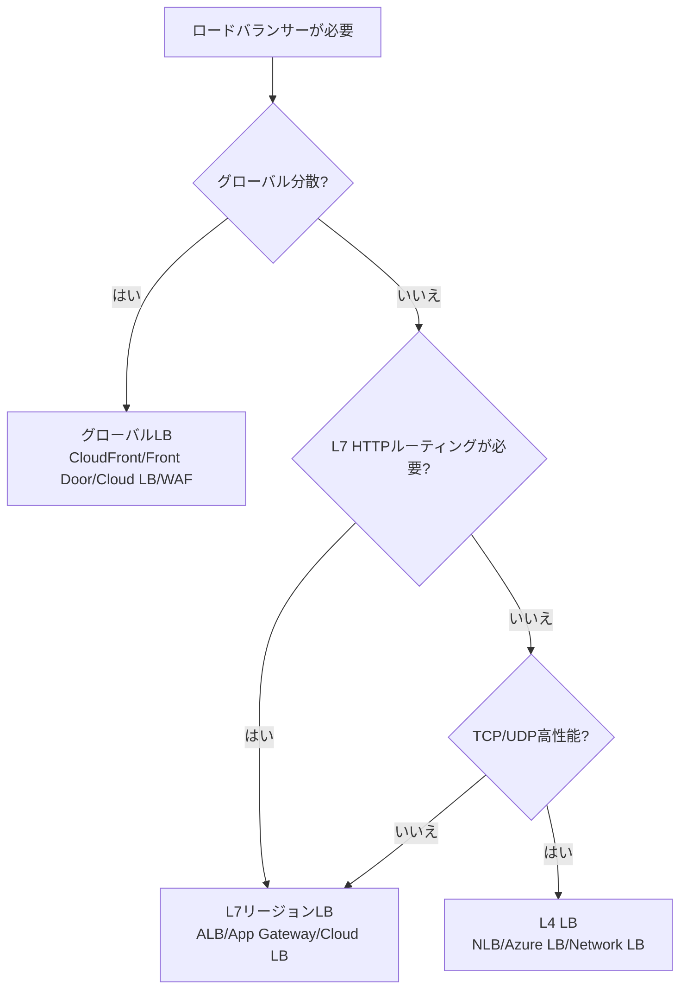

> 文書基準: 2026年8月

## 概要

サーバーが複数台ある場合、ユーザーリクエストをどのサーバーへ振り分けるかを担うのが**ロードバランサー**です。オンプレミスではF5、Citrixのようなハードウェア機器を使用しますが、クラウドではマネージドサービスとして提供されます。

オートスケーリングと組み合わせると、サーバーの追加/削除時に自動的にトラフィック分散対象が調整されます。

### オンプレミスLBとの違い

| 項目 | オンプレミス（ハードウェアLB） | クラウド（マネージドLB） |
| --- | --- | --- |
| **容量** | 機器スペックに固定（アップグレード = 機器交換） | トラフィックに応じて自動拡張 |
| **可用性** | Active-Standby冗長化を自前で構成 | ベンダーがマルチAZ冗長化を標準提供 |
| **設定** | CLI/GUIで機器に直接接続 | API/IaCでコード管理 |
| **コスト** | 機器購入 + 保守契約 | 使用量ベースの従量課金 |

:::note
オンプレミスでLBの帯域幅ボトルネックを回避するために使用されていたDSR（Direct Server Return）は、クラウドでは不要です。クラウドLBは自動拡張されボトルネックがなく、TLS終端・ロギングなどが応答経路でも動作する必要があるためです。
:::

## 製品比較

### L7（HTTP/HTTPS）ロードバランサー

| ベンダー | 製品 | 備考 |
| --- | --- | --- |
| AWS | ALB（Application Load Balancer） | パス/ホストベースルーティング、WebSocket、gRPC |
| Azure | Application Gateway | WAF統合可能 |
| Google Cloud | External HTTP(S) Load Balancer | グローバル（単一IPで世界中にサービング） |
| OCI | OCI Load Balancer | L7。パス/ホストベースルーティング、SSL終端 |

### L4（TCP/UDP）ロードバランサー

| ベンダー | 製品 | 備考 |
| --- | --- | --- |
| AWS | NLB（Network Load Balancer） | 超低遅延、固定IP |
| Azure | Azure Load Balancer | Standard/Basic層 |
| Google Cloud | TCP/UDP Load Balancer | リージョンまたはグローバル |
| OCI | OCI Network Load Balancer | L4。超低遅延、IPハッシュ/5-tupleハッシュ |

### グローバルロードバランサー / アクセラレーター

| ベンダー | 製品 | 備考 |
| --- | --- | --- |
| AWS | Global Accelerator | Anycast IPで最も近いエッジへルーティング |
| Azure | Front Door | グローバルL7 + CDN + WAF統合 |
| Google Cloud | Cloud Load Balancing | デフォルトでグローバル（単一Anycast IP） |
| OCI | OCI DNS Traffic Management | DNSベースのグローバルトラフィック分散 |

:::note
グローバルアクセラレーターはCDNと混同されやすいです。キャッシュの有無、対象プロトコル、選定基準は[CDN — グローバルネットワークアクセラレーター](../../networking/cdn/#グローバルネットワークアクセラレーター)を参照してください。
:::

## 主要構成要素

ロードバランサーはどこへ送るか（ルール）と誰に送るか（ターゲットグループ）を設定する必要があります。L7とL4はルーティング方式が異なります。

### L7（HTTP/HTTPS）

| 概念 | AWS ALB | Azure App Gateway | Google Cloud HTTP(S) LB | OCI Load Balancer |
| --- | --- | --- | --- | --- |
| **ルーティングルール** | Listener Rule（パス/ホスト/ヘッダー） | URL Path Map | URL Map | Routing Policy（パス/ホスト） |
| **ターゲットグループ** | Target Group | Backend Pool | Backend Service | Backend Set |
| **ヘルスチェック** | HTTP/HTTPSヘルスチェック | Health Probe | Health Check | Health Check |

パス（`/api/*`）、ホスト（`api.example.com`）、ヘッダー値などでトラフィックをきめ細かく分散できます。

### L4（TCP/UDP）

| 概念 | AWS NLB | Azure LB | Google Cloud TCP/UDP LB | OCI Network LB |
| --- | --- | --- | --- | --- |
| **ルーティング** | ポートベース | Frontend IP + Port | Forwarding Rule | Listener（ポートベース） |
| **ターゲットグループ** | Target Group（IP/インスタンス） | Backend Pool | Backend Service | Backend Set |
| **特徴** | 固定IP、超低遅延、TLSパススルー | Standard/Basic層 | リージョンまたはグローバル | 超低遅延、IPハッシュ |

L4はパケットの内容を見ずポート単位で分散するため、遅延が非常に低くなります。DB、gRPC、ゲームサーバーなどHTTP以外のプロトコルに使用します。

## SSL/TLS処理

ロードバランサーはTLS暗号化の終端/パススルー方式を選択できます。

| 方式 | 説明 | メリット | デメリット |
| --- | --- | --- | --- |
| **TLS Termination（終端）** | LBでTLS復号、バックエンドはHTTP | バックエンドの負担軽減、LBでL7処理 | LB-バックエンド間は平文（VPC内部のため一般的に許容） |
| **TLS Passthrough（パススルー）** | LBは暗号化されたトラフィックをそのまま転送、バックエンドが復号 | End-to-end暗号化 | L7ルーティング/検査不可（L4のみ可能） |
| **End-to-end TLS（再暗号化）** | LBで復号後、バックエンドへ送る際に再暗号化 | L7処理 + 全区間暗号化 | CPU負荷の増加 |

### 証明書管理

| ベンダー | 無料マネージド証明書 |
| --- | --- |
| AWS | AWS Certificate Manager（ACM） |
| Azure | App Service Managed Certificate、Key Vault |
| Google Cloud | Certificate Manager |
| OCI | OCI Certificates |

いずれも自動更新に対応しており、LBとネイティブに連携します。

## ヘルスチェック

:::caution
ロードバランサーでTLSを終端すると、ロードバランサーとバックエンドサーバー間の区間は平文（HTTP）で通信します。この区間がVPC内部であれば一般的に許容されますが、規制要件がある場合はEnd-to-end TLS（再暗号化）を適用してください。
:::

ロードバランサーは定期的にバックエンドの状態を確認し、異常なインスタンスを除外します。

### ヘルスチェックの種類

| 種類 | 説明 | 用途 |
| --- | --- | --- |
| **TCP** | TCP接続の可否のみ確認 | L4 LB、シンプルなチェック |
| **HTTP/HTTPS** | 特定パスへの応答コード確認（通常200） | L7 LB、アプリレベルチェック |
| **gRPC** | gRPC Health Checking Protocol | gRPCサービス |

### ヘルスチェック設計のヒント

- **専用ヘルスチェックエンドポイント**（`/health`、`/healthz`）を使用。ビジネスエンドポイントは避ける
- **DB依存の有無** — 浅いチェック（アプリが生きている）と深いチェック（DBに接続されている）を区別
- **IntervalとThreshold** — 短すぎるとfalse positive、長すぎると障害検知の遅延
- **404/500も健全とみなすか** — 特定のパスがなくてもサーバー自体は正常な場合がある

## 選定ガイド

### 決定木

### 要件別の選択

| 要件 | 推奨 | 備考 |
| --- | --- | --- |
| HTTP/HTTPSルーティング、パスベース分散 | L7（ALB、App Gateway、Cloud LB、OCI LB） | URL/ヘッダーベースルーティング、SSL終端 |
| TCP/UDP高性能、低レイテンシ | L4（NLB、Azure LB、Network LB、OCI NLB） | パケットレベル処理、固定IP |
| グローバルトラフィック分散 + CDN + WAF | グローバルLB（CloudFront+ALB、Front Door、Cloud LB、OCI WAF） | 地域別の最適ルーティング |
| 内部サービス間通信のみ | Internal LB | パブリックIP不要、プライベートサブネット内 |
| gRPC、WebSocket | L7（gRPC対応を確認） | ALB、Cloud LBはgRPCをネイティブサポート |

:::note
グローバルトラフィック分散はLBだけでなく、DNSルーティング（地理的ルーティング、フェイルオーバー）でも実現できます。DNSベースのトラフィック管理は[DNS](../../networking/dns/)を参照してください。
:::

## よくある間違い

- **L7が必要な状況でL4ロードバランサーを選択** — パス/ホストベースルーティング、TLS終端、WAF連携ができません。HTTPワークロードはL7（ALB/App Gateway）を基本として選択してください。
- **ヘルスチェックパスをビジネスエンドポイントに設定** — 認証失敗や一時的なエラーにより正常なインスタンスが除外されます。専用の`/health`エンドポイントを使用してください。
- **TLS Termination後、バックエンド区間を暗号化しないまま規制要件を無視** — VPC内部であっても、金融/医療の規制環境ではEnd-to-end TLS（再暗号化）が必要な場合があります。

## チェックリスト

- [ ] ヘルスチェックが専用エンドポイント（`/health`）を使用し、適切なInterval/Thresholdが設定されているか?
- [ ] TLS証明書がマネージドサービス（ACM、Certificate Manager）で自動更新されているか?
- [ ] Cross-AZロードバランシングが有効化されており、単一AZ障害時でもサービスが維持されるか?

## 関連ドキュメント

- [DNS](../../networking/dns/)
- [CDN](../../networking/cdn/)
- [オートスケーリング](../../compute/auto-scaling/)

## 参考資料

### AWS

- [Elastic Load Balancingドキュメント](https://docs.aws.amazon.com/ko_kr/elasticloadbalancing/)
- [AWS Global Acceleratorドキュメント](https://docs.aws.amazon.com/ko_kr/global-accelerator/)

### Azure

- [Azure Load Balancerドキュメント](https://learn.microsoft.com/ko-kr/azure/load-balancer/)
- [Azure Front Doorドキュメント](https://learn.microsoft.com/ko-kr/azure/frontdoor/)

### Google Cloud

- [Google Cloud Load Balancingドキュメント](https://cloud.google.com/load-balancing/docs)

### OCI

- [OCI Load Balancerドキュメント](https://docs.oracle.com/en-us/iaas/Content/Balance/home.htm)
- [OCI Network Load Balancerドキュメント](https://docs.oracle.com/en-us/iaas/Content/NetworkLoadBalancer/home.htm)
