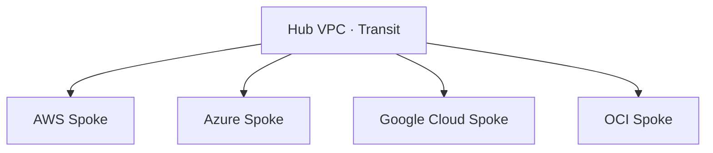

> 文書基準: 2026年8月

:::note
接続方式の概要とCIDR設計は[マルチクラウドネットワーク設計の基礎](../../networking/multicloud-networking/)を参照してください。
:::

## トランジットアーキテクチャパターン

### Hub-and-Spoke

中央にハブを置き、各クラウドをスポークとして接続するパターンです。

- **ハブの配置:** 最もトラフィックが多いベンダーまたはオンプレミス
- **メリット:** セキュリティポリシーをハブで一元管理、ルーティングの単純化
- **デメリット:** ハブがボトルネック/単一障害点になり得る

### クラウド間接続方式別サービスマッピング

| ベンダー | 内部トランジット | クラウド間直接接続 |
| --- | --- | --- |
| AWS | Transit Gateway | AWS Interconnect – multicloud |
| Azure | Virtual WAN / VNet Peering | （パートナー連携: Google Cross-Cloud、Oracle Interconnect） |
| Google Cloud | Cloud Router / NCC | Google Cross-Cloud Interconnect |
| OCI | DRG（Dynamic Routing Gateway） | Oracle Interconnect（Azure、Google Cloud、AWS） |

## ベンダー間直接接続（Cross-Cloud Interconnect）

主要CSPは競合関係にありながらも、顧客のマルチクラウド需要に対応するためベンダー間の専用ネットワークを提供しています。インターネットを経由せずにプライベートにクラウド同士を接続できます。

2025年12月のAWS re:Inventで、AWSとGoogle Cloudが**オープン相互運用仕様**に基づく共同マルチクラウドインターコネクトを発表しました。Microsoft Azureもこの仕様への参加を確認しており、Oracleも連携を発表しました（2026年4月）。この流れは単一ベンダーのイニシアチブではなく、業界全体でのマルチクラウド相互運用標準化の動きです。

| サービス | 接続区間 | ステータス（2026年6月時点） |
| --- | --- | --- |
| [**AWS Interconnect – multicloud**](https://aws.amazon.com/interconnect/multicloud/) | AWS ↔ Google Cloud | GA（2026年4月）。Azure、OCIは2026年内に追加予定 |
| [**Google Cross-Cloud Interconnect**](https://cloud.google.com/network-connectivity/docs/interconnect/concepts/cross-cloud-overview) | Google Cloud ↔ AWS/Azure/OCI | GA。オープン相互運用仕様ベース |
| [**Oracle Interconnect for Azure**](https://docs.oracle.com/iaas/Content/multicloud/interconnect-azure.htm) | OCI ↔ Azure | GA。クロスクラウドデータ転送は無料 |
| [**Oracle Interconnect for AWS**](https://docs.oracle.com/iaas/Content/multicloud/interconnect-aws.htm) | OCI ↔ AWS | LA（Limited Availability、2026年5月）。us-east-1単一リージョン。GA時に拡大予定 |
| [**Oracle Interconnect for Google Cloud**](https://docs.oracle.com/iaas/Content/Network/Concepts/access-to-google-cloud-platform.htm) | OCI ↔ Google Cloud | GA。クロスクラウドデータ転送は無料 |

### 利用可能区間マトリクス

> ✅ GA = 正式リリース、🔶 LA = Limited Availability（限定リージョン）、予定 = 未リリース

| | AWS | Azure | Google Cloud | OCI |
| --- | --- | --- | --- | --- |
| **AWS** | — | 予定（2026） | ✅ GA | 🔶 LA |
| **Azure** | 予定（2026） | — | ✅ GA | ✅ GA |
| **Google Cloud** | ✅ GA | ✅ GA | — | ✅ GA |
| **OCI** | 🔶 LA | ✅ GA | ✅ GA | — |

### Cross-Cloud Interconnect vs 専用接続 + IX

| 比較項目 | Cross-Cloud Interconnect | 専用接続 + IX（Direct Connect + ExpressRouteなど） |
| --- | --- | --- |
| **経由地点** | ベンダー間直接接続（単一ホップ） | IXまたはコロケーション施設経由（2～3ホップ） |
| **設定の複雑さ** | コンソールで相手ベンダーを選択してプロビジョニング | 両側の専用接続 + IXポート + BGP設定 |
| **レイテンシ** | 最小（同一メトロ内の直接接続） | IX経由でやや高い |
| **コスト構造** | ポート費用 + データ転送（OCIは転送無料） | 両側の専用接続費用 + IXポート費用 |
| **利用可能区間** | ベンダーがサポートする区間のみ | IXが存在するすべての区間 |

**選定基準:**

- ベンダー間直接接続がサポートされる区間であれば、Cross-Cloud Interconnectはシンプルでレイテンシも低い
- まだサポートされていない区間（例: AWS ↔ Azure）や、オンプレミスも併せて接続する必要がある場合はIX経由方式を使用

## Egressコスト比較

クラウド間のデータ移動における最大のコスト要素はEgress（アウトバウンド）料金です。

| 区間 | 単価（代表リージョンの例。リージョンごとに異なる） | 備考 |
| --- | --- | --- |
| AWS → インターネット | $0.126/GB（最初の10TB） | 以降は逓減 |
| Azure → インターネット | $0.12/GB | 最初の100GB/月は無料（[Bandwidth料金](https://azure.microsoft.com/pricing/details/bandwidth/)） |
| Google Cloud → インターネット | $0.12/GB | 最初の200GB/月は無料 |
| OCI → インターネット | 10TB/月無料、以降 ～$0.0085/GB | 他社と比べて非常に安価 |
| AWS → Direct Connect | ~$0.04/GB | 回線費別途 |
| Azure → ExpressRoute | 含む（Unlimitedプラン） | 回線費に含まれる |
| Google Cloud → Interconnect | ~$0.05/GB | 回線費別途 |
| OCI → FastConnect | 10TB/月無料に含まれる | 回線費別途 |

> 上記の数値は文書作成時点のものであり、変更される可能性があります。最新の価格は各ベンダーの公式価格表をご確認ください。

### コスト最適化のヒント

- **データローカリティ:** 頻繁に通信するワークロードは同一クラウドに配置
- **専用接続:** 月1TB以上の移動時はVPNより専用接続が経済的
- **圧縮/キャッシング:** クラウド境界を越えるデータは圧縮してから転送
- **非同期バッチ:** リアルタイム性が不要なデータは夜間バッチで移動

## DNS統合戦略

マルチクラウドにおけるサービスディスカバリの核心はDNSです。各ベンダーのプライベートDNSは分離されているため、統合戦略が必要です。

### 各ベンダーのプライベートDNS

| ベンダー | サービス | 特徴 |
| --- | --- | --- |
| AWS | Route 53 Private Hosted Zone | VPC接続、条件付きフォワーディング |
| Azure | Azure Private DNS Zone | VNetリンク |
| Google Cloud | Cloud DNS Private Zone | VPCバインディング |
| OCI | OCI DNS Private View | VCN接続 |

### 統合パターン: 条件付きフォワーディング

ドメインサフィックスに基づいて、各クラウドのプライベートDNSエンドポイントへフォワーディングします。

| ドメインパターン | フォワーディング先 |
| --- | --- |
| `*.aws.internal` | Route 53 Inbound Endpoint |
| `*.azure.internal` | Azure DNS Private Resolver |
| `*.gcp.internal` | Cloud DNS Inbound Policy |
| `*.oci.internal` | OCI DNS Inbound Endpoint |
| `*.corp.internal` | オンプレミスDNS |

**実装方法:**
1. 各クラウドにインバウンドDNSエンドポイントを作成
2. 条件付きフォワーディングルールを設定（ドメインサフィックスベース）
3. オンプレミスDNSサーバーまたはハブVPCのDNSを中央フォワーダーとして使用

:::note
**ヒント:** Route 53 Resolverのアウトバウンドエンドポイントをハブとして使用すると、AWSからAzure/Google Cloudのプライベートレコードを照会できます。
:::

## よくある間違い

- **Egressコストを事前に見積もらない** — クラウド間のデータ移動が月数千ドルに達することがあります。アーキテクチャ設計時にデータフローとコストを併せて計算してください。
- **DNS条件付きフォワーディングを設定せずクロスクラウドの名前解決が失敗** — 各クラウドのプライベートDNSはデフォルトで分離されています。インバウンドエンドポイント + フォワーディングルールを必ず構成してください。
- **ハブネットワークの冗長化なしに単一VPNトンネルのみ構成** — ハブ障害時にすべてのクラウド間通信が停止します。Active-Activeまたは代替経路を確保してください。

## チェックリスト

- [ ] クラウド間の月間Egressコストが見積もられており、しきい値アラートが設定されているか?
- [ ] DNS条件付きフォワーディングにより、すべてのクラウドのプライベートレコードが相互に解決可能か?
- [ ] ハブ障害時の代替経路（フェイルオーバー）がテストされているか?

## 参考資料

### AWS

- [AWS — Hybrid Connectivity](https://docs.aws.amazon.com/whitepapers/latest/hybrid-connectivity/hybrid-connectivity.html)
- [AWS Direct Connect](https://aws.amazon.com/ko/directconnect/)
- [AWS Interconnect](https://aws.amazon.com/interconnect/)

### Azure

- [Azure — Hub-spoke Network Topology](https://learn.microsoft.com/azure/architecture/networking/architecture/hub-spoke)
- [Azure ExpressRoute](https://azure.microsoft.com/ko-kr/products/expressroute/)

### Google Cloud

- [Google Cloud — Hybrid and Multi-cloud Network Architectures](https://cloud.google.com/architecture/network-hybrid-multicloud)
- [Google Cloud Interconnect](https://cloud.google.com/network-connectivity/docs/interconnect)

### OCI

- [OCI FastConnect](https://docs.oracle.com/en-us/iaas/Content/Network/Concepts/fastconnect.htm)
- [Oracle Interconnect for Azure](https://docs.oracle.com/iaas/Content/multicloud/interconnect-azure.htm)

### 標準とコミュニティ

- [Megaport](https://www.megaport.com/) — グローバル Cloud Exchange
- [Equinix Fabric](https://www.equinix.com/interconnection-services/equinix-fabric) — グローバル Cloud Exchange。国別のIXは各国ガイドを参照
- [NIST Multi-Cloud Security Public Working Group](https://www.nist.gov/publications/nist-cloud-computing-reference-architecture)
- [RFC 1918 — Address Allocation for Private Internets](https://www.rfc-editor.org/rfc/rfc1918)
