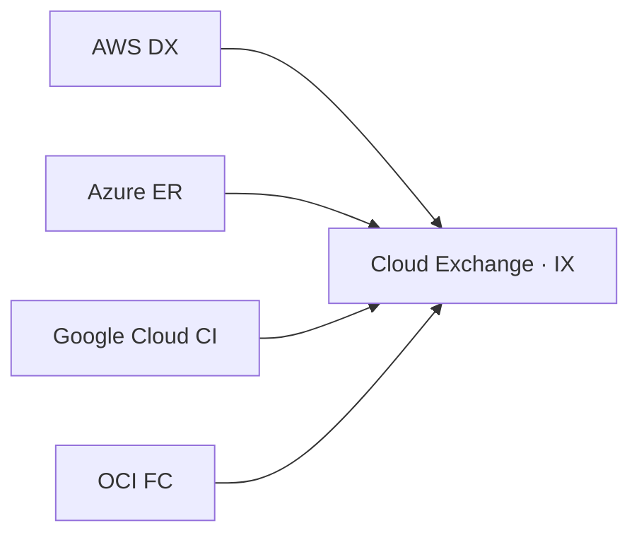

> 文書基準: 2026年8月

:::note
トランジットアーキテクチャ、Egressコスト、DNS統合などの発展的な内容は[マルチクラウドネットワークアーキテクチャ](../../networking/multicloud-connectivity/)を参照してください。
:::

## なぜクラウド間ネットワーキングが重要か

マルチクラウド環境で最初に直面する技術的課題は「**クラウドAのワークロードはクラウドBのワークロードとどう通信するのか?**」です。単一ベンダー内であればVPCピアリングやプライベートリンクで簡単に解決できますが、ベンダーの境界を越えると、ネットワーク設計、コスト、セキュリティすべてが複雑になります。

## CIDR計画 — IP競合の防止

マルチクラウドの第一原則: **すべてのクラウドのVPC/VNet CIDRが重複してはいけません。**

IPが重複するとルーティングが不可能になり、後から変更しようとするとワークロードの再デプロイが必要になります。最初から全体のIPスペースを計画してください。

### 推奨設計パターン

RFC 1918のプライベートアドレス帯をベンダー別に分割します。

| アドレス帯 | 割り当て | 例 |
| --- | --- | --- |
| `10.0.0.0/8` | AWS | `10.0.0.0/16`（prod）、`10.1.0.0/16`（dev） |
| `172.16.0.0/12` | Azure | `172.16.0.0/16`（prod）、`172.17.0.0/16`（dev） |
| `192.168.0.0/16` | Google Cloud / その他 | `192.168.0.0/20`（Google Cloud）、`192.168.16.0/20`（その他） |

:::note
**ヒント:** `/16`単位でベンダーに割り当て、その中で`/24`サブネットに分割すると、今後の拡張に柔軟に対応できます。オンプレミスがある場合は、オンプレミスのアドレス帯も必ず含めて計画してください。
:::

### 注意事項

- Google CloudはVPCがグローバルであるため、リージョンごとにサブネットが異なればよいだけです
- Azure VNetはリージョン単位であるため、リージョンごとに別々のCIDR割り当てが必要

## クラウド間接続方式

### Site-to-Site VPN

最も迅速に始められる方法です。インターネットを通じてIPsecトンネルを構成します。

| 項目 | AWS | Azure | Google Cloud | OCI |
| --- | --- | --- | --- | --- |
| **サービス名** | Site-to-Site VPN | VPN Gateway | Cloud VPN | Site-to-Site VPN |
| **最大帯域幅** | 1.25 Gbps（トンネルあたり） | 10 Gbps（VpnGw5） | 3 Gbps（HA VPN） | 250 Mbps（トンネルあたり） |
| **HA構成** | 2トンネルを標準提供 | Active-Activeモード | HA VPN（99.99% SLA） | 冗長トンネルを推奨 |
| **コスト（例）** | ~$0.05/h + Egress | ~$0.19/h（VpnGw1） | ~$0.075/h + Egress | 時間課金 + Egress。リージョンごとに異なる |

> 上記の数値は文書作成時点のものであり、変更される可能性があります。最新の価格は各ベンダーの公式価格表をご確認ください。

**AWS ↔ Google Cloud接続例:**
1. AWSでCustomer Gateway（Google Cloudの外部IP） + VPN Connectionを作成
2. Google CloudでExternal VPN Gateway（AWSの外部IP） + HA VPNトンネルを作成
3. BGPで経路交換（AWS ASN: 64512、Google Cloud ASN: 65001など）

:::note
**使用場面:** 帯域幅1Gbps以下、迅速なPoC、コストに敏感な環境
:::

### 専用接続（Dedicated Interconnect）

物理的な専用回線で接続します。遅延が低く帯域幅も大きいですが、設置に数週間かかります。

| 項目 | AWS | Azure | Google Cloud | OCI |
| --- | --- | --- | --- | --- |
| **サービス名** | Direct Connect | ExpressRoute | Cloud Interconnect | FastConnect |
| **最大帯域幅** | 100 Gbps | 100 Gbps | 200 Gbps | 100 Gbps |
| **接続拠点（PoP）** | ベンダー別IX/コロケーション。国ガイドを参照 | 同一 | 同一 | 同一 |
| **最小契約期間** | なし（ポート時間課金） | なし～1年 | なし | なし（ポート時間課金） |
| **Egress割引** | 通常比 ～50%割引 | 無制限Egress込み | 通常比割引 | Egress 10TB/月無料 |

> 上記の数値は文書作成時点のものであり、変更される可能性があります。最新の価格は各ベンダーの公式価格表をご確認ください。

:::note
**Azure ExpressRouteの特異点:** Egress料金が回線料金に含まれているため、大量のデータ移動時に最も経済的な場合があります。
:::

### Cloud Exchange（Megaport、Equinix Fabric）

Cloud Exchangeは1本の物理接続で複数のクラウドに同時接続できるサービスです。マルチクラウド環境において最も効率的な接続方式です。

**Cloud Exchangeの選択肢（グローバル）:**
- **Megaport**、**Equinix Fabric** — 多数のリージョンにPoP。対象国のローカルPoPの有無は国ガイドで確認
- 国別IX（例: 韓国のKINX）は[韓国](../../korea/)などの国ガイドを参照してください

:::note
**使用場面:** 3つ以上のクラウドを接続する場合、オンプレミスも併せて接続する場合
:::

### 接続方式の選定ガイド

| 基準 | Site-to-Site VPN | 専用接続（DX/ER/CI/FC） | Cloud Exchange |
| --- | --- | --- | --- |
| **帯域幅** | ~1 Gbps | 10～100 Gbps | 1～10 Gbps |
| **レイテンシ** | インターネット経由（変動あり） | 専用回線（安定） | 専用回線（安定） |
| **構築時間** | 数分～数時間 | 数週間～数か月 | 数日～数週間 |
| **初期コスト** | 低い | 高い（ポート費、回線費） | 中程度 |
| **月間データ転送量** | < 1TB | > 5TB | 1～5TB |
| **接続対象** | 1:1（クラウド2つ） | 1:1 | 1:N（複数クラウド同時） |
| **適した状況** | PoC、小規模、迅速な開始 | 大容量、安定性必須、本番環境 | 3つ以上のクラウド接続、柔軟性 |

## 設計時のチェックリスト

- [ ] すべてのクラウド/オンプレミスのCIDRが重複していないか?
- [ ] 接続方式（VPN vs 専用接続 vs Cloud Exchange）を帯域幅/コスト基準で選択したか?
- [ ] Egressコストを月単位で見積もったか?
- [ ] DNS条件付きフォワーディングによりクロスクラウドの名前解決が可能か?
- [ ] ハブ障害時の代替経路（フェイルオーバー）はあるか?
- [ ] セキュリティグループ/ファイアウォールルールがクラウド間トラフィックを許可しているか?

## よくある間違い

- **CIDR計画なしに各クラウドでデフォルトVPCを使用** — IPアドレス帯が重複し、後から接続できなくなります。最初から全体のIPスペースをベンダー別に分割計画してください。
- **PoCで使用したVPNをそのまま本番環境に使用** — 帯域幅不足やインターネット経由の遅延変動により障害が発生します。月1TB以上であれば専用接続を検討してください。
- **セキュリティグループ/ファイアウォールでクラウド間トラフィックを許可していない** — VPN/専用接続を構成しても、両側のファイアウォールルールがなければ通信できません。

## 関連ドキュメント

トランジットアーキテクチャパターン、Egressコストの詳細比較、DNS統合戦略については以下の文書で扱います。

- [マルチクラウドコネクティビティ（発展編）](../../networking/multicloud-connectivity/)

## 参考資料

### AWS

- [AWS Direct Connect](https://docs.aws.amazon.com/directconnect/latest/UserGuide/Welcome.html)

### Azure

- [Azure ExpressRoute](https://learn.microsoft.com/azure/expressroute/expressroute-introduction)

### Google Cloud

- [Google Cloud Interconnect](https://cloud.google.com/network-connectivity/docs/interconnect/concepts/overview)

### OCI

- [OCI FastConnect](https://docs.oracle.com/en-us/iaas/Content/Network/Concepts/fastconnect.htm)

### 標準・相互接続

- [RFC 1918 — Address Allocation for Private Internets](https://datatracker.ietf.org/doc/html/rfc1918)
- [Megaport](https://www.megaport.com/) — グローバル Cloud Exchange
- [Equinix Fabric](https://www.equinix.com/interconnection-services/equinix-fabric) — グローバル Cloud Exchange。国別IXは各国ガイドを参照
