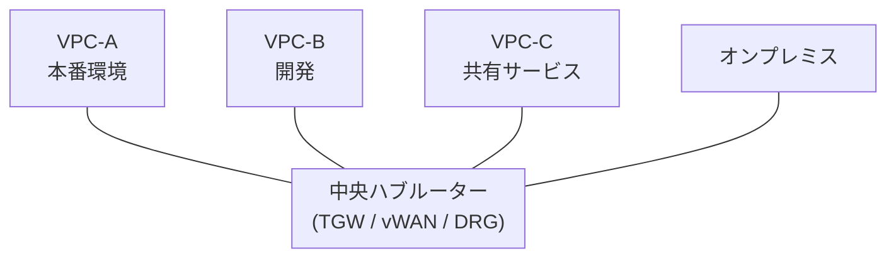

> 文書基準: 2026年6月

## 概要

オンプレミスでは物理的なネットワーク機器（スイッチ、ルーター、ファイアウォール）でネットワークを構成します。クラウドでは、これらすべてをソフトウェアで定義します。

**VPC**（Virtual Private Cloud）は、クラウド内に作成する論理的に分離された仮想ネットワークです。各VPCは他の顧客のVPCと完全に分離されており、**明示的に接続を設定しない限りVPC間通信はできません**。オンプレミスの社内ネットワークに相当し、IPアドレス帯、サブネット、ルーティング、ファイアウォールルールをユーザー自身が設計します。

**サブネット**は、VPC内でIPアドレス帯をさらに小さく分割したネットワーク領域です。サブネットを複数のアベイラビリティゾーン（AZ）に分散配置すると、障害ドメインを分離して高可用性を確保できます。リージョンとアベイラビリティゾーンの概念については、[リージョンとアベイラビリティゾーン](../../about-cloud/regions-and-zones/)で扱います。

:::note
本文書は**単一クラウド内のVPC設計**を扱います。規制環境におけるネットワーク分離要件については[網分離とネットワーク分離](../../security/network-isolation/)を、マルチクラウド間の接続については[マルチクラウドネットワーキング](../../networking/multicloud-networking/)を参照してください。
:::

## ベンダー別VPC比較

| ベンダー | 製品 | VPCの範囲 | サブネット単位 | 備考 |
| --- | --- | --- | --- | --- |
| AWS | VPC | リージョン | AZ | リージョン間はピアリング/TGWが必要 |
| Azure | VNet | リージョン | リージョン内で自由配置 | グローバルピアリング可能 |
| Google Cloud | VPC | **グローバル** | リージョン | 1つのVPCに複数リージョンのサブネットを配置可能 |
| OCI | VCN | リージョン | リージョンまたはAD | Security ListsとNSGの組み合わせ |

:::caution
**Azure VNetの変更（2026年3月~）:** APIバージョン`2025-07-01`以降に新規作成する仮想ネットワークのサブネットが**デフォルトでプライベート**に変更されました（適用時点: 2026年3月31日）。従来はサブネット内のVMにパブリックIPが割り当てられることがありましたが、今後は明示的にNAT Gatewayまたはパブリック IPを設定しない限り、アウトバウンドインターネットアクセスはできません。既存のVNetには影響なく、新規作成時のみ適用されます。[公式案内](https://techcommunity.microsoft.com/blog/azurenetworkingblog/private-subnets-by-default-in-azure-virtual-networks-what-changed-and-how-to-use/4513778)
:::

## サブネット設計

### 3階層分離

サブネットは**パブリック**、**プライベート**、**分離**の3階層に分けるのが一般的です。

| 階層 | 用途 | インターネットアクセス | 配置リソース |
| --- | --- | --- | --- |
| **パブリック** | 外部トラフィックの受信 | 双方向 | ロードバランサー、NAT Gateway、Bastion |
| **プライベート** | アプリケーション層 | NAT経由のアウトバウンドのみ | アプリサーバー、コンテナワーカーノード |
| **分離** | DB、内部システム | インターネットアクセス不可 | マネージドDB、キャッシュ |

### サブネットのサイジング

| 考慮事項 | 推奨 |
| --- | --- |
| VPC CIDR | `/16`（65,536 IP）。小さすぎると拡張が難しい |
| サブネットCIDR | `/24`（256 IP）から開始。Kubernetesノードが多い場合は`/20`（4,096 IP） |
| ベンダー予約IP | AWS/Azureはサブネットあたり5個のIPを予約。`/28`以下は使用可能IPが非常に少ない |
| AZ分散 | 最低2つ、推奨3つのAZに配置 |

### CIDR計画

CIDR設計は、後から変更するのが最も難しい決定事項です。

| 戦略 | 例 | 説明 |
| --- | --- | --- |
| 環境別アドレス帯の分離 | `10.0.0.0/16`（prod）、`10.1.0.0/16`（dev） | 環境間の競合防止 |
| チーム/サービス別割り当て | `10.10.0.0/16`（チームA）、`10.20.0.0/16`（チームB） | チームの自律性確保 |
| オンプレミスのアドレス帯を回避 | オンプレミスが`172.16.0.0/12`を使用中であればクラウドは`10.0.0.0/8`を使用 | 専用線接続時の競合防止 |

:::caution
`10.0.0.0/16`は最も一般的なデフォルト値のため、複数のVPCが同一のCIDRを持つケースが多く見られます。組織レベルでCIDR割り当てレジストリを管理してください。
:::

マルチクラウドのCIDR設計については[マルチクラウドコネクティビティ](../../networking/multicloud-connectivity/)を参照してください。

## セキュリティ（ネットワークファイアウォール）

| 階層 | AWS | Azure | Google Cloud | OCI | 役割 |
| --- | --- | --- | --- | --- | --- |
| **インスタンス** | Security Groups | NSG | Firewall Rules | Security Lists / NSG | インバウンド/アウトバウンドルール |
| **サブネット** | Network ACL | NSG（サブネット接続） | — | Security Lists | サブネット境界のフィルタリング |
| **VPC（L7）** | Network Firewall | Azure Firewall | Cloud Firewall | OCI Network Firewall | IDS/IPS、ドメインフィルタリング |
| **DDoS** | Shield | DDoS Protection | Cloud Armor | OCI WAF | L3/L4自動緩和 |
| **WAF** | AWS WAF | Azure WAF | Cloud Armor WAF | OCI WAF | L7攻撃のブロック |

### リモートアクセス

プライベートサブネットのリソースにアクセスするには、Bastion Hostまたはエージェントベースのアクセスサービスを使用します。詳細は[リモートアクセス管理](../../devops/remote-access/)を参照してください。

## ルーティング

サブネットから出るトラフィックがどこへ転送されるかを決定するルールです。

### 共通概念

- **VPC内部トラフィック**は自動的にルーティングされます（別途設定不要）
- **外部へ出るトラフィック**は明示的な経路が必要です
- **サブネット階層ごとに異なるルーティング**を適用して分離レベルを制御します

### ベンダー別ルーティングモデル

| 項目 | AWS | Azure | Google Cloud | OCI |
| --- | --- | --- | --- | --- |
| **ルーティング単位** | サブネットごと | サブネットごと（UDR） | VPC全体（暗黙的） + カスタム | サブネットごと |
| **デフォルトインターネット経路** | 明示的な追加が必要 | 標準提供（NSGで制御） | 標準提供（ファイアウォールで制御） | 明示的な追加が必要 |
| **NAT** | NAT Gateway（AZ別） | NAT Gateway（サブネット別） | Cloud NAT（リージョン別） | NAT Gateway（VCN別） |
| **特異点** | サブネットごとのきめ細かな制御 | System Routesの自動生成 | グローバルVPCのためリージョン間が自動 | Security Listが別途存在 |

### アンチパターン

| アンチパターン | 問題 | 正しいアプローチ |
| --- | --- | --- |
| すべてのサブネットに同一ルーティング | 分離階層が無意味になる | 階層別に別々のルーティング |
| DBサブネットにインターネット経路 | 不要な露出 | 経路なし + プライベートサービス接続 |
| オンプレミス経路をすべてのサブネットに伝播 | 不要な露出 | 必要なサブネットにのみ選択的に伝播 |

## VPC間接続

### ピアリング vs ハブ-スポーク

| 区分 | VPCピアリング | ハブ-スポーク（TGW / vWAN / DRG） |
| --- | --- | --- |
| **接続構造** | 1:1（メッシュ） | ハブ-スポーク（スター） |
| **推移的ルーティング** | 不可 | 可能（ハブ経由） |
| **VPC10個を接続する場合** | 45個のピアリング | 10個の接続 |
| **オンプレミス接続** | VPCごとにVPNが必要 | ハブに1つ |
| **コスト** | データ転送のみ | 時間課金 + データ処理（ピアリングより高くなる場合あり） |
| **適したケース** | VPC 2~3個、シンプルな構造 | VPC 4個以上、中央管理が必要 |

| ベンダー | ピアリング | ハブサービス |
| --- | --- | --- |
| AWS | VPC Peering | Transit Gateway |
| Azure | VNet Peering（グローバル） | Virtual WAN |
| Google Cloud | VPC Peering / Shared VPC | グローバルVPCのためほとんど不要 |
| OCI | Local/Remote Peering Gateway | DRG v2 |

## プライベートサービス接続

クラウドマネージドサービス（ストレージ、DBなど）にアクセスする際、デフォルトではNAT Gatewayを経由します。**プライベートサービス接続**を使用すると、トラフィックがベンダーの内部ネットワークを離れないため、セキュリティとコストの両面でメリットがあります。

| ベンダー | 製品 | 備考 |
| --- | --- | --- |
| AWS | VPC Endpoint（Gateway/Interface） / PrivateLink | Gateway（S3、DynamoDB）は無料 |
| Azure | Private Endpoint / Private Link | サービスごとにPrivate Endpointを作成 |
| Google Cloud | Private Service Connect / Private Google Access | Private Google Accessは設定のみで有効化 |
| OCI | Service Gateway / Private Endpoint | Service GatewayはOracleサービスアクセス用 |

:::caution
プライベートエンドポイントを作成しても、DNSが自動的に解決されない場合があります。プライベートDNSゾーンの設定も併せて確認してください。DNSの詳細は[DNS](../../networking/dns/)を参照してください。
:::

## オンプレミス接続（専用線 / VPN）

| 区分 | 専用線 | VPN（IPSec） |
| --- | --- | --- |
| **経路** | ベンダーのPoPまでの物理回線 | インターネット経由の暗号化トンネル |
| **帯域幅** | 1~100 Gbps | 一般的に1~5 Gbps |
| **遅延/安定性** | 低く一定 | インターネットの状態により変動 |
| **コスト** | 回線費 + ポート費（月額固定） | 時間課金（相対的に安価） |
| **構築期間** | 数週間~数か月 | 数分~数時間 |
| **適したケース** | 本番環境、大容量 | PoC、バックアップ経路 |

| ベンダー | 専用線 | VPN |
| --- | --- | --- |
| AWS | Direct Connect | Site-to-Site VPN |
| Azure | ExpressRoute | VPN Gateway |
| Google Cloud | Cloud Interconnect | Cloud VPN（HA VPN） |
| OCI | FastConnect | Site-to-Site VPN |

:::caution
専用線は「ベンダーまでの接続」のみを提供します。オンプレミスサイトからベンダーのPoPまでの物理回線は別途通信事業者と契約する必要があり、開通に数週間~数か月かかります。
:::

:::note
ベンダー別PoPの場所: [AWS](https://aws.amazon.com/directconnect/locations/) · [Azure](https://learn.microsoft.com/azure/expressroute/expressroute-locations) · [Google Cloud](https://cloud.google.com/network-connectivity/docs/interconnect/concepts/choosing-colocation-facilities) · [OCI](https://docs.oracle.com/en-us/iaas/Content/Network/Concepts/fastconnectprovider.htm)
:::

:::note
グローバルネットワーク管理（Cloud WAN、Virtual WANなど）とマルチサイト接続の詳細は[マルチクラウドネットワーキング](../../networking/multicloud-networking/)を参照してください。
:::

## 本番環境VPC設計チェックリスト

- [ ] CIDR範囲を今後の拡張とピアリングを考慮して設計したか
- [ ] パブリック/プライベート/分離サブネットを分けたか
- [ ] 各AZにサブネットを配置して高可用性を確保したか
- [ ] NAT GatewayをAZごとに配置したか（単一障害点の防止）
- [ ] インスタンス/サブネットファイアウォールを最小権限で設定したか
- [ ] ネットワークフローログを有効化したか
- [ ] プライベートDNSゾーンを構成したか
- [ ] マネージドサービスへのアクセスにプライベートサービス接続を使用しているか
- [ ] タグポリシーを適用したか（env、owner、cost-center）
- [ ] ピアリング/ハブ接続のためのCIDR競合の有無を確認したか

## よくある間違い

- **単一VPCにすべてのワークロード** — 本番、開発、テストを1つのVPCに配置すると、セキュリティ境界がなくなり、開発環境でのミスが本番環境に影響を与える可能性があります。
- **CIDRを小さく設計しすぎる** — VPC CIDRを`/24`のように小さく設計すると、サブネット分離、ピアリング、サービス拡張時にIPが不足します。後からCIDRを変更するのは非常に困難です。
- **セキュリティグループで0.0.0.0/0を許可** — インバウンドルールですべてのIPを許可すると、攻撃対象領域が最大化されます。必要なソースIP/セキュリティグループのみを許可してください。

## チェックリスト

- [ ] 環境別（prod/dev/staging）にVPCを分離したか
- [ ] VPC CIDRを今後の拡張とピアリングを考慮して余裕を持って設計したか
- [ ] サブネットを役割別（public/private/data）に分離したか
- [ ] VPCフローログを有効化したか

## 参考資料

### AWS

- [Amazon VPCドキュメント](https://docs.aws.amazon.com/ko_kr/vpc/)

### Azure

- [Azure Virtual Networkドキュメント](https://learn.microsoft.com/ko-kr/azure/virtual-network/)

### Google Cloud

- [Google Cloud VPCドキュメント](https://cloud.google.com/vpc/docs)

### OCI

- [OCI VCNドキュメント](https://docs.oracle.com/en-us/iaas/Content/Network/Concepts/overview.htm)
