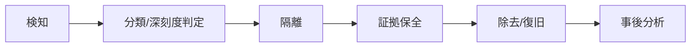

> 文書基準: 2026年5月

## 概要

[セキュリティ態勢管理](../../security/security-posture/)で予防・検知していても、セキュリティインシデントは発生し得ます。クラウド環境ではオンプレミスとは異なる対応手順が必要です — アカウント隔離、トークンの失効、APIベースの証拠保全、自動隔離など。

## 対応フロー

:::caution
セキュリティインシデント対応は**インシデント発生後に準備することはできません。** ランブック(対応手順書)、役割分担、連絡体制、隔離スクリプトを事前に作成し、定期的に訓練する必要があります。準備なくインシデントに直面すると、判断の遅れ、証拠の消失、被害拡大につながります。
:::

| 段階 | 活動 | クラウド特有のポイント |
| --- | --- | --- |
| **検知** | GuardDuty/Defender/SCCアラート、SIEM相関分析 | 自動検知サービスの活用 |
| **分類** | 深刻度判定 (Critical/High/Medium/Low)、影響範囲の把握 | どのアカウント/リージョン/サービスが影響を受けるか |
| **隔離** | 侵害されたリソースをネットワーク/権限から切り離す | SG変更、IAMキーの無効化、ロールセッションの遮断 |
| **証拠保全** | フォレンジック用データの確保 | ディスクスナップショット、メモリダンプ、監査ログの保存 |
| **除去/復旧** | 脅威除去後のサービス復旧 | 感染インスタンスの置き換え (Immutable)、鍵の交換 |
| **事後分析** | 根本原因分析、再発防止 | タイムラインの再構成、ポリシー改善 |

## クラウド隔離パターン

### IAMベースの隔離

| 状況 | 対応 | ベンダー別の方法 |
| --- | --- | --- |
| **APIキー/認証情報の漏洩** | キーの即時無効化＋アクティブセッションの無効化 | AWS: Access Keyの無効化＋セッション取り消し、Azure: Entra IDセッションの取り消し、Google Cloud: Service Accountキーの削除 |
| **ロール/権限の奪取** | 該当ロールにDenyポリシーを追加、またはセッション期限切れを強制 | AWS: SCP Deny、Azure: Conditional Accessでの遮断、Google Cloud: Organization Policy |
| **アカウント全体の侵害** | アカウント/サブスクリプション/プロジェクトを組織から隔離 | AWS: SCP全体Deny、Azure: Subscriptionの無効化、Google Cloud: Projectの停止 |

### ネットワークベースの隔離

| 対応 | 方法 |
| --- | --- |
| **インスタンス隔離** | ファイアウォールルールを「すべてのインバウンド/アウトバウンドを遮断」に置き換える (削除してはいけない — 証拠保全のため) |
| **サブネット隔離** | サブネットレベルのACLで該当サブネットのトラフィックを全面遮断 |
| **DNSシンクホール** | 悪性ドメインを内部DNSでシンクホールにリダイレクト |

:::caution
**隔離時にインスタンスを終了(terminate)しないでください。** メモリ、ディスク、ネットワーク接続情報が失われます。隔離後、まずスナップショットを確保してください。
:::

## 証拠保全

| 証拠の種類 | 収集方法 | 保存場所 |
| --- | --- | --- |
| **ディスク** | EBS/Managed Diskスナップショット | フォレンジック専用アカウントの暗号化されたストレージ |
| **メモリ** | SSM Run Commandによるメモリダンプ (LiMEなど) | S3/Blob (暗号化) |
| **ログ** | CloudTrail/Activity Log/Audit Logの保存期間延長 | 別のログアーカイブアカウント (改ざん防止) |
| **ネットワーク** | VPC Flow Logs、DNSクエリログ | 長期保存ストレージ |
| **タイムライン** | イベントの時系列整理 | インシデント対応ドキュメント |

## ベンダー別インシデント対応ツール

| 領域 | AWS | Azure | Google Cloud | OCI |
| --- | --- | --- | --- | --- |
| **検知** | GuardDuty | Defender for Cloud | Security Command Center | Cloud Guard |
| **調査** | Detective | Sentinel (Investigation) | Chronicle | Logging Analytics |
| **自動対応** | EventBridge → Lambda/Step Functions | Sentinel Playbook (Logic Apps) | Cloud Functions / Workflows | Events → Functions |
| **フォレンジック** | スナップショット + SSM + Athena (ログクエリ) | Disk Snapshot + Log Analytics | Disk Snapshot + BigQuery | Block Volume Backup + Logging |
| **ログ長期保存** | S3 + Glacier (Object Lock) | Immutable Blob Storage | Cloud Storage (Retention Lock) | Object Storage (Retention Rules) |

## 事前準備事項

インシデントが発生する**前に**準備しておくべきもの:

- [ ] **フォレンジック専用アカウント** — 証拠を隔離保存するための別アカウント/サブスクリプション/プロジェクト
- [ ] **緊急アクセス (Break-glass) アカウント** — 普段は無効化しておき、インシデント時のみ有効化。事後監査必須
- [ ] **ログ保存ポリシー** — 監査ログ(CloudTrail/Activity Log/Audit Log/OCI Audit)を最低1年以上保存 (改ざん防止設定)
- [ ] **連絡体制** — セキュリティチーム、経営陣、法務、ベンダーサポートの連絡先
- [ ] **Runbook** — インシデント種類別の対応手順の文書化 (IAMキー漏洩、データ漏洩、ランサムウェアなど)
- [ ] **定期訓練** — Tabletop Exercise (シナリオベースの模擬訓練) を四半期に1回

## 継続的に行うべきこと

- **定期訓練(テーブルトップ演習)** — 四半期に1回以上シナリオベースの模擬訓練を実施し、対応能力を維持します。
- **プレイブックの更新** — 実際のインシデントや訓練後に発見された改善点を直ちにプレイブックへ反映します。
- **事後分析(Post-mortem)の反映** — インシデント後の根本原因分析の結果を検知ルールと対応手順にフィードバックします。

## よくある間違い

- **インシデント発生後になってからランブックを作成** — 事前準備なくインシデントに直面すると、判断の遅れ、証拠の消失、被害拡大につながります
- **侵害されたインスタンスを即座に終了(terminate)** — メモリ、ディスク、ネットワーク接続情報が失われ、フォレンジックが不可能になります。隔離後にまずスナップショットを確保する必要があります
- **監査ログの保存期間が短い** — デフォルトの90日保存のままにしているため、インシデント調査時に過去のログがすでに削除されている状態

## チェックリスト

- [ ] インシデント種類別のランブック(IAMキー漏洩、データ漏洩、ランサムウェア)を事前に作成し、定期訓練を実施しているか
- [ ] フォレンジック専用アカウントを分離し、監査ログを最低1年以上改ざん防止設定で保存しているか
- [ ] Break-glass(緊急アクセス)アカウントを準備し、使用時の事後監査手順が定義されているか

## 参考資料

### AWS

- [AWS Security Incident Response Guide](https://docs.aws.amazon.com/whitepapers/latest/aws-security-incident-response-guide/aws-security-incident-response-guide.html)

### Azure

- [Azure Security Incident Response](https://learn.microsoft.com/azure/security/fundamentals/incident-response-overview)

### Google Cloud

- [Google Cloud Responding to Security Incidents](https://cloud.google.com/security/incident-response)

### OCI

- [OCI Security Best Practices](https://docs.oracle.com/en-us/iaas/Content/Security/Concepts/security_guide.htm)

### 標準とコミュニティ

- [NIST SP 800-61 — Computer Security Incident Handling Guide](https://csrc.nist.gov/publications/detail/sp/800-61/rev-2/final)
- [SANS Incident Handler's Handbook](https://www.sans.org/white-papers/33901/)
