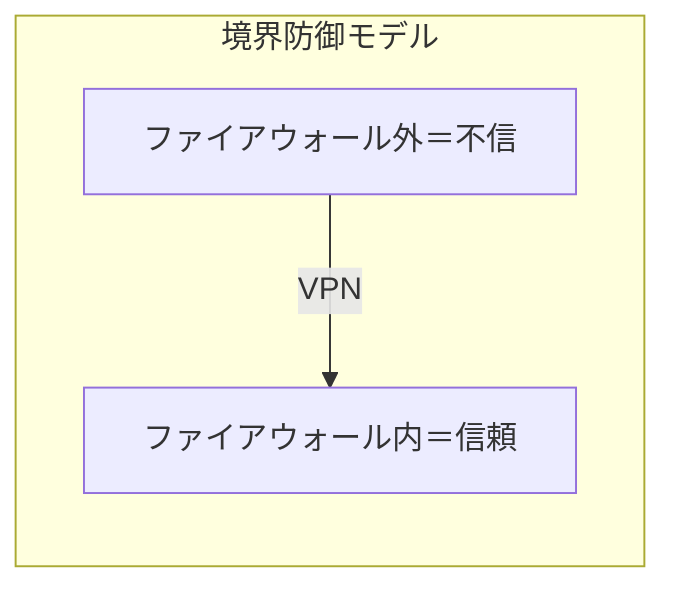
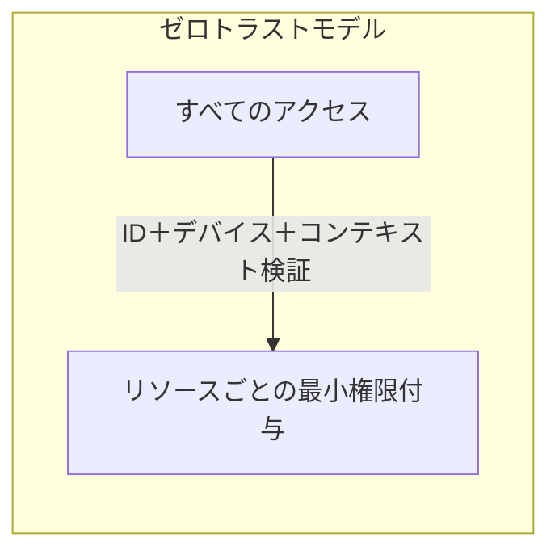

> 文書基準: 2026年8月

## 概要

:::note[前提知識と関連ドキュメント]
セキュリティの基礎と資産の識別は[セキュリティを始める](../../security/getting-started/)、ID・アクセス制御は[IAM](../../security/iam/)を先に参照してください。本ドキュメントは、境界防御を超えるゼロトラストアーキテクチャに焦点を当てます。
:::

従来のネットワークセキュリティは**境界防御** (Perimeter Security) モデルです。ファイアウォールの内側は信頼し、外側は遮断します。しかし、クラウド、リモートワーク、SaaSの普及により、「内と外」の境界は消失しました。

**ゼロトラスト** (Zero Trust)は、「決して信頼せず、常に検証せよ」(Never trust, always verify)という原則です。ネットワーク上の位置に関係なく、すべてのアクセスを検証します。

## 核心原則

| 原則 | 説明 | 実装例 |
| --- | --- | --- |
| **IDベースのアクセス** | ネットワーク上の位置ではなく、ユーザー/ワークロードIDでアクセス制御 | IAMロール、Workload Identity |
| **最小権限** | 必要なリソースにのみ、必要な時間だけアクセスを許可 | JITアクセス、時間制限付きトークン |
| **明示的な検証** | すべてのリクエストを毎回検証 (キャッシュされた信頼はなし) | MFA、デバイス状態確認、位置ベースのポリシー |
| **侵害を前提とした設計** | すでに侵害されていると仮定して設計 | マイクロセグメンテーション、暗号化、ロギング |
| **継続的な検証** | セッション中も継続的に信頼レベルを再評価 | Conditional Access、異常行動検知 |

## ベンダー別ゼロトラストサービス

| 領域 | AWS | Azure | Google Cloud | OCI |
| --- | --- | --- | --- | --- |
| **ネットワークアクセス (ZTNA)** | [Verified Access](https://docs.aws.amazon.com/verified-access/latest/ug/what-is-verified-access.html) — HTTP(S) + **TCP/SSH/RDP/DB** (TCPプロトコル対応 2024年12月GA)でVPNを代替可能 | [Entra Private Access](https://learn.microsoft.com/entra/global-secure-access/concept-private-access) | [BeyondCorp Enterprise](https://cloud.google.com/beyondcorp-enterprise/docs) | [Zero Trust Packet Routing](https://docs.oracle.com/en-us/iaas/Content/zero-trust-packet-routing/home.htm) |
| **IDベースのアクセス** | IAM + Identity Center | Entra ID + Conditional Access | IAM + Workload Identity Federation | Identity Domains + 動的グループ |
| **マイクロセグメンテーション** | Security Groups + PrivateLink | NSG + Private Endpoints | VPC Service Controls + Firewall Rules | NSG + Network Path Analyzer |
| **デバイス信頼** | Verified Accessデバイスポリシー | Intune + Conditional Access | BeyondCorpデバイス証明書 | — (サードパーティ連携) |
| **ワークロード間認証** | IAM Role + STS | Managed Identity | Workload Identity Federation | Instance Principal |

## 既存のVPCモデルとの関係

ゼロトラストは、VPC/サブネットベースのネットワークセキュリティを**代替するのではなく補完**します。

| レイヤー | 役割 | ツール |
| --- | --- | --- |
| **ネットワークレイヤー** (既存) | 帯域制御、DDoS防御、基本隔離 | VPC、サブネット、Security Group、WAF |
| **IDレイヤー** (ゼロトラスト) | 誰が、どの条件で、何にアクセスするか | IAM、Conditional Access、ZTNA |

:::note
**VPCをなくすわけではありません。** ネットワーク隔離(VPC/サブネット)は、依然として多層防御の1つのレイヤーです。ゼロトラストはその上にIDベースのアクセス制御を追加し、ネットワーク内にいても無条件には信頼しないというものです。
:::

## 導入段階

| 段階 | 活動 | 目標 |
| --- | --- | --- |
| **1. ID統合** | すべてのユーザー/サービスを中央IDシステムへ統合 | 誰がアクセスしているかを把握 |
| **2. MFA＋条件付きアクセス** | すべてのアクセスにMFAを強制、位置/デバイス条件を追加 | 基本的な検証体系の構築 |
| **3. 最小権限の適用** | 過剰な権限の除去、JITアクセスの導入 | 侵害時の被害範囲の最小化 |
| **4. マイクロセグメンテーション** | ワークロード間の通信を明示的に許可されたもののみに | 横方向の移動を遮断 |
| **5. 継続的モニタリング** | すべてのアクセスログの収集、異常行動検知 | 侵害の早期検知 |

### 段階別の具体的アクション

#### 第1段階: ID統合

- すべてのユーザーアカウントにMFAを適用 (例外なし)
- サービスアカウント/ワークロードアイデンティティのインベントリ作成
- 外部IdP(Microsoft Entra ID、Oktaなど)でSSOを統合

#### 第2段階: 条件付きアクセス

- MDM(モバイルデバイス管理)連携によるデバイス状態の確認
- 位置/時間/デバイス状態ベースの条件付きアクセスポリシーの適用
- VPNのみで信頼を付与するポリシーの廃止

#### 第3段階: 最小権限

- IAM権限監査ツールの活用 (IAM Access Analyzer、Entra ID Access Reviews)
- 未使用権限の検知と除去 (90日未使用を基準)
- JIT(Just-In-Time)アクセスによる常時権限の最小化

#### 第4段階: マイクロセグメンテーション

- VPCサブネットの分離 (ワークロードタイプ別)
- サービス間通信のホワイトリスト化 (デフォルト拒否、明示的許可のみ)
- サービスメッシュ(Istio、Linkerd)またはネットワークポリシーで実装

#### 第5段階: 継続的モニタリング

- 異常兆候検知ツールの有効化 (GuardDuty、Defender、SCC)
- SIEM連携による集中ログ分析
- アクセスパターンのベースライン策定と逸脱通知

## Zero Trust導入チェックリスト

- [ ] すべてのユーザーアカウントにMFAを適用 (フィッシング耐性MFAを優先)
- [ ] サービスアカウント/ワークロードアイデンティティのインベントリを作成
- [ ] 非人間ID(サービスアカウント、AIエージェント、CI/CDボット)に短期認証情報を適用
- [ ] ネットワーク位置に基づく信頼を排除 (VPNのみでの信頼付与を禁止)
- [ ] 条件付きアクセスポリシーを適用 (デバイス状態、位置、時間ベース)
- [ ] ワークロード間通信にワークロードID(SPIFFE/OIDC/Instance Principal)を適用
- [ ] 東西トラフィック(内部通信)の可視性を確保
- [ ] アクセスログの集中管理と異常検知の設定 (ITDRを含む)

## よくある間違い

- **「VPNがあればZero Trustだ」** — VPNはネットワーク境界を作るだけであり、Zero Trustとは異なる概念です。VPN内であってもすべてのリクエストを検証する必要があります。
- **「内部網は安全だ」** — 内部の攻撃者、アカウント乗っ取りシナリオを考慮しない従来型のアプローチです。
- **「一度に全社適用」** — 段階的アプローチなしで全面導入を試みると、運用障害のリスクが大きくなります。重要なシステムから段階的に適用してください。

## 2025〜2026年のトレンド: Identity-first Zero Trust

ゼロトラストの中心が、ネットワークベースの制御から**IDベースの制御**へと移行しています (NIST SP 800-207、CISA ZTMM)。

### 非人間ID (Non-Human Identity)

AIエージェント、サービスアカウント、CI/CDパイプラインボットなど、非人間IDの管理が新たな課題となっています。

| 課題 | 対応 |
| --- | --- |
| 長期認証情報の放置 | 短期トークン(STS)、OIDCフェデレーション、インスタンスメタデータベース認証への移行 |
| 過剰な権限を持つサービスアカウント | 未使用権限の検知(IAM Access Analyzer、Entra Access Reviews)、JITアクセス |
| AIエージェントの身元検証 | ワークロードID＋条件付きアクセス＋ツール別最小権限 |
| 非人間IDの異常行動検知 | ITDR(Identity Threat Detection & Response) |

#### Microsoft Entra Agent ID

Microsoftは、AIエージェントをディレクトリ内で独立管理される1級ID(first-class identity)として扱う[Entra Agent ID](https://learn.microsoft.com/entra/workload-id/workload-identities-overview)を導入しました (Build 2025)。エージェントには、条件付きアクセス、ライフサイクル管理、監査ログが人間IDと同様に適用されます。エージェント導入のガバナンス詳細は[AIエージェント導入ガイド](../../ai/agent-adoption/)を参照してください。

### ワークロードIDの強化

| ベンダー | 変化 |
| --- | --- |
| **Microsoft** | Entra Workload IDにConditional Access＋継続的アクセス評価(CAE)を適用 |
| **AWS** | メンバーアカウントのルートユーザーMFA必須化、IAMロール/OIDCプロバイダーのクォータ増加 |
| **Google Cloud** | Workforce Identity Federationの拡張 — 同期不要の属性ベースSSO、コンテキスト認識IAM |

マルチクラウド/ハイブリッド環境では、**SPIFFE/SPIRE** (CNCF Graduated)によりワークロード間の相互認証を標準化できます。短期認証情報(X.509 SVID、JWT)を自動発行/ローテーションすることで、長期シークレットを排除します。

### セキュリティツール統合のトレンド

個別ツールで分散運用されていたクラウドセキュリティが、**CNAPP**(Cloud-Native Application Protection Platform)へと統合されつつあります。これはZero Trustの「常に検証」の原則を自動化する基盤です。

| 構成要素 | 役割 | Zero Trustとの関連 |
| --- | --- | --- |
| **CSPM** | クラウド構成ミスの検知 | 誤って開放されたアクセス経路の事前遮断 |
| **CIEM** | クラウドID/権限管理 | 過剰権限の検知、非人間IDを含む。Azure: Entra Permissions Managementは2025年4月から**独立SKUの新規販売を終了**し、中核CIEM機能をDefender for Cloud CSPMへ統合。既存顧客は既存のライセンス条件に基づき継続利用可能 |
| **CWPP** | ワークロードランタイム保護 | 侵害を前提とした実行時点での防御 |

この3要素をID中心に統合管理することが現在の方向性であり、構成ミス(misconfiguration)と権限拡散(privilege sprawl)がクラウド侵害の主要な経路として指摘されています。

## IAMとの関係

Zero Trustは**セキュリティモデル**(哲学)であり、IAMは**実装手段**です。Zero Trustの「**常に検証せよ**」を実現する中核ツールがIAMです。IAM実務設計は[IAM詳細](../../security/iam/)を参照してください。

## 参考資料

### AWS

- [AWS Verified Access ドキュメント](https://docs.aws.amazon.com/verified-access/latest/ug/what-is-verified-access.html)

### Azure

- [Microsoft Zero Trust ガイド](https://learn.microsoft.com/security/zero-trust/)

### Google Cloud

- [Google BeyondCorp Enterprise](https://cloud.google.com/beyondcorp-enterprise/docs)

### OCI

- [OCI Zero Trust Packet Routing](https://docs.oracle.com/en-us/iaas/Content/zero-trust-packet-routing/home.htm)

### 標準とコミュニティ

- [NIST SP 800-207 — Zero Trust Architecture](https://csrc.nist.gov/publications/detail/sp/800-207/final)
- [CISA Zero Trust Maturity Model](https://www.cisa.gov/zero-trust-maturity-model)
