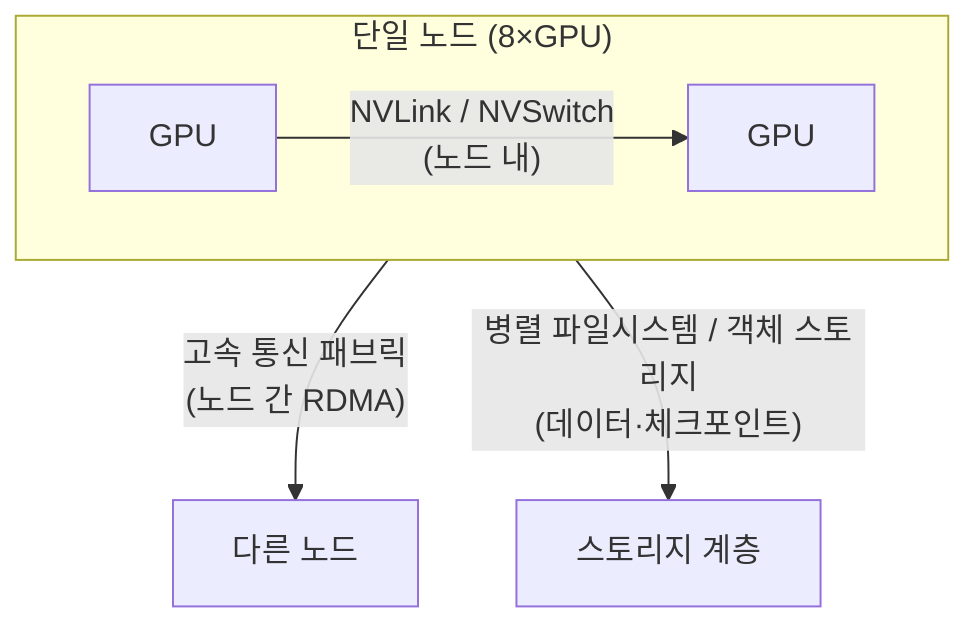

> 문서 기준: 2026년 9월 | 이 문서는 변동이 빠른 영역으로 분기별 리뷰 대상입니다.

:::note
이 문서는 GPU 인프라 설계 심화 내용입니다. GPU 인스턴스 세대별 스펙·리전 가용성·예약/스팟 옵션은 [멀티클라우드 AI — GPU 가용성](../../ai/multicloud-ai/#gpu-가용성)에, AI 플랫폼·모델 선택은 [AI 플랫폼과 모델 비교](../../ai/ai-ml/)에 정리되어 있습니다. 이 문서는 "여러 GPU를 어떻게 하나의 클러스터로 묶어 학습·추론하는가"에 초점을 둡니다.
:::

## 개요

단일 GPU로 처리할 수 없는 워크로드는 여러 GPU와 여러 노드를 하나의 클러스터로 묶어야 합니다. 이때 성능을 결정하는 것은 개별 GPU의 연산 능력이 아니라 **GPU 간·노드 간 통신 대역폭과 지연**, 그리고 **데이터를 GPU까지 밀어 넣는 스토리지 처리량**입니다. 이 문서는 워크로드 특성을 먼저 분류하고, 그에 맞는 클러스터 아키텍처를 3계층으로 나눠 벤더별로 비교합니다.

### 이식성 기준선과 이 문서의 범위

이 문서는 **CUDA + NCCL을 이식성 기준선(baseline)**으로 삼습니다. 대부분의 분산 학습·추론 스택은 이 조합 위에서 동작하며, 클라우드를 바꿔도 애플리케이션 코드 수준에서는 대체로 이식됩니다. 반면 **고속 통신 패브릭, 배치 그룹, 매니지드 클러스터 제품은 벤더마다 이름과 구현이 다르고 서로 1:1로 대응하지 않습니다.**

:::caution
벤더별 고유 구현의 세부 설정(예: 특정 인스턴스의 EFA 큐 수, InfiniBand 파티션 키)은 이 문서의 범위를 벗어납니다. 이 문서는 벤더 간 개념을 정규화·비교하는 데 초점을 두며, 벤더 고유의 상세 튜닝은 각 벤더 공식 문서로 위임합니다. 성능 수치는 인스턴스·드라이버·NCCL 버전·스토리지·토폴로지 조건에 크게 좌우되므로, 도입 전 실제 워크로드로 측정해야 합니다.
:::

## GPU 워크로드 3분류

워크로드마다 병목이 되는 자원이 다르므로, 인프라 설계의 출발점은 워크로드 특성 파악입니다.

| 워크로드 | 지배적 병목 | 통신 요구 | 스토리지 요구 | 대표 인프라 특성 |
| --- | --- | --- | --- | --- |
| **사전학습 (Pre-training)** | 연산 + 노드 간 통신 | 매우 높음 (전 노드 collective) | 높음 (대용량 데이터셋 스트리밍) | 다수 노드, 고속 패브릭 필수, 체크포인트 대역폭 중요 |
| **파인튜닝 (Fine-tuning)** | 연산 + 메모리 | 중간 (수 노드 이내가 많음) | 중간 | 소~중규모 클러스터, 단일 노드로 가능한 경우 많음 |
| **추론 (Inference)** | 메모리 대역폭 + 지연 | 낮음 (모델 병렬 시에만) | 낮음 (가중치 로드 후 상주) | 지연·처리량 균형, 오토스케일 중심 |

:::note
대부분의 엔터프라이즈 워크로드는 파인튜닝과 추론에 집중되며, 이 둘은 단일 노드 또는 소규모 노드로 충분한 경우가 많습니다. 노드 간 고속 패브릭이 성능을 좌우하는 것은 주로 대규모 사전학습입니다. 워크로드에 맞는 최소 구성을 선택하세요.
:::

## 레퍼런스 아키텍처 — 3계층 통신 모델

GPU 클러스터의 데이터 이동은 세 계층으로 구분됩니다. 각 계층은 서로 다른 기술로 처리되며, 벤더 비교 시 이 계층을 섞으면 안 됩니다.

- **노드 내 (intra-node)** — 한 서버 안의 GPU들은 NVLink/NVSwitch로 연결됩니다. 대역폭이 가장 크며 벤더와 무관하게 NVIDIA 플랫폼 특성으로 결정됩니다.
- **노드 간 (inter-node backend fabric)** — 서버와 서버 사이는 RDMA 기반 고속 통신 패브릭으로 연결됩니다. **벤더마다 구현이 다른 계층이며, 대규모 학습 성능을 좌우합니다.**
- **스토리지 (storage I/O)** — 학습 데이터 스트리밍과 체크포인트 저장/복원에 쓰입니다. 대규모 학습에서 체크포인트 대역폭이 부족하면 GPU가 유휴 상태로 대기합니다.

### 노드 간 고속 통신 패브릭 — 벤더 매핑

| 계층 | AWS | Azure | Google Cloud | OCI |
| --- | --- | --- | --- | --- |
| **노드 간 패브릭** | [EFA (Elastic Fabric Adapter)](https://docs.aws.amazon.com/AWSEC2/latest/UserGuide/efa.html) | [InfiniBand](https://learn.microsoft.com/azure/virtual-machines/sizes/overview) (ND 시리즈) | [GPUDirect-TCPX / RDMA](https://cloud.google.com/compute/docs/gpus) | [RDMA Cluster Network](https://docs.oracle.com/en-us/iaas/Content/Compute/Tasks/managingclusternetworks.htm) |
| **통신 라이브러리** | NCCL | NCCL | NCCL | NCCL |
| **동일 개념 여부** | 근사 대응 — 이름·구현·성능 특성이 상이 | 근사 대응 | 근사 대응 | 근사 대응 |

:::caution
위 표의 4개 패브릭은 **같은 역할을 하는 서로 다른 기술**이며 1:1 등가가 아닙니다. 예를 들어 InfiniBand와 EFA는 프로토콜·혼잡 제어·지원 인스턴스가 다릅니다. "A 벤더의 X = B 벤더의 Y" 식으로 단순 치환하지 말고, NCCL 위에서 동작하는 애플리케이션 이식성을 기준으로 삼되 패브릭 성능은 벤더별로 측정하세요.
:::

### 배치·토폴로지 — 물리적 근접성과 NUMA

노드 간 통신 성능을 살리려면 GPU 노드들이 **물리적으로 가까이 배치**되어야 하고, 노드 안에서는 GPU와 네트워크 인터페이스(NIC)가 **같은 NUMA 도메인**에 정렬되어야 합니다.

| 항목 | AWS | Azure | Google Cloud | OCI |
| --- | --- | --- | --- | --- |
| **근접 배치** | Placement Group (Cluster) | Proximity Placement Group + VMSS | Compact Placement Policy | Cluster Network (근접 프로비저닝 내장) |
| **NUMA·GPU-NIC 정렬** | 인스턴스 토폴로지 노출, NCCL 토폴로지 인식 | 토폴로지 노출 | gVNIC + 토폴로지 인식 | Bare Metal 토폴로지 고정 |

- **근접 배치** — 학습 노드를 저지연으로 묶으려면 근접 배치를 명시적으로 요청해야 합니다. 배치 그룹 없이 흩어진 노드는 collective 통신 지연이 커져 학습 처리량이 떨어집니다.
- **NUMA·GPU-NIC affinity** — GPU와 그 GPU가 사용하는 NIC이 다른 NUMA 노드에 있으면 데이터가 CPU 소켓 간 링크를 거쳐 지연·대역폭 손실이 발생합니다. NCCL 토폴로지 인식과 프로세스 바인딩으로 정렬합니다.

## 매니지드 GPU 클러스터

직접 노드·패브릭·스케줄러를 조립하는 대신, 벤더가 제공하는 매니지드 GPU 클러스터를 쓰면 토폴로지·헬스체크·재시작이 사전 통합됩니다. 대규모 학습에서는 1급 선택지입니다.

| 벤더 | 매니지드 클러스터 제품 | 특징 |
| --- | --- | --- |
| AWS | [SageMaker HyperPod](https://aws.amazon.com/sagemaker/hyperpod/) | 노드 헬스체크·자동 교체, 체크포인트 기반 재개 내장 |
| Azure | [CycleCloud](https://learn.microsoft.com/azure/cyclecloud/) + ND 시리즈 | HPC/AI 클러스터 오케스트레이션, 스케줄러 통합 (노드 자동 교체는 미내장 — 스케줄러·스크립트로 구성) |
| Google Cloud | [AI Hypercomputer / Cluster Director](https://cloud.google.com/ai-hypercomputer) | 통합 인프라 스택, 토폴로지 인식 프로비저닝 |
| OCI | [Supercluster](https://www.oracle.com/cloud/compute/gpu/) | RDMA 클러스터 네트워크, 대규모 GPU 초저지연 연결 (Bare Metal) |

:::note
OCI의 **Dedicated AI Cluster**는 위 학습 인프라와 다른 계층입니다. 이는 OCI Enterprise AI 서비스 안에서 사전학습된 파운데이션 모델을 파인튜닝·호스팅하는 관리형(PaaS) 자원으로, 직접 클러스터를 조립하는 학습 인프라가 아닙니다. 대규모 학습 인프라에 해당하는 것은 Supercluster입니다.
:::

:::note
매니지드 클러스터는 초기 조립·운영 부담을 크게 줄이지만 벤더 종속성이 높아집니다. 순수 쿠버네티스로 직접 구성하면 이식성은 높아지지만 토폴로지·헬스체크·gang scheduling을 직접 책임져야 합니다. 이식성과 운영 편의의 트레이드오프는 워크로드 규모와 팀 역량으로 판단하세요. 쿠버네티스 기반 구성은 [GPU 쿠버네티스와 스케줄링](../../ai/gpu-infra/kubernetes-and-scheduling/)을 참고하세요.
:::

## 관련 문서

- **분산 학습 병렬화(TP/PP/DP)** — [분산 학습 표준 아키텍처](../../ai/gpu-infra/distributed-training/)
- **쿠버네티스·스케줄링·쿼터** — [GPU 쿠버네티스와 스케줄링](../../ai/gpu-infra/kubernetes-and-scheduling/)
- **추론 서빙·장애·용량·비용** — [추론 서빙·안정성·비용 최적화](../../ai/gpu-infra/serving-reliability-cost/)
- **기밀 GPU 컴퓨팅** — [데이터 보호 — 기밀 컴퓨팅](../../security/data-protection/#기밀-컴퓨팅-confidential-computing)

## 자주 하는 실수

- **워크로드 특성 분석 없이 최상위 GPU 세대부터 선택** — 파인튜닝·추론에 충분한 워크로드에 대규모 사전학습용 구성을 도입해 비용이 급증
- **배치 그룹 없이 다수 노드 학습** — 노드가 물리적으로 흩어져 collective 통신 지연이 커지고 학습 처리량이 저하
- **패브릭을 벤더 간 1:1로 치환** — EFA·InfiniBand·RDMA를 동일하다고 가정해 성능 예측이 빗나감
- **스토리지 대역폭 과소 설계** — 체크포인트 저장 중 GPU가 유휴로 대기해 실효 활용률 하락

## 체크리스트

- [ ] 워크로드를 사전학습/파인튜닝/추론으로 분류하고 지배적 병목(연산·메모리·통신)을 식별했는가
- [ ] 노드 내/노드 간/스토리지 3계층을 각각 분리해 설계했는가
- [ ] 다수 노드 학습 시 근접 배치(placement group/cluster network)를 명시적으로 요청했는가
- [ ] GPU-NIC NUMA 정렬과 NCCL 토폴로지 인식을 확인했는가
- [ ] 매니지드 클러스터와 직접 구성의 이식성·운영 트레이드오프를 평가했는가

## 참고하기

### AWS

- [Elastic Fabric Adapter (EFA)](https://docs.aws.amazon.com/AWSEC2/latest/UserGuide/efa.html)
- [SageMaker HyperPod](https://aws.amazon.com/sagemaker/hyperpod/)

### Azure

- [GPU 최적화 VM 크기](https://learn.microsoft.com/azure/virtual-machines/sizes/overview)
- [Azure CycleCloud](https://learn.microsoft.com/azure/cyclecloud/)

### Google Cloud

- [Cloud GPUs](https://cloud.google.com/compute/docs/gpus)
- [AI Hypercomputer](https://cloud.google.com/ai-hypercomputer)

### OCI

- [Cluster Networks](https://docs.oracle.com/en-us/iaas/Content/Compute/Tasks/managingclusternetworks.htm)
- [OCI GPU Compute](https://www.oracle.com/cloud/compute/gpu/)

### 공통

- [NVIDIA NCCL 문서](https://docs.nvidia.com/deeplearning/nccl/user-guide/docs/index.html)
