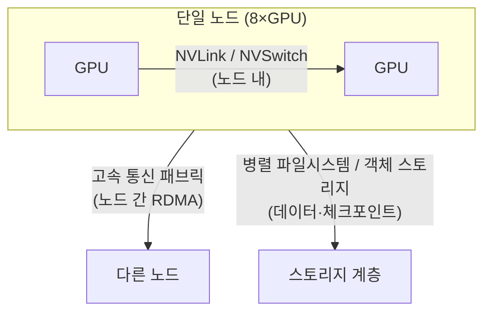

> 문서 기준: 2026년 9월 | 이 문서는 변동이 빠른 영역으로 분기별 리뷰 대상입니다.

:::tip[GPU 인프라 시리즈 읽는 순서]
이 문서는 4부로 이어지는 GPU 인프라 시리즈의 1부입니다.

1. **GPU 워크로드 특성과 레퍼런스 아키텍처** (이 문서) — 워크로드 분류, 통신 3계층, 배치
2. [분산 학습 표준 아키텍처](../distributed-training/) — 병렬화(TP/PP/DP), 체크포인트
3. [GPU 쿠버네티스와 스케줄링](../kubernetes-and-scheduling/) — 노드풀, 쿼터, gang scheduling
4. [추론 서빙·안정성·비용 최적화](../serving-reliability-cost/) — 서빙, 장애, 용량, 비용

순서대로 읽는 것을 권장하지만, **이미 학습을 돌리고 있다면 2부부터**, **클러스터 운영·SRE라면 3–4부부터** 보아도 됩니다.
:::

:::note
이 문서는 GPU 인프라 설계 심화 내용입니다. GPU 인스턴스 세대별 스펙·리전 가용성·예약/스팟 옵션은 [멀티클라우드 AI — GPU 가용성](../../../ai/multicloud-ai/#gpu-가용성)에, AI 플랫폼·모델 선택은 [AI 플랫폼과 모델 비교](../../../ai/ai-ml/)에 정리되어 있습니다. 이 문서는 "여러 GPU를 어떻게 하나의 클러스터로 묶어 학습·추론하는가"에 초점을 둡니다.
:::

## 개요

이 문서는 모델이나 데이터가 GPU 한 장(또는 서버 한 대)의 용량을 넘어설 때 필요합니다. 이 경우 여러 GPU와 여러 서버를 하나로 묶어 일을 나눠야 합니다.

이때 흔한 오해가 "GPU를 더 빠른 걸로, 더 많이 넣으면 그만큼 빨라진다"는 것입니다. 실제로는 그렇지 않습니다. 여러 GPU가 협업하려면 서로 계산 결과를 끊임없이 주고받아야 하는데, **GPU 수를 늘려도 노드 간 통신 대역폭과 스토리지 처리량이 함께 늘지 않으면 GPU 유휴 시간만 늘어나 성능이 선형으로 확장되지 않습니다.** (요리사를 아무리 늘려도 주방이 좁고 재료 나르는 길이 막히면 그만큼 빨라지지 않는 것과 같습니다.)

그래서 GPU 인프라 설계는 "어떤 GPU를 쓰나"보다 **GPU들을 어떻게 연결하고 데이터를 어떻게 흘려보내나**가 핵심입니다. 이 문서는 먼저 워크로드가 어떤 종류인지 나누고(학습이냐 추론이냐 등), 그에 맞는 연결 구조를 **노드 내 → 노드 간 → 스토리지** 3단계로 나눠 4개 벤더를 비교합니다.

:::note
이 문서에서 **노드**(node)는 GPU가 여러 장 꽂힌 서버 한 대를, **클러스터**(cluster)는 그런 노드 여러 대를 묶은 것을 뜻합니다.
:::

### 무엇이 클라우드를 바꿔도 그대로이고, 무엇이 벤더마다 다른가

클라우드를 옮길 때 무엇이 따라오고 무엇이 새로 배워야 하는지 먼저 정리하면 이후 내용이 쉽습니다.

- **그대로 가는 것(이식성 기준선)** — 학습·추론 코드는 대부분 **CUDA와 NCCL**이라는 공통 기반 위에서 돕니다. (CUDA = NVIDIA GPU에서 계산을 돌리는 표준 소프트웨어, NCCL = 여러 GPU가 계산 결과를 주고받게 해주는 통신 라이브러리.) 이 둘 위에서 짠 코드는 클라우드를 바꿔도 대체로 그대로 옮겨집니다.
- **벤더마다 다른 것** — GPU들을 물리적으로 잇는 **고속 통신망, 서버를 가까이 배치하는 방법, 통째로 관리해주는 클러스터 제품**은 벤더마다 이름도 구현도 다르고, 서로 1:1로 딱 맞바꿀 수 없습니다.

:::caution
벤더 고유 구현의 세세한 설정값(예: 특정 인스턴스의 통신 큐 수, 파티션 키)은 이 문서의 범위를 벗어납니다. 이 문서는 벤더 간 개념을 나란히 비교하는 데 집중하고, 세부 튜닝은 각 벤더 공식 문서에 맡깁니다. 또한 성능 수치는 인스턴스·드라이버·라이브러리 버전·스토리지·배치 조건에 크게 좌우되므로, 도입 전 실제 워크로드로 직접 측정해야 합니다.
:::

## GPU 워크로드 3분류

워크로드마다 병목이 되는 자원이 다르므로, 인프라 설계의 출발점은 워크로드 특성 파악입니다.

| 워크로드 | 지배적 병목 | 통신 요구 | 스토리지 요구 | 대표 인프라 특성 |
| --- | --- | --- | --- | --- |
| **사전학습 (Pre-training)** | 연산 + 노드 간 통신 | 매우 높음 (전 노드가 함께 통신) | 높음 (대용량 데이터셋 스트리밍) | 다수 노드, 고속 통신망 필수, 체크포인트 대역폭 중요 |
| **파인튜닝 (Fine-tuning)** | 연산 + 메모리 | 중간 (수 노드 이내가 많음) | 중간 | 소~중규모 클러스터, 단일 노드로 가능한 경우 많음 |
| **추론 (Inference)** | 메모리 대역폭 + 지연 | 낮음 (모델 병렬 시에만) | 낮음 (가중치 로드 후 상주) | 지연·처리량 균형, 오토스케일 중심 |

:::note
대부분의 엔터프라이즈 워크로드는 파인튜닝과 추론에 집중되며, 이 둘은 단일 노드 또는 소규모 노드로 충분한 경우가 많습니다. 노드 간 고속 패브릭이 성능을 좌우하는 것은 주로 대규모 사전학습입니다. 워크로드에 맞는 최소 구성을 선택하세요.
:::

## 레퍼런스 아키텍처 — 3계층 통신 모델

GPU 클러스터에서 데이터가 오가는 길은 크게 세 종류입니다. 각 길은 서로 다른 기술로 만들어지며, 속도도 역할도 다릅니다. 벤더를 비교할 때 이 세 계층을 섞어서 보면 잘못된 비교가 되므로 반드시 나눠서 봅니다.

- **노드 내 (한 서버 안)** — 한 서버 안의 GPU끼리는 NVLink/NVSwitch라는 초고속 전용선으로 이어집니다. 세 계층 중 가장 빠르고, 벤더와 무관하게 NVIDIA 하드웨어 특성으로 정해집니다.
- **노드 간 (서버와 서버 사이)** — 서버끼리는 **고속 통신 패브릭**으로 잇습니다. 여기서 패브릭(fabric)은 "서버들을 촘촘히 엮는 전용 고속 네트워크"를 뜻하고, RDMA(Remote Direct Memory Access)는 "CPU를 거치지 않고 서버 메모리끼리 직접 데이터를 주고받는" 기술입니다. **이 계층은 벤더마다 구현이 다르며, 대규모 학습 성능을 좌우합니다.**
- **스토리지 (데이터 보관소)** — 학습 데이터를 읽어 오고, 중간 저장본(체크포인트)을 쓰고 다시 불러오는 길입니다. 이 길이 느리면 GPU가 데이터를 기다리며 놀게 됩니다.

### 노드 간 고속 통신 패브릭 — 벤더 매핑

| 계층 | AWS | Azure | Google Cloud | OCI |
| --- | --- | --- | --- | --- |
| **노드 간 패브릭** | [EFA (Elastic Fabric Adapter)](https://docs.aws.amazon.com/AWSEC2/latest/UserGuide/efa.html) | [InfiniBand](https://learn.microsoft.com/azure/virtual-machines/sizes/overview) (ND 시리즈) | [GPUDirect-TCPX / RDMA](https://cloud.google.com/compute/docs/gpus) | [RDMA Cluster Network](https://docs.oracle.com/en-us/iaas/Content/Compute/Tasks/managingclusternetworks.htm) |
| **통신 라이브러리** | NCCL | NCCL | NCCL | NCCL |
| **동일 개념 여부** | 근사 대응 — 이름·구현·성능 특성이 상이 | 근사 대응 | 근사 대응 | 근사 대응 |

:::caution
위 표의 4개 패브릭은 **같은 역할을 하는 서로 다른 기술**이며 1:1 등가가 아닙니다. 예를 들어 InfiniBand와 EFA는 프로토콜·혼잡 제어·지원 인스턴스가 다릅니다. "A 벤더의 X = B 벤더의 Y" 식으로 단순 치환하지 말고, NCCL 위에서 동작하는 애플리케이션 이식성을 기준으로 삼되 패브릭 성능은 벤더별로 측정하세요.
:::

### 배치·토폴로지 — 물리적 근접성과 NUMA

노드 간 통신 성능을 살리려면 두 가지가 맞아야 합니다. 첫째, GPU 서버들이 데이터센터 안에서 **물리적으로 가까이** 있어야 합니다(멀리 흩어져 있으면 오가는 시간이 길어집니다). 둘째, 한 서버 안에서 GPU와 그 GPU가 쓰는 네트워크 카드(NIC)가 **같은 구역**에 붙어 있어야 합니다. 여기서 NUMA(Non-Uniform Memory Access)는 "한 서버 안에서도 CPU·메모리가 여러 구역으로 나뉘어 있어, 같은 구역끼리는 빠르고 다른 구역을 거치면 느려지는 구조"를 말합니다.

| 항목 | AWS | Azure | Google Cloud | OCI |
| --- | --- | --- | --- | --- |
| **근접 배치** | Placement Group (Cluster) | Proximity Placement Group + VMSS | Compact Placement Policy | Cluster Network (근접 프로비저닝 내장) |
| **NUMA·GPU-NIC 정렬** | 인스턴스 토폴로지 노출, NCCL 토폴로지 인식 | 토폴로지 노출 | gVNIC + 토폴로지 인식 | Bare Metal 토폴로지 고정 |

- **근접 배치** — 학습 노드를 저지연으로 묶으려면 근접 배치를 명시적으로 요청해야 합니다. 배치 그룹 없이 흩어진 노드는 collective 통신 지연이 커져 학습 처리량이 떨어집니다.
- **NUMA·GPU-NIC affinity** — GPU와 그 GPU가 사용하는 NIC이 다른 NUMA 노드에 있으면 데이터가 CPU 소켓 간 링크를 거쳐 지연·대역폭 손실이 발생합니다. NCCL 토폴로지 인식과 프로세스 바인딩으로 정렬합니다.

## 매니지드 GPU 클러스터

직접 노드·패브릭·스케줄러를 조립하는 대신, 벤더가 제공하는 매니지드 GPU 클러스터를 쓰면 토폴로지·헬스체크·재시작이 사전 통합됩니다. 대규모 학습에서는 1급 선택지입니다.

| 벤더 | 매니지드 클러스터 제품 | 특징 |
| --- | --- | --- |
| AWS | [SageMaker HyperPod](https://aws.amazon.com/sagemaker/hyperpod/) | 노드 헬스체크·자동 교체, 체크포인트 기반 재개 내장 |
| Azure | [CycleCloud](https://learn.microsoft.com/azure/cyclecloud/) + ND 시리즈 | HPC/AI 클러스터 오케스트레이션, 스케줄러 통합 (노드 자동 교체는 미내장 — 스케줄러·스크립트로 구성) |
| Google Cloud | [AI Hypercomputer / Cluster Director](https://cloud.google.com/ai-hypercomputer) | 통합 인프라 스택, 토폴로지 인식 프로비저닝 |
| OCI | [Supercluster](https://www.oracle.com/cloud/compute/gpu/) | RDMA 클러스터 네트워크, 대규모 GPU 초저지연 연결 (Bare Metal) |

:::note
OCI의 **Dedicated AI Cluster**는 위 학습 인프라와 다른 계층입니다. 이는 OCI Enterprise AI 서비스 안에서 사전학습된 파운데이션 모델을 파인튜닝·호스팅하는 관리형(PaaS) 자원으로, 직접 클러스터를 조립하는 학습 인프라가 아닙니다. 대규모 학습 인프라에 해당하는 것은 Supercluster입니다.
:::

:::note
매니지드 클러스터는 초기 조립·운영 부담을 크게 줄이지만 벤더 종속성이 높아집니다. 순수 쿠버네티스로 직접 구성하면 이식성은 높아지지만 토폴로지·헬스체크·gang scheduling을 직접 책임져야 합니다. 이식성과 운영 편의의 트레이드오프는 워크로드 규모와 팀 역량으로 판단하세요. 쿠버네티스 기반 구성은 [GPU 쿠버네티스와 스케줄링](../kubernetes-and-scheduling/)을 참고하세요.
:::

### 오케스트레이터 선택 — Slurm과 쿠버네티스

매니지드 GPU 클러스터를 고를 때 마주치는 갈림길이 **작업을 어떤 오케스트레이터로 배분하느냐**입니다. 크게 Slurm과 쿠버네티스 두 갈래가 있고, 둘은 우열을 가리는 대체 관계가 아니라 **워크로드 성격에 따라 고르는 선택지**입니다.

- **Slurm** — HPC(고성능 컴퓨팅)에서 오래 쓰인 오픈소스 워크로드 매니저(잡 스케줄러)입니다. 사용자가 "GPU 몇 장을 몇 시간 쓰겠다"는 **잡을 제출하면, Slurm이 우선순위 대기 줄(파티션)에 넣고 자리가 나는 노드에 배분**합니다. 컨테이너가 아니라 배치 잡이 중심이라, 대규모 사전학습이나 기존 온프렘 HPC·Slurm 잡을 그대로 옮겨오는 경우에 마찰이 적고 제출 스크립트·레시피를 재사용할 수 있습니다.
- **쿠버네티스** — 컨테이너 오케스트레이션 표준으로, 배치 잡보다 **상시 서비스(추론 서버 등)에 강합니다.** 학습·추론·서빙을 한 클러스터에 섞어 돌리거나 네임스페이스 격리·멀티테넌시가 필요할 때 유리하고, 기존 쿠버네티스 에코시스템을 그대로 활용합니다. 단, 분산 학습에 필요한 gang scheduling은 별도 도구로 보완해야 합니다([GPU 쿠버네티스와 스케줄링](../kubernetes-and-scheduling/) 참고).

클라우드 벤더는 Slurm과 쿠버네티스 경로를 모두 제공하는 경우가 많지만, 동일한 매니지드 클러스터에서 둘 중 하나를 선택할 수 있는지는 제품마다 다릅니다. 일부 제품은 둘을 잇는 하이브리드 방식도 지원합니다.

| 오케스트레이터 | AWS | Azure | Google Cloud | OCI |
| --- | --- | --- | --- | --- |
| **Slurm (HPC)** | [HyperPod + Slurm](https://docs.aws.amazon.com/sagemaker/latest/dg/sagemaker-hyperpod-slurm.html) (관리형) | [CycleCloud Workspace for Slurm](https://learn.microsoft.com/azure/cyclecloud/overview-ccws) (솔루션 템플릿·고객 테넌트 배포) | [Cluster Director](https://cloud.google.com/products/cluster-director) (관리형) · [Cluster Toolkit](https://cloud.google.com/ai-hypercomputer/docs/create/create-self-managed-slurm-cluster) (자체 배포) | [HPC Cluster Stack + Slurm](https://github.com/oracle-quickstart/oci-hpc) (자체 배포·GPU 클러스터 네트워크 기반) |
| **쿠버네티스** | HyperPod + EKS / EKS | AKS | GKE | OKE |
| **하이브리드** | — | — | [Cluster Director — Slurm on GKE](https://cloud.google.com/blog/products/compute/cluster-director-is-now-generally-available) (Preview) | — |

:::caution
위 표의 항목들은 **같은 역할을 하는 서로 다른 구현**이며 1:1 등가가 아닙니다. 읽을 때 세 가지를 구분하세요.

- **운영 모델** — 벤더 관리형, 고객 테넌트에 배포되는 솔루션 템플릿, 직접 배포하는 툴킷은 조달·업데이트·장애 대응 책임이 서로 다릅니다.
- **성숙도** — Cluster Director의 Slurm on GKE는 2026년 9월 기준 **Preview**입니다. 프로덕션 전제로 삼기 전에 현행 출시 단계를 확인하세요.
- **`—`의 의미** — 2026년 9월 기준 해당 벤더의 1st-party 하이브리드를 확인하지 못했다는 뜻이며, 서드파티·자체 구성까지 불가능하다는 의미는 아닙니다.

벤더별 프로비저닝 방식·복원력 기능·통합 수준은 각 공식 문서로 확인하세요.
:::

:::note
Slurm은 이 문서 범위에서 오케스트레이터 선택 축까지만 다루고, sbatch 스크립트·파티션 설정 등 세부 구성은 각 벤더 공식 문서에 맡깁니다. 쿠버네티스를 골랐다면 노드풀·쿼터·gang scheduling 구성은 위에서 안내한 [GPU 쿠버네티스와 스케줄링](../kubernetes-and-scheduling/)을 참고하세요.
:::

## 관련 문서

- **다음: 분산 학습 병렬화(TP/PP/DP)** — [분산 학습 표준 아키텍처](../distributed-training/)
- **쿠버네티스·스케줄링·쿼터** — [GPU 쿠버네티스와 스케줄링](../kubernetes-and-scheduling/)
- **추론 서빙·장애·용량·비용** — [추론 서빙·안정성·비용 최적화](../serving-reliability-cost/)
- **기밀 GPU 컴퓨팅** — [데이터 보호 — 기밀 컴퓨팅](../../../security/data-protection/#기밀-컴퓨팅-confidential-computing)

## 자주 하는 실수

- **워크로드 특성 분석 없이 최상위 GPU 세대부터 선택** — 파인튜닝·추론에 충분한 워크로드에 대규모 사전학습용 구성을 도입해 비용이 급증
- **배치 그룹 없이 다수 노드 학습** — 노드가 물리적으로 흩어져 collective 통신 지연이 커지고 학습 처리량이 저하
- **패브릭을 벤더 간 1:1로 치환** — EFA·InfiniBand·RDMA를 동일하다고 가정해 성능 예측이 빗나감
- **스토리지 대역폭 과소 설계** — 체크포인트 저장 중 GPU가 유휴로 대기해 실효 활용률 하락

## 체크리스트

- [ ] 워크로드를 사전학습/파인튜닝/추론으로 분류하고 지배적 병목(연산·메모리·통신)을 식별했는가
- [ ] 노드 내/노드 간/스토리지 3계층을 각각 분리해 설계했는가
- [ ] 다수 노드 학습 시 근접 배치(placement group/cluster network)를 명시적으로 요청했는가
- [ ] GPU-NIC NUMA 정렬과 NCCL 토폴로지 인식을 확인했는가
- [ ] 매니지드 클러스터와 직접 구성의 이식성·운영 트레이드오프를 평가했는가

## 참고하기

### AWS

- [Elastic Fabric Adapter (EFA)](https://docs.aws.amazon.com/AWSEC2/latest/UserGuide/efa.html)
- [SageMaker HyperPod](https://aws.amazon.com/sagemaker/hyperpod/)
- [SageMaker HyperPod — Slurm 오케스트레이션](https://docs.aws.amazon.com/sagemaker/latest/dg/sagemaker-hyperpod-slurm.html)

### Azure

- [GPU 최적화 VM 크기](https://learn.microsoft.com/azure/virtual-machines/sizes/overview)
- [Azure CycleCloud](https://learn.microsoft.com/azure/cyclecloud/)
- [CycleCloud Workspace for Slurm](https://learn.microsoft.com/azure/cyclecloud/overview-ccws)

### Google Cloud

- [Cloud GPUs](https://cloud.google.com/compute/docs/gpus)
- [AI Hypercomputer](https://cloud.google.com/ai-hypercomputer)
- [Cluster Toolkit — 자체 관리형 Slurm 클러스터](https://cloud.google.com/ai-hypercomputer/docs/create/create-self-managed-slurm-cluster)
- [Cluster Director (제품 페이지)](https://cloud.google.com/products/cluster-director)
- [Cluster Director GA 발표 (Slurm on GKE Preview 포함)](https://cloud.google.com/blog/products/compute/cluster-director-is-now-generally-available)

### OCI

- [OCI HPC Cluster Stack — Slurm 자체 배포](https://github.com/oracle-quickstart/oci-hpc)
- [Cluster Networks](https://docs.oracle.com/en-us/iaas/Content/Compute/Tasks/managingclusternetworks.htm)
- [OCI GPU Compute](https://www.oracle.com/cloud/compute/gpu/)

### 공통

- [NVIDIA NCCL 문서](https://docs.nvidia.com/deeplearning/nccl/user-guide/docs/index.html)
- [Slurm Workload Manager 개요](https://slurm.schedmd.com/overview.html)
