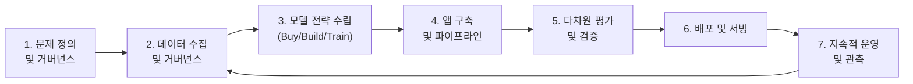
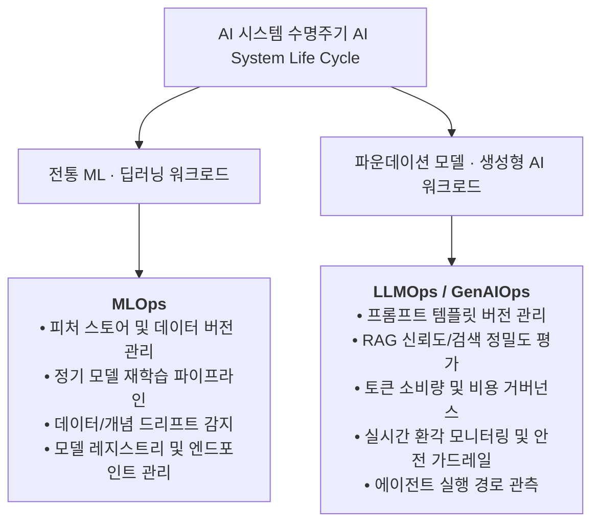

> 문서 기준: 2026년 8월

## 개요

소프트웨어 엔지니어링에서 요구사항 분석부터 유지보수까지 **SDLC (Software Development Life Cycle)**를 따르듯, AI 시스템 역시 체계적인 생명주기를 거칩니다.

그러나 AI 시스템은 전통적인 소프트웨어와 결정적인 차이점이 있습니다:
- **확률적(Probabilistic) 동작** — 동일한 입력에도 가변적인 출력이 발생할 수 있어 결정론적 단위 테스트만으로는 품질을 보증할 수 없습니다.
- **데이터 의존성과 드리프트** — 코드 변경이 없어도 학습 데이터의 노후화나 현실 세계 데이터 분포 변화(Data Drift, Concept Drift)로 인해 시스템 성능이 저하됩니다.
- **다차원 거버넌스** — 환각(Hallucination), 편향, 개인정보(PII) 유출, 프롬프트 인젝션 등 전통 소프트웨어에는 없던 안전 및 보안 위협을 상시 통제해야 합니다.

NIST AI RMF 1.0(Govern–Map–Measure–Manage)과 ISO/IEC 5338(AI 시스템 라이프사이클 프로세스) 등 글로벌 표준 프레임워크를 참조하여 실무적으로 정립한 **AI 시스템 수명주기 (AI System Life Cycle)**는 다음과 같은 전 주기 흐름을 가집니다.

---

## AI 시스템 수명주기 7단계

### 1. 문제 정의 및 거버넌스 (Problem Framing & Governance)
- **비즈니스 가치 평가** — AI 도입의 투자수익률(ROI), 핵심 성과 지표(KPI: 응답 시간, 작업 완료율, 비용 상한)를 정의합니다.
- **규제 및 준수 요건 식별** — 개인정보 보호, 네트워크 격리, 지적재산권(IP) 보호 요건을 사전에 수립합니다.
- **AI 적합성 판정** — 규칙 기반 로직이나 단순 통계로 해결 가능한 문제를 불필요하게 대규모 언어 모델(LLM)로 해결하려는 안티패턴을 방지합니다. 초심자용 진입 판단은 [AI 시작하기 — 먼저 판단하기](../../ai/getting-started/#먼저-판단하기-이-문제에-ai가-적합한가)의 4개 질문 게이트를 참고하세요.

### 2. 데이터 수집 및 거버넌스 (Data Prep & Governance)
- **데이터 파이프라인** — 정형/비정형 데이터 수집, 정제, 청킹(Chunking), 메타데이터 태깅을 수행합니다.
- **프라이버시 및 보안** — 민감 정보(PII) 마스킹, 권한 기반 접근 통제(RBAC/ABAC)를 데이터 수집 단계부터 강제합니다.
- **품질 관리** — RAG를 위한 벡터 임베딩 생성 및 최신 문서 카탈로그를 정비합니다. 상세는 [벡터 스토어](../../ai/vector-store/)를 참고하세요.

### 3. 모델 전략 수립 (Model Strategy Selection)
- **도입 경로 결정** — 상용 완성형 서비스(Buy), 관리형 RAG 조립(Assemble), API 기반 맞춤 개발(Build), 자체 파인튜닝/사전학습(Train) 중 조직의 역량과 TCO에 맞춰 선택합니다.
- **모델 크기 최적화** — 무조건 최상위 프런티어 모델을 쓰기보다, 태스크별로 경량 모델(Small/Flash)과 추론형 모델을 라우팅하는 복합 모델 전략을 수립합니다. [1P vs 3P 모델 비교](../../ai/1p-vs-3p/)를 참고하세요.

### 4. 애플리케이션 구축 및 파이프라인 (Application Engineering)
- **프롬프트 및 RAG 파이프라인** — 퓨샷 프롬프트, ReAct 프레임워크, 시맨틱 라우팅, 하이브리드 검색을 구현합니다. 상세는 [RAG 고급 패턴](../../ai/rag-patterns/)을 참고하세요.
- **도구 연동 및 에이전트 설계** — 함수 호출(Function Calling), 백엔드 API, 데이터베이스 커넥터를 연동하여 자율 실행 에이전트를 구축합니다. [AI 에이전트](../../ai/agents/)를 참고하세요.
- **학습 파이프라인 구성** — 자체 모델을 훈련하거나 파인튜닝하는 경우 분산 학습 파이프라인을 구축합니다.

### 5. 다차원 평가 및 검증 (Multi-Dimensional Evaluation)
- **오프라인 벤치마크 (Golden Set)** — 정답 데이터셋을 기반으로 정확도, 재현율, 정밀도를 측정합니다.
- **LLM-as-a-Judge & RAG 지표** — 환각 여부(Faithfulness), 답변 관련성(Answer Relevance), 문맥 정밀도(Context Precision)를 평가합니다.
- **레드팀(Red Teaming) 보안 검증** — 악의적 프롬프트 인젝션, 시스템 탈옥, 데이터 추출 공격에 대한 안전성을 검증합니다. [AI 보안](../../security/ai-security/)을 참고하세요.

### 6. 배포 및 서빙 (Deployment & Serving)
- **추론 아키텍처** — 서버리스 API 엔드포인트 호출, 컨테이너 기반 전용 추론 엔진(vLLM, TensorRT-LLM) 배포, 또는 엣지 디바이스 배포를 구성합니다.
- **트래픽 제어** — 카나리(Canary) 배포, 블루/그린 배포, 레이트 리밋(Rate Limiting), 토큰 쿼터 관리 체계를 적용합니다.

### 7. 지속적 운영 및 관측 (Continual Operations & Observability)
- **지속적 모니터링** — 토큰 소비량, 응답 지연시간(P99 Latency), 사용자 피드백(Thumbs Up/Down)을 실시간 추적합니다.
- **피드백 루프** — 운영 중 수집된 저품질 응답 데이터를 회귀 테스트 세트에 추가하여 프롬프트와 지식 베이스를 지속적으로 고도화합니다.

---

## 4단계 엔터프라이즈 도입 매트릭스

AI 시스템의 도입 방식은 문제의 성격뿐 아니라 **대상 사용자(페르소나)**와 **제어권 및 운영 책임의 경계**에 따라 결정됩니다.

| 도입 방식 | 대상 사용자 (페르소나) | 제어권 및 책임 경계 | UI/UX 접점 형태 | 대표 벤더 솔루션 | 적합한 엔터프라이즈 유스케이스 |
| --- | --- | --- | --- | --- | --- |
| **Tier 1 (Buy)** | **비기술직 일반 임직원** (영업, 인사, 마케팅, 일반 사무) | • **공급자 전담 (Turnkey SaaS)** • 모델 가중치·인프라 벤더 운영 • 고객은 프롬프트/업무 데이터만 관리 | • 업무 도구 내장형 코파일럿 • 독립형 전사 웹 챗봇 | • Microsoft 365 Copilot • Google Workspace Gemini • Salesforce Agentforce • ChatGPT Enterprise | • 전사 문서·이메일 초안 작성 • 회의 요약 및 일정 추출 • CRM 고객 접점 자동 브리핑 |
| **Tier 2 (Assemble)** | **시민 개발자 / 현업 기획자** (비즈니스 도메인 전문가) | • **공동 책임 (Managed Assemble)** • 모델 호스팅·엔진 벤더 운영 • 고객은 지식DB·워크플로·연동 관리 | • 드래그앤드롭 비주얼 스튜디오 • 사내 메신저(Teams/Slack) 봇 | • Microsoft Copilot Studio • Amazon Bedrock IDE (SageMaker Unified Studio) • Vertex AI Agent Builder • Dify, Flowise | • 인사팀 사내 취업규칙 질의 봇 • 고객지원팀 1차 FAQ 자동 응대 • 부서별 비즈니스 데이터 수집 봇 |
| **Tier 3 (Build)** | **소프트웨어 엔지니어** (앱·백엔드 개발팀) | • **고객 주도 개발 (Custom Orchestration)** • 기본 모델 API 활용 • 커스텀 코드·LoRA 튜닝·가드레일 통제 | • 자체 웹/모바일 앱 UI • 백그라운드 헤드리스 에이전트 • 백엔드 REST/gRPC API | • Amazon Bedrock API + AgentCore • Microsoft Foundry SDK • Gemini Enterprise API • LangChain / Semantic Kernel | • 사내 ERP 연동 맞춤형 재고 에이전트 • 고객용 모바일 앱 내 AI 검색/추천 • 시스템 장애 자동 트리아지 에이전트 |
| **Tier 4 (Train & Ops)** | **ML 엔지니어 / 데이터 과학자** (인프라 & 모델 전문가) | • **고객 완전 통제 (Weights & Infra)** • GPU 클러스터·모델 가중치 소유 • 자체 MLOps 파이프라인 전담 운영 | • Jupyter/VS Code IDE • MLOps 오케스트레이션 파이프라인 • 전용 추론 엔드포인트 | • AWS SageMaker AI • Azure Machine Learning • Google Vertex AI Pipelines • OCI Data Science | • 금융 사기 탐지(FDS), 신용 평가 • 대규모 물류 수요 시계열 예측 • 특수 도메인 전용 온프레미스 파인튜닝 |

:::note[Tier 선택의 본질: 성숙도 사다리가 아닌 책임과 제어권의 트레이드오프]
위 4단계는 모든 조직이 순서대로 올라가야 하는 성숙도 사다리가 아닙니다. **조직이 감당할 수 있는 운영 부담(TCO)과 필요한 제어권(IP 보호, 정밀 튜닝) 간의 최적 균형점**을 찾는 축입니다. 대부분의 글로벌 엔터프라이즈는 일반 생산성 향상에는 Tier 1/2를 신속히 도입하고, 고유 경쟁력 창출 영역에 Tier 3/4를 집중하는 하이브리드 포트폴리오를 채택합니다.
:::

---

## 기술 태스크별 선택 가이드

아래는 실무 요구사항별로 접근·기술·문서를 바로 찾는 **라우팅** 관점입니다. AI가 처음이라 단순→고급 **학습 순서**로 익히려면 [AI 시작하기 — 언제 어떤 방법을 쓸까](../../ai/getting-started/#언제-어떤-방법을-쓸까)를 참고하세요.

| 요구사항 | 권장 접근 | 주요 기술 및 문서 |
| --- | --- | --- |
| 자연어 대화, 요약, 번역 | 파운데이션 모델 API | [AI 플랫폼과 모델 비교](../../ai/ai-ml/) |
| 사내 문서 기반 지식 검색 | RAG (파운데이션 모델 + 벡터 스토어) | [RAG 고급 패턴](../../ai/rag-patterns/), [벡터 스토어](../../ai/vector-store/) |
| 멀티스텝 자율 업무 자동화 | AI 에이전트 (도구 호출 + 계획) | [AI 에이전트](../../ai/agents/), [에이전트 도입 가이드](../../ai/agent-adoption/) |
| 특정 도메인 말투·형식 고정 | Fine-tuning 또는 LoRA 어댑터 | 파운데이션 모델 미세 조정 |
| 이미지/객체 인식, OCR | 사전 학습 비전 모델 또는 Computer Vision API | Document AI, Amazon Rekognition 등 |
| 시계열 예측, 수치 이상 탐지 | 전통 ML 알고리즘 | SageMaker AI, Vertex AI 등 전통 ML 플랫폼 |
| 초경량 엣지·온디바이스 배포 | 경량 오픈 모델 + 양자화(Quantization) | ONNX Runtime, TensorRT-LLM, vLLM |

---

## 워크로드별 운영 프레임워크: MLOps vs LLMOps

AI 시스템 수명주기의 운영 단계는 다루는 모델과 데이터의 성격에 따라 **MLOps**와 **LLMOps / GenAIOps**라는 두 가지 특화 실행 기둥으로 분화됩니다.

### 핵심 차이점 비교

| 비교 영역 | 전통 ML (MLOps) | 생성형 AI (LLMOps / GenAIOps) |
| --- | --- | --- |
| **핵심 자산** | 데이터셋, 피처(Feature), 모델 가중치 바이너리 | 프롬프트 템플릿, 벡터 인덱스, 임베딩, 가드레일 |
| **반복 주기** | 수 주–수 개월 단위의 모델 재학습 | 수 분 단위 프롬프트 튜닝, 수 시간 단위 RAG 갱신 |
| **품질 평가** | F1-Score, RMSE, AUC-ROC 등 통계 지표 | Golden Set, LLM-as-a-Judge, 환각률, 안전 가드레일 |
| **비용 특성** | 주로 학습 시점 GPU 비용(CAPEX 성격) | 호출당 토큰 소모량 기반 지속적 운영 비용(OPEX 성격) |
| **주요 도구** | Kubeflow, MLflow, SageMaker Pipelines | LangSmith, Arize Phoenix, Promptflow, AgentOps |

상세한 LLMOps 아키텍처와 트레이싱 기법은 [LLMOps](../../ai/llmops/) 문서를 참고하세요.

---

## DevOps와의 연계

AI 시스템은 고립되어 작동하지 않으며, 전사 DevOps 및 플랫폼 엔지니어링 체계와 직접 연계되어야 합니다.

- **CI/CD 연계** — 애플리케이션 배포 파이프라인([CI/CD](../../devops/cicd/)) 내에 프롬프트 회귀 테스트와 RAG 평가 단계를 통합하여 품질 저하를 사전에 차단합니다.
- **인프라 자동화 (IaC)** — 벡터 데이터베이스, GPU 노드 풀, 서빙 엔드포인트를 [IaC](../../devops/iac/)로 프로비저닝하여 환경 일관성을 보장합니다.
- **통합 관측성 (Observability)** — 전통 인프라 메트릭(CPU, GPU, Memory)과 AI 애플리케이션 지표(토큰 소모량, 환각률, 사용자 만족도)를 단일 대시보드([관측성](../../devops/observability/))에 통합합니다.

---

## 참고하기

- [AI 시작하기](../../ai/getting-started/) — 초심자를 위한 AI 핵심 개념과 의사결정 경로
- [AI 플랫폼과 모델 비교](../../ai/ai-ml/) — 클라우드 4사 AI 플랫폼 및 최신 파운데이션 모델 스펙 비교
- [LLMOps](../../ai/llmops/) — 생성형 AI 및 에이전트 프로덕션 운영 체계
- [AI 보안](../../security/ai-security/) — 프롬프트 인젝션, 탈옥, AI 가드레일 구축
- [DevOps 시작하기](../../devops/getting-started/) — 클라우드 소프트웨어 개발 및 전달 파이프라인
