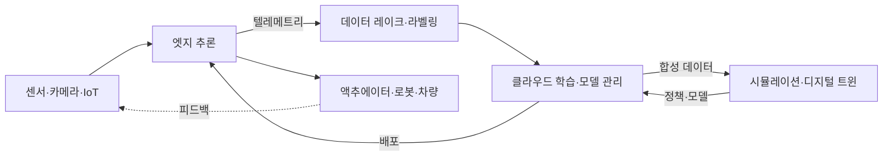

> 문서 기준: 2026년 9월 | 이 문서는 변동이 빠른 영역으로 분기별 리뷰 대상입니다.

## Physical AI란

Physical AI(피지컬 AI)는 텍스트·이미지 같은 디지털 데이터에 머무르던 AI를 **센서·로봇·차량·설비 등 물리 세계와 연결**해, 인식하고 판단하고 물리적으로 행동하게 하는 흐름을 가리킵니다. 챗봇이나 문서 처리 같은 디지털 AI와 달리, Physical AI는 **지연(latency)·안전(safety)·실시간성**이 실패하면 사람이나 장비에 직접적인 위험이 될 수 있다는 점이 근본적으로 다릅니다.

Physical AI는 하나의 제품이 아니라 여러 계층이 맞물린 파이프라인입니다. 데이터가 물리 세계에서 들어와, 저장·정제와 학습·시뮬레이션을 거쳐, 다시 물리 세계로 행동을 내보냅니다.

:::note
이 문서는 **개념과 벤더 중립 비교**에 집중합니다. 엣지·하이브리드 인프라의 일반 패턴은 [하이브리드·엣지 컴퓨팅](../../compute/hybrid-and-edge/), 자율 실행 개념은 [AI 에이전트](../../ai/agents/), 모델 카탈로그·추론 비용은 [AI 플랫폼과 모델 비교](../../ai/ai-ml/)를 참고하세요. 이 영역은 제품명·모델명이 특히 빠르게 바뀌므로, 도입 전 각 벤더 공식 문서로 재확인이 필요합니다.
:::

## 계층 1 — 엣지 추론과 IoT

물리 세계의 데이터는 대량이고 실시간이라, 모두 클라우드로 보내 처리하기 어렵습니다. 현장(엣지)에서 먼저 추론하고, 필요한 데이터만 클라우드로 올리는 구조가 기본입니다.

| 항목 | AWS | Azure | Google Cloud | OCI |
| --- | --- | --- | --- | --- |
| 엣지 런타임 | [IoT Greengrass](https://docs.aws.amazon.com/greengrass/v2/developerguide/) | [Azure IoT Operations](https://learn.microsoft.com/azure/iot-operations/) / [IoT Edge](https://learn.microsoft.com/azure/iot-edge/) | [Google Distributed Cloud (Edge)](https://cloud.google.com/distributed-cloud) | [Roving Edge Infrastructure](https://www.oracle.com/cloud/roving-edge-infrastructure/) |
| 엣지 ML 추론 | Greengrass ML 컴포넌트 (SageMaker AI 모델 배포) | IoT Edge 모듈 + Azure AI 서비스 | Edge TPU / Coral | RED 상의 컴퓨트로 자체 구성 |
| 산업 데이터 수집 | [IoT SiteWise](https://aws.amazon.com/iot-sitewise/) (OPC UA) | IoT Operations (OPC UA) | — (파트너·자체 구성) | — (자체 구성) |

:::caution
**Azure Percept는 2023년 3월 은퇴**했습니다. 과거 자료에서 Percept를 엣지 AI 하드웨어로 소개하더라도, 현재는 Azure IoT Edge / IoT Operations와 Azure Certified Device 파트너 하드웨어로 유사 기능을 구성합니다(Microsoft가 단일 공식 후속 제품을 지정한 것은 아닙니다). 오래된 제품명을 아키텍처 전제로 삼지 마세요.
:::

### 센서 데이터 파이프라인 — 수집·저장·라벨링

엣지에서 올라온 데이터를 바로 학습에 쓸 수는 없습니다. Physical AI의 데이터는 **1D 시계열(관절 각도·전류·온도), 2D 영상, 3D 포인트 클라우드, 설비 메타데이터가 섞인 멀티모달**이라, 수집 → 저장 → 정제·라벨링 단계를 거쳐야 학습 파이프라인에 들어갑니다.

| 단계 | AWS | Azure | Google Cloud | OCI |
| --- | --- | --- | --- | --- |
| 스트림·영상 수집 | [IoT Core](https://aws.amazon.com/iot-core/) (엣지 입구) / [Kinesis Video Streams](https://aws.amazon.com/kinesis/video-streams/)·[Data Streams](https://aws.amazon.com/kinesis/data-streams/) (다운스트림 적재) | [Event Hubs](https://learn.microsoft.com/azure/event-hubs/) + IoT Operations | [Pub/Sub](https://cloud.google.com/pubsub) | [OCI Streaming](https://www.oracle.com/cloud/streaming/) |
| 데이터 레이크 | [S3](https://aws.amazon.com/s3/) | [Data Lake Storage](https://learn.microsoft.com/azure/storage/blobs/data-lake-storage-introduction) | [Cloud Storage](https://cloud.google.com/storage) | [Object Storage](https://www.oracle.com/cloud/storage/object-storage/) |
| 학습용 병렬 파일 시스템 | [FSx for Lustre](https://aws.amazon.com/fsx/lustre/) | [Azure Managed Lustre](https://azure.microsoft.com/products/managed-lustre) | [Managed Lustre](https://cloud.google.com/products/managed-lustre) / [Parallelstore](https://cloud.google.com/parallelstore) | [File Storage with Lustre](https://www.oracle.com/cloud/storage/file-storage-with-lustre/) |
| 라벨링 | [SageMaker Ground Truth](https://docs.aws.amazon.com/sagemaker/latest/dg/sms.html) (신규 고객 접수 종료) | [Azure ML 데이터 라벨링](https://learn.microsoft.com/azure/machine-learning/how-to-label-data) | — (관리형 종료, 파트너·오픈소스) | [OCI Data Labeling](https://www.oracle.com/artificial-intelligence/data-labeling/) |

:::caution
**관리형 라벨링 서비스는 오히려 줄어드는 추세입니다.** Google Cloud의 Vertex AI 데이터 라벨링은 [2024년 10월 3일 종료](https://cloud.google.com/vertex-ai/docs/deprecations)되었고, AWS SageMaker Ground Truth는 2026년 7월 30일부터 신규 고객을 받지 않습니다(기존 고객은 계속 사용, 신규 기능 추가 계획 없음). Ground Truth Plus는 2026년 6월 30일 지원이 종료되었습니다. 라벨링을 특정 클라우드의 관리형 서비스에 묶어 설계하지 말고, **오픈소스·파트너 도구로 대체 가능한 구조**를 기본값으로 두세요.
:::

:::note
GPU 학습에서 병목은 연산이 아니라 **데이터 로딩과 체크포인트 쓰기**인 경우가 많습니다. 객체 스토리지에서 직접 읽으면 GPU가 놀게 되므로, 학습 구간에는 병렬 파일 시스템을 앞단에 두고 객체 스토리지와 연동하는 구성이 일반적입니다. 스토리지 계층 일반 비교는 [블록·파일 스토리지](../../storage/block-and-file/), 체크포인트 전략은 [분산 학습](../gpu-infra/distributed-training/)을 참고하세요.
:::

## 계층 2 — 디지털 트윈과 시뮬레이션

로봇·차량을 실제 세계에서만 학습시키면 비용·위험·시간이 큽니다. 그래서 물리 환경을 가상으로 복제한 **디지털 트윈**과 **시뮬레이션**에서 대량의 시나리오를 생성·학습한 뒤 현실로 옮기는 sim-to-real 접근이 자리 잡았습니다.

| 항목 | AWS | Azure | Google Cloud | OCI | 크로스벤더 |
| --- | --- | --- | --- | --- | --- |
| 디지털 트윈 | [IoT TwinMaker](https://aws.amazon.com/iot-twinmaker/) | [Azure Digital Twins](https://learn.microsoft.com/azure/digital-twins/) | — (Spanner Graph·BigQuery 등으로 자체 구성) | — | [NVIDIA Omniverse](https://www.nvidia.com/en-us/omniverse/) |
| 로봇·물리 시뮬레이션 | — (RoboMaker 지원 종료, 자체 구성) | — (파트너·자체 구성) | — (파트너·자체 구성) | — | [NVIDIA Isaac Sim / Isaac Lab](https://developer.nvidia.com/isaac/sim) |

:::caution
**AWS RoboMaker는 2025년 9월 10일 지원이 종료**되었습니다. 현재 AWS에서 로봇 시뮬레이션은 전용 관리형 서비스 없이 GPU 인스턴스 + 오픈소스(Isaac Sim, Gazebo 등)로 직접 구성합니다. EOL(지원 종료)된 서비스를 신규 설계에 넣지 않도록 주의하세요.
:::

:::note
디지털 트윈·로봇 시뮬레이션 계층은 **NVIDIA Omniverse·Isaac 생태계가 널리 활용되고 있습니다.** 주요 클라우드 모두 이 스택을 GPU 인스턴스 위에서 실행하는 형태로 지원하며, 특정 클라우드의 전용 관리형 제품에 의존하기보다 **어느 클라우드에서도 옮겨 실행할 수 있는지(이식성)** 를 먼저 확인하는 것이 락인을 줄이는 길입니다.
:::

### 학습 데이터는 왜 부족한가

시뮬레이션이 선택이 아니라 전제가 되는 이유는 **데이터 희소성** 때문입니다. 언어 모델은 인터넷 텍스트라는 사실상 무한한 사전학습 데이터에서 출발했지만, "로봇이 실제로 물건을 집어 옮긴" 데이터는 자릿수가 다르게 적습니다. Physical AI 학습은 값싸고 많은 데이터로 부족한 부분을 메우는 설계에서 시작합니다.

| 데이터 층 | 성격 | 한계 |
| --- | --- | --- |
| 인터넷 영상·이미지·텍스트 | 사실상 무한하고 값쌈. 일반 상식·물체 지식을 제공 | 로봇의 몸·관절 명령과 직접 연결되지 않음 |
| 사람 작업 영상(1인칭) | 상대적으로 많음. 동작 순서·의도의 힌트를 제공 | 사람 몸 기준이라 로봇 embodiment로 그대로 옮기지 못함 |
| 로봇 teleop 에피소드 | 실제 관절 명령을 담아 가장 정확 | 사람이 로봇을 직접 조종해 만들어야 해 수집 비용이 가장 높음 |

**teleoperation(원격 조작)** 은 사람이 조종기·VR 장비로 로봇을 직접 움직여 시연 데이터를 만드는 방식이고, 이 데이터를 그대로 따라 하도록 학습시키는 것이 **모방학습(imitation learning)** 입니다. 가장 확실한 방법이지만 사람의 시간이 곧 비용이라 규모를 키우기 어렵습니다.

:::note
클라우드 비용 산정 관점에서 이 구조는 **GPU 비용과 별개의 축이 존재한다**는 뜻입니다. 데이터 수집(장비·인건비), 저장·전송, 라벨링 비용이 학습 연산 비용과 독립적으로 발생하므로, GPU 시간만으로 TCO를 추정하면 크게 빗나갑니다.
:::

### Sim-to-Real Gap

시뮬레이션의 가치는 명확하지만, **시뮬레이터의 물리·센서·재질 모델은 현실과 미세하게 다릅니다.** 마찰 계수, 조명, 센서 노이즈, 부품 유격 같은 차이가 쌓여 시뮬레이션에서 성공한 정책이 실제 로봇에서 실패하는 현상을 **Sim-to-Real Gap**이라고 합니다.

일반적인 완화 방법은 세 가지입니다.

- **도메인 랜덤화** — 마찰·질량·조명·텍스처 같은 물리 파라미터를 학습 중에 무작위로 흔들어, 현실이 그 분포 안에 들어오게 만듭니다.
- **실물 데이터 소량 미세조정** — 시뮬레이션으로 사전학습한 정책을 실제 로봇 데이터로 마무리 조정합니다.
- **실물 검증 게이트** — 시뮬레이션 성공률과 별도로, 실제 장비에서의 성공률을 배포 기준으로 둡니다.

:::caution
**시뮬레이션 성공률을 배포 근거로 그대로 쓰지 마세요.** 시뮬레이션 지표는 회귀 감지에는 유용하지만 현실 성능을 보장하지 않습니다. 시뮬레이터를 고를 때도 렌더링 품질뿐 아니라 **대상 도메인의 물리 정확도**(접촉·마찰·변형 등)를 함께 보아야 합니다.
:::

## 계층 3 — 로보틱스 파운데이션 모델

### 기본 용어 — policy와 embodiment

로봇이 "지금 상황에서 무엇을 할지" 정하는 함수를 **policy(정책)** 라고 합니다. **관측(observation)** — 카메라 영상, 거리 센서, 관절 각도 등 — 을 입력받아 **행동(action)** — 관절 명령, 이동 명령 등 — 을 출력하는 것이 로봇 지능의 최소 단위입니다. 뒤에 나오는 모델은 모두 이 policy를 어떻게 만드느냐의 문제입니다.

로봇의 몸은 제각각입니다. 로봇팔(manipulator), 사족 보행, 휴머노이드, 자율이동로봇(AMR)은 관절 수(자유도)와 제어 방식이 모두 다르고, 이 서로 다른 몸을 **embodiment**라고 부릅니다. 한 몸에서 배운 정책을 다른 몸으로 옮기는 **cross-embodiment 전이**는 이 분야의 대표적 미해결 과제입니다.

:::note
조달 관점에서 embodiment는 **모델 재사용성을 좌우하는 변수**입니다. 같은 작업이라도 로봇 기종을 바꾸면 축적한 데이터와 학습한 정책을 그대로 쓰지 못할 수 있으므로, 하드웨어 선정 시 "이 몸에 묶이는 자산이 무엇인지"를 함께 따져야 합니다.
:::

LLM이 언어를 일반화했듯, 로봇의 인식·계획·동작을 일반화하려는 **로봇 파운데이션 모델**이 부상하고 있습니다. 자연어 지시를 받아 시각(Vision)·언어(Language)·행동(Action)을 연결하는 VLA(Vision-Language-Action) 방식이 대표적입니다.

| 항목 | 현황 |
| --- | --- |
| 대표 스택 | [NVIDIA Isaac GR00T](https://developer.nvidia.com/isaac/gr00t) — 로봇용 오픈 파운데이션 모델(VLA), Omniverse·Cosmos 기반 시뮬레이션·합성 데이터, Jetson Thor 온디바이스 추론 |
| 주요 클라우드 | 자체 범용 로봇 파운데이션 모델은 아직 제한적 — 대체로 NVIDIA 스택을 GPU 인프라 위에서 실행하거나 파트너십으로 제공 |
| 국가 정책 | 일본은 GENIAC에서 로보틱스 파운데이션 모델 개발을 국책 과제로 채택 ([일본 AI 지형](../../japan/ai-landscape/) 참고) |

### 물리 세계와 에이전트의 연결

로봇 파운데이션 모델이 인식·계획·동작을 담당한다면, 그 위에서 **목표를 받아 스스로 단계를 계획하고 도구·센서·액추에이터를 호출해 실행하는** 자율 실행 계층이 에이전트입니다. Physical AI에서 에이전트는 디지털 에이전트와 달리 **행동이 물리 세계에 즉시 반영**되므로, 연결 방식과 권한 경계가 안전과 직결됩니다.

- **엣지 에이전트 ↔ 클라우드 오케스트레이션** — 실시간 판단·제어 루프는 현장(엣지)에서 자율적으로 돌고, 장기 계획·다중 로봇 조율·모델 갱신은 클라우드에서 담당하는 분업이 일반적입니다. 네트워크가 끊겨도 엣지 에이전트가 안전하게 동작을 이어가거나 정지할 수 있어야 합니다.
- **도구·액추에이터 연결(MCP 등)** — 에이전트가 센서 값을 읽고 상위 작업을 지시하려면 표준화된 연결 계층이 필요합니다. 다만 MCP 같은 프로토콜은 **고수준 작업 지시·도구 호출 계층**이며, 실시간 액추에이터 제어(모터·관절 등)는 지연·안전이 보장되는 **별도의 결정론적 저수준 제어 계층**(필드버스·로봇 미들웨어 등)이 담당합니다. 이 둘을 혼동하면 안 됩니다. 자율 실행·도구 호출의 일반 개념은 [AI 에이전트](../../ai/agents/)를, 에이전트-도구 연동 프로토콜은 [AI 에이전트 연동 (MCP)](../../mcp/)를 참고하세요.

#### 왜 계층을 나누는가 — 제어 주기의 불일치

이 분리는 설계 취향이 아니라 **동작 주기가 물리적으로 다르기 때문**입니다. 모터·관절을 붙잡는 저수준 제어 루프는 밀리초 이하 주기로 결정론적으로 돌아야 하지만, 대형 멀티모달 모델의 추론은 그보다 훨씬 느리고 지연 편차도 큽니다. 그래서 일반적인 구성은 두 층으로 나뉩니다.

- **느린 층(이해·계획)** — 장면을 이해하고 다음 목표를 정합니다. 모델이 무겁고 주기가 느려도 됩니다. 클라우드에 둘 수도 있습니다.
- **빠른 층(실행·제어)** — 정해진 목표를 실제 관절 궤적으로 바꿔 일정 주기로 실행합니다. 반드시 현장에 있어야 하고, 지연이 흔들려서는 안 됩니다.

:::caution
대형 모델을 제어 루프 안에 그대로 넣으려는 설계는 흔한 실패 원인입니다. 모델을 온디바이스에 올리면 실시간 주기를 맞추기 어렵고, 클라우드로 빼면 네트워크 지연·단절이 곧바로 제어 품질 문제가 됩니다. **어느 판단이 몇 밀리초 안에 끝나야 하는지를 먼저 정의**한 뒤 배치를 결정하세요.
:::

#### 에이전트–하드웨어 연결 표준

MCP가 에이전트와 데이터·소프트웨어 도구를 잇는 표준으로 자리 잡은 데 이어, **에이전트와 물리 장비를 잇는 표준**도 등장하기 시작했습니다. Anthropic은 2026년 8월 **[Model Hardware Standard(MHS)](https://www.anthropic.com/news/model-hardware-standard-research-preview)** 리서치 프리뷰를 공개했습니다. 장비마다 맞춤 어댑터를 만드는 대신 공통 드라이버로 장비를 노출해, 하나의 에이전트가 여러 장비를 병렬로 다루게 하는 것이 목표입니다. 안전 한계는 에이전트보다 아래인 **드라이버 수준에서 강제**되어, 모델이 프롬프트로 한계를 넘어설 수 없도록 설계되었습니다.

:::caution
MHS는 2026년 9월 기준 **리서치 프리뷰**이며 적용 대상도 과학 실험 장비·첨단 제조 설비 중심입니다. 산업용 로봇 제어의 기존 표준(필드버스·안전 PLC·로봇 미들웨어)을 대체하는 것이 아니고, 기능 안전 인증 체계와도 별개입니다. 아키텍처 전제로 삼기보다 **에이전트-하드웨어 연결 계층이 표준화되는 방향**을 보여주는 신호로 읽는 것이 적절합니다.
:::

:::caution
에이전트가 물리 액추에이터(모터·밸브·차량 제어 등)를 직접 호출하게 할 때는 **권한 범위(action space)를 명시적으로 제한**하고, 위험 동작에는 사람 승인·안전 계층의 사전 검증을 두어야 합니다. 디지털 에이전트의 잘못된 도구 호출은 재시도로 끝나지만, 물리 에이전트의 오작동은 되돌릴 수 없는 피해로 이어질 수 있습니다.
:::

:::caution
로봇 파운데이션 모델과 **월드 모델(world model)** 은 2026년 9월 기준 빠르게 발전 중인 초기 영역입니다. 모델명·버전·성능 수치는 벤더 발표마다 크게 바뀌므로, 이 문서는 성숙한 비교가 가능한 범위만 다루고 세부 수치는 공식 출처 링크로 대신합니다.
:::

## 안전 레이어 — 자율주행과 로보틱스

물리 세계에서 움직이는 AI는 인명·설비와 직결되어 **기능 안전(functional safety)**이 핵심입니다. 자율주행은 [ISO 26262](https://www.iso.org/standard/68383.html), 산업 기계·로봇은 [ISO 13849](https://www.iso.org/standard/73481.html)·IEC 61508 등 도메인별 안전 표준과 인증 체계가 별도로 적용되며, AI 모델의 판단과 무관하게 동작하는 **독립적 안전 계층**(안전 정지, 하드웨어 인터록, 안전 PLC 등)을 두는 것이 원칙입니다.

각 벤더·공급사는 이를 구현한 상용 스택을 제공합니다. 예를 들어 NVIDIA는 안전 시스템 **Halos**를 제공합니다.

- **자율주행(AV)**: [DRIVE](https://www.nvidia.com/en-us/solutions/autonomous-vehicles/) 플랫폼(AGX·Hyperion)과 Halos 안전 시스템(클라우드-차량 전 구간, ISO 26262 지향), 시뮬레이션은 Omniverse·Cosmos.
- **로보틱스**: NVIDIA는 2026년 6월 자율주행 안전 기반을 산업용 로봇·휴머노이드·AMR로 확장한 **[Halos for Robotics](https://developer.nvidia.com/blog/inside-nvidia-halos-for-robotics-a-full-stack-functional-safety-system-for-physical-ai/)**(IGX Thor·Holoscan Sensor Bridge·Halos OS·AI Systems Inspection Lab)를 발표했습니다.

:::note
안전 계층은 **파운데이션 모델이 아니라 별도의 안전 시스템**입니다. 로봇의 인식·계획·동작은 파운데이션 모델(예: [Isaac GR00T](https://developer.nvidia.com/isaac/gr00t))이 담당하고, 그 위에서 기능 안전을 담당하는 계층은 역할이 다릅니다. 안전 계층은 에이전트나 모델이 계획한 동작이라도 **허용된 행동 범위(action space)를 벗어나면 차단·제한**하는 최종 게이트 역할을 합니다. 위 Halos는 이 안전 계층의 상용 구현 예시이며, 자율주행에서 시작해 2026년 로보틱스로 적용 범위가 확장되었습니다.
:::

## 멀티클라우드·엣지 아키텍처 고려사항

### 무엇을 엣지에, 무엇을 클라우드에 둘까

Physical AI 설계의 출발점은 각 작업을 엣지와 클라우드 중 어디에 둘지 정하는 것입니다. 판단 기준은 지연 민감도, 데이터 양(대역폭), 안전 요구, 네트워크 단절 시 동작입니다.

| 작업 | 주 위치 | 이유 |
| --- | --- | --- |
| 실시간 인식·제어 루프 | 엣지 | 지연에 민감하고 네트워크 단절에도 멈추면 안 됨 |
| 안전 정지·비상 차단 | 엣지 | 클라우드 왕복 지연을 허용할 수 없음 |
| 센서 데이터 1차 필터링·집계 | 엣지 | 원본을 모두 올리면 대역폭·비용 과다 |
| 데이터 저장·라벨링 | 클라우드 | 다수 장비의 데이터를 모아 학습 자산으로 관리 |
| 모델 학습·재학습 | 클라우드 | 대규모 GPU·데이터셋 필요 ([GPU 인프라](../gpu-infra/workload-and-architecture/) 참고) |
| 합성 데이터 생성·시뮬레이션 | 클라우드 | 디지털 트윈·시뮬레이터에 대규모 연산 필요 |
| 다중 로봇·플릿 조율, 장기 계획 | 클라우드 | 개별 엣지의 시야를 넘는 전역 조율 |
| 모델 버전 관리·배포(OTA) | 클라우드 → 엣지 | 중앙에서 관리하고 현장으로 배포 |

### 폐루프(closed-loop) 운영 사이클

Physical AI는 한 번 배포하고 끝나는 것이 아니라, 현장 데이터가 다시 모델로 돌아오는 순환 구조로 운영됩니다. 상단 흐름도의 각 단계는 다음 운영 사이클에 대응합니다.

1. **엣지 추론** (흐름도의 `엣지 추론`) — 현장에서 실시간으로 인식·판단·제어하고, 유의미한 이벤트·이상 데이터만 선별합니다.
2. **텔레메트리 수집·정제** (`텔레메트리` → `데이터 레이크·라벨링`) — 선별된 데이터·주행/작업 로그를 클라우드로 올려 저장하고, 학습에 쓸 수 있도록 정제·라벨링합니다.
3. **클라우드 재학습·시뮬레이션** (`클라우드 학습·모델 관리` ↔ `시뮬레이션·디지털 트윈`) — 수집 데이터로 모델을 개선하고, 디지털 트윈·시뮬레이션에서 새 시나리오를 검증합니다.
4. **OTA 배포** (`배포` → `엣지 추론`) — 검증된 모델·정책을 다시 엣지로 배포합니다. 배포 실패·회귀에 대비한 서명·롤백 등 일반 패턴은 [하이브리드·엣지 컴퓨팅](../../compute/hybrid-and-edge/)을 참고하세요.

:::note
네트워크가 끊기면 이 사이클의 2–4단계는 일시 중단되지만, 1단계(엣지 추론·제어)는 **오프라인에서도 자율적으로 이어져야** 합니다. 단절을 예외가 아니라 정상 상태의 하나로 가정하고, 엣지가 독립적으로 안전하게 동작하도록 설계하세요.
:::

### 무엇으로 합격을 판정할 것인가

폐루프를 돌리려면 "이 모델을 내보내도 되는가"를 판정하는 기준이 필요합니다. 그런데 Physical AI에서는 **학습 손실(loss)이 낮아졌다고 실제 성공률이 오르지 않습니다.** 시연 데이터를 잘 따라 하도록 학습한 모델도, 시연에 없던 상태에 빠지면 회복하지 못하기 때문입니다.

그래서 판정 기준은 손실 값이 아니라 **끝까지 수행해 본 결과(rollout)의 성공률**이어야 합니다. 실무에서는 다음 세 층을 나눠 기록합니다.

| 판정 층 | 무엇을 재는가 | 한계 |
| --- | --- | --- |
| 오프라인 지표 | 검증 데이터에 대한 손실·예측 정확도 | 성공률과 상관이 약함. 회귀 감지 용도로만 |
| 시뮬레이션 rollout | 시뮬레이터에서 작업을 끝까지 수행한 성공률 | Sim-to-Real Gap만큼 실제와 벌어짐 |
| 실물 rollout | 실제 장비에서의 성공률·개입 횟수·복구 시간 | 가장 신뢰할 수 있지만 가장 비쌈 |

:::caution
로보틱스 평가 벤치마크는 언어 모델에 비해 **표준화가 덜 되어 있습니다.** 벤더가 제시하는 성공률은 작업 정의·초기 조건·재시도 허용 여부에 따라 크게 달라지므로, 숫자 자체보다 **측정 조건이 공개되어 있는지**를 먼저 확인하세요. 조건이 다르면 두 모델의 성공률은 비교 대상이 아닙니다. 모델 평가 일반론은 [LLMOps](../llmops/)를 참고하세요.
:::

### 규모에 맞는 학습 인프라

Physical AI에서 흔한 오해가 "로봇 모델 학습에는 무조건 대형 GPU 클러스터가 필요하다"는 것입니다. 실제로는 **사전학습된 로봇 파운데이션 모델을 자사 로봇·작업에 맞추는 미세조정**이 대부분이고, 이 구간은 LLM 사전학습과 규모가 전혀 다릅니다. 소규모 PEFT·어댑터 학습은 단일 GPU의 단기 작업으로 끝나는 경우가 많습니다.

| 단계 | 작업 성격 | 인프라 패턴 | 비용 전략 |
| --- | --- | --- | --- |
| 초기 검증 | 시연 데이터 소량, LoRA·PEFT 어댑터 학습 | 단일 GPU 인스턴스 1대 | 스팟·선점형 인스턴스가 기본값. 중단돼도 재시작 비용이 작음 |
| 작업 특화 | 시연 데이터 중간 규모, 전체 미세조정 | 단일 노드 다중 GPU + 관리형 학습 작업 | 자동 체크포인트·재개가 있는 관리형 학습 서비스 |
| 플랫폼화 | 다수 로봇·다수 작업, 반복 재학습 | 다중 노드 + 고속 인터커넥트 | 예약·약정 할인. 노드 자동 복구 필요 ([분산 학습](../gpu-infra/distributed-training/) 참고) |

:::note
이 사다리의 실질적 함의는 **첫 단계에서 대규모 약정을 하지 말라**는 것입니다. 초기·작업 특화 구간은 스팟/선점형 인스턴스와 종량제로 충분한 경우가 많고, 예약·약정은 재학습 주기가 정례화된 뒤에 검토해도 늦지 않습니다. 반대로 시뮬레이션은 병렬 환경 수를 늘릴수록 GPU를 오래 점유하므로, 학습보다 시뮬레이션이 비용을 지배하는 경우가 자주 있습니다. GPU 인스턴스 계열·인터커넥트의 벤더 매핑은 [GPU 워크로드와 아키텍처](../gpu-infra/workload-and-architecture/)를 참고하세요.
:::

### fleet 배포 — 중단과 롤백은 다른 계층

로봇 한 대에 모델을 올리는 것과 수천–수만 대 플릿에 배포하는 것은 다른 문제입니다. 플릿 규모에서는 **잘못된 모델이 얼마나 빨리 퍼지는가**와 **퍼진 뒤 되돌릴 수 있는가**가 설계의 핵심이 됩니다.

- **단계적 롤아웃** — 전체에 한 번에 배포하지 않고 소규모 그룹부터 확대하며, 실패율이 기준을 넘으면 확산을 멈춥니다.
- **중단(abort)** — 확산을 멈추는 장치입니다. 다만 많은 플릿 OTA 서비스에서 중단은 **아직 시작하지 않은 대상만 취소**하고 이미 진행 중인 배포는 그대로 끝나므로, 사용할 서비스의 중단 동작 범위를 벤더 문서로 확인해야 합니다.
- **롤백(rollback)** — 이미 새 버전을 받은 장비를 이전 상태로 되돌리는 장치입니다. 중단과는 별개 계층이며, 장비 쪽에 **이전 버전 보존이나 A/B 파티션** 같은 복구 경로가 있어야 실제로 동작합니다.

:::caution
"중단 기준을 걸어 뒀으니 안전하다"는 가장 흔한 오해입니다. 중단은 확산을 멈출 뿐 **이미 배포된 장비를 되돌리지 못합니다.** 롤백 경로는 클라우드 쪽 배포 정책과 장비 쪽 복구 메커니즘 양쪽에 따로 설계해야 합니다.
:::

:::note
플릿 배포 서비스에는 **조정할 수 없는 한도**가 있는 경우가 많습니다(작업 1건당 대상 수, 동적 그룹 수, 배포 패키지 크기 등). 이런 한도는 나중에 발견하면 배포 구조 자체를 바꿔야 하므로, 파일럿 단계에서 **목표 플릿 규모를 기준으로 각 벤더의 현행 서비스 할당량 문서를 먼저 확인**하세요. 또한 신규 장비가 배포 그룹에 자동 편입되는 구성에서는, 편입 시점에 따라 단계적 롤아웃을 건너뛰고 즉시 배포가 나가는 동작이 있을 수 있습니다.
:::

### 그 밖의 고려사항

- **데이터 중력과 지연** — 센서 데이터는 대량이고 지연에 민감해, 현장 엣지 추론과 클라우드 학습을 분담하는 설계가 기본입니다. 무엇을 엣지에서 처리하고 무엇을 올릴지 먼저 정하세요.
- **시뮬레이터 이식성** — 디지털 트윈·시뮬레이션이 특정 클라우드의 전용 서비스에 묶이면 이식이 어렵습니다. NVIDIA Omniverse·Isaac처럼 GPU만 있으면 어디서든 실행 가능한 스택을 우선 검토하면 락인이 줄어듭니다.
- **온디바이스 vs 클라우드 학습 분담** — 학습·합성 데이터 생성은 클라우드 GPU, 실시간 추론은 온디바이스(예: Jetson류)로 나누는 것이 일반적입니다.
- **안전·규제** — 자율주행·산업 로봇은 기능 안전 인증과 규제가 별도로 적용됩니다. 아키텍처 초기에 인증 요건을 반영하세요.
- **제품 수명주기 확인** — 이 영역은 은퇴(EOL)된 제품이 많습니다(예: Azure Percept, AWS RoboMaker, 관리형 라벨링 서비스). 설계 전 각 서비스의 현행 지원 상태를 반드시 확인하세요.

## 아직 풀리지 않은 문제

Physical AI는 활발한 연구 단계이고, 도입 판단에는 "지금 무엇이 되는가"만큼 **"지금 무엇이 안 되는가"** 가 중요합니다. 남아 있는 난제는 대체로 다음 다섯 갈래로 정리됩니다. 벤더 데모나 제안서를 볼 때, 어느 칸을 실제로 전진시켰는지 묻는 격자로 쓸 수 있습니다.

| 갈래 | 핵심 질문 | 현재의 한계 |
| --- | --- | --- |
| 행동 표현 | 행동을 어떤 형태로 표현해야 잘 배우고 잘 옮겨지는가 | 표현 방식마다 정밀도·일반화·속도의 트레이드오프가 달라 정답이 정해지지 않음 |
| 실행 | 느린 이해·계획과 빠른 실시간 제어의 주기 차이를 어떻게 메우는가 | 큰 모델은 온디바이스 실시간이 어렵고, 클라우드로 빼면 지연·단절 문제가 생김 |
| 일반화 | 한 로봇·한 환경에서 배운 것을 다른 몸·새 물체·새 장면으로 얼마나 옮기는가 | Sim-to-Real Gap과 cross-embodiment 전이가 미해결 |
| 안전 | 물리적 힘을 쓰는 기계가 위험하지 않게 행동한다고 어떻게 보장하는가 | 실패가 곧 물리적 피해. 모델 성능과 별개의 독립 과제 |
| 데이터·평가 | 데이터를 어떻게 충분히 모으고 모델을 어떻게 공정히 비교하는가 | 수집 비용이 높고, 성공률 측정·벤치마크가 아직 표준화 중 |

:::note
이 다섯은 서로 얽혀 있습니다. 예를 들어 평가가 정직해야 안전을 말할 수 있고, 일반화가 되지 않으면 데이터 수집 비용이 작업마다 반복됩니다. 도입 계획을 세울 때는 **대상 작업이 이 격자의 어느 칸에 의존하는지**를 먼저 확인하는 편이 안전합니다.
:::

## 자주 하는 실수

- **모든 데이터를 클라우드로 보내기** — 지연·대역폭·비용을 무시한 설계는 실시간 제어에서 실패합니다. 엣지 추론 분담이 먼저입니다.
- **EOL 제품을 신규 설계에 사용** — RoboMaker·Percept·관리형 라벨링 서비스처럼 지원이 종료되거나 축소된 서비스를 오래된 자료만 보고 채택하지 마세요.
- **단일 벤더 시뮬레이터에 종속** — 특정 클라우드 전용 시뮬레이션에 학습 파이프라인을 묶으면 이식·비교가 어려워집니다.
- **안전을 나중에 붙이기** — 자율주행·로봇은 안전을 아키텍처 초기부터 설계해야 합니다("bolt-on"이 아니라 "built-in").
- **물리 에이전트에 무제한 권한 부여** — 자율 실행 에이전트가 액추에이터를 제약 없이 호출하게 두면 오작동이 물리적 피해로 직결됩니다. 행동 범위 제한과 안전 계층 검증이 필수입니다.
- **GPU 비용만으로 TCO 추정** — 데이터 수집·저장·라벨링과 시뮬레이션 점유 비용이 학습 연산과 별개로 발생합니다.
- **시뮬레이션 성공률을 배포 근거로 사용** — 실물 rollout 검증 게이트 없이 배포하면 Sim-to-Real Gap이 현장에서 드러납니다.
- **중단 기준만 두고 롤백 경로를 설계하지 않기** — 확산은 멈춰도 이미 배포된 장비는 되돌아오지 않습니다.
- **대형 모델을 실시간 제어 루프에 직접 배치** — 제어 주기를 맞추지 못해 안전 문제로 이어집니다. 느린 계획 층과 빠른 제어 층을 분리하세요.

## 체크리스트

- [ ] 엣지에서 처리할 추론과 클라우드로 올릴 데이터를 구분했는가?
- [ ] 네트워크 단절 시 엣지가 자율적으로(오프라인) 안전하게 동작하는가?
- [ ] 각 판단이 몇 밀리초 안에 끝나야 하는지 정의하고, 느린 계획 층과 빠른 제어 층을 분리했는가?
- [ ] 에이전트가 물리 액추에이터를 호출한다면 행동 범위(action space)를 제한하고 안전 계층의 검증을 두었는가?
- [ ] 센서 데이터의 저장·정제·라벨링 계층을 설계하고, 라벨링 도구의 대체 가능성을 확인했는가?
- [ ] 데이터 수집·저장·라벨링·시뮬레이션 비용을 GPU 비용과 별도로 산정했는가?
- [ ] 모델 합격 기준을 손실 값이 아니라 rollout 성공률로 정의하고, 실물 검증 게이트를 두었는가?
- [ ] 학습 규모에 맞는 인프라 단계를 골랐는가(초기 검증에 과도한 약정을 하지 않았는가)?
- [ ] 플릿 배포에 단계적 롤아웃과 **롤백 경로**를 각각 설계했는가(중단만으로 충분하다고 가정하지 않았는가)?
- [ ] 목표 플릿 규모가 각 벤더의 조정 불가 서비스 할당량 안에 들어가는가?
- [ ] 디지털 트윈·시뮬레이션 스택이 다른 클라우드로 이식 가능한가(락인 점검)?
- [ ] 사용하려는 IoT·로보틱스 서비스가 현행 지원 상태인가(EOL 확인)?
- [ ] 자율주행·산업 로봇이라면 기능 안전 인증 요건을 설계에 반영했는가?
- [ ] 온디바이스 추론과 클라우드 학습의 역할 분담이 명확한가?

## 관련 문서

- [하이브리드·엣지 컴퓨팅](../../compute/hybrid-and-edge/) — 엣지 인프라 일반 패턴
- [AI 에이전트](../../ai/agents/) — 자율 계획·실행 개념
- [AI 에이전트 연동 (MCP)](../../mcp/) — 에이전트-도구·시스템 연동 프로토콜
- [GPU 인프라](../gpu-infra/workload-and-architecture/) — 클라우드 학습·시뮬레이션용 GPU 클러스터
- [분산 학습](../gpu-infra/distributed-training/) — 다중 노드 학습·체크포인트 전략
- [블록·파일 스토리지](../../storage/block-and-file/) — 병렬 파일 시스템 비교
- [LLMOps](../llmops/) — 모델 평가·운영 일반론
- [AI 플랫폼과 모델 비교](../../ai/ai-ml/) — 모델 카탈로그·추론 비용
- [일본 AI 지형](../../japan/ai-landscape/) — 로보틱스 파운데이션 모델 국책 과제(GENIAC)

## 참고하기

### AWS

- [AWS IoT Greengrass 개발자 가이드](https://docs.aws.amazon.com/greengrass/v2/developerguide/)
- [AWS IoT TwinMaker](https://aws.amazon.com/iot-twinmaker/)
- [AWS IoT SiteWise](https://aws.amazon.com/iot-sitewise/)
- [Amazon FSx for Lustre](https://aws.amazon.com/fsx/lustre/)
- [Amazon SageMaker Ground Truth 문서](https://docs.aws.amazon.com/sagemaker/latest/dg/sms.html)

### Azure

- [Azure IoT Operations 문서](https://learn.microsoft.com/azure/iot-operations/)
- [Azure Digital Twins 문서](https://learn.microsoft.com/azure/digital-twins/)
- [Azure Managed Lustre](https://azure.microsoft.com/products/managed-lustre)
- [Azure Machine Learning 데이터 라벨링](https://learn.microsoft.com/azure/machine-learning/how-to-label-data)

### Google Cloud

- [Google Distributed Cloud](https://cloud.google.com/distributed-cloud)
- [Coral / Edge TPU](https://cloud.google.com/edge-tpu)
- [Google Cloud Managed Lustre](https://cloud.google.com/products/managed-lustre)
- [Google Cloud Parallelstore](https://cloud.google.com/parallelstore)

### OCI

- [Oracle Roving Edge Infrastructure](https://www.oracle.com/cloud/roving-edge-infrastructure/)
- [OCI File Storage with Lustre](https://www.oracle.com/cloud/storage/file-storage-with-lustre/)
- [OCI Data Labeling](https://www.oracle.com/artificial-intelligence/data-labeling/)

### 크로스벤더

- [NVIDIA Isaac GR00T (개발자 페이지)](https://developer.nvidia.com/isaac/gr00t)
- [NVIDIA Omniverse](https://www.nvidia.com/en-us/omniverse/)
- [NVIDIA 자율주행(DRIVE·Halos) 솔루션](https://www.nvidia.com/en-us/solutions/autonomous-vehicles/)
- [Anthropic Model Hardware Standard (리서치 프리뷰)](https://www.anthropic.com/news/model-hardware-standard-research-preview)
