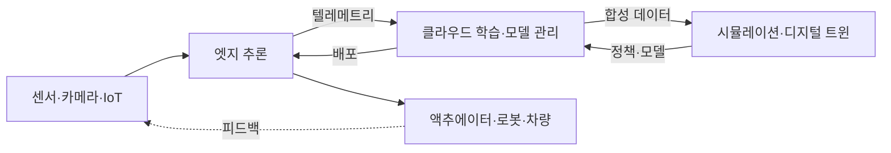

> 문서 기준: 2026년 9월 | 이 문서는 변동이 빠른 영역으로 분기별 리뷰 대상입니다.

## Physical AI란

Physical AI(피지컬 AI)는 텍스트·이미지 같은 디지털 데이터에 머무르던 AI를 **센서·로봇·차량·설비 등 물리 세계와 연결**해, 인식하고 판단하고 물리적으로 행동하게 하는 흐름을 가리킵니다. 챗봇이나 문서 처리 같은 디지털 AI와 달리, Physical AI는 **지연(latency)·안전(safety)·실시간성**이 실패하면 사람이나 장비에 직접적인 위험이 될 수 있다는 점이 근본적으로 다릅니다.

Physical AI는 하나의 제품이 아니라 여러 계층이 맞물린 파이프라인입니다. 데이터가 물리 세계에서 들어와, 학습·시뮬레이션을 거쳐, 다시 물리 세계로 행동을 내보냅니다.

:::note
이 문서는 **개념과 벤더 중립 비교**에 집중합니다. 엣지·하이브리드 인프라의 일반 패턴은 [하이브리드·엣지 컴퓨팅](../../compute/hybrid-and-edge/), 자율 실행 개념은 [AI 에이전트](../../ai/agents/), 모델 카탈로그·추론 비용은 [AI 플랫폼과 모델 비교](../../ai/ai-ml/)를 참고하세요. 이 영역은 제품명·모델명이 특히 빠르게 바뀌므로, 도입 전 각 벤더 공식 문서로 재확인이 필요합니다.
:::

## 계층 1 — 엣지 추론과 IoT

물리 세계의 데이터는 대량이고 실시간이라, 모두 클라우드로 보내 처리하기 어렵습니다. 현장(엣지)에서 먼저 추론하고, 필요한 데이터만 클라우드로 올리는 구조가 기본입니다.

| 항목 | AWS | Azure | Google Cloud | OCI |
| --- | --- | --- | --- | --- |
| 엣지 런타임 | [IoT Greengrass](https://docs.aws.amazon.com/greengrass/v2/developerguide/) | [Azure IoT Operations](https://learn.microsoft.com/azure/iot-operations/) / [IoT Edge](https://learn.microsoft.com/azure/iot-edge/) | [Google Distributed Cloud (Edge)](https://cloud.google.com/distributed-cloud) | [Roving Edge Infrastructure](https://www.oracle.com/cloud/roving-edge-infrastructure/) |
| 엣지 ML 추론 | Greengrass ML 컴포넌트 (SageMaker AI 모델 배포) | IoT Edge 모듈 + Azure AI 서비스 | Edge TPU / Coral | RED 상의 컴퓨트로 자체 구성 |
| 산업 데이터 수집 | [IoT SiteWise](https://aws.amazon.com/iot-sitewise/) (OPC UA) | IoT Operations (OPC UA) | — (파트너·자체 구성) | — (자체 구성) |

:::caution
**Azure Percept는 2023년 3월 은퇴**했습니다. 과거 자료에서 Percept를 엣지 AI 하드웨어로 소개하더라도, 현재는 Azure IoT Edge / IoT Operations와 Azure Certified Device 파트너 하드웨어로 유사 기능을 구성합니다(Microsoft가 단일 공식 후속 제품을 지정한 것은 아닙니다). 오래된 제품명을 아키텍처 전제로 삼지 마세요.
:::

## 계층 2 — 디지털 트윈과 시뮬레이션

로봇·차량을 실제 세계에서만 학습시키면 비용·위험·시간이 큽니다. 그래서 물리 환경을 가상으로 복제한 **디지털 트윈**과 **시뮬레이션**에서 대량의 시나리오를 생성·학습한 뒤 현실로 옮기는 sim-to-real 접근이 자리 잡았습니다.

| 항목 | AWS | Azure | Google Cloud | OCI | 크로스벤더 |
| --- | --- | --- | --- | --- | --- |
| 디지털 트윈 | [IoT TwinMaker](https://aws.amazon.com/iot-twinmaker/) | [Azure Digital Twins](https://learn.microsoft.com/azure/digital-twins/) | — (Spanner Graph·BigQuery 등으로 자체 구성) | — | [NVIDIA Omniverse](https://www.nvidia.com/en-us/omniverse/) |
| 로봇·물리 시뮬레이션 | — (RoboMaker 지원 종료, 자체 구성) | — (파트너·자체 구성) | — (파트너·자체 구성) | — | [NVIDIA Isaac Sim / Isaac Lab](https://developer.nvidia.com/isaac/sim) |

:::caution
**AWS RoboMaker는 2025년 9월 10일 지원이 종료**되었습니다. 현재 AWS에서 로봇 시뮬레이션은 전용 관리형 서비스 없이 GPU 인스턴스 + 오픈소스(Isaac Sim, Gazebo 등)로 직접 구성합니다. EOL(지원 종료)된 서비스를 신규 설계에 넣지 않도록 주의하세요.
:::

:::note
디지털 트윈·로봇 시뮬레이션 계층은 **NVIDIA Omniverse·Isaac 생태계가 널리 활용되고 있습니다.** 클라우드 3사 모두 이 스택을 GPU 인스턴스 위에서 실행하는 형태로 지원하며, 특정 클라우드의 전용 관리형 제품에 의존하기보다 **어느 클라우드에서도 옮겨 실행할 수 있는지(이식성)** 를 먼저 확인하는 것이 락인을 줄이는 길입니다.
:::

## 계층 3 — 로보틱스 파운데이션 모델

LLM이 언어를 일반화했듯, 로봇의 인식·계획·동작을 일반화하려는 **로봇 파운데이션 모델**이 부상하고 있습니다. 자연어 지시를 받아 시각(Vision)·언어(Language)·행동(Action)을 연결하는 VLA(Vision-Language-Action) 방식이 대표적입니다.

| 항목 | 현황 |
| --- | --- |
| 대표 스택 | [NVIDIA Isaac GR00T](https://developer.nvidia.com/isaac/gr00t) — 로봇용 오픈 파운데이션 모델(VLA), Omniverse·Cosmos 기반 시뮬레이션·합성 데이터, Jetson Thor 온디바이스 추론 |
| 클라우드 3사 | 자체 범용 로봇 파운데이션 모델은 아직 제한적 — 대체로 NVIDIA 스택을 GPU 인프라 위에서 실행하거나 파트너십으로 제공 |
| 국가 정책 | 일본은 GENIAC에서 로보틱스 파운데이션 모델 개발을 국책 과제로 채택 ([일본 AI 지형](../../japan/ai-landscape/) 참고) |

### 물리 세계와 에이전트의 연결

로봇 파운데이션 모델이 인식·계획·동작을 담당한다면, 그 위에서 **목표를 받아 스스로 단계를 계획하고 도구·센서·액추에이터를 호출해 실행하는** 자율 실행 계층이 에이전트입니다. Physical AI에서 에이전트는 디지털 에이전트와 달리 **행동이 물리 세계에 즉시 반영**되므로, 연결 방식과 권한 경계가 안전과 직결됩니다.

- **엣지 에이전트 ↔ 클라우드 오케스트레이션** — 실시간 판단·제어 루프는 현장(엣지)에서 자율적으로 돌고, 장기 계획·다중 로봇 조율·모델 갱신은 클라우드에서 담당하는 분업이 일반적입니다. 네트워크가 끊겨도 엣지 에이전트가 안전하게 동작을 이어가거나 정지할 수 있어야 합니다.
- **도구·액추에이터 연결(MCP 등)** — 에이전트가 센서 값을 읽고 상위 작업을 지시하려면 표준화된 연결 계층이 필요합니다. 다만 MCP 같은 프로토콜은 **고수준 작업 지시·도구 호출 계층**이며, 실시간 액추에이터 제어(모터·관절 등)는 지연·안전이 보장되는 **별도의 결정론적 저수준 제어 계층**(필드버스·로봇 미들웨어 등)이 담당합니다. 이 둘을 혼동하면 안 됩니다. 자율 실행·도구 호출의 일반 개념은 [AI 에이전트](../../ai/agents/)를, 에이전트-도구 연동 프로토콜은 [AI 에이전트 연동 (MCP)](../../mcp/)를 참고하세요.

:::caution
에이전트가 물리 액추에이터(모터·밸브·차량 제어 등)를 직접 호출하게 할 때는 **권한 범위(action space)를 명시적으로 제한**하고, 위험 동작에는 사람 승인·안전 계층의 사전 검증을 두어야 합니다. 디지털 에이전트의 잘못된 도구 호출은 재시도로 끝나지만, 물리 에이전트의 오작동은 되돌릴 수 없는 피해로 이어질 수 있습니다.
:::

:::caution
로봇 파운데이션 모델과 **월드 모델(world model)** 은 2026년 9월 기준 빠르게 발전 중인 초기 영역입니다. 모델명·버전·성능 수치는 벤더 발표마다 크게 바뀌므로, 이 문서는 성숙한 비교가 가능한 범위만 다루고 세부 수치는 공식 출처 링크로 대신합니다.
:::

## 안전 레이어 — 자율주행과 로보틱스

물리 세계에서 움직이는 AI는 인명·설비와 직결되어 **기능 안전(functional safety)**이 핵심입니다. 자율주행은 [ISO 26262](https://www.iso.org/standard/68383.html), 산업 기계·로봇은 [ISO 13849](https://www.iso.org/standard/73481.html)·IEC 61508 등 도메인별 안전 표준과 인증 체계가 별도로 적용되며, AI 모델의 판단과 무관하게 동작하는 **독립적 안전 계층**(안전 정지, 하드웨어 인터록, 안전 PLC 등)을 두는 것이 원칙입니다.

각 벤더·공급사는 이를 구현한 상용 스택을 제공합니다. 예를 들어 NVIDIA는 안전 시스템 **Halos**를 제공합니다.

- **자율주행(AV)**: [DRIVE](https://www.nvidia.com/en-us/solutions/autonomous-vehicles/) 플랫폼(AGX·Hyperion)과 Halos 안전 시스템(클라우드-차량 전 구간, ISO 26262 지향), 시뮬레이션은 Omniverse·Cosmos.
- **로보틱스**: NVIDIA는 2026년 6월 자율주행 안전 기반을 산업용 로봇·휴머노이드·AMR로 확장한 **[Halos for Robotics](https://developer.nvidia.com/blog/inside-nvidia-halos-for-robotics-a-full-stack-functional-safety-system-for-physical-ai/)**(IGX Thor·Holoscan Sensor Bridge·Halos OS·AI Systems Inspection Lab)를 발표했습니다.

:::note
안전 계층은 **파운데이션 모델이 아니라 별도의 안전 시스템**입니다. 로봇의 인식·계획·동작은 파운데이션 모델(예: [Isaac GR00T](https://developer.nvidia.com/isaac/gr00t))이 담당하고, 그 위에서 기능 안전을 담당하는 계층은 역할이 다릅니다. 안전 계층은 에이전트나 모델이 계획한 동작이라도 **허용된 행동 범위(action space)를 벗어나면 차단·제한**하는 최종 게이트 역할을 합니다. 위 Halos는 이 안전 계층의 상용 구현 예시이며, 자율주행에서 시작해 2026년 로보틱스로 적용 범위가 확장되었습니다.
:::

## 멀티클라우드·엣지 아키텍처 고려사항

### 무엇을 엣지에, 무엇을 클라우드에 둘까

Physical AI 설계의 출발점은 각 작업을 엣지와 클라우드 중 어디에 둘지 정하는 것입니다. 판단 기준은 지연 민감도, 데이터 양(대역폭), 안전 요구, 네트워크 단절 시 동작입니다.

| 작업 | 주 위치 | 이유 |
| --- | --- | --- |
| 실시간 인식·제어 루프 | 엣지 | 지연에 민감하고 네트워크 단절에도 멈추면 안 됨 |
| 안전 정지·비상 차단 | 엣지 | 클라우드 왕복 지연을 허용할 수 없음 |
| 센서 데이터 1차 필터링·집계 | 엣지 | 원본을 모두 올리면 대역폭·비용 과다 |
| 모델 학습·재학습 | 클라우드 | 대규모 GPU·데이터셋 필요 ([GPU 인프라](../gpu-infra/workload-and-architecture/) 참고) |
| 합성 데이터 생성·시뮬레이션 | 클라우드 | 디지털 트윈·시뮬레이터에 대규모 연산 필요 |
| 다중 로봇·플릿 조율, 장기 계획 | 클라우드 | 개별 엣지의 시야를 넘는 전역 조율 |
| 모델 버전 관리·배포(OTA) | 클라우드 → 엣지 | 중앙에서 관리하고 현장으로 배포 |

### 폐루프(closed-loop) 운영 사이클

Physical AI는 한 번 배포하고 끝나는 것이 아니라, 현장 데이터가 다시 모델로 돌아오는 순환 구조로 운영됩니다. 상단 흐름도의 각 단계는 다음 운영 사이클에 대응합니다.

1. **엣지 추론** (흐름도의 `엣지 추론`) — 현장에서 실시간으로 인식·판단·제어하고, 유의미한 이벤트·이상 데이터만 선별합니다.
2. **텔레메트리 수집** (`텔레메트리`) — 선별된 데이터·주행/작업 로그를 클라우드로 올립니다.
3. **클라우드 재학습·시뮬레이션** (`클라우드 학습·모델 관리` ↔ `시뮬레이션·디지털 트윈`) — 수집 데이터로 모델을 개선하고, 디지털 트윈·시뮬레이션에서 새 시나리오를 검증합니다.
4. **OTA 배포** (`배포` → `엣지 추론`) — 검증된 모델·정책을 다시 엣지로 배포합니다. 배포 실패·회귀에 대비한 서명·롤백 등 일반 패턴은 [하이브리드·엣지 컴퓨팅](../../compute/hybrid-and-edge/)을 참고하세요.

:::note
네트워크가 끊기면 이 사이클의 2–4단계는 일시 중단되지만, 1단계(엣지 추론·제어)는 **오프라인에서도 자율적으로 이어져야** 합니다. 단절을 예외가 아니라 정상 상태의 하나로 가정하고, 엣지가 독립적으로 안전하게 동작하도록 설계하세요.
:::

- **데이터 중력과 지연** — 센서 데이터는 대량이고 지연에 민감해, 현장 엣지 추론과 클라우드 학습을 분담하는 설계가 기본입니다. 무엇을 엣지에서 처리하고 무엇을 올릴지 먼저 정하세요.
- **시뮬레이터 이식성** — 디지털 트윈·시뮬레이션이 특정 클라우드의 전용 서비스에 묶이면 이식이 어렵습니다. NVIDIA Omniverse·Isaac처럼 GPU만 있으면 어디서든 실행 가능한 스택을 우선 검토하면 락인이 줄어듭니다.
- **온디바이스 vs 클라우드 학습 분담** — 학습·합성 데이터 생성은 클라우드 GPU, 실시간 추론은 온디바이스(예: Jetson류)로 나누는 것이 일반적입니다.
- **안전·규제** — 자율주행·산업 로봇은 기능 안전 인증과 규제가 별도로 적용됩니다. 아키텍처 초기에 인증 요건을 반영하세요.
- **제품 수명주기 확인** — 이 영역은 은퇴(EOL)된 제품이 많습니다(예: Azure Percept, AWS RoboMaker). 설계 전 각 서비스의 현행 지원 상태를 반드시 확인하세요.

## 자주 하는 실수

- **모든 데이터를 클라우드로 보내기** — 지연·대역폭·비용을 무시한 설계는 실시간 제어에서 실패합니다. 엣지 추론 분담이 먼저입니다.
- **EOL 제품을 신규 설계에 사용** — RoboMaker·Percept처럼 지원 종료된 서비스를 오래된 자료만 보고 채택하지 마세요.
- **단일 벤더 시뮬레이터에 종속** — 특정 클라우드 전용 시뮬레이션에 학습 파이프라인을 묶으면 이식·비교가 어려워집니다.
- **안전을 나중에 붙이기** — 자율주행·로봇은 안전을 아키텍처 초기부터 설계해야 합니다("bolt-on"이 아니라 "built-in").
- **물리 에이전트에 무제한 권한 부여** — 자율 실행 에이전트가 액추에이터를 제약 없이 호출하게 두면 오작동이 물리적 피해로 직결됩니다. 행동 범위 제한과 안전 계층 검증이 필수입니다.

## 체크리스트

- [ ] 엣지에서 처리할 추론과 클라우드로 올릴 데이터를 구분했는가?
- [ ] 네트워크 단절 시 엣지가 자율적으로(오프라인) 안전하게 동작하는가?
- [ ] 에이전트가 물리 액추에이터를 호출한다면 행동 범위(action space)를 제한하고 안전 계층의 검증을 두었는가?
- [ ] 디지털 트윈·시뮬레이션 스택이 다른 클라우드로 이식 가능한가(락인 점검)?
- [ ] 사용하려는 IoT·로보틱스 서비스가 현행 지원 상태인가(EOL 확인)?
- [ ] 자율주행·산업 로봇이라면 기능 안전 인증 요건을 설계에 반영했는가?
- [ ] 온디바이스 추론과 클라우드 학습의 역할 분담이 명확한가?

## 관련 문서

- [하이브리드·엣지 컴퓨팅](../../compute/hybrid-and-edge/) — 엣지 인프라 일반 패턴
- [AI 에이전트](../../ai/agents/) — 자율 계획·실행 개념
- [AI 에이전트 연동 (MCP)](../../mcp/) — 에이전트-도구·시스템 연동 프로토콜
- [GPU 인프라](../gpu-infra/workload-and-architecture/) — 클라우드 학습·시뮬레이션용 GPU 클러스터
- [AI 플랫폼과 모델 비교](../../ai/ai-ml/) — 모델 카탈로그·추론 비용
- [일본 AI 지형](../../japan/ai-landscape/) — 로보틱스 파운데이션 모델 국책 과제(GENIAC)

## 참고하기

### AWS

- [AWS IoT Greengrass 개발자 가이드](https://docs.aws.amazon.com/greengrass/v2/developerguide/)
- [AWS IoT TwinMaker](https://aws.amazon.com/iot-twinmaker/)
- [AWS IoT SiteWise](https://aws.amazon.com/iot-sitewise/)

### Azure

- [Azure IoT Operations 문서](https://learn.microsoft.com/azure/iot-operations/)
- [Azure Digital Twins 문서](https://learn.microsoft.com/azure/digital-twins/)

### Google Cloud

- [Google Distributed Cloud](https://cloud.google.com/distributed-cloud)
- [Coral / Edge TPU](https://cloud.google.com/edge-tpu)

### OCI

- [Oracle Roving Edge Infrastructure](https://www.oracle.com/cloud/roving-edge-infrastructure/)

### 크로스벤더 (NVIDIA)

- [NVIDIA Isaac GR00T (개발자 페이지)](https://developer.nvidia.com/isaac/gr00t)
- [NVIDIA Omniverse](https://www.nvidia.com/en-us/omniverse/)
- [NVIDIA 자율주행(DRIVE·Halos) 솔루션](https://www.nvidia.com/en-us/solutions/autonomous-vehicles/)
