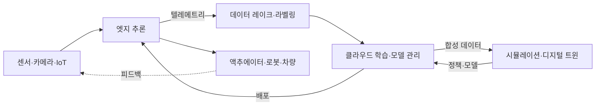

> 문서 기준: 2026년 9월 | 이 문서는 변동이 빠른 영역으로 분기별 리뷰 대상입니다.

## Physical AI란

Physical AI(피지컬 AI)는 텍스트·이미지 같은 디지털 데이터에 머무르던 AI를 **센서·로봇·차량·설비 등 물리 세계와 연결**해, 인식하고 판단하고 물리적으로 행동하게 하는 흐름을 가리킵니다. 챗봇이나 문서 처리 같은 디지털 AI와 달리, Physical AI는 **지연(latency)·안전(safety)·실시간성**이 실패하면 사람이나 장비에 직접적인 위험이 될 수 있다는 점이 근본적으로 다릅니다.

Physical AI는 하나의 제품이 아니라 여러 계층이 맞물린 파이프라인입니다. 데이터가 물리 세계에서 들어와, 저장·정제와 학습·시뮬레이션을 거쳐, 다시 물리 세계로 행동을 내보냅니다.

:::note
이 문서군은 **개념과 벤더 중립 비교**에 집중합니다. 엣지·하이브리드 인프라의 일반 패턴은 [하이브리드·엣지 컴퓨팅](../../../compute/hybrid-and-edge/), 자율 실행 개념은 [AI 에이전트](../../../ai/agents/), 모델 카탈로그·추론 비용은 [AI 플랫폼과 모델 비교](../../../ai/ai-ml/)를 참고하세요. 이 영역은 제품명·모델명이 특히 빠르게 바뀌므로, 도입 전 각 벤더 공식 문서로 재확인이 필요합니다.
:::

## 이 문서군의 구성

Physical AI는 파이프라인 전체가 길어, 데이터·학습 계층과 배포·운영 계층을 나눠 다룹니다.

- **[데이터와 학습](./data-and-training/)** — 계층 1(엣지 추론·IoT·하드웨어·센서 데이터 파이프라인)과 계층 2(디지털 트윈·시뮬레이션·공개 데이터셋·Sim-to-Real), 그리고 규모에 맞는 학습 인프라 선택.
- **[배포와 운영](./deploy-and-operate/)** — 계층 3(로보틱스 파운데이션 모델·에이전트 연결), 안전 레이어, 멀티클라우드·엣지 아키텍처, 폐루프 운영과 fleet 배포.

## 아직 풀리지 않은 문제

Physical AI는 활발한 연구 단계이고, 도입 판단에는 "지금 무엇이 되는가"만큼 **"지금 무엇이 안 되는가"** 가 중요합니다. 남아 있는 난제는 대체로 다음 다섯 갈래로 정리됩니다. 벤더 데모나 제안서를 볼 때, 어느 칸을 실제로 전진시켰는지 묻는 격자로 쓸 수 있습니다.

| 갈래 | 핵심 질문 | 현재의 한계 |
| --- | --- | --- |
| 행동 표현 | 행동을 어떤 형태로 표현해야 잘 배우고 잘 옮겨지는가 | 표현 방식마다 정밀도·일반화·속도의 트레이드오프가 달라 정답이 정해지지 않음 |
| 실행 | 느린 이해·계획과 빠른 실시간 제어의 주기 차이를 어떻게 메우는가 | 큰 모델은 온디바이스 실시간이 어렵고, 클라우드로 빼면 지연·단절 문제가 생김 |
| 일반화 | 한 로봇·한 환경에서 배운 것을 다른 몸·새 물체·새 장면으로 얼마나 옮기는가 | Sim-to-Real Gap과 cross-embodiment 전이가 미해결 |
| 안전 | 물리적 힘을 쓰는 기계가 위험하지 않게 행동한다고 어떻게 보장하는가 | 실패가 곧 물리적 피해. 모델 성능과 별개의 독립 과제 |
| 데이터·평가 | 데이터를 어떻게 충분히 모으고 모델을 어떻게 공정히 비교하는가 | 수집 비용이 높고, 성공률 측정·벤치마크가 아직 표준화 중 |

:::note
이 다섯은 서로 얽혀 있습니다. 예를 들어 평가가 정직해야 안전을 말할 수 있고, 일반화가 되지 않으면 데이터 수집 비용이 작업마다 반복됩니다. 도입 계획을 세울 때는 **대상 작업이 이 격자의 어느 칸에 의존하는지**를 먼저 확인하는 편이 안전합니다.
:::

## 관련 문서

- [데이터와 학습](./data-and-training/) — 엣지·데이터 파이프라인·시뮬레이션·학습 인프라
- [배포와 운영](./deploy-and-operate/) — 로보틱스 파운데이션 모델·안전·아키텍처·fleet 배포
- [하이브리드·엣지 컴퓨팅](../../../compute/hybrid-and-edge/) — 엣지 인프라 일반 패턴
- [AI 에이전트](../../../ai/agents/) — 자율 계획·실행 개념
- [GPU 인프라](../gpu-infra/workload-and-architecture/) — 클라우드 학습·시뮬레이션용 GPU 클러스터
- [AI 플랫폼과 모델 비교](../../../ai/ai-ml/) — 모델 카탈로그·추론 비용

## 참고하기

### 크로스벤더

- [NVIDIA Isaac GR00T (개발자 페이지)](https://developer.nvidia.com/isaac/gr00t)
- [NVIDIA Omniverse](https://www.nvidia.com/en-us/omniverse/)
- [NVIDIA Jetson 모듈 라인업](https://developer.nvidia.com/embedded/jetson-modules)
