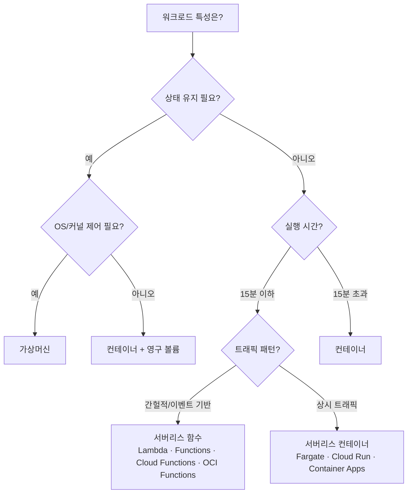

> 문서 기준: 2026년 8월

## 개요

VM과 컨테이너는 서버 생성과 배포를 자동화했지만, 여전히 "서버가 몇 대 필요한가", "언제 스케일링할 것인가"를 사용자가 결정해야 합니다. 오토스케일링이 도와주지만, 최소 인스턴스를 유지하는 비용은 남습니다.

**서버리스**는 이 마지막 관리 부담마저 제거합니다. 서버의 존재를 의식하지 않고, 요청이 있을 때만 코드가 실행됩니다. 함수의 라이프사이클은 **요청 수신 → 인스턴스 생성(Cold Start) → 코드 실행 → 유휴 대기 → 일정 시간 후 해제(Evict)** 입니다. 이 과정이 벤더가 자동으로 관리합니다.

| 단계 | 관리 대상 | 과금 방식 | 유휴 비용 |
| --- | --- | --- | --- |
| **인스턴스 (VM)** | OS, 패치, 스케일링 전부 | 시간 단위 (켜져 있으면 과금) | 있음 |
| **컨테이너** | 앱 + 오케스트레이션 | 노드 시간 또는 Pod 단위 | 일부 있음 |
| **서버리스** | 코드만 | 요청 수 + 실행 시간 (GB-seconds) | 없음 (Provisioned Concurrency 미사용 시) |

## 왜 서버리스인가?

- **비용** — 트래픽이 없으면 비용이 0. 사용한 만큼만 과금됩니다 (GB-seconds 또는 요청 수 기반).
- **운영** — OS 패치, 보안 업데이트, 스케일링을 벤더가 전부 처리합니다.
- **속도** — 인프라 설정 없이 코드만 배포하면 즉시 실행됩니다.

:::caution
서버리스가 항상 저렴한 것은 아닙니다. 상시 고부하 워크로드에서는 VM/컨테이너보다 비용이 높아질 수 있습니다. 또한 Provisioned Concurrency를 설정하면 유휴 시에도 비용이 발생합니다. 트래픽 패턴에 따라 비용을 시뮬레이션하세요.
:::

## 아직 서버리스가 어려운 경우

- **Cold Start** — 일정 시간 호출이 없으면 인스턴스가 해제되어, 다시 호출 시 수백ms–수초 지연이 발생합니다. (이 문서에서 Cold Start는 함수 초기화 지연을 의미합니다. VM 기동 지연은 [오토스케일링](../../compute/auto-scaling/)을 참고하세요.)
- **실행 시간 제한** — 장시간 실행되는 작업에는 제한이 있습니다.
- **상시 부하** — 24시간 일정한 트래픽이면 VM이 더 경제적일 수 있습니다.
- **재시도와 멱등성** — 비동기·이벤트 트리거는 벤더·서비스에 따라 전달 보장이 다릅니다. 재시도가 있는 경로에서는 함수를 멱등하게 설계하세요. 실패 목적지는 DLQ, on-failure destination, 구독 dead-letter 등 서비스별 옵션을 확인하세요.
- **VPC 연결 시 지연 영향** — VPC 연동은 벤더마다 구현이 다릅니다. AWS Lambda는 Hyperplane ENI를 함수 생성/갱신 시점에 준비하는 모델로, “호출마다 ENI 생성” 설명은 구식입니다. 초기 구성·장기 유휴 후 첫 호출, 서브넷/보안 그룹 제약 등 환경별 지연은 별도로 측정하세요.

이러한 제약은 점차 완화되고 있으며 (Provisioned Concurrency, 실행 시간 연장 등), 서버리스 적용 범위는 계속 넓어지고 있습니다.

## 제품 비교

### FaaS (Function as a Service)

| 벤더 | 제품 | 비고 |
| --- | --- | --- |
| AWS | Lambda | 최대 15분. 200+ AWS 서비스 이벤트 연동. **Lambda durable functions**(GA): 체크포인트, 자동 복구, 대기 중 비용 없음 |
| Azure | Azure Functions | Premium: 무제한 실행. Durable Functions/Durable Tasks(상태 유지 워크플로우). **서버리스 에이전트**, MCP 커넥터, Go 언어 지원 추가 (Build 2026) |
| Google Cloud | Cloud Functions | 2세대: 최대 60분. Eventarc 연동 |
| OCI | OCI Functions | Fn Project 기반. Docker 컨테이너로 실행. 동기 5분, **비동기(Detached) 최대 60분** |

### 서버리스 컨테이너

| 벤더 | 제품 | 비고 |
| --- | --- | --- |
| AWS | Fargate | ECS/EKS에서 서버 없이 컨테이너 실행 |
| AWS | App Runner | 소스/이미지에서 바로 배포 |
| Azure | Container Apps | 이벤트 기반 스케일링 내장 |
| Google Cloud | Cloud Run | HTTP 기반. 기존 컨테이너 앱을 수정 없이 서버리스 전환 |
| OCI | OCI Container Instances | 서버 관리 없이 컨테이너 실행 |

### 워크플로우 오케스트레이션

| 벤더 | 제품 | 비고 |
| --- | --- | --- |
| AWS | Step Functions | 시각적 워크플로우 편집기 |
| Azure | Durable Functions / Logic Apps | 코드 기반 / 로우코드 |
| Google Cloud | Workflows | YAML 기반 서비스 오케스트레이션 |
| OCI | OCI Events + OCI Functions | 이벤트 기반 함수 체이닝 |

## 핵심 차이점

- **AWS Lambda** — AWS 서비스와의 이벤트 소스 연동이 풍부합니다. API Gateway, S3, DynamoDB Streams 등 다양한 트리거를 네이티브로 지원합니다.
- **Google Cloud Cloud Run** — 기존 컨테이너 이미지를 수정 없이 그대로 배포할 수 있어 마이그레이션 경로가 단순합니다.
- **Azure Functions** — Durable Functions로 장시간 상태 유지 워크플로우까지 서버리스로 처리할 수 있습니다.
- **OCI Functions** — Fn Project(오픈소스) 기반으로 Docker 컨테이너를 그대로 함수로 실행할 수 있어, 벤더 종속이 낮습니다.

## 서버리스 vs 컨테이너 vs VM

## 언제 무엇을 선택할 것인가

| 이럴 때 | 이것을 선택 |
| --- | --- |
| AWS 서비스 이벤트 연동이 핵심일 때 | AWS Lambda |
| 기존 컨테이너 앱을 수정 없이 서버리스로 전환하고 싶을 때 | Google Cloud Cloud Run |
| 장시간 상태 유지 워크플로우를 서버리스로 처리할 때 | Azure Durable Functions |
| 벤더 종속을 최소화하고 Docker 기반으로 함수를 실행할 때 | OCI Functions (Fn Project 기반) |
| 시각적 워크플로우 오케스트레이션이 필요할 때 | AWS Step Functions |
| 이벤트 기반 자동 스케일링 컨테이너가 필요할 때 | Azure Container Apps |

:::note
**Cold Start는 점점 완화되고 있습니다.** Provisioned Concurrency, Pre-warmed 인스턴스 등 각 벤더가 완화책을 제공합니다. 하지만 완전히 사라지지는 않으므로, 응답 지연에 민감한 워크로드는 사전 프로비저닝을 설정하거나 Keep-warm 전략을 적용하세요.
:::

## Cold Start 완화 전략

Cold Start는 서버리스의 가장 큰 단점입니다. 벤더별 완화 방법을 정리합니다.

| 전략 | 설명 | AWS Lambda | Azure Functions | Google Cloud Cloud Functions/Run | OCI Functions |
| --- | --- | --- | --- | --- | --- |
| **사전 프로비저닝** | 미리 웜업된 인스턴스 유지 (유휴에도 비용 발생) | Provisioned Concurrency | Premium Plan (Pre-warmed) | Min Instances | — |
| **Keep-warm 호출** | 주기적으로 함수를 호출하여 웜 상태 유지 | EventBridge 스케줄 | Timer Trigger | Cloud Scheduler | OCI Events |
| **런타임 선택** | 빠른 초기화 런타임 사용 | Go, Rust는 Cold Start 빠름. Java/.NET은 느림 | 동일 | 동일 | 동일 |
| **경량화** | 패키지 크기 축소, 의존성 최소화 | Lambda Layers 활용 | 동일 | 동일 | 동일 |
| **SnapStart** | 스냅샷 기반 빠른 시작 | Lambda SnapStart (Java) | — | — | — |

## 동시성 제한과 처리량

서버리스는 자동 확장되지만 무제한은 아닙니다. 초당 얼마나 많은 요청을 처리할 수 있는지 알아야 합니다.

| 벤더 | 기본 동시성 제한 | 확장 가능 |
| --- | --- | --- |
| AWS Lambda | 계정당 1,000 동시 실행 (리전별) | 지원 요청으로 증가 가능 |
| Azure Functions | Consumption Plan: 제한 있음. Premium: 더 높음 | Elastic Premium Plan |
| Google Cloud Cloud Functions (2세대) | 인스턴스당 concurrent request 한도와 함수/프로젝트 확장 한도가 별도 ([공식 quotas](https://cloud.google.com/functions/quotas) 확인) | 조정 가능 |
| OCI Functions | 테넌시별 제한 | 지원 요청으로 증가 |

### 동시성 제한 전략

- **Reserved Concurrency** (AWS Lambda) — 특정 함수에 동시 실행 수 예약 또는 제한
- **Throttling** — 지원되는 리트라이 정책 사용 (지수 백오프)
- **큐 기반 버퍼링** — SQS/Service Bus/Pub/Sub로 트래픽 스파이크 흡수
- **다운스트림 보호** — 동시성 1,000 = DB 커넥션 1,000개. RDS Proxy, Cloud SQL Auth Proxy, PgBouncer 등 Lambda와 DB 사이에 커넥션 풀러를 반드시 배치하세요

## 컨테이너 이미지 지원

모든 벤더가 컨테이너 이미지 기반 서버리스 함수를 지원합니다. 기존 컨테이너 워크로드를 서버리스로 전환하기 쉽습니다.

| 벤더 | 최대 이미지 크기 | 비고 |
| --- | --- | --- |
| AWS Lambda | 10GB | ECR에서 가져옴 |
| Azure Functions | — (Custom Container) | 모든 이미지 |
| Google Cloud Cloud Run | — | Artifact Registry에서 가져옴 |
| OCI Functions | — | OCI Registry 또는 외부 |

## 운영 고려사항

서버리스는 인프라 관리가 줄어들지만, 운영이 사라지는 것은 아닙니다.

- **IAM 최소 권한** — 함수에 필요한 최소 권한만 부여. 하나의 역할을 여러 함수가 공유하지 마세요.
- **VPC 연결** — DB 접근 등이 필요할 때만 VPC를 연결하고, 벤더별 네트워킹 지연·제약(서브넷, NAT, 보안 그룹)을 측정하세요.
- **분산 추적** — 서버리스는 호출 체인이 복잡해지기 쉽습니다. X-Ray, Cloud Trace 등으로 추적을 설정하세요.
- **멱등성 설계** — 재시도·중복 전달이 있는 경로에서는 동일 이벤트를 여러 번 처리해도 결과가 같도록 설계하세요.
- **비용 모니터링** — 예상치 못한 호출 폭증이 비용 폭증으로 이어질 수 있습니다. 예산 알림을 설정하세요.

## 자주 하는 실수

- **DB 직접 연결 (커넥션 고갈)** — Lambda/Function에서 DB에 직접 연결하면 동시 실행 수만큼 커넥션이 생성되어 DB 커넥션 풀이 고갈됩니다. RDS Proxy, Cloud SQL Auth Proxy, PgBouncer 등 커넥션 풀러를 반드시 배치하세요.
- **콜드 스타트 무시** — 응답 지연에 민감한 워크로드에서 콜드 스타트 완화 설정(Provisioned Concurrency, Min Instances) 없이 운영하면 사용자 경험이 저하됩니다.
- **함수 하나에 모든 로직** — 하나의 함수에 여러 책임을 넣으면 디버깅이 어렵고, 타임아웃 위험이 커지며, 재사용이 불가능합니다. 단일 책임 원칙을 적용하세요.

## 체크리스트

- [ ] 커넥션 풀러(RDS Proxy, PgBouncer 등)를 DB 앞에 배치했는가
- [ ] 콜드 스타트 완화 설정(Provisioned Concurrency, Min Instances)을 적용했는가
- [ ] 함수 타임아웃을 워크로드에 맞게 설정했는가
- [ ] 비동기 패턴(큐, 이벤트)을 적용하여 동기 호출 체인을 줄였는가

## 참고하기

### AWS

- [AWS Lambda 문서](https://docs.aws.amazon.com/ko_kr/lambda/)
- [AWS Step Functions 문서](https://docs.aws.amazon.com/ko_kr/step-functions/)
- [서버리스 아키텍처](https://docs.aws.amazon.com/ko_kr/wellarchitected/latest/serverless-applications-lens/welcome.html)

### Azure

- [Azure Functions 문서](https://learn.microsoft.com/ko-kr/azure/azure-functions/)
- [Azure Durable Functions 문서](https://learn.microsoft.com/azure/azure-functions/durable/durable-functions-overview)

### Google Cloud

- [Google Cloud Functions 문서](https://cloud.google.com/functions/docs)
- [Google Cloud Run 문서](https://cloud.google.com/run/docs)
- [Google Cloud Workflows 문서](https://cloud.google.com/workflows/docs)

### OCI

- [OCI Functions 문서](https://docs.oracle.com/en-us/iaas/Content/Functions/home.htm)
